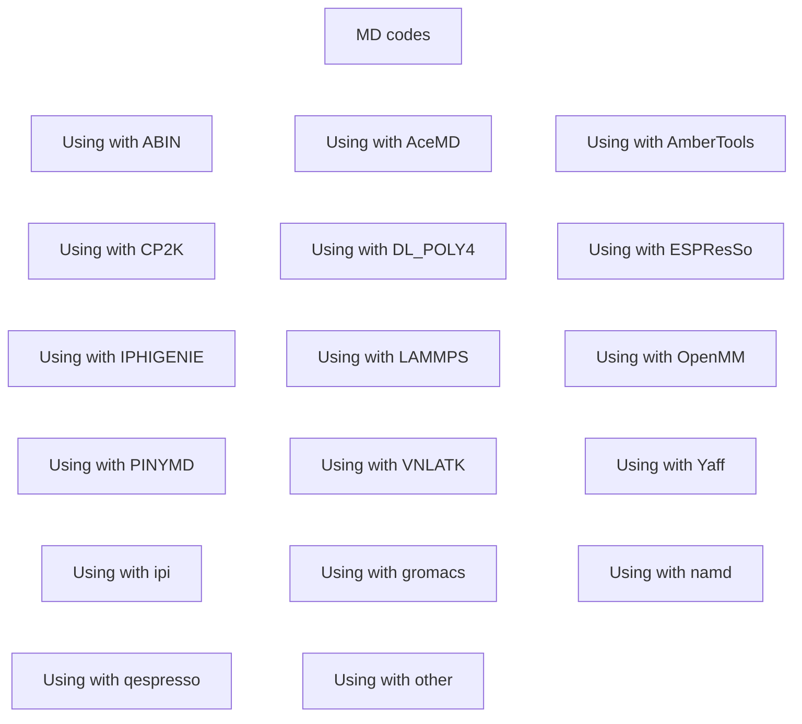

#  PLUMED Installation: An interactive guide

There are a variety of different ways of getting your hands on PLUMED.  For example you can:

* Install it from [Conda](conda.md).  See [here](https://docs.conda.io/en/latest/miniconda.html) for more info on Conda.
* Install it from [MacPorts](macports.md).  See [here](https://www.macports.org) for more information on macports.
* Compile it yourself

If you just want to run the code on your local machine to do the exercises for the tutorials here we would recommend installing 
PLUMED from Conda. However, if you want to use PLUMED to do production calculations we would recommend compiling 
it yourself. 

If you are impatient the short version of the installation process is to use the following three commands:

```bash
./configure --enable-modules=all
make -j 4
make install
```

Notice that you can set the location to install plumed using the `--prefix` option when you call configure and that further details 
on these three commands is available on [this page](installation_old.md). Alternatively, [this page](Installation.md) presents the same information 
in a way that some people find easier to navigate. 

You will most likely want to use PLUMED in tandem with an MD code. For some MD codes we regularly test the interfaces between them and 
PLUMED.  We display the results obtained from these tests and the installation scripts that we use for thse tests 
[here](http://plumed-testcenter.github.io).  If you are using an MD code that doesn't appear on that website you can find the information
we have on using it in tandem with PLUMED from the following chart. 



No actions were used in this tutorial so if you click on the link below (which is generated automatically) you will be taken to an empty 
version of the action list page of the PLUMED manual.

<b><a href="https://www.plumed.org/doc-master/user-doc/html/actionlist/?actions=" target="_blank">Click here</a> to open manual pages for actions discussed in this tutorial.</b>

