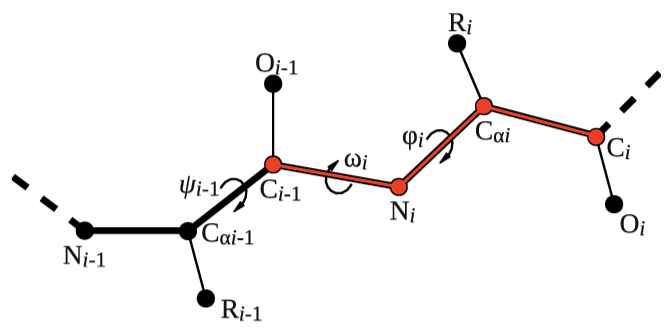

# PLUMED Masterclass 21.1: PLUMED syntax and analysis

## Origin

This masterclass was authored by Max Bonomi on January 18, 2021

# Aims

The aim of this Masterclass is to introduce users to the PLUMED syntax and to illustrate how PLUMED can be used to analyze pre-existing molecular dynamics trajectories.

# Objectives

Once this Masterclass is completed, users will be able to:

- Write a simple PLUMED input file and use it with the driver utility to analyze a trajectory.
- Use advanced selection tools with MOLINFO.
- Define and use virtual atoms, such as CENTER.
- Deal with discontinuities in the trajectory due to periodic boundary conditions.
- Use RMSD to measure protein conformational changes.
- Align the system to a template with FIT_TO_TEMPLATE. 
 
## Setting up the software 

### Installation

We will use [conda](https://docs.conda.io/en/latest/) to install all the software needed in this Masterclass:
- [PLUMED](https://www.plumed.org) version 2.7.0
- [NumPy](https://numpy.org)
- [pandas](https://pandas.pydata.org)
- [matplotlib](https://matplotlib.org)
- [jupyter](https://jupyter.org/index.html)
- [MDTraj](https://mdtraj.org/1.9.4/index.html)
- [MDAnalysis](https://www.mdanalysis.org)
- [Git](https://git-scm.com)

First, make sure conda is installed by typing:

````
conda
````

If the command is not found, please refer to these [instructions](https://docs.conda.io/en/latest/miniconda.html) to install conda on your machine.  Alternatively, if you use the [Homebrew](https://brew.sh) package manager, you can install conda with:

```bash
brew install --cask anaconda
# add this line to your .bashrc
export PATH="/usr/local/anaconda3/bin:$PATH"
```

Now we can create a conda environment for the PLUMED Masterclass:

```bash
conda create --name plumed-masterclass 
```

and activate it with:

```bash
conda activate plumed-masterclass
```

Finally, we can proceed with the installation of the required software:

```bash
conda install -c conda-forge plumed py-plumed numpy pandas matplotlib notebook mdtraj mdanalysis git
```

__IMPORTANT: Do not forget to activate the `plumed-masterclass` environment every time you open a new terminal/shell.__

## PLUMED overview 
 
PLUMED is a library that can be incorporated into many molecular dynamics (MD) codes by adding a relatively simple and well documented interface.  Once it is incorporated you can use PLUMED to perform on-the-fly a variety of different analyses and to bias the sampling in MD simulations. Additionally, PLUMED can be used as a standalone code for analyzing trajectories.  If you want to use the code in this way, you can run the PLUMED executable by issuing the command:

````
plumed <instructions>
````

Let's start by getting a feel for the range of calculations that PLUMED can do. Issue the following command now:

````
plumed --help 
````

The output of this command is the list of tools included in PLUMED. Among these, there are commands that allow you to patch an MD code, postprocess metadynamics simulations, and build the manual. In this class we will use PLUMED to analyze trajectories. In order to do so, we will learn how to use the driver command line tool.  Let's look at the options of PLUMED driver by issuing the following command:  

````
plumed driver --help
````

As you can see we can do a number of things with driver. For all of these options, however, we are going to need to write a PLUMED input file. 

## Resources

The data needed to complete the exercises of this Masterclass can be found on [GitHub](https://github.com/plumed/masterclass-21-1).
You can clone this repository locally on your machine using the following command:

````
git clone https://github.com/plumed/masterclass-21-1.git
````

The MD trajectory that we will analyze can be found in the folder called `data`.  This folder contains the following files:

- `5-HT1B.pdb`: reference conformation of the 5-HT1B receptor with the serotonin ligand.
- `5-HT1B.xtc`: trajectory of the 5-HT1B receptor with the serotonin ligand.

A Jupyter notebook to be used as template for the analysis of the PLUMED output can be found in the folder called `notebooks`. In this directory, you will also find the complete solution to all exercises in the notebook `solution.ipynb`.

Please note that:

- This is a simulation of a membrane receptor, but water, lipids, and ions have been stripped out of the trajectory.
- This is the raw trajectory generated by [GROMACS](https://www.gromacs.org). Therefore it is discontinuous due to periodic boundaries conditions (PBCs).
- Students are invited to solve the exercises by themselves after completing the PLUMED input file templates provided below. In case of problems, students can rely on the solution notebook provided in the [GitHub](https://github.com/plumed/masterclass-21-1) repository.

To keep things clean, it is recommended to run each exercise in a separate sub-directory (i.e. Exercise-1, Exercise-2, ...), which you can create inside the root directory `masterclass-21-1`.

_All the exercises have been tested with PLUMED version 2.7.0._

## A sample PLUMED input file

The main goal of PLUMED is to compute collective variables (or CVs), which are complex descriptors of the system that can be used to describe the conformational change of a protein or a chemical reaction.  This can be done either _on-the-fly_ during a molecular dynamics simulations or _a posteriori_ on a pre-calculated trajectory using PLUMED as a post-processing tool.  In both cases, you should create an input file with a specific PLUMED syntax.  Have a look at the sample input file below:


<div class="plumedpreheader">
<div class="headerInfo" id="value_details_data/INSTRUCTIONS.md_working_1.dat"> Click on the labels of the actions for more information on what each action computes </div>
<div class="containerBadge">
<div class="headerBadge"><a href="INSTRUCTIONS.md_working_1.dat.plumed.stderr"></a></div>
<div class="headerBadge"><a href="INSTRUCTIONS.md_working_1.dat.plumed_master.stderr"></a></div>
</div>
</div>
<pre class="plumedlisting">
<span style="color:blue" class="comment"># Compute distance between atoms 1 and 10.</span>
<span style="color:blue" class="comment"># Atoms are ordered as in the trajectory files and their numbering starts from 1.</span>
<span style="color:blue" class="comment"># The distance is called &quot;d&quot; for future reference.</span>
<b name="data/INSTRUCTIONS.md_working_1.datd" onclick='showPath("data/INSTRUCTIONS.md_working_1.dat","data/INSTRUCTIONS.md_working_1.datd","data/INSTRUCTIONS.md_working_1.datd","black")'>d</b><span style="display:none;" id="data/INSTRUCTIONS.md_working_1.datd">The DISTANCE action with label <b>d</b> calculates the following quantities:<table  align="center" frame="void" width="95%" cellpadding="5%"><tr><td width="5%"><b> Quantity </b>  </td><td width="5%"><b> Type </b>  </td><td><b> Description </b> </td></tr><tr><td width="5%">d</td><td width="5%"><font color="black">scalar</font></td><td>the DISTANCE between this pair of atoms</td></tr></table></span>: <span class="plumedtooltip" style="color:green">DISTANCE<span class="right">Calculate the distance/s between pairs of atoms. <a href="https://www.plumed.org/doc-master/user-doc/html/DISTANCE" style="color:green">More details</a><i></i></span></span> <span class="plumedtooltip">ATOMS<span class="right">the pair of atom that we are calculating the distance between<i></i></span></span>=1,10

<span style="color:blue" class="comment"># Compute the torsional angle between atoms 1, 10, 20, and 30.</span>
<span style="color:blue" class="comment"># The angle is called &quot;phi1&quot; for future reference.</span>
<b name="data/INSTRUCTIONS.md_working_1.datphi1" onclick='showPath("data/INSTRUCTIONS.md_working_1.dat","data/INSTRUCTIONS.md_working_1.datphi1","data/INSTRUCTIONS.md_working_1.datphi1","black")'>phi1</b><span style="display:none;" id="data/INSTRUCTIONS.md_working_1.datphi1">The TORSION action with label <b>phi1</b> calculates the following quantities:<table  align="center" frame="void" width="95%" cellpadding="5%"><tr><td width="5%"><b> Quantity </b>  </td><td width="5%"><b> Type </b>  </td><td><b> Description </b> </td></tr><tr><td width="5%">phi1</td><td width="5%"><font color="black">scalar</font></td><td>the TORSION involving these atoms</td></tr></table></span>: <span class="plumedtooltip" style="color:green">TORSION<span class="right">Calculate one or multiple torsional angles. <a href="https://www.plumed.org/doc-master/user-doc/html/TORSION" style="color:green">More details</a><i></i></span></span> <span class="plumedtooltip">ATOMS<span class="right">the four atoms involved in the torsional angle<i></i></span></span>=1,10,20,30

<span style="color:blue" class="comment"># The same CV defined above can be split into multiple lines</span>
<span style="color:blue" class="comment"># The angle is called &quot;phi2&quot; for future reference.</span>
<span class="plumedtooltip" style="color:green">TORSION<span class="right">Calculate one or multiple torsional angles. <a href="https://www.plumed.org/doc-master/user-doc/html/TORSION" style="color:green">More details</a><i></i></span></span> ...
<span class="plumedtooltip">LABEL<span class="right">a label for the action so that its output can be referenced in the input to other actions<i></i></span></span>=<b name="data/INSTRUCTIONS.md_working_1.datphi2" onclick='showPath("data/INSTRUCTIONS.md_working_1.dat","data/INSTRUCTIONS.md_working_1.datphi2","data/INSTRUCTIONS.md_working_1.datphi2","black")'>phi2</b><span style="display:none;" id="data/INSTRUCTIONS.md_working_1.datphi2">The TORSION action with label <b>phi2</b> calculates the following quantities:<table  align="center" frame="void" width="95%" cellpadding="5%"><tr><td width="5%"><b> Quantity </b>  </td><td width="5%"><b> Type </b>  </td><td><b> Description </b> </td></tr><tr><td width="5%">phi2</td><td width="5%"><font color="black">scalar</font></td><td>the TORSION involving these atoms</td></tr></table></span>
<span class="plumedtooltip">ATOMS<span class="right">the four atoms involved in the torsional angle<i></i></span></span>=1,10,20,30
...
<br/><span style="color:blue" class="comment"># Print &quot;d&quot; on a file named &quot;COLVAR1&quot; every 10 steps.</span>
<span class="plumedtooltip" style="color:green">PRINT<span class="right">Print quantities to a file. <a href="https://www.plumed.org/doc-master/user-doc/html/PRINT" style="color:green">More details</a><i></i></span></span> <span class="plumedtooltip">ARG<span class="right">the labels of the values that you would like to print to the file<i></i></span></span>=<b name="data/INSTRUCTIONS.md_working_1.datd">d</b> <span class="plumedtooltip">FILE<span class="right">the name of the file on which to output these quantities<i></i></span></span>=COLVAR1 <span class="plumedtooltip">STRIDE<span class="right"> the frequency with which the quantities of interest should be output<i></i></span></span>=10

<span style="color:blue" class="comment"># Print &quot;phi1&quot; and &quot;phi2&quot; on another file named &quot;COLVAR2&quot; every 100 steps.</span>
<span style="display:none;" id="data/INSTRUCTIONS.md_working_1.dat">The PRINT action with label <b></b> calculates something</span><span class="plumedtooltip" style="color:green">PRINT<span class="right">Print quantities to a file. <a href="https://www.plumed.org/doc-master/user-doc/html/PRINT" style="color:green">More details</a><i></i></span></span> <span class="plumedtooltip">ARG<span class="right">the labels of the values that you would like to print to the file<i></i></span></span>=<b name="data/INSTRUCTIONS.md_working_1.datphi1">phi1</b>,<b name="data/INSTRUCTIONS.md_working_1.datphi2">phi2</b> <span class="plumedtooltip">FILE<span class="right">the name of the file on which to output these quantities<i></i></span></span>=COLVAR2 <span class="plumedtooltip">STRIDE<span class="right"> the frequency with which the quantities of interest should be output<i></i></span></span>=100
</pre>
  

In the input file above, each line defines a so-called action. In this simple example, actions are used to compute a distance, a dihedral angle, or print some values on a file. Each action supports a number of keywords, whose value is specified. Action names are highlighted in green and, by clicking on them, you can go to the corresponding page in the manual that contains a detailed description of each keyword.  Actions that support the keyword `STRIDE` are those that determine how frequently things are done.  Notice that the default value for `STRIDE` is always 1. In the example above, omitting `STRIDE` keywords the corresponding `COLVAR` files would have been written for every frame of the analyzed trajectory.  All the other actions in the example above, i.e. DISTANCE and TORSION, do not support the `STRIDE` keyword and are only calculated when requested. That is, `d` will be computed every 10 frames, and `phi1` and `phi2` every 100 frames.

Variables should be given a name (in the example above, `d`, `phi1`, and `phi2`), which is then used to refer to these variables in subsequent actions, such as the PRINT command.  A lists of atoms should be provided as comma separated numbers, with no space.

You can find more information on the PLUMED syntax on the [syntax](https://www.plumed.org/doc-master/user-doc/html/_syntax.html) page of the manual. The complete documentation for all the supported collective variables can be found at the [page that introduces collective variables](https://www.plumed.org/doc-master/user-doc/html/colvarintro.html).

### The PLUMED internal units

By default the PLUMED inputs and outputs quantities in the following units:

- Length: nanometers
- Energy: kJ/mol
- Time: picoseconds
- Mass: amu
- Charge: e

If you want to change these units, you can do this using the \ref UNITS keyword. 

## Exercises

### Exercise 1: Computing and printing simple collective variables

In this exercise, we will learn how to compute and print collective variables on a pre-calculated MD trajectory.  To analyze the trajectory provided here, we will:
- create a PLUMED input file with a text editor (typically called `plumed.dat`);
- run the PLUMED driver utility;
- visualize the output with the aid of a Jupyter notebook.

Notice that you can also visualize trajectories with [VMD](https://www.ks.uiuc.edu/Research/vmd/) (always a good idea!).  For example, the trajectory `5-HT1B.xtc` can be visualized with the command:

````
vmd 5-HT1B.pdb 5-HT1B.xtc 
````

When you try this, you will notice that this trajectory is discontinuous due to PBCs. We need to keep this in mind in our analysis. 

Let's now prepare a PLUMED input file to calculate: 
- the gyration radius of the CA protein atoms (GYRATION) of the first 40 N-terminal residues; 
- the distance (DISTANCE) between CA atoms of residues 1 and 40.

The first 40 residues of the 5-HT1B receptor correspond to an extracellular flexible loop of which we want to characterize the dynamics during our MD simulation. Below you can find a sample `plumed.dat` file that you can use as a template.  Whenever you see an highlighted __FILL__ string, be careful because this is a string that you must replace.  To retrieve the atom indexes that you need to include in the input file, you can have a look at `5-HT1B.pdb`.  The atoms indexes are contained in the second column. Keep in mind that numbering scheme in PLUMED starts from 1.


<div class="plumedpreheader">
<div class="headerInfo" id="value_details_data/work/plumed_ex1.dat"> Click on the labels of the actions for more information on what each action computes </div>
<div class="containerBadge">
<div class="headerBadge"><a href="plumed_ex1.dat.plumed.stderr"></a></div>
<div class="headerBadge"><a href="plumed_ex1.dat.plumed_master.stderr"></a></div>
<div class="headerBadge"></div>
</div>
</div>
<div id="data/work/plumed_ex1.dat_short">
<pre class="plumedlisting">
<span style="color:blue" class="comment"># Compute gyration radius on CA atoms of the first 40 N-terminal residues:</span>
<b name="data/work/plumed_ex1.datr" onclick='showPath("data/work/plumed_ex1.dat","data/work/plumed_ex1.datr","data/work/plumed_ex1.datr","brown")'>r</b>: <span class="plumedtooltip" style="color:green">GYRATION<span class="right">Calculate the radius of gyration, or other properties related to it. <a href="https://www.plumed.org/doc-master/user-doc/html/GYRATION" style="color:green">More details</a><i></i></span></span> <span class="plumedtooltip">ATOMS<span class="right">the group of atoms that you are calculating the Gyration Tensor for<i></i></span></span>=<span style="background-color:yellow">__FILL__</span>
<br/><span style="color:blue" class="comment"># Compute distance between CA atoms of residues 1 and 40 </span>
<span style="display:none;" id="data/work/plumed_ex1.datr">The GYRATION action with label <b>r</b> calculates the following quantities:<table  align="center" frame="void" width="95%" cellpadding="5%"><tr><td width="5%"><b> Quantity </b>  </td><td><b> Description </b> </td></tr><tr><td width="5%">r.value</td><td>the radius that was computed from the weights</td></tr></table></span><b name="data/work/plumed_ex1.datd" onclick='showPath("data/work/plumed_ex1.dat","data/work/plumed_ex1.datd","data/work/plumed_ex1.datd","brown")'>d</b>: <span class="plumedtooltip" style="color:green">DISTANCE<span class="right">Calculate the distance/s between pairs of atoms. <a href="https://www.plumed.org/doc-master/user-doc/html/DISTANCE" style="color:green">More details</a><i></i></span></span> <span class="plumedtooltip">ATOMS<span class="right">the pair of atom that we are calculating the distance between<i></i></span></span>=<span style="background-color:yellow">__FILL__</span>
<br/><span style="color:blue" class="comment"># Print the two collective variables on COLVAR file every step</span>
<span style="display:none;" id="data/work/plumed_ex1.datd">The DISTANCE action with label <b>d</b> calculates the following quantities:<table  align="center" frame="void" width="95%" cellpadding="5%"><tr><td width="5%"><b> Quantity </b>  </td><td><b> Description </b> </td></tr><tr><td width="5%">d.value</td><td>the DISTANCE between this pair of atoms</td></tr></table></span><span class="plumedtooltip" style="color:green">PRINT<span class="right">Print quantities to a file. <a href="https://www.plumed.org/doc-master/user-doc/html/PRINT" style="color:green">More details</a><i></i></span></span> <span class="plumedtooltip">ARG<span class="right">the labels of the values that you would like to print to the file<i></i></span></span>=<span style="background-color:yellow">__FILL__</span> <span class="plumedtooltip">FILE<span class="right">the name of the file on which to output these quantities<i></i></span></span>=COLVAR <span class="plumedtooltip">STRIDE<span class="right"> the frequency with which the quantities of interest should be output<i></i></span></span>=<span style="background-color:yellow">__FILL__</span>
</pre></div>
<div style="display:none;" id="data/work/plumed_ex1.dat_long"><pre class="plumedlisting">
<span style="color:blue" class="comment"># Compute gyration radius on CA atoms of the first 40 N-terminal residues:</span>
<b name="data/work/plumed_ex1.dat_solr" onclick='showPath("data/work/plumed_ex1.dat","data/work/plumed_ex1.dat_solr","data/work/plumed_ex1.dat_solr","brown")'>r</b>: <span class="plumedtooltip" style="color:green">GYRATION<span class="right">Calculate the radius of gyration, or other properties related to it. <a href="https://www.plumed.org/doc-master/user-doc/html/GYRATION" style="color:green">More details</a><i></i></span></span> <span class="plumedtooltip">ATOMS<span class="right">the group of atoms that you are calculating the Gyration Tensor for<i></i></span></span>=5,22,37,54,66,73,83,100,111,123,137,151,165,177,187,194,205,220,234,258,276,288,305,315,328,347,358,369,381,393,404,421,434,445,456,466,488,500,521,540

<span style="color:blue" class="comment"># Compute distance between CA atoms of residues 1 and 40</span>
<span style="display:none;" id="data/work/plumed_ex1.dat_solr">The GYRATION action with label <b>r</b> calculates the following quantities:<table  align="center" frame="void" width="95%" cellpadding="5%"><tr><td width="5%"><b> Quantity </b>  </td><td><b> Description </b> </td></tr><tr><td width="5%">r.value</td><td>the radius that was computed from the weights</td></tr></table></span><b name="data/work/plumed_ex1.dat_sold" onclick='showPath("data/work/plumed_ex1.dat","data/work/plumed_ex1.dat_sold","data/work/plumed_ex1.dat_sold","brown")'>d</b>: <span class="plumedtooltip" style="color:green">DISTANCE<span class="right">Calculate the distance/s between pairs of atoms. <a href="https://www.plumed.org/doc-master/user-doc/html/DISTANCE" style="color:green">More details</a><i></i></span></span> <span class="plumedtooltip">ATOMS<span class="right">the pair of atom that we are calculating the distance between<i></i></span></span>=5,540

<span style="color:blue" class="comment"># Print the two collective variables on COLVAR file every step</span>
<span style="display:none;" id="data/work/plumed_ex1.dat_sold">The DISTANCE action with label <b>d</b> calculates the following quantities:<table  align="center" frame="void" width="95%" cellpadding="5%"><tr><td width="5%"><b> Quantity </b>  </td><td><b> Description </b> </td></tr><tr><td width="5%">d.value</td><td>the DISTANCE between this pair of atoms</td></tr></table></span><span class="plumedtooltip" style="color:green">PRINT<span class="right">Print quantities to a file. <a href="https://www.plumed.org/doc-master/user-doc/html/PRINT" style="color:green">More details</a><i></i></span></span> <span class="plumedtooltip">ARG<span class="right">the labels of the values that you would like to print to the file<i></i></span></span>=<b name="data/work/plumed_ex1.dat_solr">r</b>,<b name="data/work/plumed_ex1.dat_sold">d</b> <span class="plumedtooltip">FILE<span class="right">the name of the file on which to output these quantities<i></i></span></span>=COLVAR <span class="plumedtooltip">STRIDE<span class="right"> the frequency with which the quantities of interest should be output<i></i></span></span>=1
</pre></div>

  

Once your `plumed.dat` file is complete, you can run the PLUMED driver as follows:

````
plumed driver --plumed plumed.dat --mf_xtc 5-HT1B.xtc
````

Scroll in your terminal to read the PLUMED log. As you can see, PLUMED gives a lot of feedback about the input that it is reading and the actions that it will execute. Please take your time to inspect the log file and check if PLUMED is actually doing what you intend to do.

The command above will create a `COLVAR` file. The first lines should be identical to these ones:

````
#! FIELDS time r d
 0.000000 1.271069 2.782998
 1.000000 1.263125 2.388697
 2.000000 1.348965 2.606062
 3.000000 1.291011 2.204363
 4.000000 1.280714 2.411836
 5.000000 1.257692 2.334839
````

Notice that the first line informs you about the content of each column.

__In case you obtain different numbers, check your input, you might have made some mistakes!__

This `COLVAR` file can be analyzed using the Jupyter notebook `plumed-pandas.ipynb` provided in the folder `notebooks`.
You can use the following command to open the notebook:

````
jupyter notebook plumed-pandas.ipynb
````

This notebook allows you to import the `COLVAR` file produced by PLUMED and to generate the desired figures using the 
`matplotlib` library:

```python     
 # import python modules
 import plumed
 import matplotlib.pyplot as plt

 # import COLVAR file as pandas dataset
 # set the right path to the COLVAR file
 data=plumed.read_as_pandas("../Exercise-1/COLVAR")
 # print pandas dataset
 data

 # plot time serie of gyration radius (r) and distance (d)
 plt.plot(data.time,data.r, label="gyration radius")
 plt.plot(data.time,data.d, label="distance")
 # x-y axis labels
 plt.xlabel("MD frame")
 plt.ylabel("r/d [nm]")
 plt.legend()

 # plot gyration radius vs distance
 plt.plot(data.r,data.d, 'o')
 # x-y axis labels
 plt.xlabel("gyration radius [nm]")
 plt.ylabel("distance [nm]")
```     

What can you deduce about the dynamics of this region of the 5-HT1B receptors? Are the two CVs both providing useful information or are they quite correlated? To answer to the latter question, you can inspect the plot of one CV against the other.

### Exercise 2: Mastering advanced selection tools

PLUMED provides some shortcuts to select atoms with specific properties.  To use this feature, you should specify the MOLINFO action along with a reference PDB file. This command is used to provide information on the molecules that are present in your system.

Let's try to use this functionality to calculate the backbone dihedral angle $\phi$ (phi) of residue 2 of the 5-HT1B receptor. This CV is defined by the action TORSION and a set of 4 atoms. For residue `i`, the dihedral $\phi$ is defined by these atoms: C(i-1),N(i),CA(i),C(i) as shown in the figure below: 



After consulting the manual and inspecting `5-HT1B.pdb`, let's define the dihedral angle $\phi$ of residue 2 in two different ways:

1. specifying an explicit list of 4 atoms (`t1`).
2. using the \ref MOLINFO shortcut to select quadruplets for dihedral angles (`t2`);


<div class="plumedpreheader">
<div class="headerInfo" id="value_details_data/work/plumed_ex2.dat"> Click on the labels of the actions for more information on what each action computes </div>
<div class="containerBadge">
<div class="headerBadge"><a href="plumed_ex2.dat.plumed.stderr"></a></div>
<div class="headerBadge"><a href="plumed_ex2.dat.plumed_master.stderr"></a></div>
<div class="headerBadge"></div>
</div>
</div>
<div id="data/work/plumed_ex2.dat_short">
<pre class="plumedlisting">
<span style="color:blue" class="comment"># Activate MOLINFO functionalities</span>
<span class="plumedtooltip" style="color:green">MOLINFO<span class="right">This command is used to provide information on the molecules that are present in your system. <a href="https://www.plumed.org/doc-master/user-doc/html/MOLINFO" style="color:green">More details</a><i></i></span></span> <span class="plumedtooltip">STRUCTURE<span class="right">a file in pdb format containing a reference structure<i></i></span></span>=<span style="background-color:yellow">__FILL__</span>
<br/><span style="color:blue" class="comment"># Define the dihedral phi of residue 2 as an explicit list of 4 atoms</span>
<span style="display:none;" id="data/work/plumed_ex2.dat">The MOLINFO action with label <b></b> calculates something</span><b name="data/work/plumed_ex2.datt1" onclick='showPath("data/work/plumed_ex2.dat","data/work/plumed_ex2.datt1","data/work/plumed_ex2.datt1","brown")'>t1</b>: <span class="plumedtooltip" style="color:green">TORSION<span class="right">Calculate one or multiple torsional angles. <a href="https://www.plumed.org/doc-master/user-doc/html/TORSION" style="color:green">More details</a><i></i></span></span> <span class="plumedtooltip">ATOMS<span class="right">the four atoms involved in the torsional angle<i></i></span></span>=<span style="background-color:yellow">__FILL__</span>
<span style="color:blue" class="comment"># Define the same dihedral using MOLINFO shortcuts</span>
<span style="display:none;" id="data/work/plumed_ex2.datt1">The TORSION action with label <b>t1</b> calculates the following quantities:<table  align="center" frame="void" width="95%" cellpadding="5%"><tr><td width="5%"><b> Quantity </b>  </td><td><b> Description </b> </td></tr><tr><td width="5%">t1.value</td><td>the TORSION involving these atoms</td></tr></table></span><b name="data/work/plumed_ex2.datt2" onclick='showPath("data/work/plumed_ex2.dat","data/work/plumed_ex2.datt2","data/work/plumed_ex2.datt2","brown")'>t2</b>: <span class="plumedtooltip" style="color:green">TORSION<span class="right">Calculate one or multiple torsional angles. <a href="https://www.plumed.org/doc-master/user-doc/html/TORSION" style="color:green">More details</a><i></i></span></span> <span class="plumedtooltip">ATOMS<span class="right">the four atoms involved in the torsional angle<i></i></span></span>=<span style="background-color:yellow">__FILL__</span>
<br/><span style="color:blue" class="comment"># Print the two collective variables on COLVAR file every step</span>
<span style="display:none;" id="data/work/plumed_ex2.datt2">The TORSION action with label <b>t2</b> calculates the following quantities:<table  align="center" frame="void" width="95%" cellpadding="5%"><tr><td width="5%"><b> Quantity </b>  </td><td><b> Description </b> </td></tr><tr><td width="5%">t2.value</td><td>the TORSION involving these atoms</td></tr></table></span><span class="plumedtooltip" style="color:green">PRINT<span class="right">Print quantities to a file. <a href="https://www.plumed.org/doc-master/user-doc/html/PRINT" style="color:green">More details</a><i></i></span></span> <span class="plumedtooltip">ARG<span class="right">the labels of the values that you would like to print to the file<i></i></span></span>=<span style="background-color:yellow">__FILL__</span> <span class="plumedtooltip">FILE<span class="right">the name of the file on which to output these quantities<i></i></span></span>=COLVAR <span class="plumedtooltip">STRIDE<span class="right"> the frequency with which the quantities of interest should be output<i></i></span></span>=<span style="background-color:yellow">__FILL__</span>
</pre></div>
<div style="display:none;" id="data/work/plumed_ex2.dat_long"><pre class="plumedlisting">
<span style="color:blue" class="comment"># Activate MOLINFO functionalities</span>
<span class="plumedtooltip" style="color:green">MOLINFO<span class="right">This command is used to provide information on the molecules that are present in your system. <a href="https://www.plumed.org/doc-master/user-doc/html/MOLINFO" style="color:green">More details</a><i></i></span></span> <span class="plumedtooltip">STRUCTURE<span class="right">a file in pdb format containing a reference structure<i></i></span></span>=../data/5-HT1B.pdb

<span style="color:blue" class="comment"># Define the dihedral phi of residue 2 as an explicit list of 4 atoms</span>
<span style="display:none;" id="data/work/plumed_ex2.dat_sol">The MOLINFO action with label <b></b> calculates something</span><b name="data/work/plumed_ex2.dat_solt1" onclick='showPath("data/work/plumed_ex2.dat","data/work/plumed_ex2.dat_solt1","data/work/plumed_ex2.dat_solt1","brown")'>t1</b>: <span class="plumedtooltip" style="color:green">TORSION<span class="right">Calculate one or multiple torsional angles. <a href="https://www.plumed.org/doc-master/user-doc/html/TORSION" style="color:green">More details</a><i></i></span></span> <span class="plumedtooltip">ATOMS<span class="right">the four atoms involved in the torsional angle<i></i></span></span>=18,20,22,33
<span style="color:blue" class="comment"># Define the same dihedral using MOLINFO shortcuts</span>
<span style="display:none;" id="data/work/plumed_ex2.dat_solt1">The TORSION action with label <b>t1</b> calculates the following quantities:<table  align="center" frame="void" width="95%" cellpadding="5%"><tr><td width="5%"><b> Quantity </b>  </td><td><b> Description </b> </td></tr><tr><td width="5%">t1.value</td><td>the TORSION involving these atoms</td></tr></table></span><b name="data/work/plumed_ex2.dat_solt2" onclick='showPath("data/work/plumed_ex2.dat","data/work/plumed_ex2.dat_solt2","data/work/plumed_ex2.dat_solt2","brown")'>t2</b>: <span class="plumedtooltip" style="color:green">TORSION<span class="right">Calculate one or multiple torsional angles. <a href="https://www.plumed.org/doc-master/user-doc/html/TORSION" style="color:green">More details</a><i></i></span></span> <span class="plumedtooltip">ATOMS<span class="right">the four atoms involved in the torsional angle<i></i></span></span>=<span class="plumedtooltip">@phi-2<span class="right">the four atoms that are required to calculate the phi dihedral for residue 2. <a href="https://www.plumed.org/doc-master/user-doc/html/MOLINFO">Click here</a> for more information. <i></i></span></span>

<span style="color:blue" class="comment"># Print the two collective variables on COLVAR file every step</span>
<span style="display:none;" id="data/work/plumed_ex2.dat_solt2">The TORSION action with label <b>t2</b> calculates the following quantities:<table  align="center" frame="void" width="95%" cellpadding="5%"><tr><td width="5%"><b> Quantity </b>  </td><td><b> Description </b> </td></tr><tr><td width="5%">t2.value</td><td>the TORSION involving these atoms</td></tr></table></span><span class="plumedtooltip" style="color:green">PRINT<span class="right">Print quantities to a file. <a href="https://www.plumed.org/doc-master/user-doc/html/PRINT" style="color:green">More details</a><i></i></span></span> <span class="plumedtooltip">ARG<span class="right">the labels of the values that you would like to print to the file<i></i></span></span>=<b name="data/work/plumed_ex2.dat_solt1">t1</b>,<b name="data/work/plumed_ex2.dat_solt2">t2</b> <span class="plumedtooltip">FILE<span class="right">the name of the file on which to output these quantities<i></i></span></span>=COLVAR <span class="plumedtooltip">STRIDE<span class="right"> the frequency with which the quantities of interest should be output<i></i></span></span>=1
</pre></div>

  

After completing the PLUMED input file above, let's use it to analyze the trajectory `5-HT1B.xtc` using the driver tool:

````
plumed driver --plumed plumed.dat --mf_xtc 5-HT1B.xtc
````

You can modify the Jupyter notebook that you used for the first exercise to visualize the trajectory of the two CVs calculated with the PLUMED input file above and written in the `COLVAR` file.
If you executed this exercise correctly, these two trajectories should be identical.

As a second example of MOLINFO's capabilities, we will use the advanced atom selection tools provided by [MDAnalysis](https://www.mdanalysis.org) and [MDTraj](https://mdtraj.org/1.9.4/index.html) libraries.  Let's redo exercise 1 above but this time use MOLINFO's shortcuts to select the CA atoms.  You need to complete the following template PLUMED input file using the appropriate selection syntax for the corresponding library used. Please consult the [MDAnalysis](https://www.mdanalysis.org) and [MDTraj](https://mdtraj.org/1.9.4/index.html) documentation if you are not familiar with these libraries and their syntax.


<div class="plumedpreheader">
<div class="headerInfo" id="value_details_data/work/plumed_ex3.dat"> Click on the labels of the actions for more information on what each action computes </div>
<div class="containerBadge">
<div class="headerBadge"><a href="plumed_ex3.dat.plumed.stderr"></a></div>
<div class="headerBadge"><a href="plumed_ex3.dat.plumed_master.stderr"></a></div>
<div class="headerBadge"></div>
</div>
</div>
<div id="data/work/plumed_ex3.dat_short">
<pre class="plumedlisting">
<span style="color:blue" class="comment"># Activate MOLINFO functionalities</span>
<span class="plumedtooltip" style="color:green">MOLINFO<span class="right">This command is used to provide information on the molecules that are present in your system. <a href="https://www.plumed.org/doc-master/user-doc/html/MOLINFO" style="color:green">More details</a><i></i></span></span> <span class="plumedtooltip">STRUCTURE<span class="right">a file in pdb format containing a reference structure<i></i></span></span>=<span style="background-color:yellow">__FILL__</span> 
<br/><span style="color:blue" class="comment"># To use MDAnalysis selection tools:</span>
<span style="display:none;" id="data/work/plumed_ex3.dat">The MOLINFO action with label <b></b> calculates something</span><b name="data/work/plumed_ex3.datr1" onclick='showPath("data/work/plumed_ex3.dat","data/work/plumed_ex3.datr1","data/work/plumed_ex3.datr1","brown")'>r1</b>: <span class="plumedtooltip" style="color:green">GYRATION<span class="right">Calculate the radius of gyration, or other properties related to it. <a href="https://www.plumed.org/doc-master/user-doc/html/GYRATION" style="color:green">More details</a><i></i></span></span> <span class="plumedtooltip">ATOMS<span class="right">the group of atoms that you are calculating the Gyration Tensor for<i></i></span></span>={<span class="plumedtooltip">@mda:<span class="right">atom selection built using syntax for <a href="https://docs.mdanalysis.org/stable/documentation_pages/selections.html">MDAnalysis</a>.  <a href="https://www.plumed.org/doc-master/user-doc/html/MOLINFO">Click here</a> for more information. <i></i></span></span>{resid __FILL__ and name __FILL__}}
<span style="display:none;" id="data/work/plumed_ex3.datr1">The GYRATION action with label <b>r1</b> calculates the following quantities:<table  align="center" frame="void" width="95%" cellpadding="5%"><tr><td width="5%"><b> Quantity </b>  </td><td><b> Description </b> </td></tr><tr><td width="5%">r1.value</td><td>the radius that was computed from the weights</td></tr></table></span><b name="data/work/plumed_ex3.datd1" onclick='showPath("data/work/plumed_ex3.dat","data/work/plumed_ex3.datd1","data/work/plumed_ex3.datd1","brown")'>d1</b>: <span class="plumedtooltip" style="color:green">DISTANCE<span class="right">Calculate the distance/s between pairs of atoms. <a href="https://www.plumed.org/doc-master/user-doc/html/DISTANCE" style="color:green">More details</a><i></i></span></span> <span class="plumedtooltip">ATOMS<span class="right">the pair of atom that we are calculating the distance between<i></i></span></span>={<span class="plumedtooltip">@mda:<span class="right">atom selection built using syntax for <a href="https://docs.mdanalysis.org/stable/documentation_pages/selections.html">MDAnalysis</a>.  <a href="https://www.plumed.org/doc-master/user-doc/html/MOLINFO">Click here</a> for more information. <i></i></span></span>{resid __FILL__ and name __FILL__}}
<br/><span style="color:blue" class="comment"># To use MDTraj selection tools:</span>
<span style="display:none;" id="data/work/plumed_ex3.datd1">The DISTANCE action with label <b>d1</b> calculates the following quantities:<table  align="center" frame="void" width="95%" cellpadding="5%"><tr><td width="5%"><b> Quantity </b>  </td><td><b> Description </b> </td></tr><tr><td width="5%">d1.value</td><td>the DISTANCE between this pair of atoms</td></tr></table></span><b name="data/work/plumed_ex3.datr2" onclick='showPath("data/work/plumed_ex3.dat","data/work/plumed_ex3.datr2","data/work/plumed_ex3.datr2","brown")'>r2</b>: <span class="plumedtooltip" style="color:green">GYRATION<span class="right">Calculate the radius of gyration, or other properties related to it. <a href="https://www.plumed.org/doc-master/user-doc/html/GYRATION" style="color:green">More details</a><i></i></span></span> <span class="plumedtooltip">ATOMS<span class="right">the group of atoms that you are calculating the Gyration Tensor for<i></i></span></span>={<span class="plumedtooltip">@mdt:<span class="right">atom selection built using syntax for <a href="https://www.mdtraj.org/1.9.8.dev0/index.html">mdtraj</a>.  <a href="https://www.plumed.org/doc-master/user-doc/html/MOLINFO">Click here</a> for more information. <i></i></span></span>{resid __FILL__ and name __FILL__}}
<span style="display:none;" id="data/work/plumed_ex3.datr2">The GYRATION action with label <b>r2</b> calculates the following quantities:<table  align="center" frame="void" width="95%" cellpadding="5%"><tr><td width="5%"><b> Quantity </b>  </td><td><b> Description </b> </td></tr><tr><td width="5%">r2.value</td><td>the radius that was computed from the weights</td></tr></table></span><b name="data/work/plumed_ex3.datd2" onclick='showPath("data/work/plumed_ex3.dat","data/work/plumed_ex3.datd2","data/work/plumed_ex3.datd2","brown")'>d2</b>: <span class="plumedtooltip" style="color:green">DISTANCE<span class="right">Calculate the distance/s between pairs of atoms. <a href="https://www.plumed.org/doc-master/user-doc/html/DISTANCE" style="color:green">More details</a><i></i></span></span> <span class="plumedtooltip">ATOMS<span class="right">the pair of atom that we are calculating the distance between<i></i></span></span>={<span class="plumedtooltip">@mdt:<span class="right">atom selection built using syntax for <a href="https://www.mdtraj.org/1.9.8.dev0/index.html">mdtraj</a>.  <a href="https://www.plumed.org/doc-master/user-doc/html/MOLINFO">Click here</a> for more information. <i></i></span></span>{resid __FILL__ and name __FILL__}}
<br/><span style="color:blue" class="comment"># Print all the collective variables on COLVAR file every step</span>
<span style="display:none;" id="data/work/plumed_ex3.datd2">The DISTANCE action with label <b>d2</b> calculates the following quantities:<table  align="center" frame="void" width="95%" cellpadding="5%"><tr><td width="5%"><b> Quantity </b>  </td><td><b> Description </b> </td></tr><tr><td width="5%">d2.value</td><td>the DISTANCE between this pair of atoms</td></tr></table></span><span class="plumedtooltip" style="color:green">PRINT<span class="right">Print quantities to a file. <a href="https://www.plumed.org/doc-master/user-doc/html/PRINT" style="color:green">More details</a><i></i></span></span> <span class="plumedtooltip">ARG<span class="right">the labels of the values that you would like to print to the file<i></i></span></span>=<span style="background-color:yellow">__FILL__</span> <span class="plumedtooltip">FILE<span class="right">the name of the file on which to output these quantities<i></i></span></span>=COLVAR <span class="plumedtooltip">STRIDE<span class="right"> the frequency with which the quantities of interest should be output<i></i></span></span>=<span style="background-color:yellow">__FILL__</span>
</pre></div>
<div style="display:none;" id="data/work/plumed_ex3.dat_long"><pre class="plumedlisting">
<span style="color:blue" class="comment"># Activate MOLINFO functionalities</span>
<span class="plumedtooltip" style="color:green">MOLINFO<span class="right">This command is used to provide information on the molecules that are present in your system. <a href="https://www.plumed.org/doc-master/user-doc/html/MOLINFO" style="color:green">More details</a><i></i></span></span> <span class="plumedtooltip">STRUCTURE<span class="right">a file in pdb format containing a reference structure<i></i></span></span>=../data/5-HT1B.pdb

<span style="color:blue" class="comment"># To use MDAnalysis selection tools:</span>
<span style="display:none;" id="data/work/plumed_ex3.dat_sol">The MOLINFO action with label <b></b> calculates something</span><b name="data/work/plumed_ex3.dat_solr1" onclick='showPath("data/work/plumed_ex3.dat","data/work/plumed_ex3.dat_solr1","data/work/plumed_ex3.dat_solr1","brown")'>r1</b>: <span class="plumedtooltip" style="color:green">GYRATION<span class="right">Calculate the radius of gyration, or other properties related to it. <a href="https://www.plumed.org/doc-master/user-doc/html/GYRATION" style="color:green">More details</a><i></i></span></span> <span class="plumedtooltip">ATOMS<span class="right">the group of atoms that you are calculating the Gyration Tensor for<i></i></span></span>={<span class="plumedtooltip">@mda:<span class="right">atom selection built using syntax for <a href="https://docs.mdanalysis.org/stable/documentation_pages/selections.html">MDAnalysis</a>.  <a href="https://www.plumed.org/doc-master/user-doc/html/MOLINFO">Click here</a> for more information. <i></i></span></span>{resid 1:40 and name CA}}
<span style="display:none;" id="data/work/plumed_ex3.dat_solr1">The GYRATION action with label <b>r1</b> calculates the following quantities:<table  align="center" frame="void" width="95%" cellpadding="5%"><tr><td width="5%"><b> Quantity </b>  </td><td><b> Description </b> </td></tr><tr><td width="5%">r1.value</td><td>the radius that was computed from the weights</td></tr></table></span><b name="data/work/plumed_ex3.dat_sold1" onclick='showPath("data/work/plumed_ex3.dat","data/work/plumed_ex3.dat_sold1","data/work/plumed_ex3.dat_sold1","brown")'>d1</b>: <span class="plumedtooltip" style="color:green">DISTANCE<span class="right">Calculate the distance/s between pairs of atoms. <a href="https://www.plumed.org/doc-master/user-doc/html/DISTANCE" style="color:green">More details</a><i></i></span></span> <span class="plumedtooltip">ATOMS<span class="right">the pair of atom that we are calculating the distance between<i></i></span></span>={<span class="plumedtooltip">@mda:<span class="right">atom selection built using syntax for <a href="https://docs.mdanalysis.org/stable/documentation_pages/selections.html">MDAnalysis</a>.  <a href="https://www.plumed.org/doc-master/user-doc/html/MOLINFO">Click here</a> for more information. <i></i></span></span>{resid 1 40 and name CA}}
<br/><span style="color:blue" class="comment"># To use MDTraj selection tools:</span>
<span style="display:none;" id="data/work/plumed_ex3.dat_sold1">The DISTANCE action with label <b>d1</b> calculates the following quantities:<table  align="center" frame="void" width="95%" cellpadding="5%"><tr><td width="5%"><b> Quantity </b>  </td><td><b> Description </b> </td></tr><tr><td width="5%">d1.value</td><td>the DISTANCE between this pair of atoms</td></tr></table></span><b name="data/work/plumed_ex3.dat_solr2" onclick='showPath("data/work/plumed_ex3.dat","data/work/plumed_ex3.dat_solr2","data/work/plumed_ex3.dat_solr2","brown")'>r2</b>: <span class="plumedtooltip" style="color:green">GYRATION<span class="right">Calculate the radius of gyration, or other properties related to it. <a href="https://www.plumed.org/doc-master/user-doc/html/GYRATION" style="color:green">More details</a><i></i></span></span> <span class="plumedtooltip">ATOMS<span class="right">the group of atoms that you are calculating the Gyration Tensor for<i></i></span></span>={<span class="plumedtooltip">@mdt:<span class="right">atom selection built using syntax for <a href="https://www.mdtraj.org/1.9.8.dev0/index.html">mdtraj</a>.  <a href="https://www.plumed.org/doc-master/user-doc/html/MOLINFO">Click here</a> for more information. <i></i></span></span>{resid 0 to 39 and name CA}}
<span style="display:none;" id="data/work/plumed_ex3.dat_solr2">The GYRATION action with label <b>r2</b> calculates the following quantities:<table  align="center" frame="void" width="95%" cellpadding="5%"><tr><td width="5%"><b> Quantity </b>  </td><td><b> Description </b> </td></tr><tr><td width="5%">r2.value</td><td>the radius that was computed from the weights</td></tr></table></span><b name="data/work/plumed_ex3.dat_sold2" onclick='showPath("data/work/plumed_ex3.dat","data/work/plumed_ex3.dat_sold2","data/work/plumed_ex3.dat_sold2","brown")'>d2</b>: <span class="plumedtooltip" style="color:green">DISTANCE<span class="right">Calculate the distance/s between pairs of atoms. <a href="https://www.plumed.org/doc-master/user-doc/html/DISTANCE" style="color:green">More details</a><i></i></span></span> <span class="plumedtooltip">ATOMS<span class="right">the pair of atom that we are calculating the distance between<i></i></span></span>={<span class="plumedtooltip">@mdt:<span class="right">atom selection built using syntax for <a href="https://www.mdtraj.org/1.9.8.dev0/index.html">mdtraj</a>.  <a href="https://www.plumed.org/doc-master/user-doc/html/MOLINFO">Click here</a> for more information. <i></i></span></span>{resid 0 39 and name CA}}
<br/><span style="color:blue" class="comment"># Print all the collective variables on COLVAR file every step</span>
<span style="display:none;" id="data/work/plumed_ex3.dat_sold2">The DISTANCE action with label <b>d2</b> calculates the following quantities:<table  align="center" frame="void" width="95%" cellpadding="5%"><tr><td width="5%"><b> Quantity </b>  </td><td><b> Description </b> </td></tr><tr><td width="5%">d2.value</td><td>the DISTANCE between this pair of atoms</td></tr></table></span><span class="plumedtooltip" style="color:green">PRINT<span class="right">Print quantities to a file. <a href="https://www.plumed.org/doc-master/user-doc/html/PRINT" style="color:green">More details</a><i></i></span></span> <span class="plumedtooltip">ARG<span class="right">the labels of the values that you would like to print to the file<i></i></span></span>=<b name="data/work/plumed_ex3.dat_solr1">r1</b>,<b name="data/work/plumed_ex3.dat_sold1">d1</b>,<b name="data/work/plumed_ex3.dat_solr2">r2</b>,<b name="data/work/plumed_ex3.dat_sold2">d2</b> <span class="plumedtooltip">FILE<span class="right">the name of the file on which to output these quantities<i></i></span></span>=COLVAR <span class="plumedtooltip">STRIDE<span class="right"> the frequency with which the quantities of interest should be output<i></i></span></span>=1
</pre></div>

  

Now, you can compare the `COLVAR` file obtained with the one you obtained when you completed exercise 1: they should be identical!

### Exercise 3: Using virtual atoms

Sometimes, when calculating a CV, you may not want to use the positions of a number of atoms directly.  Instead you may want to define a virtual atom whose position is generated based on the positions of a collection of other atoms. For example you might want to use the center of mass (COM) or the geometric center (CENTER) of a group of atoms.

In this exercise, you will learn how to specify virtual atoms and later use them to define a CV.  The objective is to calculate the distances between the geometric center of the serotonin ligand (indicated as residue `LIG` in `5-HT1B.pdb`) and the geometric centers of the two glycans located at position N24 and N32.  Glycans are carbohydrate-based polymers that are sometimes linked to certain protein aminoacids. If you examine `5-HT1B.pdb`, you will find the two glycans defined after the end of the protein, i.e. after residue SER-390.  These two glycans have different length:

- the glycan attached at position N24 ranges from residue BGLC-1 to AFUC-9
- the glycan attached at position N32 ranges from residue BGLC-1 to AFUC-10 

Let's complete the PLUMED input file below. You can use the advanced selection tools learned in exercise 2 to specify the atoms belonging to the ligand and to the two glycans:


<div class="plumedpreheader">
<div class="headerInfo" id="value_details_data/work/plumed_ex4.dat"> Click on the labels of the actions for more information on what each action computes </div>
<div class="containerBadge">
<div class="headerBadge"><a href="plumed_ex4.dat.plumed.stderr"></a></div>
<div class="headerBadge"><a href="plumed_ex4.dat.plumed_master.stderr"></a></div>
<div class="headerBadge"></div>
</div>
</div>
<div id="data/work/plumed_ex4.dat_short">
<pre class="plumedlisting">
<span style="color:blue" class="comment"># Geometric center of the ligand</span>
<b name="data/work/plumed_ex4.datlig" onclick='showPath("data/work/plumed_ex4.dat","data/work/plumed_ex4.datlig","data/work/plumed_ex4.datlig","brown")'>lig</b>: <span class="plumedtooltip" style="color:green">CENTER<span class="right">Calculate the center for a group of atoms, with arbitrary weights. <a href="https://www.plumed.org/doc-master/user-doc/html/CENTER" style="color:green">More details</a><i></i></span></span> <span class="plumedtooltip">ATOMS<span class="right">the group of atoms that appear in the definition of this center<i></i></span></span>=<span style="background-color:yellow">__FILL__</span>
<span style="color:blue" class="comment"># Geometric center of the first glycan </span>
<span style="display:none;" id="data/work/plumed_ex4.datlig">The CENTER action with label <b>lig</b> calculates the following quantities:<table  align="center" frame="void" width="95%" cellpadding="5%"><tr><td width="5%"><b> Quantity </b>  </td><td><b> Description </b> </td></tr><tr><td width="5%">lig.value</td><td>the position of the center of mass</td></tr></table></span><b name="data/work/plumed_ex4.datg1" onclick='showPath("data/work/plumed_ex4.dat","data/work/plumed_ex4.datg1","data/work/plumed_ex4.datg1","brown")'>g1</b>: <span class="plumedtooltip" style="color:green">CENTER<span class="right">Calculate the center for a group of atoms, with arbitrary weights. <a href="https://www.plumed.org/doc-master/user-doc/html/CENTER" style="color:green">More details</a><i></i></span></span> <span class="plumedtooltip">ATOMS<span class="right">the group of atoms that appear in the definition of this center<i></i></span></span>=<span style="background-color:yellow">__FILL__</span>
<span style="color:blue" class="comment"># Geometric center of the second glycan</span>
<span style="display:none;" id="data/work/plumed_ex4.datg1">The CENTER action with label <b>g1</b> calculates the following quantities:<table  align="center" frame="void" width="95%" cellpadding="5%"><tr><td width="5%"><b> Quantity </b>  </td><td><b> Description </b> </td></tr><tr><td width="5%">g1.value</td><td>the position of the center of mass</td></tr></table></span><b name="data/work/plumed_ex4.datg2" onclick='showPath("data/work/plumed_ex4.dat","data/work/plumed_ex4.datg2","data/work/plumed_ex4.datg2","brown")'>g2</b>: <span class="plumedtooltip" style="color:green">CENTER<span class="right">Calculate the center for a group of atoms, with arbitrary weights. <a href="https://www.plumed.org/doc-master/user-doc/html/CENTER" style="color:green">More details</a><i></i></span></span> <span class="plumedtooltip">ATOMS<span class="right">the group of atoms that appear in the definition of this center<i></i></span></span>=<span style="background-color:yellow">__FILL__</span>
<br/><span style="color:blue" class="comment"># Distance between ligand and first glycan</span>
<span style="display:none;" id="data/work/plumed_ex4.datg2">The CENTER action with label <b>g2</b> calculates the following quantities:<table  align="center" frame="void" width="95%" cellpadding="5%"><tr><td width="5%"><b> Quantity </b>  </td><td><b> Description </b> </td></tr><tr><td width="5%">g2.value</td><td>the position of the center of mass</td></tr></table></span><b name="data/work/plumed_ex4.datd1" onclick='showPath("data/work/plumed_ex4.dat","data/work/plumed_ex4.datd1","data/work/plumed_ex4.datd1","brown")'>d1</b>: <span class="plumedtooltip" style="color:green">DISTANCE<span class="right">Calculate the distance/s between pairs of atoms. <a href="https://www.plumed.org/doc-master/user-doc/html/DISTANCE" style="color:green">More details</a><i></i></span></span> <span class="plumedtooltip">ATOMS<span class="right">the pair of atom that we are calculating the distance between<i></i></span></span>=<span style="background-color:yellow">__FILL__</span>
<span style="color:blue" class="comment"># Distance between ligand and second glycan </span>
<span style="display:none;" id="data/work/plumed_ex4.datd1">The DISTANCE action with label <b>d1</b> calculates the following quantities:<table  align="center" frame="void" width="95%" cellpadding="5%"><tr><td width="5%"><b> Quantity </b>  </td><td><b> Description </b> </td></tr><tr><td width="5%">d1.value</td><td>the DISTANCE between this pair of atoms</td></tr></table></span><b name="data/work/plumed_ex4.datd2" onclick='showPath("data/work/plumed_ex4.dat","data/work/plumed_ex4.datd2","data/work/plumed_ex4.datd2","brown")'>d2</b>: <span class="plumedtooltip" style="color:green">DISTANCE<span class="right">Calculate the distance/s between pairs of atoms. <a href="https://www.plumed.org/doc-master/user-doc/html/DISTANCE" style="color:green">More details</a><i></i></span></span> <span class="plumedtooltip">ATOMS<span class="right">the pair of atom that we are calculating the distance between<i></i></span></span>=<span style="background-color:yellow">__FILL__</span>
<br/><span style="color:blue" class="comment"># Print the two distances on COLVAR file every step</span>
<span style="display:none;" id="data/work/plumed_ex4.datd2">The DISTANCE action with label <b>d2</b> calculates the following quantities:<table  align="center" frame="void" width="95%" cellpadding="5%"><tr><td width="5%"><b> Quantity </b>  </td><td><b> Description </b> </td></tr><tr><td width="5%">d2.value</td><td>the DISTANCE between this pair of atoms</td></tr></table></span><span class="plumedtooltip" style="color:green">PRINT<span class="right">Print quantities to a file. <a href="https://www.plumed.org/doc-master/user-doc/html/PRINT" style="color:green">More details</a><i></i></span></span> <span class="plumedtooltip">ARG<span class="right">the labels of the values that you would like to print to the file<i></i></span></span>=<span style="background-color:yellow">__FILL__</span> <span class="plumedtooltip">FILE<span class="right">the name of the file on which to output these quantities<i></i></span></span>=COLVAR <span class="plumedtooltip">STRIDE<span class="right"> the frequency with which the quantities of interest should be output<i></i></span></span>=<span style="background-color:yellow">__FILL__</span>
</pre></div>
<div style="display:none;" id="data/work/plumed_ex4.dat_long"><pre class="plumedlisting">
<span style="color:blue" class="comment"># Geometric center of the ligand</span>
<b name="data/work/plumed_ex4.dat_sollig" onclick='showPath("data/work/plumed_ex4.dat","data/work/plumed_ex4.dat_sollig","data/work/plumed_ex4.dat_sollig","brown")'>lig</b>: <span class="plumedtooltip" style="color:green">CENTER<span class="right">Calculate the center for a group of atoms, with arbitrary weights. <a href="https://www.plumed.org/doc-master/user-doc/html/CENTER" style="color:green">More details</a><i></i></span></span> <span class="plumedtooltip">ATOMS<span class="right">the group of atoms that appear in the definition of this center<i></i></span></span>=6659-6671
<span style="color:blue" class="comment"># Geometric center of the first glycan</span>
<span style="display:none;" id="data/work/plumed_ex4.dat_sollig">The CENTER action with label <b>lig</b> calculates the following quantities:<table  align="center" frame="void" width="95%" cellpadding="5%"><tr><td width="5%"><b> Quantity </b>  </td><td><b> Description </b> </td></tr><tr><td width="5%">lig.value</td><td>the position of the center of mass</td></tr></table></span><b name="data/work/plumed_ex4.dat_solg1" onclick='showPath("data/work/plumed_ex4.dat","data/work/plumed_ex4.dat_solg1","data/work/plumed_ex4.dat_solg1","brown")'>g1</b>: <span class="plumedtooltip" style="color:green">CENTER<span class="right">Calculate the center for a group of atoms, with arbitrary weights. <a href="https://www.plumed.org/doc-master/user-doc/html/CENTER" style="color:green">More details</a><i></i></span></span> <span class="plumedtooltip">ATOMS<span class="right">the group of atoms that appear in the definition of this center<i></i></span></span>=6212-6424
<span style="color:blue" class="comment"># Geometric center of the second glycan</span>
<span style="display:none;" id="data/work/plumed_ex4.dat_solg1">The CENTER action with label <b>g1</b> calculates the following quantities:<table  align="center" frame="void" width="95%" cellpadding="5%"><tr><td width="5%"><b> Quantity </b>  </td><td><b> Description </b> </td></tr><tr><td width="5%">g1.value</td><td>the position of the center of mass</td></tr></table></span><b name="data/work/plumed_ex4.dat_solg2" onclick='showPath("data/work/plumed_ex4.dat","data/work/plumed_ex4.dat_solg2","data/work/plumed_ex4.dat_solg2","brown")'>g2</b>: <span class="plumedtooltip" style="color:green">CENTER<span class="right">Calculate the center for a group of atoms, with arbitrary weights. <a href="https://www.plumed.org/doc-master/user-doc/html/CENTER" style="color:green">More details</a><i></i></span></span> <span class="plumedtooltip">ATOMS<span class="right">the group of atoms that appear in the definition of this center<i></i></span></span>=6425-6658

<span style="color:blue" class="comment"># Distance between ligand and first glycan</span>
<span style="display:none;" id="data/work/plumed_ex4.dat_solg2">The CENTER action with label <b>g2</b> calculates the following quantities:<table  align="center" frame="void" width="95%" cellpadding="5%"><tr><td width="5%"><b> Quantity </b>  </td><td><b> Description </b> </td></tr><tr><td width="5%">g2.value</td><td>the position of the center of mass</td></tr></table></span><b name="data/work/plumed_ex4.dat_sold1" onclick='showPath("data/work/plumed_ex4.dat","data/work/plumed_ex4.dat_sold1","data/work/plumed_ex4.dat_sold1","brown")'>d1</b>: <span class="plumedtooltip" style="color:green">DISTANCE<span class="right">Calculate the distance/s between pairs of atoms. <a href="https://www.plumed.org/doc-master/user-doc/html/DISTANCE" style="color:green">More details</a><i></i></span></span> <span class="plumedtooltip">ATOMS<span class="right">the pair of atom that we are calculating the distance between<i></i></span></span>=<b name="data/work/plumed_ex4.dat_sollig">lig</b>,<b name="data/work/plumed_ex4.dat_solg1">g1</b>
<span style="color:blue" class="comment"># Distance between ligand and second glycan</span>
<span style="display:none;" id="data/work/plumed_ex4.dat_sold1">The DISTANCE action with label <b>d1</b> calculates the following quantities:<table  align="center" frame="void" width="95%" cellpadding="5%"><tr><td width="5%"><b> Quantity </b>  </td><td><b> Description </b> </td></tr><tr><td width="5%">d1.value</td><td>the DISTANCE between this pair of atoms</td></tr></table></span><b name="data/work/plumed_ex4.dat_sold2" onclick='showPath("data/work/plumed_ex4.dat","data/work/plumed_ex4.dat_sold2","data/work/plumed_ex4.dat_sold2","brown")'>d2</b>: <span class="plumedtooltip" style="color:green">DISTANCE<span class="right">Calculate the distance/s between pairs of atoms. <a href="https://www.plumed.org/doc-master/user-doc/html/DISTANCE" style="color:green">More details</a><i></i></span></span> <span class="plumedtooltip">ATOMS<span class="right">the pair of atom that we are calculating the distance between<i></i></span></span>=<b name="data/work/plumed_ex4.dat_sollig">lig</b>,<b name="data/work/plumed_ex4.dat_solg2">g2</b>

<span style="color:blue" class="comment"># Print the two distances on COLVAR file every step</span>
<span style="display:none;" id="data/work/plumed_ex4.dat_sold2">The DISTANCE action with label <b>d2</b> calculates the following quantities:<table  align="center" frame="void" width="95%" cellpadding="5%"><tr><td width="5%"><b> Quantity </b>  </td><td><b> Description </b> </td></tr><tr><td width="5%">d2.value</td><td>the DISTANCE between this pair of atoms</td></tr></table></span><span class="plumedtooltip" style="color:green">PRINT<span class="right">Print quantities to a file. <a href="https://www.plumed.org/doc-master/user-doc/html/PRINT" style="color:green">More details</a><i></i></span></span> <span class="plumedtooltip">ARG<span class="right">the labels of the values that you would like to print to the file<i></i></span></span>=<b name="data/work/plumed_ex4.dat_sold1">d1</b>,<b name="data/work/plumed_ex4.dat_sold2">d2</b> <span class="plumedtooltip">FILE<span class="right">the name of the file on which to output these quantities<i></i></span></span>=COLVAR <span class="plumedtooltip">STRIDE<span class="right"> the frequency with which the quantities of interest should be output<i></i></span></span>=1
</pre></div>

  

Once you have prepared a PLUMED input file containing the above instructions, you can execute it on the trajectory `5-HT1B.xtc` by making use of the following command:

````
plumed driver --mf_xtc 5-HT1B.xtc --plumed plumed.dat
````

Let's now analyze the output of the calculation by plotting the time series of the two CVs.  Can you say if the ligand is overall staying closer to the first or second glycan?

### Exercise 4: Fixing PBCs discontinuities 

As mentioned above, `5-HT1B.xtc` is the raw trajectory generated by the GROMACS MD code. Therefore, it typically presents discontinuities due to PBCs. Many of the CVs used so far, such as CENTER or DISTANCE, take care of these discontinuities automatically. However, other CVs need a special command, called WHOLEMOLECULES, to fix PBCs discontinuities before the calculation of the CV. In this exercise, you will learn how to use this action.

We have seen that the first 40 N-terminal residues of the 5-HT1B receptor are quite flexibile. In this exercise, we want to estimate
the secondary structure content (alpha-helix and beta-sheet) of this fragment during the course of the MD simulations. In order to 
do so, we can use the following 3 CVs:

- ALPHARMSD to measure the alpha-helical content of a protein structure. 
- PARABETARMSD to measure the parallel beta-sheet content. 
- ANTIBETARMSD to measure the antiparallel beta-sheet content. 

Let's first try to complete the following PLUMED input file:


<div class="plumedpreheader">
<div class="headerInfo" id="value_details_data/work/plumed_ex5.dat"> Click on the labels of the actions for more information on what each action computes </div>
<div class="containerBadge">
<div class="headerBadge"><a href="plumed_ex5.dat.plumed.stderr"></a></div>
<div class="headerBadge"><a href="plumed_ex5.dat.plumed_master.stderr"></a></div>
<div class="headerBadge"></div>
</div>
</div>
<div id="data/work/plumed_ex5.dat_short">
<pre class="plumedlisting">
<span style="color:blue" class="comment"># Activate MOLINFO functionalities </span>
<span class="plumedtooltip" style="color:green">MOLINFO<span class="right">This command is used to provide information on the molecules that are present in your system. <a href="https://www.plumed.org/doc-master/user-doc/html/MOLINFO" style="color:green">More details</a><i></i></span></span> <span style="background-color:yellow">__FILL__</span>
<span style="color:blue" class="comment"># make the first 40 N-terminal residues whole</span>
<span style="display:none;" id="data/work/plumed_ex5.dat">The MOLINFO action with label <b></b> calculates something</span><span class="plumedtooltip" style="color:green">WHOLEMOLECULES<span class="right">This action is used to rebuild molecules that can become split by the periodic boundary conditions. <a href="https://www.plumed.org/doc-master/user-doc/html/WHOLEMOLECULES" style="color:green">More details</a><i></i></span></span> <span style="background-color:yellow">__FILL__</span>
<span style="color:blue" class="comment"># alpha-helix content of residues 1-40</span>
<b name="data/work/plumed_ex5.dath" onclick='showPath("data/work/plumed_ex5.dat","data/work/plumed_ex5.dath","data/work/plumed_ex5.dath","brown")'>h</b>: <span class="plumedtooltip" style="color:green">ALPHARMSD<span class="right">Probe the alpha helical content of a protein structure. <a href="https://www.plumed.org/doc-master/user-doc/html/ALPHARMSD" style="color:green">More details</a><i></i></span></span> <span style="background-color:yellow">__FILL__</span> <span class="plumedtooltip">TYPE<span class="right"> the manner in which RMSD alignment is performed<i></i></span></span>=OPTIMAL
<span style="color:blue" class="comment"># parallel beta-sheet content of residues 1-40</span>
<span style="display:none;" id="data/work/plumed_ex5.dath">The ALPHARMSD action with label <b>h</b> calculates the following quantities:<table  align="center" frame="void" width="95%" cellpadding="5%"><tr><td width="5%"><b> Quantity </b>  </td><td><b> Description </b> </td></tr><tr><td width="5%">h.struct</td><td>the vectors containing the rmsd distances between the residues and each of the reference structures</td></tr><tr><td width="5%">h.lessthan</td><td>the number blocks of residues that have an RMSD from the secondary structure that is less than the threshold</td></tr><tr><td width="5%">h.value</td><td>if LESS_THAN is present the RMSD distance between each residue and the ideal alpha helix</td></tr></table></span><b name="data/work/plumed_ex5.datpb" onclick='showPath("data/work/plumed_ex5.dat","data/work/plumed_ex5.datpb","data/work/plumed_ex5.datpb","brown")'>pb</b>: <span class="plumedtooltip" style="color:green">PARABETARMSD<span class="right">Probe the parallel beta sheet content of your protein structure. <a href="https://www.plumed.org/doc-master/user-doc/html/PARABETARMSD" style="color:green">More details</a><i></i></span></span> <span style="background-color:yellow">__FILL__</span> <span class="plumedtooltip">TYPE<span class="right"> the manner in which RMSD alignment is performed<i></i></span></span>=OPTIMAL
<span style="color:blue" class="comment"># antiparallel beta sheet-content of residues 1-40</span>
<span style="display:none;" id="data/work/plumed_ex5.datpb">The PARABETARMSD action with label <b>pb</b> calculates the following quantities:<table  align="center" frame="void" width="95%" cellpadding="5%"><tr><td width="5%"><b> Quantity </b>  </td><td><b> Description </b> </td></tr><tr><td width="5%">pb.struct</td><td>the vectors containing the rmsd distances between the residues and each of the reference structures</td></tr><tr><td width="5%">pb.lessthan</td><td>the number blocks of residues that have an RMSD from the secondary structure that is less than the threshold</td></tr><tr><td width="5%">pb.value</td><td>if LESS_THAN is present the RMSD distance between each residue and the ideal parallel beta sheet</td></tr></table></span><b name="data/work/plumed_ex5.datab" onclick='showPath("data/work/plumed_ex5.dat","data/work/plumed_ex5.datab","data/work/plumed_ex5.datab","brown")'>ab</b>: <span class="plumedtooltip" style="color:green">ANTIBETARMSD<span class="right">Probe the antiparallel beta sheet content of your protein structure. <a href="https://www.plumed.org/doc-master/user-doc/html/ANTIBETARMSD" style="color:green">More details</a><i></i></span></span> <span style="background-color:yellow">__FILL__</span> <span class="plumedtooltip">TYPE<span class="right"> the manner in which RMSD alignment is performed<i></i></span></span>=OPTIMAL
<span style="color:blue" class="comment"># now we create a new CV that sums parallel and antiparallel beta-sheet contents</span>
<span style="display:none;" id="data/work/plumed_ex5.datab">The ANTIBETARMSD action with label <b>ab</b> calculates the following quantities:<table  align="center" frame="void" width="95%" cellpadding="5%"><tr><td width="5%"><b> Quantity </b>  </td><td><b> Description </b> </td></tr><tr><td width="5%">ab.struct</td><td>the vectors containing the rmsd distances between the residues and each of the reference structures</td></tr><tr><td width="5%">ab.lessthan</td><td>the number blocks of residues that have an RMSD from the secondary structure that is less than the threshold</td></tr><tr><td width="5%">ab.value</td><td>if LESS_THAN is present the RMSD distance between each residue and the ideal antiparallel beta sheet</td></tr></table></span><b name="data/work/plumed_ex5.datb" onclick='showPath("data/work/plumed_ex5.dat","data/work/plumed_ex5.datb","data/work/plumed_ex5.datb","brown")'>b</b>: <span class="plumedtooltip" style="color:green">COMBINE<span class="right">Calculate a polynomial combination of a set of other variables. <a href="https://www.plumed.org/doc-master/user-doc/html/COMBINE" style="color:green">More details</a><i></i></span></span> <span style="background-color:yellow">__FILL__</span> <span class="plumedtooltip">PERIODIC<span class="right">if the output of your function is periodic then you should specify the periodicity of the function<i></i></span></span>=NO
<span style="color:blue" class="comment"># Print the alpha-helical content and the *total* beta-sheet content on COLVAR file every step</span>
<span style="display:none;" id="data/work/plumed_ex5.datb">The COMBINE action with label <b>b</b> calculates the following quantities:<table  align="center" frame="void" width="95%" cellpadding="5%"><tr><td width="5%"><b> Quantity </b>  </td><td><b> Description </b> </td></tr><tr><td width="5%">b.value</td><td>a linear compbination</td></tr></table></span><span class="plumedtooltip" style="color:green">PRINT<span class="right">Print quantities to a file. <a href="https://www.plumed.org/doc-master/user-doc/html/PRINT" style="color:green">More details</a><i></i></span></span> <span style="background-color:yellow">__FILL__</span>
</pre></div>
<div style="display:none;" id="data/work/plumed_ex5.dat_long"><pre class="plumedlisting">
<span style="color:blue" class="comment"># Activate MOLINFO functionalities</span>
<span class="plumedtooltip" style="color:green">MOLINFO<span class="right">This command is used to provide information on the molecules that are present in your system. <a href="https://www.plumed.org/doc-master/user-doc/html/MOLINFO" style="color:green">More details</a><i></i></span></span> <span class="plumedtooltip">STRUCTURE<span class="right">a file in pdb format containing a reference structure<i></i></span></span>=../data/5-HT1B.pdb
<span style="color:blue" class="comment"># make the first 40 N-terminal residues whole</span>
<span style="display:none;" id="data/work/plumed_ex5.dat_sol">The MOLINFO action with label <b></b> calculates something</span><span class="plumedtooltip" style="color:green">WHOLEMOLECULES<span class="right">This action is used to rebuild molecules that can become split by the periodic boundary conditions. <a href="https://www.plumed.org/doc-master/user-doc/html/WHOLEMOLECULES" style="color:green">More details</a><i></i></span></span> <span class="plumedtooltip">ENTITY0<span class="right">the atoms that make up a molecule that you wish to align<i></i></span></span>={<span class="plumedtooltip">@mda:<span class="right">atom selection built using syntax for <a href="https://docs.mdanalysis.org/stable/documentation_pages/selections.html">MDAnalysis</a>.  <a href="https://www.plumed.org/doc-master/user-doc/html/MOLINFO">Click here</a> for more information. <i></i></span></span>{protein and resid 1:40}}
<span style="color:blue" class="comment"># alpha-helix content of residues 1-40</span>
<b name="data/work/plumed_ex5.dat_solh" onclick='showPath("data/work/plumed_ex5.dat","data/work/plumed_ex5.dat_solh","data/work/plumed_ex5.dat_solh","brown")'>h</b>: <span class="plumedtooltip" style="color:green">ALPHARMSD<span class="right">Probe the alpha helical content of a protein structure. <a href="https://www.plumed.org/doc-master/user-doc/html/ALPHARMSD" style="color:green">More details</a><i></i></span></span> <span class="plumedtooltip">RESIDUES<span class="right">this command is used to specify the set of residues that could conceivably form part of the secondary structure<i></i></span></span>=1-40 <span class="plumedtooltip">TYPE<span class="right"> the manner in which RMSD alignment is performed<i></i></span></span>=OPTIMAL
<span style="color:blue" class="comment"># parallel beta-sheet content of residues 1-40</span>
<span style="display:none;" id="data/work/plumed_ex5.dat_solh">The ALPHARMSD action with label <b>h</b> calculates the following quantities:<table  align="center" frame="void" width="95%" cellpadding="5%"><tr><td width="5%"><b> Quantity </b>  </td><td><b> Description </b> </td></tr><tr><td width="5%">h.struct</td><td>the vectors containing the rmsd distances between the residues and each of the reference structures</td></tr><tr><td width="5%">h.lessthan</td><td>the number blocks of residues that have an RMSD from the secondary structure that is less than the threshold</td></tr><tr><td width="5%">h.value</td><td>if LESS_THAN is present the RMSD distance between each residue and the ideal alpha helix</td></tr></table></span><b name="data/work/plumed_ex5.dat_solpb" onclick='showPath("data/work/plumed_ex5.dat","data/work/plumed_ex5.dat_solpb","data/work/plumed_ex5.dat_solpb","brown")'>pb</b>: <span class="plumedtooltip" style="color:green">PARABETARMSD<span class="right">Probe the parallel beta sheet content of your protein structure. <a href="https://www.plumed.org/doc-master/user-doc/html/PARABETARMSD" style="color:green">More details</a><i></i></span></span> <span class="plumedtooltip">RESIDUES<span class="right">this command is used to specify the set of residues that could conceivably form part of the secondary structure<i></i></span></span>=1-40 <span class="plumedtooltip">TYPE<span class="right"> the manner in which RMSD alignment is performed<i></i></span></span>=OPTIMAL
<span style="color:blue" class="comment"># antiparallel beta sheet-content of residues 1-40</span>
<span style="display:none;" id="data/work/plumed_ex5.dat_solpb">The PARABETARMSD action with label <b>pb</b> calculates the following quantities:<table  align="center" frame="void" width="95%" cellpadding="5%"><tr><td width="5%"><b> Quantity </b>  </td><td><b> Description </b> </td></tr><tr><td width="5%">pb.struct</td><td>the vectors containing the rmsd distances between the residues and each of the reference structures</td></tr><tr><td width="5%">pb.lessthan</td><td>the number blocks of residues that have an RMSD from the secondary structure that is less than the threshold</td></tr><tr><td width="5%">pb.value</td><td>if LESS_THAN is present the RMSD distance between each residue and the ideal parallel beta sheet</td></tr></table></span><b name="data/work/plumed_ex5.dat_solab" onclick='showPath("data/work/plumed_ex5.dat","data/work/plumed_ex5.dat_solab","data/work/plumed_ex5.dat_solab","brown")'>ab</b>: <span class="plumedtooltip" style="color:green">ANTIBETARMSD<span class="right">Probe the antiparallel beta sheet content of your protein structure. <a href="https://www.plumed.org/doc-master/user-doc/html/ANTIBETARMSD" style="color:green">More details</a><i></i></span></span> <span class="plumedtooltip">RESIDUES<span class="right">this command is used to specify the set of residues that could conceivably form part of the secondary structure<i></i></span></span>=1-40 <span class="plumedtooltip">TYPE<span class="right"> the manner in which RMSD alignment is performed<i></i></span></span>=OPTIMAL
<span style="color:blue" class="comment"># now we create a new CV that sums parallel and antiparallel beta-sheet contents</span>
<span style="display:none;" id="data/work/plumed_ex5.dat_solab">The ANTIBETARMSD action with label <b>ab</b> calculates the following quantities:<table  align="center" frame="void" width="95%" cellpadding="5%"><tr><td width="5%"><b> Quantity </b>  </td><td><b> Description </b> </td></tr><tr><td width="5%">ab.struct</td><td>the vectors containing the rmsd distances between the residues and each of the reference structures</td></tr><tr><td width="5%">ab.lessthan</td><td>the number blocks of residues that have an RMSD from the secondary structure that is less than the threshold</td></tr><tr><td width="5%">ab.value</td><td>if LESS_THAN is present the RMSD distance between each residue and the ideal antiparallel beta sheet</td></tr></table></span><b name="data/work/plumed_ex5.dat_solb" onclick='showPath("data/work/plumed_ex5.dat","data/work/plumed_ex5.dat_solb","data/work/plumed_ex5.dat_solb","brown")'>b</b>: <span class="plumedtooltip" style="color:green">COMBINE<span class="right">Calculate a polynomial combination of a set of other variables. <a href="https://www.plumed.org/doc-master/user-doc/html/COMBINE" style="color:green">More details</a><i></i></span></span> <span class="plumedtooltip">ARG<span class="right">the values input to this function<i></i></span></span>=<b name="data/work/plumed_ex5.dat_solpb">pb</b>,<b name="data/work/plumed_ex5.dat_solab">ab</b> <span class="plumedtooltip">PERIODIC<span class="right">if the output of your function is periodic then you should specify the periodicity of the function<i></i></span></span>=NO
<span style="color:blue" class="comment"># Print the alpha-helical content and the *total* beta-sheet content on COLVAR file every step</span>
<span style="display:none;" id="data/work/plumed_ex5.dat_solb">The COMBINE action with label <b>b</b> calculates the following quantities:<table  align="center" frame="void" width="95%" cellpadding="5%"><tr><td width="5%"><b> Quantity </b>  </td><td><b> Description </b> </td></tr><tr><td width="5%">b.value</td><td>a linear compbination</td></tr></table></span><span class="plumedtooltip" style="color:green">PRINT<span class="right">Print quantities to a file. <a href="https://www.plumed.org/doc-master/user-doc/html/PRINT" style="color:green">More details</a><i></i></span></span> <span class="plumedtooltip">ARG<span class="right">the labels of the values that you would like to print to the file<i></i></span></span>=<b name="data/work/plumed_ex5.dat_solh">h</b>,<b name="data/work/plumed_ex5.dat_solb">b</b> <span class="plumedtooltip">FILE<span class="right">the name of the file on which to output these quantities<i></i></span></span>=COLVAR <span class="plumedtooltip">STRIDE<span class="right"> the frequency with which the quantities of interest should be output<i></i></span></span>=1
</pre></div>

  

and use it to analyze the trajectory `5-HT1B.xtc`. Can you say if the first 40 N-terminal residues tend to populate more alpha-helical or beta-sheet conformations? 

### Exercise 5: Using RMSD to measure conformational changes

As previously mentioned, the first 40 N-terminal residues of the 5-HT1B receptor are quite flexible, while the rest of the protein remains more stable during the course of the simulation. In this exercise, you will learn how to use RMSD to measure deviations from a reference structure. To use this CV, you need to keep in mind that you must specify in the PLUMED input a PDB file in which you mark the atoms that you want to use to:

- optimally align a conformation to the reference;
- calculate the displacement from the reference conformation after optimal alignment.

Keep in mind that these two sets of atoms might be different! In fact, the objective of this exercise is to calculate:

- the RMSD of the backbone atoms of the first 40 N-terminal residues after aligning the system on the backbone atoms of residues 41 to 390;
- the RMSD of the backbone atoms of residues 41 to 390 after aligning the system on the same set of atoms.

To create the two PDB files needed to define the two RMSD CVs, you can start from the provided PDB file `5-HT1B.pdb`. Please consult the manual for the RMSD action, in order to:

- create the PLUMED input file to calculate the two CVs defined above (use `TYPE=OPTIMAL`);
- learn how to mark atoms for alignment and displacement in the PDB files;
- check whether PBCs are automatically taken care of or you need to use the WHOLEMOLECULES action.

After analyzing `5-HT1B.xtc` with the driver tool, can you say which part of the receptor is more flexible and deviates more from the starting conformation during the course of the simulation?

### Exercise 6: Aligning conformations to a template

In this exercise, we will learn how to align a MD trajectory to a reference conformation, after fixing possible discontinuities due to PBCs.  The goal is to compute the vertical position of the serotonin ligand with respect to the lipid bilayer. In the simulations of membrane proteins, typically the initial conformation is oriented so that the lipid bilayer is parallel to the xy plane (look for example at `5-HT1B.pdb`).  Therefore, initially one could use for example the coordinate `z` of the geometric center of the ligand to measure how far it is from the membrane bilayer. However, during the simulation:

- the system can translate from its original position;
- the system can be broken by PBCs;

therefore one could not use an absolute position to keep track of the location of the ligand. To solve this problem, there are several PLUMED actions that can be used to make sure the system is not broken by PBCs, to re-align it to a reference conformation, and thus to use absolute positions safely.

To complete this exercise, the users will need to make heavy use of the PLUMED [manual](https://www.plumed.org/doc-v2.7/user-doc/html/colvarintro.html) to prepare the input file on their own. In the following, some suggestions will be given:

- first, make sure the entire protein is not broken by PBCs using WHOLEMOLECULES;
- then, make sure the ligand is not broken by PBCs and in the same cell as the protein, using the WRAPAROUND action and the `GROUPBY` option;
- to align the _stable_ protein residues (as defined in exercise 5 above, i.e. residues 41 to 390) to the template `5-HT1B.pdb`, you can use FIT_TO_TEMPLATE;
- at this point, you can safely define the position of the geometric center of the ligand using the POSITION CV with the option `NOPBC`;
- the requested CV is the `z` component of the POSITION CV. 

You can check that your PLUMED input file is correct in two ways. First, you can print out the conformations of the system after the transformations done by WHOLEMOLECULES, WRAPAROUND, and FIT_TO_TEMPLATE by modifying your input file as follows:


<div class="plumedpreheader">
<div class="headerInfo" id="value_details_data/work/plumed_ex6.dat"> Click on the labels of the actions for more information on what each action computes </div>
<div class="containerBadge">
<div class="headerBadge"><a href="plumed_ex6.dat.plumed.stderr"></a></div>
<div class="headerBadge"><a href="plumed_ex6.dat.plumed_master.stderr"></a></div>
<div class="headerBadge"></div>
</div>
</div>
<div id="data/work/plumed_ex6.dat_short">
<pre class="plumedlisting">
<span style="color:blue" class="comment"># Activate MOLINFO functionalities</span>
<span class="plumedtooltip" style="color:green">MOLINFO<span class="right">This command is used to provide information on the molecules that are present in your system. <a href="https://www.plumed.org/doc-master/user-doc/html/MOLINFO" style="color:green">More details</a><i></i></span></span> <span class="plumedtooltip">STRUCTURE<span class="right">a file in pdb format containing a reference structure<i></i></span></span>=<span style="background-color:yellow">__FILL__</span>
<span style="color:blue" class="comment"># Here put your PLUMED input file</span>
<span style="color:blue" class="comment">#</span>
<span style="color:blue" class="comment">#</span>
<span style="color:blue" class="comment"># Write coordinates of all the atoms to file after PLUMED transformations</span>
<span style="display:none;" id="data/work/plumed_ex6.dat">The MOLINFO action with label <b></b> calculates something</span><span class="plumedtooltip" style="color:green">DUMPATOMS<span class="right">Dump selected atoms on a file. <a href="https://www.plumed.org/doc-master/user-doc/html/DUMPATOMS" style="color:green">More details</a><i></i></span></span> <span class="plumedtooltip">FILE<span class="right">file on which to output coordinates; extension is automatically detected<i></i></span></span>=5-HT1B_aligned.gro <span class="plumedtooltip">ATOMS<span class="right">the atom indices whose positions you would like to print out<i></i></span></span>=<span style="background-color:yellow">__FILL__</span>
</pre></div>
<div style="display:none;" id="data/work/plumed_ex6.dat_long"><pre class="plumedlisting">
<span style="color:blue" class="comment"># Activate MOLINFO functionalities</span>
<span class="plumedtooltip" style="color:green">MOLINFO<span class="right">This command is used to provide information on the molecules that are present in your system. <a href="https://www.plumed.org/doc-master/user-doc/html/MOLINFO" style="color:green">More details</a><i></i></span></span> <span class="plumedtooltip">STRUCTURE<span class="right">a file in pdb format containing a reference structure<i></i></span></span>=../data/5-HT1B.pdb
<span style="color:blue" class="comment"># Here put your PLUMED input file</span>
<span style="color:blue" class="comment">#</span>
<span style="color:blue" class="comment">#</span>
<span style="color:blue" class="comment"># Write coordinates of all the atoms to file after PLUMED transformations</span>
<span style="display:none;" id="data/work/plumed_ex6.dat_sol">The MOLINFO action with label <b></b> calculates something</span><span class="plumedtooltip" style="color:green">DUMPATOMS<span class="right">Dump selected atoms on a file. <a href="https://www.plumed.org/doc-master/user-doc/html/DUMPATOMS" style="color:green">More details</a><i></i></span></span> <span class="plumedtooltip">FILE<span class="right">file on which to output coordinates; extension is automatically detected<i></i></span></span>=5-HT1B_aligned.gro <span class="plumedtooltip">ATOMS<span class="right">the atom indices whose positions you would like to print out<i></i></span></span>=1-6684
</pre></div>

  

Now, you can visualize the `5-HT1B_aligned.gro` file using [VMD](https://www.ks.uiuc.edu/Research/vmd/).  Second, if you inspect the time series of your CV, this should be a continuous trajectory that spans the range from 9 nm to 18 nm.

### Exercise 7: Estimating binding propensity 

In this last exercise, we want to determine the propensity of the serotonin ligand to bind the first 40 N-terminal flexible residues of the 5-HT1B receptor and if there are hot-spots where binding is more favorite. In order to answer to these questions, the user will:

- compute the fraction of bound conformations over the total number of frames in the MD trajectory;
- for each individual residue and glycan, compute the fraction of bound conformation per residue/glycan;
- dump all bound conformations to a `gro` file, after fixing PBCs as in exercise 6 above;
- for each individual residue and glycan, dump all bound conformations to a separate `gro` file, after fixing PBCs.

To solve this exercise, no template PLUMED input file nor any indication of the procedure to follow will be given. The users should only keep in mind that:

- we arbitrarily define as *bound* a conformation in which at least one pair of atoms of the ligand and of the protein/residue/glycan is closer than 0.4 nm;
- any pre-exisiting CV defined in the PLUMED [manual](https://www.plumed.org/doc-v2.7/user-doc/html/colvarintro.html) can be used;
- any CV defined directly by the user in the PLUMED input file via the CUSTOM action can be used.
