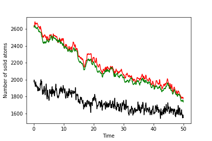

# PLUMED Masterclass 21.6: Dimensionality reduction

## Aims

The primary aim of this Masterclass is to show you how you might use PLUMED in your work.
We will see how to call PLUMED from a python notebook and discuss some strategies for selecting
collective variables.

## Objectives

Once this series of exercise is completed, users will be able to:

- Use Gibbs dividing surfaces to determine the extent of a phase. 

## Resources

The data needed to complete this Masterclass can be found on [GitHub](https://github.com/plumed/masterclass-21-6).
You can clone this repository locally on your machine using the following command:

````
git clone https://github.com/plumed/masterclass-21-6.git
````

I recommend that you run each exercise in a separate sub-directory (i.e. Exercise-1, Exercise-2, ...), which you can create inside the root directory `masterclass-21-6`. Organizing your data this way will help you to keep things clean.

_All the exercises have been tested with PLUMED version 2.7.0._

## Acknowledgements

Throughout this exercise, we use the [atomistic simulation environment](https://wiki.fysik.dtu.dk/ase/)
and [chemiscope](https://chemiscope.org/).  Please look at the information at the links I have provided here
for more information about these codes.

## Exercises

Many researchers have used these rare event methods to study nucleation and crystal growth.  Studying such problems introduces an additional challenge when designing collective variables as all the
atoms are indistinguishable.  You thus know before even running the simulation that there are multiple paths that connect the reactant (liquid) state and the product (solid) state.  The nucleation, 
after all, can start with any atom in the simulation box.  The first step in developing CVs for studying nucleation processes is thus to identify some order parameter that allows us to distinguish atoms that 
are in the solid state from atoms that are in the liquid state.  The following input, once it is filled in will calculate some suitable order parameters for all the atoms in the system: 


<div class="plumedpreheader">
<div class="headerInfo" id="value_details_data/work/plumed_ex10.dat"> Click on the labels of the actions for more information on what each action computes </div>
<div class="containerBadge">
<div class="headerBadge"><a href="plumed_ex10.dat.plumed.stderr"></a></div>
<div class="headerBadge"><a href="plumed_ex10.dat.plumed_master.stderr"></a></div>
<div class="headerBadge"></div>
</div>
</div>
<div id="data/work/plumed_ex10.dat_short">
<pre class="plumedlisting">
<span class="plumedtooltip" style="color:green">UNITS<span class="right">This command sets the internal units for the code. <a href="https://www.plumed.org/doc-master/user-doc/html/UNITS" style="color:green">More details</a><i></i></span></span> <span class="plumedtooltip">NATURAL<span class="right"> use natural units<i></i></span></span>
<span style="display:none;" id="data/work/plumed_ex10.dat">The UNITS action with label <b></b> calculates something</span><b name="data/work/plumed_ex10.datcoord" onclick='showPath("data/work/plumed_ex10.dat","data/work/plumed_ex10.datcoord","data/work/plumed_ex10.datcoord","brown")'>coord</b>: <span class="plumedtooltip" style="color:green">COORDINATIONNUMBER<span class="right">Calculate the coordination numbers of atoms so that you can then calculate functions of the distribution of <a href="https://www.plumed.org/doc-master/user-doc/html/COORDINATIONNUMBER" style="color:green">More details</a><i></i></span></span> <span style="background-color:yellow">__FILL__</span>=1-5184 <span style="background-color:yellow">__FILL__</span>={CUBIC <span class="plumedtooltip">D_0<span class="right"> The d_0 parameter of the switching function<i></i></span></span>=1.2 D_MAX=1.5} 
<span style="display:none;" id="data/work/plumed_ex10.datcoord">The COORDINATIONNUMBER action with label <b>coord</b> calculates the following quantities:<table  align="center" frame="void" width="95%" cellpadding="5%"><tr><td width="5%"><b> Quantity </b>  </td><td><b> Description </b> </td></tr><tr><td width="5%">coord.value</td><td>the coordination numbers of the specified atoms</td></tr></table></span><b name="data/work/plumed_ex10.datcub" onclick='showPath("data/work/plumed_ex10.dat","data/work/plumed_ex10.datcub","data/work/plumed_ex10.datcub","brown")'>cub</b>: <span class="plumedtooltip" style="color:green">FCCUBIC<span class="right">Measure how similar the environment around atoms is to that found in a FCC structure. <a href="https://www.plumed.org/doc-master/user-doc/html/FCCUBIC" style="color:green">More details</a><i></i></span></span> <span style="background-color:yellow">__FILL__</span>=1-5184 <span style="background-color:yellow">__FILL__</span>={CUBIC <span class="plumedtooltip">D_0<span class="right"> The d_0 parameter of the switching function<i></i></span></span>=1.2 D_MAX=1.5} <span class="plumedtooltip">ALPHA<span class="right"> The alpha parameter of the angular function that is used for FCCUBIC<i></i></span></span>=27
<span style="display:none;" id="data/work/plumed_ex10.datcub">The FCCUBIC action with label <b>cub</b> calculates the following quantities:<table  align="center" frame="void" width="95%" cellpadding="5%"><tr><td width="5%"><b> Quantity </b>  </td><td><b> Description </b> </td></tr><tr><td width="5%">cub.value</td><td>the symmetry function for each of the specified atoms</td></tr></table></span><b name="data/work/plumed_ex10.datfcub" onclick='showPath("data/work/plumed_ex10.dat","data/work/plumed_ex10.datfcub","data/work/plumed_ex10.datfcub","brown")'>fcub</b>: <span class="plumedtooltip" style="color:green">MORE_THAN<span class="right">Use a switching function to determine how many of the input variables are more than a certain cutoff. <a href="https://www.plumed.org/doc-master/user-doc/html/MORE_THAN" style="color:green">More details</a><i></i></span></span> <span class="plumedtooltip">ARG<span class="right">the values input to this function<i></i></span></span>=<span style="background-color:yellow">__FILL__</span> <span class="plumedtooltip">SWITCH<span class="right">This keyword is used if you want to employ an alternative to the continuous swiching function defined above<i></i></span></span>={SMAP R_0=0.45 D_0=0.0 A=8 B=8}
<span style="display:none;" id="data/work/plumed_ex10.datfcub">The MORE_THAN action with label <b>fcub</b> calculates the following quantities:<table  align="center" frame="void" width="95%" cellpadding="5%"><tr><td width="5%"><b> Quantity </b>  </td><td><b> Description </b> </td></tr><tr><td width="5%">fcub.value</td><td>a function that is one if the if the input is more than a threshold</td></tr></table></span><b name="data/work/plumed_ex10.datfcub_grp" onclick='showPath("data/work/plumed_ex10.dat","data/work/plumed_ex10.datfcub_grp","data/work/plumed_ex10.datfcub_grp","brown")'>fcub_grp</b>: <span class="plumedtooltip" style="color:green">GROUP<span class="right">Define a group of atoms so that a particular list of atoms can be referenced with a single label in definitions of CVs or virtual atoms. <a href="https://www.plumed.org/doc-master/user-doc/html/GROUP" style="color:green">More details</a><i></i></span></span> <span class="plumedtooltip">ATOMS<span class="right">the numerical indexes for the set of atoms in the group<i></i></span></span>=<b name="data/work/plumed_ex10.datcub">cub</b>
<span style="display:none;" id="data/work/plumed_ex10.datfcub_grp">The GROUP action with label <b>fcub_grp</b> calculates something</span><span class="plumedtooltip" style="color:green">DUMPMULTICOLVAR<span class="right">Dump atom positions and a vector of values to a file. <a href="https://www.plumed.org/doc-master/user-doc/html/DUMPMULTICOLVAR" style="color:green">More details</a><i></i></span></span> <span style="background-color:yellow">__FILL__</span>=<b name="data/work/plumed_ex10.datcoord">coord</b> STRIDE=1000 <span style="background-color:yellow">__FILL__</span>=<b name="data/work/plumed_ex10.datcoord">coord.xyz</b>
<span class="plumedtooltip" style="color:green">DUMPMULTICOLVAR<span class="right">Dump atom positions and a vector of values to a file. <a href="https://www.plumed.org/doc-master/user-doc/html/DUMPMULTICOLVAR" style="color:green">More details</a><i></i></span></span> <span style="background-color:yellow">__FILL__</span>=<b name="data/work/plumed_ex10.datcub">cub</b> STRIDE=1000 <span style="background-color:yellow">__FILL__</span>=<b name="data/work/plumed_ex10.datcub">cub.xyz</b> 
<span class="plumedtooltip" style="color:green">DUMPMULTICOLVAR<span class="right">Dump atom positions and a vector of values to a file. <a href="https://www.plumed.org/doc-master/user-doc/html/DUMPMULTICOLVAR" style="color:green">More details</a><i></i></span></span> <span style="background-color:yellow">__FILL__</span>=<b name="data/work/plumed_ex10.datfcub">fcub</b> STRIDE=1000 <span style="background-color:yellow">__FILL__</span>=<b name="data/work/plumed_ex10.datfcub">fcub.xyz</b>
</pre></div>
<div style="display:none;" id="data/work/plumed_ex10.dat_long"><pre class="plumedlisting">
<span class="plumedtooltip" style="color:green">UNITS<span class="right">This command sets the internal units for the code. <a href="https://www.plumed.org/doc-master/user-doc/html/UNITS" style="color:green">More details</a><i></i></span></span> <span class="plumedtooltip">NATURAL<span class="right"> use natural units<i></i></span></span>
<span style="display:none;" id="data/work/plumed_ex10.dat_sol">The UNITS action with label <b></b> calculates something</span><b name="data/work/plumed_ex10.dat_solcoord" onclick='showPath("data/work/plumed_ex10.dat","data/work/plumed_ex10.dat_solcoord","data/work/plumed_ex10.dat_solcoord","brown")'>coord</b>: <span class="plumedtooltip" style="color:green">COORDINATIONNUMBER<span class="right">Calculate the coordination numbers of atoms so that you can then calculate functions of the distribution of <a href="https://www.plumed.org/doc-master/user-doc/html/COORDINATIONNUMBER" style="color:green">More details</a><i></i></span></span> <span class="plumedtooltip">SPECIES<span class="right">the list of atoms for which the symmetry function is being calculated and the atoms that can be in the environments<i></i></span></span>=1-5184 <span class="plumedtooltip">SWITCH<span class="right">the switching function that it used in the construction of the contact matrix. Options for this keyword are explained in the documentation for <a href="https://www.plumed.org/doc-master/user-doc/html/LESS_THAN">LESS_THAN</a>.<i></i></span></span>={CUBIC D_0=1.2 D_MAX=1.5} 
<span style="display:none;" id="data/work/plumed_ex10.dat_solcoord">The COORDINATIONNUMBER action with label <b>coord</b> calculates the following quantities:<table  align="center" frame="void" width="95%" cellpadding="5%"><tr><td width="5%"><b> Quantity </b>  </td><td><b> Description </b> </td></tr><tr><td width="5%">coord.value</td><td>the coordination numbers of the specified atoms</td></tr></table></span><b name="data/work/plumed_ex10.dat_solcub" onclick='showPath("data/work/plumed_ex10.dat","data/work/plumed_ex10.dat_solcub","data/work/plumed_ex10.dat_solcub","brown")'>cub</b>: <span class="plumedtooltip" style="color:green">FCCUBIC<span class="right">Measure how similar the environment around atoms is to that found in a FCC structure. <a href="https://www.plumed.org/doc-master/user-doc/html/FCCUBIC" style="color:green">More details</a><i></i></span></span> <span class="plumedtooltip">SPECIES<span class="right">the list of atoms for which the symmetry function is being calculated and the atoms that can be in the environments<i></i></span></span>=1-5184 <span class="plumedtooltip">SWITCH<span class="right">the switching function that it used in the construction of the contact matrix. Options for this keyword are explained in the documentation for <a href="https://www.plumed.org/doc-master/user-doc/html/LESS_THAN">LESS_THAN</a>.<i></i></span></span>={CUBIC D_0=1.2 D_MAX=1.5} <span class="plumedtooltip">ALPHA<span class="right"> The alpha parameter of the angular function that is used for FCCUBIC<i></i></span></span>=27
<span style="display:none;" id="data/work/plumed_ex10.dat_solcub">The FCCUBIC action with label <b>cub</b> calculates the following quantities:<table  align="center" frame="void" width="95%" cellpadding="5%"><tr><td width="5%"><b> Quantity </b>  </td><td><b> Description </b> </td></tr><tr><td width="5%">cub.value</td><td>the symmetry function for each of the specified atoms</td></tr></table></span><b name="data/work/plumed_ex10.dat_solfcub" onclick='showPath("data/work/plumed_ex10.dat","data/work/plumed_ex10.dat_solfcub","data/work/plumed_ex10.dat_solfcub","brown")'>fcub</b>: <span class="plumedtooltip" style="color:green">MORE_THAN<span class="right">Use a switching function to determine how many of the input variables are more than a certain cutoff. <a href="https://www.plumed.org/doc-master/user-doc/html/MORE_THAN" style="color:green">More details</a><i></i></span></span> <span class="plumedtooltip">ARG<span class="right">the values input to this function<i></i></span></span>=<b name="data/work/plumed_ex10.dat_solcub">cub</b> <span class="plumedtooltip">SWITCH<span class="right">This keyword is used if you want to employ an alternative to the continuous swiching function defined above<i></i></span></span>={SMAP R_0=0.45 D_0=0.0 A=8 B=8}
<span style="display:none;" id="data/work/plumed_ex10.dat_solfcub">The MORE_THAN action with label <b>fcub</b> calculates the following quantities:<table  align="center" frame="void" width="95%" cellpadding="5%"><tr><td width="5%"><b> Quantity </b>  </td><td><b> Description </b> </td></tr><tr><td width="5%">fcub.value</td><td>a function that is one if the if the input is more than a threshold</td></tr></table></span><b name="data/work/plumed_ex10.dat_solfcub_grp" onclick='showPath("data/work/plumed_ex10.dat","data/work/plumed_ex10.dat_solfcub_grp","data/work/plumed_ex10.dat_solfcub_grp","brown")'>fcub_grp</b>: <span class="plumedtooltip" style="color:green">GROUP<span class="right">Define a group of atoms so that a particular list of atoms can be referenced with a single label in definitions of CVs or virtual atoms. <a href="https://www.plumed.org/doc-master/user-doc/html/GROUP" style="color:green">More details</a><i></i></span></span> <span class="plumedtooltip">ATOMS<span class="right">the numerical indexes for the set of atoms in the group<i></i></span></span>=<b name="data/work/plumed_ex10.dat_solcub">cub</b>
<span style="display:none;" id="data/work/plumed_ex10.dat_solfcub_grp">The GROUP action with label <b>fcub_grp</b> calculates something</span><span class="plumedtooltip" style="color:green">DUMPMULTICOLVAR<span class="right">Dump atom positions and a vector of values to a file. <a href="https://www.plumed.org/doc-master/user-doc/html/DUMPMULTICOLVAR" style="color:green">More details</a><i></i></span></span> <span class="plumedtooltip">DATA<span class="right">the vector you wish to transform<i></i></span></span>=<b name="data/work/plumed_ex10.dat_solcoord">coord</b> STRIDE=1000 <span class="plumedtooltip">FILE<span class="right">the file that you would like to output the data to<i></i></span></span>=<b name="data/work/plumed_ex10.dat_solcoord">coord.xyz</b>
<span class="plumedtooltip" style="color:green">DUMPMULTICOLVAR<span class="right">Dump atom positions and a vector of values to a file. <a href="https://www.plumed.org/doc-master/user-doc/html/DUMPMULTICOLVAR" style="color:green">More details</a><i></i></span></span> <span class="plumedtooltip">DATA<span class="right">the vector you wish to transform<i></i></span></span>=<b name="data/work/plumed_ex10.dat_solcub">cub</b> STRIDE=1000 <span class="plumedtooltip">FILE<span class="right">the file that you would like to output the data to<i></i></span></span>=<b name="data/work/plumed_ex10.dat_solcub">cub.xyz</b>
<span class="plumedtooltip" style="color:green">DUMPMULTICOLVAR<span class="right">Dump atom positions and a vector of values to a file. <a href="https://www.plumed.org/doc-master/user-doc/html/DUMPMULTICOLVAR" style="color:green">More details</a><i></i></span></span> <span class="plumedtooltip">DATA<span class="right">the vector you wish to transform<i></i></span></span>=<b name="data/work/plumed_ex10.dat_solfcub">fcub</b> STRIDE=1000 <span class="plumedtooltip">FILE<span class="right">the file that you would like to output the data to<i></i></span></span>=<b name="data/work/plumed_ex10.dat_solfcub">fcub.xyz</b>
</pre></div>

  

You can run a short MD simulation on Lennard-Jonesium to compute those order parameter by using the following input (in) file for simplemd:

````
inputfile interface.xyz
outputfile output.xyz
temperature 0.6
tstep 0.005
friction 1
forcecutoff 2.5
listcutoff  3.0
nstep 10000
nconfig 100 trajectory.xyz
nstat   100 energies.dat
````

You can run this from a python notebook and read in the values of the order parameters by using the following script: 

```python
p = '''
INSERT YOUR PLUMED INPUT HERE
'''

inp = '''
INSERT YOUR SIMPLEMD INPUT HERE
'''

# Make a directory to run in 
!rm -rf ../LJ-trajectories/First-run && mkdir ../LJ-trajectories/First-run
# Copy the initial configuration
!cp ../data/interface.xyz ../LJ-trajectories/First-run
# Output the plumed file
f = open("../LJ-trajectories/First-run/plumed.dat", 'w')
f.write(p)
f.close()
# Output the input to simplemd
f = open("../LJ-trajectories/First-run/in", 'w')
f.write(inp)
f.close()

# Now run PLUMED
!cd ../LJ-trajectories/First-run/ && plumed simplemd < in &> /dev/null

# Read in the various order parameters (N.B. you can almost certainly write better python here)
!grep X ../LJ-trajectories/First-run/coord.xyz | awk '{print $5}' > ../LJ-trajectories/First-run/coord.dat
coord = np.loadtxt("../LJ-trajectories/First-run/coord.dat")
!grep X ../LJ-trajectories/First-run/cub.xyz | awk '{print $5}' > ../LJ-trajectories/First-run/cub.dat
cub = np.loadtxt("../LJ-trajectories/First-run/cub.dat")
!grep X ../LJ-trajectories/First-run/fcub.xyz | awk '{print $6}' > ../LJ-trajectories/First-run/fcub.dat
fcub = np.loadtxt("../LJ-trajectories/First-run/fcub.dat")
```

A visualization of the order parameters for all the atoms can then be produced using chemiscope, which allows you to see the value of all the individual atom order parameters.  

```python
import ase
import ase.io
from chemiscope import write_input

# Read in the trajectory
traj = ase.io.read('../LJ-trajectories/First-run/trajectory.xyz',':')

# This constructs the dictionary of properties for chemiscope
properties = {
    "coord": {
        "target": "atom",
        "values": coord,
        "description": "Coordination number of atom",
    },
    "cub": {
        "target": "atom",
        "values": cub,
        "description": "FCCCUBIC order parameter",
    },
    "fcub": {
        "target": "atom",
        "values": fcub,
        "description": "Transformed FCCUBIC order parameter",
    },
}

# This generates our chemiscope output
write_input("fccubic_chemiscope.json.gz", cutoff=1.5, frames=traj, properties=properties )
```

__Put all the above together and see if you can produce a chemiscope representation like the one below__


Chemiscope is invaluable for determining whether our order parameter is good at distinguishing the atoms within the solid from those within the liquid.   If you visualize the FCCCUBIC or the transformed values of these parameters in the example above, you see that roughly half of the atoms are solid-like, and nearly half of the atoms are liquid-like.  Notice also that we can use the dimensionality reduction that were discussed in earlier parts of this masterclass
and clustering algorithms to develop these atomic order parameters.  Generating the data to analyze using these algorithms is easier because we can get multiple sets of coordinates to analyze from each trajectory frame.  The atoms are, 
after all, indistinguishable.

Once we have identified an order parameter we can analyse the distribution of values that it takes by using an input like the one shown below:


<div class="plumedpreheader">
<div class="headerInfo" id="value_details_data/work/plumed_ex11.dat"> Click on the labels of the actions for more information on what each action computes </div>
<div class="containerBadge">
<div class="headerBadge"><a href="plumed_ex11.dat.plumed.stderr"></a></div>
<div class="headerBadge"><a href="plumed_ex11.dat.plumed_master.stderr"></a></div>
<div class="headerBadge"></div>
</div>
</div>
<div id="data/work/plumed_ex11.dat_short">
<pre class="plumedlisting">
<span class="plumedtooltip" style="color:green">UNITS<span class="right">This command sets the internal units for the code. <a href="https://www.plumed.org/doc-master/user-doc/html/UNITS" style="color:green">More details</a><i></i></span></span> <span class="plumedtooltip">NATURAL<span class="right"> use natural units<i></i></span></span>
<span style="display:none;" id="data/work/plumed_ex11.dat">The UNITS action with label <b></b> calculates something</span><b name="data/work/plumed_ex11.datcoord" onclick='showPath("data/work/plumed_ex11.dat","data/work/plumed_ex11.datcoord","data/work/plumed_ex11.datcoord","brown")'>coord</b>: <span class="plumedtooltip" style="color:green">COORDINATIONNUMBER<span class="right">Calculate the coordination numbers of atoms so that you can then calculate functions of the distribution of <a href="https://www.plumed.org/doc-master/user-doc/html/COORDINATIONNUMBER" style="color:green">More details</a><i></i></span></span> <span style="background-color:yellow">__FILL__</span>=1-5184 <span style="background-color:yellow">__FILL__</span>={CUBIC <span class="plumedtooltip">D_0<span class="right"> The d_0 parameter of the switching function<i></i></span></span>=1.2 D_MAX=1.5} 
<span style="display:none;" id="data/work/plumed_ex11.datcoord">The COORDINATIONNUMBER action with label <b>coord</b> calculates the following quantities:<table  align="center" frame="void" width="95%" cellpadding="5%"><tr><td width="5%"><b> Quantity </b>  </td><td><b> Description </b> </td></tr><tr><td width="5%">coord.value</td><td>the coordination numbers of the specified atoms</td></tr></table></span><b name="data/work/plumed_ex11.datcub" onclick='showPath("data/work/plumed_ex11.dat","data/work/plumed_ex11.datcub","data/work/plumed_ex11.datcub","brown")'>cub</b>: <span class="plumedtooltip" style="color:green">FCCUBIC<span class="right">Measure how similar the environment around atoms is to that found in a FCC structure. <a href="https://www.plumed.org/doc-master/user-doc/html/FCCUBIC" style="color:green">More details</a><i></i></span></span> <span style="background-color:yellow">__FILL__</span>=1-5184 <span style="background-color:yellow">__FILL__</span>={CUBIC <span class="plumedtooltip">D_0<span class="right"> The d_0 parameter of the switching function<i></i></span></span>=1.2 D_MAX=1.5} <span class="plumedtooltip">ALPHA<span class="right"> The alpha parameter of the angular function that is used for FCCUBIC<i></i></span></span>=27
<span style="display:none;" id="data/work/plumed_ex11.datcub">The FCCUBIC action with label <b>cub</b> calculates the following quantities:<table  align="center" frame="void" width="95%" cellpadding="5%"><tr><td width="5%"><b> Quantity </b>  </td><td><b> Description </b> </td></tr><tr><td width="5%">cub.value</td><td>the symmetry function for each of the specified atoms</td></tr></table></span><b name="data/work/plumed_ex11.datfcub" onclick='showPath("data/work/plumed_ex11.dat","data/work/plumed_ex11.datfcub","data/work/plumed_ex11.datfcub","brown")'>fcub</b>: <span class="plumedtooltip" style="color:green">MORE_THAN<span class="right">Use a switching function to determine how many of the input variables are more than a certain cutoff. <a href="https://www.plumed.org/doc-master/user-doc/html/MORE_THAN" style="color:green">More details</a><i></i></span></span> <span class="plumedtooltip">ARG<span class="right">the values input to this function<i></i></span></span>=<span style="background-color:yellow">__FILL__</span> <span class="plumedtooltip">SWITCH<span class="right">This keyword is used if you want to employ an alternative to the continuous swiching function defined above<i></i></span></span>={SMAP R_0=0.45 D_0=0.0 A=8 B=8}
<span style="display:none;" id="data/work/plumed_ex11.datfcub">The MORE_THAN action with label <b>fcub</b> calculates the following quantities:<table  align="center" frame="void" width="95%" cellpadding="5%"><tr><td width="5%"><b> Quantity </b>  </td><td><b> Description </b> </td></tr><tr><td width="5%">fcub.value</td><td>a function that is one if the if the input is more than a threshold</td></tr></table></span><b name="data/work/plumed_ex11.datfcub_grp" onclick='showPath("data/work/plumed_ex11.dat","data/work/plumed_ex11.datfcub_grp","data/work/plumed_ex11.datfcub_grp","brown")'>fcub_grp</b>: <span class="plumedtooltip" style="color:green">GROUP<span class="right">Define a group of atoms so that a particular list of atoms can be referenced with a single label in definitions of CVs or virtual atoms. <a href="https://www.plumed.org/doc-master/user-doc/html/GROUP" style="color:green">More details</a><i></i></span></span> <span class="plumedtooltip">ATOMS<span class="right">the numerical indexes for the set of atoms in the group<i></i></span></span>=<b name="data/work/plumed_ex11.datcub">cub</b>
<span style="display:none;" id="data/work/plumed_ex11.datfcub_grp">The GROUP action with label <b>fcub_grp</b> calculates something</span><b name="data/work/plumed_ex11.datcoord_histo" onclick='showPath("data/work/plumed_ex11.dat","data/work/plumed_ex11.datcoord_histo","data/work/plumed_ex11.datcoord_histo","brown")'>coord_histo</b>: <span class="plumedtooltip" style="color:green">HISTOGRAM<span class="right">Accumulate the average probability density along a few CVs from a trajectory. <a href="https://www.plumed.org/doc-master/user-doc/html/HISTOGRAM" style="color:green">More details</a><i></i></span></span> <span style="background-color:yellow">__FILL__</span>=<b name="data/work/plumed_ex11.datcoord">coord</b> <span class="plumedtooltip">STRIDE<span class="right"> the frequency with which to store data for averaging<i></i></span></span>=10 <span style="background-color:yellow">__FILL__</span>=2 <span class="plumedtooltip">GRID_MAX<span class="right"> the upper bounds for the grid<i></i></span></span>=15 <span style="background-color:yellow">__FILL__</span>=100 <span style="background-color:yellow">__FILL__</span>=DISCRETE
<span style="display:none;" id="data/work/plumed_ex11.datcoord_histo">The HISTOGRAM action with label <b>coord_histo</b> calculates the following quantities:<table  align="center" frame="void" width="95%" cellpadding="5%"><tr><td width="5%"><b> Quantity </b>  </td><td><b> Description </b> </td></tr><tr><td width="5%">coord_histo.value</td><td>the estimate of the histogram as a function of the argument that was obtained</td></tr></table></span><b name="data/work/plumed_ex11.datcub_histo" onclick='showPath("data/work/plumed_ex11.dat","data/work/plumed_ex11.datcub_histo","data/work/plumed_ex11.datcub_histo","brown")'>cub_histo</b>: <span class="plumedtooltip" style="color:green">HISTOGRAM<span class="right">Accumulate the average probability density along a few CVs from a trajectory. <a href="https://www.plumed.org/doc-master/user-doc/html/HISTOGRAM" style="color:green">More details</a><i></i></span></span> <span style="background-color:yellow">__FILL__</span>=<b name="data/work/plumed_ex11.datcub">cub</b> <span class="plumedtooltip">STRIDE<span class="right"> the frequency with which to store data for averaging<i></i></span></span>=10 <span class="plumedtooltip">GRID_MIN<span class="right"> the lower bounds for the grid<i></i></span></span>=-1 <span style="background-color:yellow">__FILL__</span>=1 <span style="background-color:yellow">__FILL__</span>=100 <span style="background-color:yellow">__FILL__</span>=DISCRETE
<span style="display:none;" id="data/work/plumed_ex11.datcub_histo">The HISTOGRAM action with label <b>cub_histo</b> calculates the following quantities:<table  align="center" frame="void" width="95%" cellpadding="5%"><tr><td width="5%"><b> Quantity </b>  </td><td><b> Description </b> </td></tr><tr><td width="5%">cub_histo.value</td><td>the estimate of the histogram as a function of the argument that was obtained</td></tr></table></span><b name="data/work/plumed_ex11.datfcub_histo" onclick='showPath("data/work/plumed_ex11.dat","data/work/plumed_ex11.datfcub_histo","data/work/plumed_ex11.datfcub_histo","brown")'>fcub_histo</b>: <span class="plumedtooltip" style="color:green">HISTOGRAM<span class="right">Accumulate the average probability density along a few CVs from a trajectory. <a href="https://www.plumed.org/doc-master/user-doc/html/HISTOGRAM" style="color:green">More details</a><i></i></span></span> <span style="background-color:yellow">__FILL__</span>=<b name="data/work/plumed_ex11.datfcub">fcub</b> <span class="plumedtooltip">STRIDE<span class="right"> the frequency with which to store data for averaging<i></i></span></span>=10 <span style="background-color:yellow">__FILL__</span>=0 <span class="plumedtooltip">GRID_MAX<span class="right"> the upper bounds for the grid<i></i></span></span>=1 <span style="background-color:yellow">__FILL__</span>=100 <span style="background-color:yellow">__FILL__</span>=DISCRETE
<span style="display:none;" id="data/work/plumed_ex11.datfcub_histo">The HISTOGRAM action with label <b>fcub_histo</b> calculates the following quantities:<table  align="center" frame="void" width="95%" cellpadding="5%"><tr><td width="5%"><b> Quantity </b>  </td><td><b> Description </b> </td></tr><tr><td width="5%">fcub_histo.value</td><td>the estimate of the histogram as a function of the argument that was obtained</td></tr></table></span><span class="plumedtooltip" style="color:green">DUMPGRID<span class="right">Output the function on the grid to a file with the PLUMED grid format. <a href="https://www.plumed.org/doc-master/user-doc/html/DUMPGRID" style="color:green">More details</a><i></i></span></span> <span style="background-color:yellow">__FILL__</span>=<b name="data/work/plumed_ex11.datcoord_histo">coord_histo</b> <span class="plumedtooltip">FILE<span class="right"> the file on which to write the grid<i></i></span></span>=<b name="data/work/plumed_ex11.datcoord_histo">coord_histo.dat</b>
<span class="plumedtooltip" style="color:green">DUMPGRID<span class="right">Output the function on the grid to a file with the PLUMED grid format. <a href="https://www.plumed.org/doc-master/user-doc/html/DUMPGRID" style="color:green">More details</a><i></i></span></span> <span style="background-color:yellow">__FILL__</span>=<b name="data/work/plumed_ex11.datcub_histo">cub_histo</b> <span class="plumedtooltip">FILE<span class="right"> the file on which to write the grid<i></i></span></span>=<b name="data/work/plumed_ex11.datcub_histo">cub_histo.dat</b>
<span class="plumedtooltip" style="color:green">DUMPGRID<span class="right">Output the function on the grid to a file with the PLUMED grid format. <a href="https://www.plumed.org/doc-master/user-doc/html/DUMPGRID" style="color:green">More details</a><i></i></span></span> <span style="background-color:yellow">__FILL__</span>=<b name="data/work/plumed_ex11.datfcub_histo">fcub_histo</b> <span class="plumedtooltip">FILE<span class="right"> the file on which to write the grid<i></i></span></span>=<b name="data/work/plumed_ex11.datfcub_histo">fcub_histo.dat</b>
</pre></div>
<div style="display:none;" id="data/work/plumed_ex11.dat_long"><pre class="plumedlisting">
<span class="plumedtooltip" style="color:green">UNITS<span class="right">This command sets the internal units for the code. <a href="https://www.plumed.org/doc-master/user-doc/html/UNITS" style="color:green">More details</a><i></i></span></span> <span class="plumedtooltip">NATURAL<span class="right"> use natural units<i></i></span></span>
<span style="display:none;" id="data/work/plumed_ex11.dat_sol">The UNITS action with label <b></b> calculates something</span><b name="data/work/plumed_ex11.dat_solcoord" onclick='showPath("data/work/plumed_ex11.dat","data/work/plumed_ex11.dat_solcoord","data/work/plumed_ex11.dat_solcoord","brown")'>coord</b>: <span class="plumedtooltip" style="color:green">COORDINATIONNUMBER<span class="right">Calculate the coordination numbers of atoms so that you can then calculate functions of the distribution of <a href="https://www.plumed.org/doc-master/user-doc/html/COORDINATIONNUMBER" style="color:green">More details</a><i></i></span></span> <span class="plumedtooltip">SPECIES<span class="right">the list of atoms for which the symmetry function is being calculated and the atoms that can be in the environments<i></i></span></span>=1-5184 <span class="plumedtooltip">SWITCH<span class="right">the switching function that it used in the construction of the contact matrix. Options for this keyword are explained in the documentation for <a href="https://www.plumed.org/doc-master/user-doc/html/LESS_THAN">LESS_THAN</a>.<i></i></span></span>={CUBIC D_0=1.2 D_MAX=1.5} 
<span style="display:none;" id="data/work/plumed_ex11.dat_solcoord">The COORDINATIONNUMBER action with label <b>coord</b> calculates the following quantities:<table  align="center" frame="void" width="95%" cellpadding="5%"><tr><td width="5%"><b> Quantity </b>  </td><td><b> Description </b> </td></tr><tr><td width="5%">coord.value</td><td>the coordination numbers of the specified atoms</td></tr></table></span><b name="data/work/plumed_ex11.dat_solcub" onclick='showPath("data/work/plumed_ex11.dat","data/work/plumed_ex11.dat_solcub","data/work/plumed_ex11.dat_solcub","brown")'>cub</b>: <span class="plumedtooltip" style="color:green">FCCUBIC<span class="right">Measure how similar the environment around atoms is to that found in a FCC structure. <a href="https://www.plumed.org/doc-master/user-doc/html/FCCUBIC" style="color:green">More details</a><i></i></span></span> <span class="plumedtooltip">SPECIES<span class="right">the list of atoms for which the symmetry function is being calculated and the atoms that can be in the environments<i></i></span></span>=1-5184 <span class="plumedtooltip">SWITCH<span class="right">the switching function that it used in the construction of the contact matrix. Options for this keyword are explained in the documentation for <a href="https://www.plumed.org/doc-master/user-doc/html/LESS_THAN">LESS_THAN</a>.<i></i></span></span>={CUBIC D_0=1.2 D_MAX=1.5} <span class="plumedtooltip">ALPHA<span class="right"> The alpha parameter of the angular function that is used for FCCUBIC<i></i></span></span>=27
<span style="display:none;" id="data/work/plumed_ex11.dat_solcub">The FCCUBIC action with label <b>cub</b> calculates the following quantities:<table  align="center" frame="void" width="95%" cellpadding="5%"><tr><td width="5%"><b> Quantity </b>  </td><td><b> Description </b> </td></tr><tr><td width="5%">cub.value</td><td>the symmetry function for each of the specified atoms</td></tr></table></span><b name="data/work/plumed_ex11.dat_solfcub" onclick='showPath("data/work/plumed_ex11.dat","data/work/plumed_ex11.dat_solfcub","data/work/plumed_ex11.dat_solfcub","brown")'>fcub</b>: <span class="plumedtooltip" style="color:green">MORE_THAN<span class="right">Use a switching function to determine how many of the input variables are more than a certain cutoff. <a href="https://www.plumed.org/doc-master/user-doc/html/MORE_THAN" style="color:green">More details</a><i></i></span></span> <span class="plumedtooltip">ARG<span class="right">the values input to this function<i></i></span></span>=<b name="data/work/plumed_ex11.dat_solcub">cub</b> <span class="plumedtooltip">SWITCH<span class="right">This keyword is used if you want to employ an alternative to the continuous swiching function defined above<i></i></span></span>={SMAP R_0=0.45 D_0=0.0 A=8 B=8}
<span style="display:none;" id="data/work/plumed_ex11.dat_solfcub">The MORE_THAN action with label <b>fcub</b> calculates the following quantities:<table  align="center" frame="void" width="95%" cellpadding="5%"><tr><td width="5%"><b> Quantity </b>  </td><td><b> Description </b> </td></tr><tr><td width="5%">fcub.value</td><td>a function that is one if the if the input is more than a threshold</td></tr></table></span><b name="data/work/plumed_ex11.dat_solfcub_grp" onclick='showPath("data/work/plumed_ex11.dat","data/work/plumed_ex11.dat_solfcub_grp","data/work/plumed_ex11.dat_solfcub_grp","brown")'>fcub_grp</b>: <span class="plumedtooltip" style="color:green">GROUP<span class="right">Define a group of atoms so that a particular list of atoms can be referenced with a single label in definitions of CVs or virtual atoms. <a href="https://www.plumed.org/doc-master/user-doc/html/GROUP" style="color:green">More details</a><i></i></span></span> <span class="plumedtooltip">ATOMS<span class="right">the numerical indexes for the set of atoms in the group<i></i></span></span>=<b name="data/work/plumed_ex11.dat_solcub">cub</b>
<span style="display:none;" id="data/work/plumed_ex11.dat_solfcub_grp">The GROUP action with label <b>fcub_grp</b> calculates something</span><b name="data/work/plumed_ex11.dat_solcoord_histo" onclick='showPath("data/work/plumed_ex11.dat","data/work/plumed_ex11.dat_solcoord_histo","data/work/plumed_ex11.dat_solcoord_histo","brown")'>coord_histo</b>: <span class="plumedtooltip" style="color:green">HISTOGRAM<span class="right">Accumulate the average probability density along a few CVs from a trajectory. <a href="https://www.plumed.org/doc-master/user-doc/html/HISTOGRAM" style="color:green">More details</a><i></i></span></span> <span class="plumedtooltip">DATA<span class="right">an alternative to the ARG keyword<i></i></span></span>=<b name="data/work/plumed_ex11.dat_solcoord">coord</b> <span class="plumedtooltip">STRIDE<span class="right"> the frequency with which to store data for averaging<i></i></span></span>=10 <span class="plumedtooltip">GRID_MIN<span class="right"> the lower bounds for the grid<i></i></span></span>=2 <span class="plumedtooltip">GRID_MAX<span class="right"> the upper bounds for the grid<i></i></span></span>=15 <span class="plumedtooltip">GRID_BIN<span class="right">the number of bins for the grid<i></i></span></span>=100 <span class="plumedtooltip">KERNEL<span class="right"> the kernel function you are using<i></i></span></span>=DISCRETE
<span style="display:none;" id="data/work/plumed_ex11.dat_solcoord_histo">The HISTOGRAM action with label <b>coord_histo</b> calculates the following quantities:<table  align="center" frame="void" width="95%" cellpadding="5%"><tr><td width="5%"><b> Quantity </b>  </td><td><b> Description </b> </td></tr><tr><td width="5%">coord_histo.value</td><td>the estimate of the histogram as a function of the argument that was obtained</td></tr></table></span><b name="data/work/plumed_ex11.dat_solcub_histo" onclick='showPath("data/work/plumed_ex11.dat","data/work/plumed_ex11.dat_solcub_histo","data/work/plumed_ex11.dat_solcub_histo","brown")'>cub_histo</b>: <span class="plumedtooltip" style="color:green">HISTOGRAM<span class="right">Accumulate the average probability density along a few CVs from a trajectory. <a href="https://www.plumed.org/doc-master/user-doc/html/HISTOGRAM" style="color:green">More details</a><i></i></span></span> <span class="plumedtooltip">DATA<span class="right">an alternative to the ARG keyword<i></i></span></span>=<b name="data/work/plumed_ex11.dat_solcub">cub</b> <span class="plumedtooltip">STRIDE<span class="right"> the frequency with which to store data for averaging<i></i></span></span>=10 <span class="plumedtooltip">GRID_MIN<span class="right"> the lower bounds for the grid<i></i></span></span>=-1 <span class="plumedtooltip">GRID_MAX<span class="right"> the upper bounds for the grid<i></i></span></span>=1 <span class="plumedtooltip">GRID_BIN<span class="right">the number of bins for the grid<i></i></span></span>=100 <span class="plumedtooltip">KERNEL<span class="right"> the kernel function you are using<i></i></span></span>=DISCRETE
<span style="display:none;" id="data/work/plumed_ex11.dat_solcub_histo">The HISTOGRAM action with label <b>cub_histo</b> calculates the following quantities:<table  align="center" frame="void" width="95%" cellpadding="5%"><tr><td width="5%"><b> Quantity </b>  </td><td><b> Description </b> </td></tr><tr><td width="5%">cub_histo.value</td><td>the estimate of the histogram as a function of the argument that was obtained</td></tr></table></span><b name="data/work/plumed_ex11.dat_solfcub_histo" onclick='showPath("data/work/plumed_ex11.dat","data/work/plumed_ex11.dat_solfcub_histo","data/work/plumed_ex11.dat_solfcub_histo","brown")'>fcub_histo</b>: <span class="plumedtooltip" style="color:green">HISTOGRAM<span class="right">Accumulate the average probability density along a few CVs from a trajectory. <a href="https://www.plumed.org/doc-master/user-doc/html/HISTOGRAM" style="color:green">More details</a><i></i></span></span> <span class="plumedtooltip">DATA<span class="right">an alternative to the ARG keyword<i></i></span></span>=<b name="data/work/plumed_ex11.dat_solfcub">fcub</b> <span class="plumedtooltip">STRIDE<span class="right"> the frequency with which to store data for averaging<i></i></span></span>=10 <span class="plumedtooltip">GRID_MIN<span class="right"> the lower bounds for the grid<i></i></span></span>=0 <span class="plumedtooltip">GRID_MAX<span class="right"> the upper bounds for the grid<i></i></span></span>=1 <span class="plumedtooltip">GRID_BIN<span class="right">the number of bins for the grid<i></i></span></span>=100 <span class="plumedtooltip">KERNEL<span class="right"> the kernel function you are using<i></i></span></span>=DISCRETE
<span style="display:none;" id="data/work/plumed_ex11.dat_solfcub_histo">The HISTOGRAM action with label <b>fcub_histo</b> calculates the following quantities:<table  align="center" frame="void" width="95%" cellpadding="5%"><tr><td width="5%"><b> Quantity </b>  </td><td><b> Description </b> </td></tr><tr><td width="5%">fcub_histo.value</td><td>the estimate of the histogram as a function of the argument that was obtained</td></tr></table></span><span class="plumedtooltip" style="color:green">DUMPGRID<span class="right">Output the function on the grid to a file with the PLUMED grid format. <a href="https://www.plumed.org/doc-master/user-doc/html/DUMPGRID" style="color:green">More details</a><i></i></span></span> <span class="plumedtooltip">GRID<span class="right">the grid you would like to print (can also use ARG for specifying what is being printed)<i></i></span></span>=<b name="data/work/plumed_ex11.dat_solcoord_histo">coord_histo</b> <span class="plumedtooltip">FILE<span class="right"> the file on which to write the grid<i></i></span></span>=<b name="data/work/plumed_ex11.dat_solcoord_histo">coord_histo.dat</b>
<span class="plumedtooltip" style="color:green">DUMPGRID<span class="right">Output the function on the grid to a file with the PLUMED grid format. <a href="https://www.plumed.org/doc-master/user-doc/html/DUMPGRID" style="color:green">More details</a><i></i></span></span> <span class="plumedtooltip">GRID<span class="right">the grid you would like to print (can also use ARG for specifying what is being printed)<i></i></span></span>=<b name="data/work/plumed_ex11.dat_solcub_histo">cub_histo</b> <span class="plumedtooltip">FILE<span class="right"> the file on which to write the grid<i></i></span></span>=<b name="data/work/plumed_ex11.dat_solcub_histo">cub_histo.dat</b>
<span class="plumedtooltip" style="color:green">DUMPGRID<span class="right">Output the function on the grid to a file with the PLUMED grid format. <a href="https://www.plumed.org/doc-master/user-doc/html/DUMPGRID" style="color:green">More details</a><i></i></span></span> <span class="plumedtooltip">GRID<span class="right">the grid you would like to print (can also use ARG for specifying what is being printed)<i></i></span></span>=<b name="data/work/plumed_ex11.dat_solfcub_histo">fcub_histo</b> <span class="plumedtooltip">FILE<span class="right"> the file on which to write the grid<i></i></span></span>=<b name="data/work/plumed_ex11.dat_solfcub_histo">fcub_histo.dat</b>
</pre></div>

  

The resulting distributions of order parameter values should look like this:


__Try to use the information above to reproduce this plot.__ Notice that the distribution of order parameters for the FCC Cubic order parameters is bimodal.  There is a peak corresponding to the value that this quantity takes in the box's liquid part. The second peak then corresponds to the value that the quantity takes in the box's solid part.  The same cannot be said for the coordination number by contrast.  Notice, last of all, that by transforming the values above
we have an order parameter that is one for atoms that are within the solid and zero otherwise. 

It is tempting to argue that the number of solid particles is equal to the number of atoms that have an order parameter that is greater than some threshold.  A better way to calculate the number of solid
particles, however, is to proceed as follows:

- Run simulations of the solid and liquid under the same thermodynamic conditions.
- Calculate the average values per atom value of the order parameter in these simulations of the solid $\phi_s$ and liquid $\phi_l$.
- Calculate the number of solid $n_l$ and liquid atoms $n_l$ by solving the following pair of simultaneous equations $N=n_s + n_l$ and $\Phi = n_s \phi_s + n_l \phi_l$, where $N$ is the total number of atoms. $\Phi$, meanwhile, is given by:

$$
\Phi = \sum_{i=1}^N \phi_i
$$

The sum runs over all the atoms and where $\phi_i$ is the order parameter for the $i$th atom in the system.

This procedure works because $\Phi$ is an extensive quantity and is thus additive.  If we have a system that contains a aolid liquid interface we can express the value of any extensive quantity, $\Psi$ using:

$$
\Psi = n_s \psi_s + n_l \psi_l + \psi_i
$$

where $\psi_s$ and $\psi_l$ is the average value per atom value of the quantity $\psi$ in the solid and liquid phases.  $\psi_i$, meanwhile, is the so-called surface excess term which measures the contribution that the presence of the interface makes to the value of $\Psi$.  When we find $n_s$ by solving the simultaneous equations above, we assume that this excess term is zero.

__To complete this exercise, you should run simulations of the solid, liquid and interface.  You should use the ensemble average of the order parameter for your solid and liquid simulations to make a graph like the one below that shows the number of atoms of solid as a function of time for the system that contains the interface__.  The number of solid atoms has been determined by solving the simultaneous equations using the theory above.  Notice that there are input configurations for the solid, liquid and interface systems in the data directory of the GitHub repository.  The solid configuration is in `solid.xyz`. The liquid is in `liquid.xyz`, and the interface is in `interface.xyz`.  The final result you get will look something like this:



Notice that the green line is the least noisy of these curves.  The reason the line is less noisy is connected to the fact that you have the clearest delineation between solid and liquid atoms when you use this order parameter.

NB. We are running at constant volume because we are keeping things simple and using simplemd.  If you are studying nucleation using these techniques, you should run at constant pressure. 
