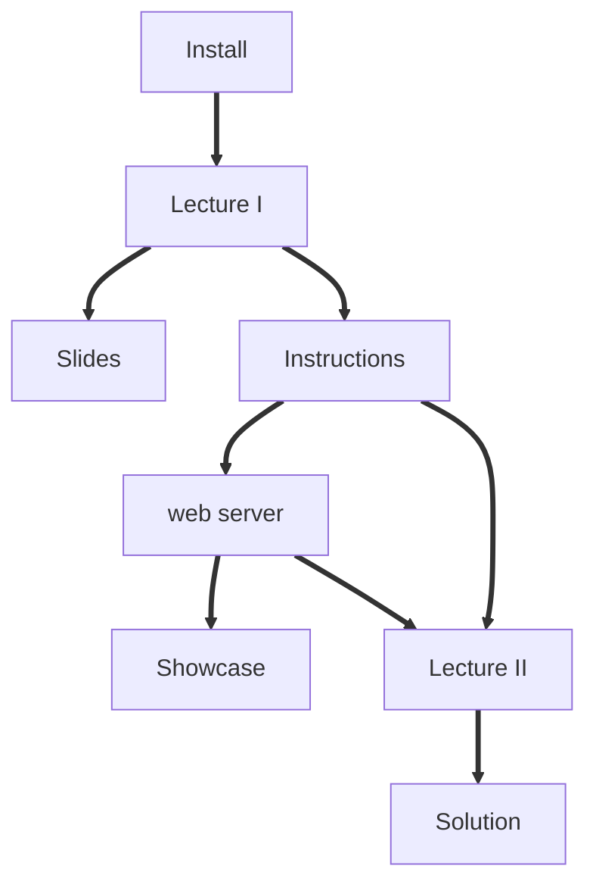

# Masterclass 22.01: Funnel Metadynamics (FM): predicting ligand binding models, binding free energies and kinetics

This lesson was given as part of the PLUMED masterclass series in 2022.  It included:

* A two video set covering the theory behind the technique and practical information to set up and analyse the results.
* A set of inputs to try the code and rerun FM on a paradigmatic system.
* Some supplementary python notebooks that provide further background information on the exercise.

The flow chart shown below indicates the order in which you should consult the resources.  You can click on the nodes to access the various resources.  Follow the thick black lines for the best results.  The resources that are connected by dashed lines are supplmentary resources that you may find useful when completing the exercise.

This data was presented among the masterclasses in the 2022 series.


<b><a href="https://www.plumed.org/doc-master/user-doc/html/actionlist/?actions=" target="_blank">Click here</a> to open manual pages for actions discussed in this tutorial.</b>

