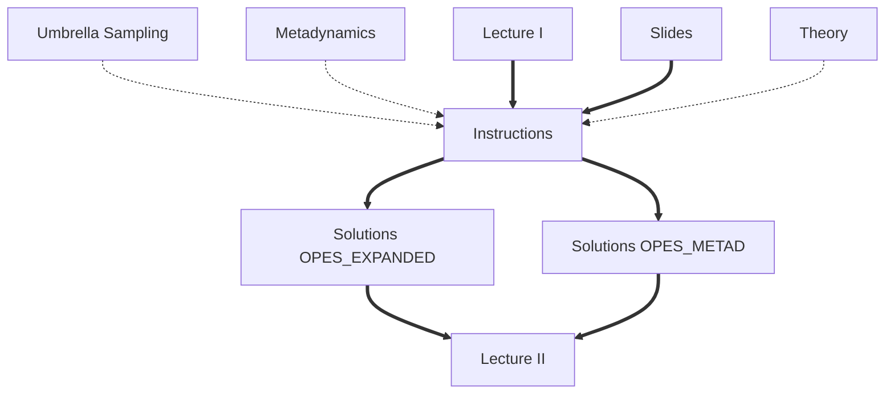

# Masterclass 22.03: Rethinking Metadynamics: the On-the-fly Probability Enhanced Sampling (OPES) method

This lesson was given as part of the PLUMED masterclass series in 2022.  It includes:

* Two videos, one about the theory and one about the exercises.
* A series of exercises for you to complete.
* Two python notebooks that contain the full solutions to the exercises.

The flow chart shown below indicates the order in which you should consult the resources.  You can click on the nodes to access the various resources.  Follow the thick black lines for the best results.  The resources that are connected by dashed lines are supplmentary resources that you may find useful when completing the exercise.

This lesson was the third masterclass in the 2022 series.

## References
1. Invernizzi, Piaggi, and Parrinello, [Unified Approach to Enhanced Sampling](https://journals.aps.org/prx/abstract/10.1103/PhysRevX.10.041034), PRX (2020)
2. Invernizzi and Parrinello, [Rethinking Metadynamics: From Bias Potentials to Probability Distributions](https://pubs.acs.org/doi/10.1021/acs.jpclett.0c00497), JPCL (2020)
3. Invernizzi and Parrinello, [Exploration vs Convergence Speed in Adaptive-Bias Enhanced Sampling](https://pubs.acs.org/doi/10.1021/acs.jctc.2c00152), JCTC (2022)


<b><a href="https://www.plumed.org/doc-master/user-doc/html/actionlist/?actions=OPES_METAD,ENERGY,OPES_METAD_EXPLORE,ECV_UMBRELLAS_LINE,ECV_MULTITHERMAL,TORSION,OPES_EXPANDED" target="_blank">Click here</a> to open manual pages for actions discussed in this tutorial.</b>

