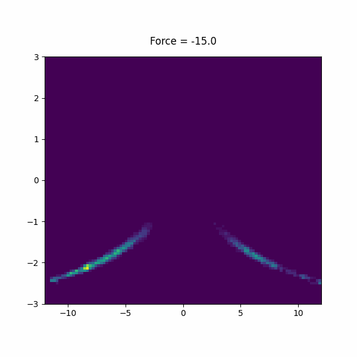
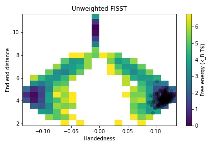
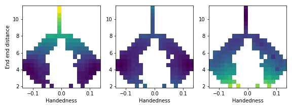
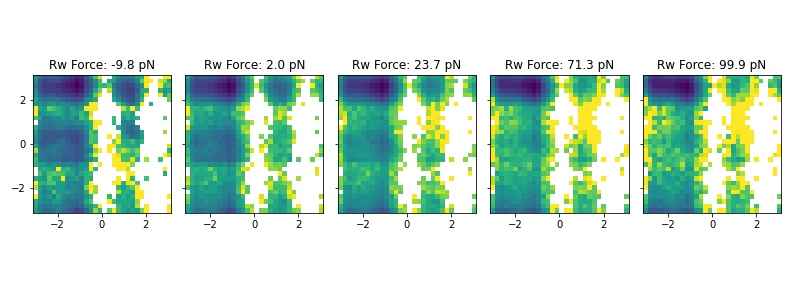

# PLUMED Masterclass 22.15: FISST module and application of mechanical forces with PLUMED

## Origin

This masterclass was authored by Glen M. Hocky on October 17, 2022

## Aims

This Masterclass explains how mechanical forces can be modeled using PLUMED, and the application of the FISST module for applying multiple forces simultaneously.

## Objectives

The objectives of this Masterclass are:
- Learn how to apply a constant force in PLUMED
- Learn how to perform steered-MD in PLUMED, and approximately get a free energy surface from repeating this calculation
- Learn how to apply constant forces with FISST, and reweight to different intermediate forces

## Prerequisites

We assume that the person that will follow this tutorial is familiar with the Linux terminal, Gromacs and basic functionality of PLUMED.

Familiarity with python and matplotlib is recommended for FISST reweighting and plotting

## Setting up PLUMED

We will use GROMACS, LAMMPS, PLUMED, and PLUMED's pesmd function to perform the calculations.
Conda packages with the software required for this class have been prepared and you can install them following the instructions in [this link](https://github.com/plumed/masterclass-2022).

If you are compiling PLUMED on your own, you will need to install the FISST module manually by adding '--enable-modules=fisst' to your './configure' command when building PLUMED.

The data needed to run the exercises of this Masterclass can be found on [GitHub](https://github.com/hockyg/masterclass-22-15).
You can clone this repository locally on your machine using the following command:

````
git clone https://github.com/hockyg/masterclass-22-15
````

## Background

A force along some direction here is defined as the negative gradient of the potential energy along that direction. 

A constant force $F$ on a scalar collective variable $Q(\vec{X})$ therefore is a simple addition to the system's energy function.

$$
 U(\vec{X},F) = U(\vec{X}) - F Q(\vec{X}) 
$$

Notice that, because of the negative sign, a postive value of $F$ results in a lower energy for large values of $Q$, meaning $F\gt0$ corresponds to a "pulling" force.

A mechanical force would often in reality would correspond to pulling apart two atoms, and so $Q$ would often be a simple distance coordinate.

Note however, that other quantities could be used, such as an area which would mean $F$ corresponds to a pressure.

Dimensional analysis implies that the units of $F$ must be [Energy]/[Q].

The effect of constant force can be assessed using any enhanced sampling method.

The work done by the bias in this case is very simple

$$
W = \int_a^b F \cdot d Q = F ( Q_b - Q_a )
$$

Constant forces can be applied in PLUMED with the SLOPE keyword of the RESTRAINT bias.

## Steered MD

Steered molecular dynamics (SMD) is one way of pulling on a molecular coordinate, and has a connection to experiments done where a molecule is attached via a "spring" to an object such as an optical tweezer or AFM tip. To represent this in simulation, instead of applying a constant force, we impose a Harmonic restraint on $Q$ with a center that moves:

$$
 U(\vec{X},F) = U(\vec{X}) + \frac{1}{2} k (Q-Q_0(t))^2
$$

Typically $Q_0(t)$ would move linearly, with $ Q_0(t) = Q_0(0)-\lambda t $ although that is not a requirement. 

At any given time, the force along $Q$ from the moving bias is given as:

$$
 F(t) = -\frac{\partial U}{\partial Q} = -k(Q-Q_0(t))
$$

This force is positive (pulling) when $Q_0(t)$ is bigger than $Q$, and it can get very large if the spring moves quickly to larger values.

SMD is implemented in PLUMED using the MOVINGRESTRAINT bias, and the work is computed automatically.

$$
W = \int_a^B F dQ \approx \sum_{i=1}^{N_{steps}} \bar{F}_i (Q_0(t_i)-Q_0(t_{i-1})) = \lambda dt \sum_{i=1}^{N_{steps}} \bar{F}_i, 
$$

$$
\bar{F_i}=\frac{1}{2}( F_{i}+F_{i-1} ) = -\frac{k}{2}( Q(t_i)-Q_0(t_i) -Q(t_{i-1})+Q_0(t_{i-1})) = -\frac{k}{2} (\Delta Q_i - \lambda d t)
$$

## FISST

Infinite Switch Simulated Tempering in Force (FISST) is a method implemented  in [this paper](https://doi.org/10.1063/5.0009280) and demonstrated to be compatible with replica exchange approaches in [this paper](https://doi.org/10.1021/acs.jpcb.3c07081)

This method takes advantage of the limit of changing a force from $F_{min}$ to $F_{max}$ and back infinitely quickly.

In this limit, the system feels an average force $\bar{F}(Q)$ that depends on the current value of the pulling coordinate.

$$
 U(\vec{X},F) = U(\vec{X}) - \bar{F}(Q) Q(\vec{X}) 
$$

In practice, this $\bar{F}(Q)$ is computed using weights $w(F)$ for each force in the force range that are learned on the fly, and separate "observable weights" $W_F(Q_i)$ are used to compute the average of any quantity $A$ at a given force.

$$
\langle A \rangle_F = \frac{1}{N} \sum_{i=1}^{N_{steps}} A(X(t_i)) W_F(Q_i)
$$

where the observable weights are computed in a way that 

$$
W_F(Q_i)\propto \left(\int_{F_{min}}^{F_{max}} dF' w(F') e^{\beta (F'-F) Q_i} \right)^{-1}
$$

The module writes out both the force weights and the observable weights to files.

## Exercises

The exercises are presented below.

### Effect of force on a 2-dimensional potential

Use the RESTRAINT function to add a constant force of different magnitudes (e.g. -2.5 to 2.5 in these units) and look at how the force changes the resulting free energy surface.


<div class="plumedpreheader">
<div class="headerInfo" id="value_details_data/work/plumed_ex1.dat"> Click on the labels of the actions for more information on what each action computes </div>
<div class="containerBadge">
<div class="headerBadge"><a href="plumed_ex1.dat.plumed.stderr"></a></div>
<div class="headerBadge"><a href="plumed_ex1.dat.plumed_master.stderr"></a></div>
<div class="headerBadge"></div>
</div>
</div>
<div id="data/work/plumed_ex1.dat_short">
<pre class="plumedlisting">
<span class="plumedtooltip" style="color:green">UNITS<span class="right">This command sets the internal units for the code. <a href="https://www.plumed.org/doc-master/user-doc/html/UNITS" style="color:green">More details</a><i></i></span></span> <span class="plumedtooltip">ENERGY<span class="right">the units of energy<i></i></span></span>=kcal/mol

<span style="display:none;" id="data/work/plumed_ex1.dat">The UNITS action with label <b></b> calculates something</span><b name="data/work/plumed_ex1.datd1" onclick='showPath("data/work/plumed_ex1.dat","data/work/plumed_ex1.datd1","data/work/plumed_ex1.datd1","brown")'>d1</b>: <span class="plumedtooltip" style="color:green">DISTANCE<span class="right">Calculate the distance/s between pairs of atoms. <a href="https://www.plumed.org/doc-master/user-doc/html/DISTANCE" style="color:green">More details</a><i></i></span></span> <span class="plumedtooltip">ATOMS<span class="right">the pair of atom that we are calculating the distance between<i></i></span></span>=1,2
<span style="display:none;" id="data/work/plumed_ex1.datd1">The DISTANCE action with label <b>d1</b> calculates the following quantities:<table  align="center" frame="void" width="95%" cellpadding="5%"><tr><td width="5%"><b> Quantity </b>  </td><td><b> Description </b> </td></tr><tr><td width="5%">d1.value</td><td>the DISTANCE between this pair of atoms</td></tr></table></span><b name="data/work/plumed_ex1.datff" onclick='showPath("data/work/plumed_ex1.dat","data/work/plumed_ex1.datff","data/work/plumed_ex1.datff","brown")'>ff</b>: <span class="plumedtooltip" style="color:green">MATHEVAL<span class="right">An alias to the CUSTOM function that can also be used to calaculate combinations of variables using a custom expression. <a href="https://www.plumed.org/doc-master/user-doc/html/MATHEVAL" style="color:green">More details</a><i></i></span></span> <span class="plumedtooltip">ARG<span class="right">the values input to this function<i></i></span></span>=<b name="data/work/plumed_ex1.datd1">d1</b> <span class="plumedtooltip">PERIODIC<span class="right">if the output of your function is periodic then you should specify the periodicity of the function<i></i></span></span>=NO <span class="plumedtooltip">FUNC<span class="right">the function you wish to evaluate<i></i></span></span>=0.2*(((x-10)^2)*((x-20)^2))
<span style="display:none;" id="data/work/plumed_ex1.datff">The MATHEVAL action with label <b>ff</b> calculates the following quantities:<table  align="center" frame="void" width="95%" cellpadding="5%"><tr><td width="5%"><b> Quantity </b>  </td><td><b> Description </b> </td></tr><tr><td width="5%">ff.value</td><td>an arbitrary function</td></tr></table></span><b name="data/work/plumed_ex1.datbb" onclick='showPath("data/work/plumed_ex1.dat","data/work/plumed_ex1.datbb","data/work/plumed_ex1.datbb","brown")'>bb</b>: <span class="plumedtooltip" style="color:green">BIASVALUE<span class="right">Takes the value of one variable and use it as a bias <a href="https://www.plumed.org/doc-master/user-doc/html/BIASVALUE" style="color:green">More details</a><i></i></span></span> <span class="plumedtooltip">ARG<span class="right">the labels of the scalar/vector arguments whose values will be used as a bias on the system<i></i></span></span>=<b name="data/work/plumed_ex1.datff">ff</b>

<span style="display:none;" id="data/work/plumed_ex1.datbb">The BIASVALUE action with label <b>bb</b> calculates the following quantities:<table  align="center" frame="void" width="95%" cellpadding="5%"><tr><td width="5%"><b> Quantity </b>  </td><td><b> Description </b> </td></tr><tr><td width="5%">bb.bias</td><td>the instantaneous value of the bias potential</td></tr><tr><td width="5%">bb._bias</td><td>one or multiple instances of this quantity can be referenced elsewhere in the input file</td></tr></table></span><b name="data/work/plumed_ex1.datmetad" onclick='showPath("data/work/plumed_ex1.dat","data/work/plumed_ex1.datmetad","data/work/plumed_ex1.datmetad","brown")'>metad</b>: <span class="plumedtooltip" style="color:green">METAD<span class="right">Used to performed metadynamics on one or more collective variables. <a href="https://www.plumed.org/doc-master/user-doc/html/METAD" style="color:green">More details</a><i></i></span></span> <span class="plumedtooltip">ARG<span class="right">the labels of the scalars on which the bias will act<i></i></span></span>=<b name="data/work/plumed_ex1.datd1">d1</b> <span class="plumedtooltip">PACE<span class="right">the frequency for hill addition<i></i></span></span>=500 <span class="plumedtooltip">HEIGHT<span class="right">the heights of the Gaussian hills<i></i></span></span>=0.1 <span class="plumedtooltip">SIGMA<span class="right">the widths of the Gaussian hills<i></i></span></span>=2.5 <span class="plumedtooltip">FILE<span class="right"> a file in which the list of added hills is stored<i></i></span></span>=<span style="background-color:yellow">__FILL__</span> <span class="plumedtooltip">BIASFACTOR<span class="right">use well tempered metadynamics and use this bias factor<i></i></span></span>=10 <span class="plumedtooltip">TEMP<span class="right">the system temperature - this is only needed if you are doing well-tempered metadynamics<i></i></span></span>=300.0 <span class="plumedtooltip">GRID_WFILE<span class="right">the file on which to write the grid<i></i></span></span>=<span style="background-color:yellow">__FILL__</span> <span class="plumedtooltip">GRID_MIN<span class="right">the lower bounds for the grid<i></i></span></span>=0 <span class="plumedtooltip">GRID_MAX<span class="right">the upper bounds for the grid<i></i></span></span>=30 <span class="plumedtooltip">GRID_BIN<span class="right">the number of bins for the grid<i></i></span></span>=251 <span class="plumedtooltip">GRID_WSTRIDE<span class="right">write the grid to a file every N steps<i></i></span></span>=10000

<span style="display:none;" id="data/work/plumed_ex1.datmetad">The METAD action with label <b>metad</b> calculates the following quantities:<table  align="center" frame="void" width="95%" cellpadding="5%"><tr><td width="5%"><b> Quantity </b>  </td><td><b> Description </b> </td></tr><tr><td width="5%">metad.bias</td><td>the instantaneous value of the bias potential</td></tr></table></span><span class="plumedtooltip" style="color:green">RESTRAINT<span class="right">Adds harmonic and/or linear restraints on one or more variables. <a href="https://www.plumed.org/doc-master/user-doc/html/RESTRAINT" style="color:green">More details</a><i></i></span></span> <span style="background-color:yellow">__FILL__</span>
<br/><span class="plumedtooltip" style="color:green">PRINT<span class="right">Print quantities to a file. <a href="https://www.plumed.org/doc-master/user-doc/html/PRINT" style="color:green">More details</a><i></i></span></span> <span class="plumedtooltip">ARG<span class="right">the labels of the values that you would like to print to the file<i></i></span></span>=* <span class="plumedtooltip">FILE<span class="right">the name of the file on which to output these quantities<i></i></span></span>=<span style="background-color:yellow">__FILL__</span> <span class="plumedtooltip">STRIDE<span class="right"> the frequency with which the quantities of interest should be output<i></i></span></span>=100
</pre></div>
<div style="display:none;" id="data/work/plumed_ex1.dat_long"><pre class="plumedlisting">
<span class="plumedtooltip" style="color:green">UNITS<span class="right">This command sets the internal units for the code. <a href="https://www.plumed.org/doc-master/user-doc/html/UNITS" style="color:green">More details</a><i></i></span></span> <span class="plumedtooltip">ENERGY<span class="right">the units of energy<i></i></span></span>=kcal/mol

<span style="display:none;" id="data/work/plumed_ex1.dat_sol">The UNITS action with label <b></b> calculates something</span><b name="data/work/plumed_ex1.dat_sold1" onclick='showPath("data/work/plumed_ex1.dat","data/work/plumed_ex1.dat_sold1","data/work/plumed_ex1.dat_sold1","brown")'>d1</b>: <span class="plumedtooltip" style="color:green">DISTANCE<span class="right">Calculate the distance/s between pairs of atoms. <a href="https://www.plumed.org/doc-master/user-doc/html/DISTANCE" style="color:green">More details</a><i></i></span></span> <span class="plumedtooltip">ATOMS<span class="right">the pair of atom that we are calculating the distance between<i></i></span></span>=1,2
<span style="display:none;" id="data/work/plumed_ex1.dat_sold1">The DISTANCE action with label <b>d1</b> calculates the following quantities:<table  align="center" frame="void" width="95%" cellpadding="5%"><tr><td width="5%"><b> Quantity </b>  </td><td><b> Description </b> </td></tr><tr><td width="5%">d1.value</td><td>the DISTANCE between this pair of atoms</td></tr></table></span><b name="data/work/plumed_ex1.dat_solff" onclick='showPath("data/work/plumed_ex1.dat","data/work/plumed_ex1.dat_solff","data/work/plumed_ex1.dat_solff","brown")'>ff</b>: <span class="plumedtooltip" style="color:green">MATHEVAL<span class="right">An alias to the CUSTOM function that can also be used to calaculate combinations of variables using a custom expression. <a href="https://www.plumed.org/doc-master/user-doc/html/MATHEVAL" style="color:green">More details</a><i></i></span></span> <span class="plumedtooltip">ARG<span class="right">the values input to this function<i></i></span></span>=<b name="data/work/plumed_ex1.dat_sold1">d1</b> <span class="plumedtooltip">PERIODIC<span class="right">if the output of your function is periodic then you should specify the periodicity of the function<i></i></span></span>=NO <span class="plumedtooltip">FUNC<span class="right">the function you wish to evaluate<i></i></span></span>=0.2*(((x-10)^2)*((x-20)^2))
<span style="display:none;" id="data/work/plumed_ex1.dat_solff">The MATHEVAL action with label <b>ff</b> calculates the following quantities:<table  align="center" frame="void" width="95%" cellpadding="5%"><tr><td width="5%"><b> Quantity </b>  </td><td><b> Description </b> </td></tr><tr><td width="5%">ff.value</td><td>an arbitrary function</td></tr></table></span><b name="data/work/plumed_ex1.dat_solbb" onclick='showPath("data/work/plumed_ex1.dat","data/work/plumed_ex1.dat_solbb","data/work/plumed_ex1.dat_solbb","brown")'>bb</b>: <span class="plumedtooltip" style="color:green">BIASVALUE<span class="right">Takes the value of one variable and use it as a bias <a href="https://www.plumed.org/doc-master/user-doc/html/BIASVALUE" style="color:green">More details</a><i></i></span></span> <span class="plumedtooltip">ARG<span class="right">the labels of the scalar/vector arguments whose values will be used as a bias on the system<i></i></span></span>=<b name="data/work/plumed_ex1.dat_solff">ff</b>

<span style="display:none;" id="data/work/plumed_ex1.dat_solbb">The BIASVALUE action with label <b>bb</b> calculates the following quantities:<table  align="center" frame="void" width="95%" cellpadding="5%"><tr><td width="5%"><b> Quantity </b>  </td><td><b> Description </b> </td></tr><tr><td width="5%">bb.bias</td><td>the instantaneous value of the bias potential</td></tr><tr><td width="5%">bb._bias</td><td>one or multiple instances of this quantity can be referenced elsewhere in the input file</td></tr></table></span><b name="data/work/plumed_ex1.dat_solmetad" onclick='showPath("data/work/plumed_ex1.dat","data/work/plumed_ex1.dat_solmetad","data/work/plumed_ex1.dat_solmetad","brown")'>metad</b>: <span class="plumedtooltip" style="color:green">METAD<span class="right">Used to performed metadynamics on one or more collective variables. <a href="https://www.plumed.org/doc-master/user-doc/html/METAD" style="color:green">More details</a><i></i></span></span> <span class="plumedtooltip">ARG<span class="right">the labels of the scalars on which the bias will act<i></i></span></span>=<b name="data/work/plumed_ex1.dat_sold1">d1</b> <span class="plumedtooltip">PACE<span class="right">the frequency for hill addition<i></i></span></span>=500 <span class="plumedtooltip">HEIGHT<span class="right">the heights of the Gaussian hills<i></i></span></span>=0.1 <span class="plumedtooltip">SIGMA<span class="right">the widths of the Gaussian hills<i></i></span></span>=2.5 <span class="plumedtooltip">FILE<span class="right"> a file in which the list of added hills is stored<i></i></span></span>=run_metad_F2.5.hills <span class="plumedtooltip">BIASFACTOR<span class="right">use well tempered metadynamics and use this bias factor<i></i></span></span>=10 <span class="plumedtooltip">TEMP<span class="right">the system temperature - this is only needed if you are doing well-tempered metadynamics<i></i></span></span>=300.0 <span class="plumedtooltip">GRID_WFILE<span class="right">the file on which to write the grid<i></i></span></span>=run_metad_F2.5.grid <span class="plumedtooltip">GRID_MIN<span class="right">the lower bounds for the grid<i></i></span></span>=0 <span class="plumedtooltip">GRID_MAX<span class="right">the upper bounds for the grid<i></i></span></span>=30 <span class="plumedtooltip">GRID_BIN<span class="right">the number of bins for the grid<i></i></span></span>=251 <span class="plumedtooltip">GRID_WSTRIDE<span class="right">write the grid to a file every N steps<i></i></span></span>=10000

<span style="display:none;" id="data/work/plumed_ex1.dat_solmetad">The METAD action with label <b>metad</b> calculates the following quantities:<table  align="center" frame="void" width="95%" cellpadding="5%"><tr><td width="5%"><b> Quantity </b>  </td><td><b> Description </b> </td></tr><tr><td width="5%">metad.bias</td><td>the instantaneous value of the bias potential</td></tr></table></span><b name="data/work/plumed_ex1.dat_solF" onclick='showPath("data/work/plumed_ex1.dat","data/work/plumed_ex1.dat_solF","data/work/plumed_ex1.dat_solF","brown")'>F</b>: <span class="plumedtooltip" style="color:green">RESTRAINT<span class="right">Adds harmonic and/or linear restraints on one or more variables. <a href="https://www.plumed.org/doc-master/user-doc/html/RESTRAINT" style="color:green">More details</a><i></i></span></span> <span class="plumedtooltip">ARG<span class="right">the values the harmonic restraint acts upon<i></i></span></span>=<b name="data/work/plumed_ex1.dat_sold1">d1</b> <span class="plumedtooltip">AT<span class="right">the position of the restraint<i></i></span></span>=0.0 <span class="plumedtooltip">KAPPA<span class="right"> specifies that the restraint is harmonic and what the values of the force constants on each of the variables are<i></i></span></span>=0 <span class="plumedtooltip">SLOPE<span class="right"> specifies that the restraint is linear and what the values of the force constants on each of the variables are<i></i></span></span>=2.5

<span style="display:none;" id="data/work/plumed_ex1.dat_solF">The RESTRAINT action with label <b>F</b> calculates the following quantities:<table  align="center" frame="void" width="95%" cellpadding="5%"><tr><td width="5%"><b> Quantity </b>  </td><td><b> Description </b> </td></tr><tr><td width="5%">F.bias</td><td>the instantaneous value of the bias potential</td></tr><tr><td width="5%">F.force2</td><td>the instantaneous value of the squared force due to this bias potential</td></tr></table></span><span class="plumedtooltip" style="color:green">DUMPATOMS<span class="right">Dump selected atoms on a file. <a href="https://www.plumed.org/doc-master/user-doc/html/DUMPATOMS" style="color:green">More details</a><i></i></span></span> <span class="plumedtooltip">STRIDE<span class="right"> the frequency with which the atoms should be output<i></i></span></span>=2000 <span class="plumedtooltip">FILE<span class="right">file on which to output coordinates; extension is automatically detected<i></i></span></span>=run_metad_F2.5.xyz <span class="plumedtooltip">ATOMS<span class="right">the atom indices whose positions you would like to print out<i></i></span></span>=1-2,<b name="data/work/plumed_ex1.dat_sol"></b>

<span class="plumedtooltip" style="color:green">PRINT<span class="right">Print quantities to a file. <a href="https://www.plumed.org/doc-master/user-doc/html/PRINT" style="color:green">More details</a><i></i></span></span> <span class="plumedtooltip">ARG<span class="right">the labels of the values that you would like to print to the file<i></i></span></span>=* <span class="plumedtooltip">FILE<span class="right">the name of the file on which to output these quantities<i></i></span></span>=run_metad_F2.5.metad.dat <span class="plumedtooltip">STRIDE<span class="right"> the frequency with which the quantities of interest should be output<i></i></span></span>=100
</pre></div>

  

Then run the simulation using the command:

````
plumed pesmd < doublewell_prod.pesmd.input
````

Plot the free energy surface from the GRID or after using sum_hills to compute the surface, and zero the potential at the left minimum. What do you notice about the other minimum and barrier?


### Effect of force on a 2-dimensional potential

The following implements a "V-shaped" potential which has 2 minima at small y values and 1 minima at large y value. 

Try plotting the potential to see.


<div class="plumedpreheader">
<div class="headerInfo" id="value_details_data/INSTRUCTIONS.md_working_2.dat"> Click on the labels of the actions for more information on what each action computes </div>
<div class="containerBadge">
<div class="headerBadge"><a href="INSTRUCTIONS.md_working_2.dat.plumed.stderr"></a></div>
<div class="headerBadge"><a href="INSTRUCTIONS.md_working_2.dat.plumed_master.stderr"></a></div>
</div>
</div>
<pre class="plumedlisting">
<b name="data/INSTRUCTIONS.md_working_2.datd1" onclick='showPath("data/INSTRUCTIONS.md_working_2.dat","data/INSTRUCTIONS.md_working_2.datd1","data/INSTRUCTIONS.md_working_2.datd1","black")'>d1</b><span style="display:none;" id="data/INSTRUCTIONS.md_working_2.datd1">The DISTANCE action with label <b>d1</b> calculates the following quantities:<table  align="center" frame="void" width="95%" cellpadding="5%"><tr><td width="5%"><b> Quantity </b>  </td><td width="5%"><b> Type </b>  </td><td><b> Description </b> </td></tr><tr><td width="5%">d1.x</td><td width="5%"><font color="black">scalar</font></td><td>the x-component of the vector connecting the two atoms</td></tr><tr><td width="5%">d1.y</td><td width="5%"><font color="black">scalar</font></td><td>the y-component of the vector connecting the two atoms</td></tr><tr><td width="5%">d1.z</td><td width="5%"><font color="black">scalar</font></td><td>the z-component of the vector connecting the two atoms</td></tr></table></span>: <span class="plumedtooltip" style="color:green">DISTANCE<span class="right">Calculate the distance/s between pairs of atoms. <a href="https://www.plumed.org/doc-master/user-doc/html/DISTANCE" style="color:green">More details</a><i></i></span></span> <span class="plumedtooltip">ATOMS<span class="right">the pair of atom that we are calculating the distance between<i></i></span></span>=1,2 <span class="plumedtooltip">COMPONENTS<span class="right"> calculate the x, y and z components of the distance separately and store them as label<i></i></span></span>
<b name="data/INSTRUCTIONS.md_working_2.datff" onclick='showPath("data/INSTRUCTIONS.md_working_2.dat","data/INSTRUCTIONS.md_working_2.datff","data/INSTRUCTIONS.md_working_2.datff","black")'>ff</b><span style="display:none;" id="data/INSTRUCTIONS.md_working_2.datff">The MATHEVAL action with label <b>ff</b> calculates the following quantities:<table  align="center" frame="void" width="95%" cellpadding="5%"><tr><td width="5%"><b> Quantity </b>  </td><td width="5%"><b> Type </b>  </td><td><b> Description </b> </td></tr><tr><td width="5%">ff</td><td width="5%"><font color="black">scalar</font></td><td>an arbitrary function</td></tr></table></span>: <span class="plumedtooltip" style="color:green">MATHEVAL<span class="right">An alias to the CUSTOM function that can also be used to calaculate combinations of variables using a custom expression. <a href="https://www.plumed.org/doc-master/user-doc/html/MATHEVAL" style="color:green">More details</a><i></i></span></span> <span class="plumedtooltip">ARG<span class="right">the values input to this function<i></i></span></span>=<b name="data/INSTRUCTIONS.md_working_2.datd1">d1.x</b>,<b name="data/INSTRUCTIONS.md_working_2.datd1">d1.y</b> <span class="plumedtooltip">PERIODIC<span class="right">if the output of your function is periodic then you should specify the periodicity of the function<i></i></span></span>=NO <span class="plumedtooltip">FUNC<span class="right">the function you wish to evaluate<i></i></span></span>=-8*log((exp(-(y-exp(-x))^2/2)+exp(-(y+exp(-x))^2/2))*exp(-x^2/2))
<b name="data/INSTRUCTIONS.md_working_2.datbb" onclick='showPath("data/INSTRUCTIONS.md_working_2.dat","data/INSTRUCTIONS.md_working_2.datbb","data/INSTRUCTIONS.md_working_2.datbb","black")'>bb</b><span style="display:none;" id="data/INSTRUCTIONS.md_working_2.datbb">The BIASVALUE action with label <b>bb</b> calculates the following quantities:<table  align="center" frame="void" width="95%" cellpadding="5%"><tr><td width="5%"><b> Quantity </b>  </td><td width="5%"><b> Type </b>  </td><td><b> Description </b> </td></tr><tr><td width="5%">bb.bias</td><td width="5%"><font color="black">scalar</font></td><td>the instantaneous value of the bias potential</td></tr><tr><td width="5%">bb.ff_bias</td><td width="5%"><font color="black">scalar</font></td><td>one or multiple instances of this quantity can be referenced elsewhere in the input file. these quantities will named with  the arguments of the bias followed by the character string _bias. These quantities tell the user how much the bias is due to each of the colvars. This particular component measures this quantity for the input CV named ff</td></tr></table></span>: <span class="plumedtooltip" style="color:green">BIASVALUE<span class="right">Takes the value of one variable and use it as a bias <a href="https://www.plumed.org/doc-master/user-doc/html/BIASVALUE" style="color:green">More details</a><i></i></span></span> <span class="plumedtooltip">ARG<span class="right">the labels of the scalar/vector arguments whose values will be used as a bias on the system<i></i></span></span>=<b name="data/INSTRUCTIONS.md_working_2.datff">ff</b>

<span class="plumedtooltip" style="color:green">PRINT<span class="right">Print quantities to a file. <a href="https://www.plumed.org/doc-master/user-doc/html/PRINT" style="color:green">More details</a><i></i></span></span> <span class="plumedtooltip">ARG<span class="right">the labels of the values that you would like to print to the file<i></i></span></span>=* <span class="plumedtooltip">FILE<span class="right">the name of the file on which to output these quantities<i></i></span></span>=COLVARS.dat <span class="plumedtooltip">STRIDE<span class="right"> the frequency with which the quantities of interest should be output<i></i></span></span>=100
</pre>
  

First run a simulation using the command, and make a 2d histogram of x and y to show that it is trapped on one side. 

````
plumed pesmd < doublewell_prod.pesmd.input
````

If you have time, use RESTRAINT to add a constant force in the Y direction that favors the higher vertical state.

Now add FISST in order to sample forces all at once:


<div class="plumedpreheader">
<div class="headerInfo" id="value_details_data/work/plumed_ex2.dat"> Click on the labels of the actions for more information on what each action computes </div>
<div class="containerBadge">
<div class="headerBadge"><a href="plumed_ex2.dat.plumed.stderr"></a></div>
<div class="headerBadge"><a href="plumed_ex2.dat.plumed_master.stderr"></a></div>
<div class="headerBadge"></div>
</div>
</div>
<div id="data/work/plumed_ex2.dat_short">
<pre class="plumedlisting">
<b name="data/work/plumed_ex2.datf" onclick='showPath("data/work/plumed_ex2.dat","data/work/plumed_ex2.datf","data/work/plumed_ex2.datf","brown")'>f</b>: <span class="plumedtooltip" style="color:green">FISST<span class="right">Compute and apply the optimal linear force on an observable to enhance sampling of conformational distributions over a range of applied forces. <a href="https://www.plumed.org/doc-master/user-doc/html/FISST" style="color:green">More details</a><i></i></span></span> <span class="plumedtooltip">MIN_FORCE<span class="right">Minimum force (per CV) to use for sampling<i></i></span></span>=-15 <span class="plumedtooltip">MAX_FORCE<span class="right">Maximum force (per CV) to use for sampling<i></i></span></span>=15.0 <span class="plumedtooltip">PERIOD<span class="right">Steps corresponding to the learning rate<i></i></span></span>=200 <span class="plumedtooltip">NINTERPOLATE<span class="right">Number of grid points on which to do interpolation<i></i></span></span>=41 <span class="plumedtooltip">ARG<span class="right">the labels of the scalars on which the bias will act<i></i></span></span>=d1.x <span class="plumedtooltip">KBT<span class="right">The system temperature in units of KB*T<i></i></span></span>=1.0 <span class="plumedtooltip">OUT_RESTART<span class="right">Output file for all information needed to continue FISST simulation<i></i></span></span>=<span style="background-color:yellow">__FILL__</span> <span class="plumedtooltip">OUT_OBSERVABLE<span class="right">Output file putting weights needed to compute observables at different force values<i></i></span></span>=<span style="background-color:yellow">__FILL__</span> <span class="plumedtooltip">OBSERVABLE_FREQ<span class="right"><i></i></span></span>=100 <span class="plumedtooltip">CENTER<span class="right"> The CV value at which the applied bias energy will be zero<i></i></span></span>=0
<span style="display:none;" id="data/work/plumed_ex2.datf">The FISST action with label <b>f</b> calculates the following quantities:<table  align="center" frame="void" width="95%" cellpadding="5%"><tr><td width="5%"><b> Quantity </b>  </td><td><b> Description </b> </td></tr><tr><td width="5%">f.bias</td><td>the instantaneous value of the bias potential</td></tr><tr><td width="5%">f.force2</td><td>squared value of force from the bias</td></tr><tr><td width="5%">f._fbar</td><td>For each named CV biased, there will be a corresponding output CV_fbar storing the current linear bias prefactor</td></tr></table></span></pre></div>
<div style="display:none;" id="data/work/plumed_ex2.dat_long"><pre class="plumedlisting">
<b name="data/work/plumed_ex2.dat_sold1" onclick='showPath("data/work/plumed_ex2.dat","data/work/plumed_ex2.dat_sold1","data/work/plumed_ex2.dat_sold1","brown")'>d1</b>: <span class="plumedtooltip" style="color:green">DISTANCE<span class="right">Calculate the distance/s between pairs of atoms. <a href="https://www.plumed.org/doc-master/user-doc/html/DISTANCE" style="color:green">More details</a><i></i></span></span> <span class="plumedtooltip">ATOMS<span class="right">the pair of atom that we are calculating the distance between<i></i></span></span>=1,2 <span class="plumedtooltip">COMPONENTS<span class="right"> calculate the x, y and z components of the distance separately and store them as label<i></i></span></span>
<span style="display:none;" id="data/work/plumed_ex2.dat_sold1">The DISTANCE action with label <b>d1</b> calculates the following quantities:<table  align="center" frame="void" width="95%" cellpadding="5%"><tr><td width="5%"><b> Quantity </b>  </td><td><b> Description </b> </td></tr><tr><td width="5%">d1.x</td><td>the x-component of the vector connecting the two atoms</td></tr><tr><td width="5%">d1.y</td><td>the y-component of the vector connecting the two atoms</td></tr><tr><td width="5%">d1.z</td><td>the z-component of the vector connecting the two atoms</td></tr><tr><td width="5%">d1.value</td><td>the DISTANCE between this pair of atoms</td></tr></table></span><b name="data/work/plumed_ex2.dat_solff" onclick='showPath("data/work/plumed_ex2.dat","data/work/plumed_ex2.dat_solff","data/work/plumed_ex2.dat_solff","brown")'>ff</b>: <span class="plumedtooltip" style="color:green">MATHEVAL<span class="right">An alias to the CUSTOM function that can also be used to calaculate combinations of variables using a custom expression. <a href="https://www.plumed.org/doc-master/user-doc/html/MATHEVAL" style="color:green">More details</a><i></i></span></span> <span class="plumedtooltip">ARG<span class="right">the values input to this function<i></i></span></span>=<b name="data/work/plumed_ex2.dat_sold1">d1.x</b>,<b name="data/work/plumed_ex2.dat_sold1">d1.y</b> <span class="plumedtooltip">PERIODIC<span class="right">if the output of your function is periodic then you should specify the periodicity of the function<i></i></span></span>=NO <span class="plumedtooltip">FUNC<span class="right">the function you wish to evaluate<i></i></span></span>=-8*log((exp(-(y-exp(-x))^2/2)+exp(-(y+exp(-x))^2/2))*exp(-x^2/2))
<span style="display:none;" id="data/work/plumed_ex2.dat_solff">The MATHEVAL action with label <b>ff</b> calculates the following quantities:<table  align="center" frame="void" width="95%" cellpadding="5%"><tr><td width="5%"><b> Quantity </b>  </td><td><b> Description </b> </td></tr><tr><td width="5%">ff.value</td><td>an arbitrary function</td></tr></table></span><b name="data/work/plumed_ex2.dat_solbb" onclick='showPath("data/work/plumed_ex2.dat","data/work/plumed_ex2.dat_solbb","data/work/plumed_ex2.dat_solbb","brown")'>bb</b>: <span class="plumedtooltip" style="color:green">BIASVALUE<span class="right">Takes the value of one variable and use it as a bias <a href="https://www.plumed.org/doc-master/user-doc/html/BIASVALUE" style="color:green">More details</a><i></i></span></span> <span class="plumedtooltip">ARG<span class="right">the labels of the scalar/vector arguments whose values will be used as a bias on the system<i></i></span></span>=<b name="data/work/plumed_ex2.dat_solff">ff</b>

<span style="display:none;" id="data/work/plumed_ex2.dat_solbb">The BIASVALUE action with label <b>bb</b> calculates the following quantities:<table  align="center" frame="void" width="95%" cellpadding="5%"><tr><td width="5%"><b> Quantity </b>  </td><td><b> Description </b> </td></tr><tr><td width="5%">bb.bias</td><td>the instantaneous value of the bias potential</td></tr><tr><td width="5%">bb._bias</td><td>one or multiple instances of this quantity can be referenced elsewhere in the input file</td></tr></table></span><b name="data/work/plumed_ex2.dat_solf" onclick='showPath("data/work/plumed_ex2.dat","data/work/plumed_ex2.dat_solf","data/work/plumed_ex2.dat_solf","brown")'>f</b>: <span class="plumedtooltip" style="color:green">FISST<span class="right">Compute and apply the optimal linear force on an observable to enhance sampling of conformational distributions over a range of applied forces. <a href="https://www.plumed.org/doc-master/user-doc/html/FISST" style="color:green">More details</a><i></i></span></span> <span class="plumedtooltip">MIN_FORCE<span class="right">Minimum force (per CV) to use for sampling<i></i></span></span>=-15 <span class="plumedtooltip">MAX_FORCE<span class="right">Maximum force (per CV) to use for sampling<i></i></span></span>=15.0 <span class="plumedtooltip">PERIOD<span class="right">Steps corresponding to the learning rate<i></i></span></span>=200 <span class="plumedtooltip">NINTERPOLATE<span class="right">Number of grid points on which to do interpolation<i></i></span></span>=41 <span class="plumedtooltip">ARG<span class="right">the labels of the scalars on which the bias will act<i></i></span></span>=<b name="data/work/plumed_ex2.dat_sold1">d1.x</b> <span class="plumedtooltip">KBT<span class="right">The system temperature in units of KB*T<i></i></span></span>=1.0 <span class="plumedtooltip">OUT_RESTART<span class="right">Output file for all information needed to continue FISST simulation<i></i></span></span>=v-shape_fisst-15_15_scale8_seed1.restart.txt <span class="plumedtooltip">OUT_OBSERVABLE<span class="right">Output file putting weights needed to compute observables at different force values<i></i></span></span>=v-shape_fisst-15_15_scale8_seed1.observable.txt <span class="plumedtooltip">OBSERVABLE_FREQ<span class="right"><i></i></span></span>=100 <span class="plumedtooltip">CENTER<span class="right"> The CV value at which the applied bias energy will be zero<i></i></span></span>=0

<span style="display:none;" id="data/work/plumed_ex2.dat_solf">The FISST action with label <b>f</b> calculates the following quantities:<table  align="center" frame="void" width="95%" cellpadding="5%"><tr><td width="5%"><b> Quantity </b>  </td><td><b> Description </b> </td></tr><tr><td width="5%">f.bias</td><td>the instantaneous value of the bias potential</td></tr><tr><td width="5%">f.force2</td><td>squared value of force from the bias</td></tr><tr><td width="5%">f._fbar</td><td>For each named CV biased, there will be a corresponding output CV_fbar storing the current linear bias prefactor</td></tr></table></span><span class="plumedtooltip" style="color:green">PRINT<span class="right">Print quantities to a file. <a href="https://www.plumed.org/doc-master/user-doc/html/PRINT" style="color:green">More details</a><i></i></span></span> <span class="plumedtooltip">ARG<span class="right">the labels of the values that you would like to print to the file<i></i></span></span>=<b name="data/work/plumed_ex2.dat_sold1">d1.x</b>,<b name="data/work/plumed_ex2.dat_sold1">d1.y</b>,<b name="data/work/plumed_ex2.dat_solbb">bb.bias</b>,<b name="data/work/plumed_ex2.dat_solf">f.d1.x_fbar</b>,<b name="data/work/plumed_ex2.dat_solf">f.bias</b>,<b name="data/work/plumed_ex2.dat_solf">f.force2</b> <span class="plumedtooltip">FILE<span class="right">the name of the file on which to output these quantities<i></i></span></span>=v-shape_fisst-15_15_scale8_seed1.colvar.txt <span class="plumedtooltip">STRIDE<span class="right"> the frequency with which the quantities of interest should be output<i></i></span></span>=100
</pre></div>

  

We used forces -15 to 15 in the paper, but feel free to experiment with your own force range. Inspect the observable file and restart file to see what is in there.

Now generate a histogram at each force using the following command, which will render it as an animated gif if you have the proper libraries installed.

````
python reweight_vshape.py observable_file cv_file
````



### Model bistable helix

In this section, we will study a toy model of a a helix using a bead spring model in lammps. This model has lowest energy when it is in a left or right handed helix, but it is not chiral, so they must have the same free energy.

First, run the system without any pulling, if you fisualize the trajectory, you will see that it is stuck in one configuration (epsilon sets the strength of the bonds, it can be studied at lower or higher stabilities by changing eps).

````
lmp -log helix_sf_example.log \
           -var plumed_file helix_sf_f-4.5_eps7.5_10000000.plumed.dat  \
           -var outprefix helix_sf_pull0 \
           -var steps 10000000  \
           -var eps 7.5 \
           -in run_helix_plumed.lmp
````

Now, run the system using FISST, suitibly modifying the plumed file to impose a force from -2 to 8 (as studied in the paper)

````
lmp -log helix_sf_example.log \
           -var plumed_file helix_fisst_fmin-2.0_fmax8.0_eps7.5_50000000.plumed.dat  \
           -var outprefix helix_fisst_fmin-2.0_fmax8.0_eps7.5_50000000 \
           -var steps 50000000  \
           -var eps 7.5 \
           -in run_helix_plumed.lmp
`````

The included script 'compute_handedness.py' has an ad-hoc handedness calculation which is computed using RMSD to a left and right handed helix. 
The end-end distance is already computed in the colvars file.

Use the handedness calculation in this script to create a 2d FES from the unbiased simulation, and from the unweighted FISST data.



Note that both sides are equally explored in this relatively long simulation. 
Then compute plots reweighted to small/negative forces and large forces, and notice how the result mirrors that from the V-shaped potential.

 

### Solvated alanine-10

We will now study the effect of force on a model peptide, alanine 10 in water. You can set this up to run yourself, but the colvar files are also included for a 200ns simulation of alanine 10 run with FISST from forces -10 to 10 pN and from -10 to 100 pN.

Note, now we are using real units, a conversion factor is needed: 69.4786 pN = 1 kcal/mol/Angstrom

To run yourself, modify ala10_fisst.plumed.dat

````
gmx_mpi -s ala10.tpr -plumed ala10_fisst.plumed.dat -nsteps 100000000 --deffnm OUTPUT_PREFIX
````

Then analyze your files, or my files ala10_pull_fRange_fmin-10_fmax100.* to compute the end-end distance of Alanine 10 at different forces.
Do your results from different FISST ranges agree?

 

Finally, use the observable weights to compute the Ramachandran plot (averaged over residues) at different forces (mine is from analyzing the gromacs structural output, but you may want to put the phi-psi calculation in the plumed file as in previous tutorials!)

 
