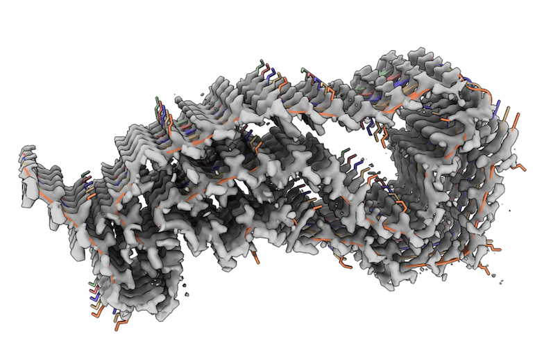
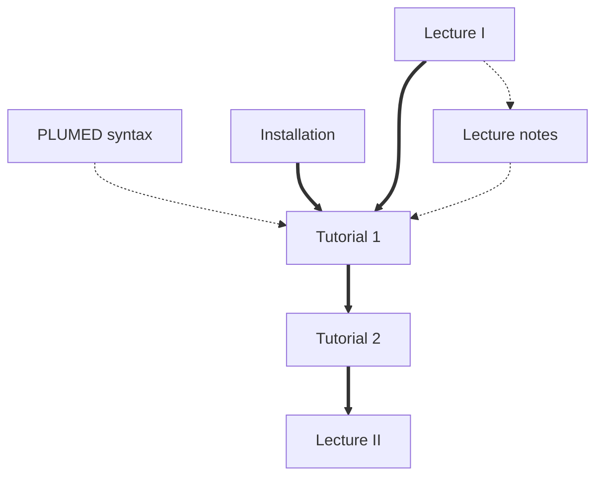

# Single-structure and ensemble refinement with cryo-EM maps and EMMIVox

## Aims

The aim of this tutorial is to learn how to use PLUMED to perform single-structure and ensemble refinement using cryo-EM maps and EMMIVox.
This lesson was given as part of the PLUMED masterclass series in 2022. It includes:

* A video that explain the theory covered and a second video which shows you how the exercises should be completed.
* Two tutorials that you should try to complete yourself.

## Overview of the theory 

The EMMIVox approach is described in the following publication:

S. E. Hoff, F. E. Thomasen, K. Lindorff-Larsen, M. Bonomi. Accurate model and ensemble refinement using cryo-electron microscopy maps and Bayesian inference.
PLoS Comput. Biol. 20 (2024) e1012180. doi: [10.1371/journal.pcbi.1012180](https://doi.org/10.1371/journal.pcbi.1012180).

## Installation instructions
Prerequisites and guide to install the software to perform EMMIVox simulations can be found [here](install.md).

## Resources

The data needed to complete the tutorials can be found [here](https://github.com/maxbonomi/EMMIVox-Plumed-Tutorials). You can clone this repository locally on your machine using the following command:

````
git clone https://github.com/maxbonomi/EMMIVox-Plumed-Tutorials.git  
````

This repository contains the following 2 directories:
* `scripts`: python scripts used for preprocessing and analysis of EMMIVox simulations
* `tutorials`: complete tutorials for single-structure and ensemble refinement

The system under study is a Tau filament resolved at 1.9 Angstrom by the Scheres group
 ([PDB 7P6A](https://www.rcsb.org/structure/7P6A), [EMD 13223](https://www.ebi.ac.uk/emdb/EMD-13223)). The system is composed by 5 identical chains, for a total of 8335 solute atoms.
We will simulate the system using the CHARMM36m force field in explicit TIP3P water, for a total of 40958 atoms. The reference is:

[Shi, Y., Zhang, W., Yang, Y. et al. Structure-based classification of tauopathies. Nature 598, 359–363 (2021)](https://doi.org/10.1038/s41586-021-03911-7)

<p align="center">
  
</p>


## Tutorial 1: Single-structure refinement with EMMIVox
The first tutorial to perform single-structure refinement with EMMIVox can be accessed [here](01.md).

## Tutorial 2: Ensemble refinement with EMMIVox
The second tutorial to perform ensemble refinement with EMMIVox can be accessed [here](02.md).

## Flowchart
The flow chart shown below indicates the order in which you should consult the resources.  You can click on the nodes to access the various resources.  Follow the thick black lines for the best results.  The resources that are connected by dashed lines are supplementary resources that you may find useful when completing the exercise. 



<b><a href="https://www.plumed.org/doc-master/user-doc/html/actionlist/?actions=PRINT,EMMIVOX,GROUP,MOLINFO,WHOLEMOLECULES,BIASVALUE" target="_blank">Click here</a> to open manual pages for actions discussed in this tutorial.</b>

