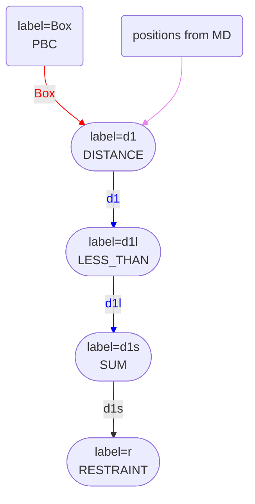
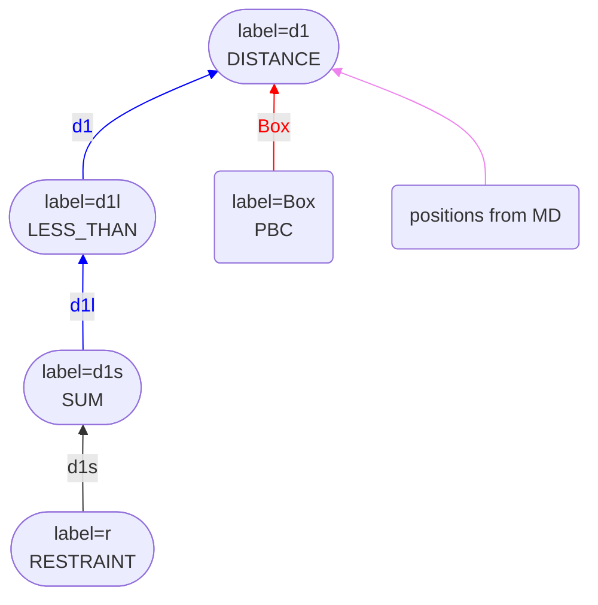

# Reimplementing MultiColvar

The original idea for the MultiColvar class came from a conversation I had with Fabio Pietrucci.
The line of thought went something like this:

* When calculating many collective variables you calculate the same function $f$ for multiple sets of atomic positions $\{X\}_i$.
* The sum of the functions is then computed. The final CV is thus:

$$
s = \sum_{i=1}^N f(\{X\}_i)
$$

* As it is straightforward to parallelise the sum in the above expression, why should we not write a base class for calculating CVs like this?
* If this base class is implemented, developers can inherit from it and only need to implement the $f(\{X\})$ part of the expression above.

The MultiColvarBase class I implemented after this conversation was designed with this line of thinking in mind. With this class, you can thus use
a command like:


<div class="plumedpreheader">
<div class="headerInfo" id="value_details_data/MultiColvar.md_working_1.dat"> Click on the labels of the actions for more information on what each action computes </div>
<div class="containerBadge">
<div class="headerBadge"><a href="MultiColvar.md_working_1.dat.plumed.stderr"></a></div>
<div class="headerBadge"><a href="MultiColvar.md_working_1.dat.plumed_master.stderr"></a></div>
</div>
</div>
<pre class="plumedlisting">
<span id="data/MultiColvar.md_working_1.datd1_short"><b name="data/MultiColvar.md_working_1.datd1" onclick='showPath("data/MultiColvar.md_working_1.dat","data/MultiColvar.md_working_1.datd1","data/MultiColvar.md_working_1.datd1_shortcut","blue")'>d1</b><span style="display:none;" id="data/MultiColvar.md_working_1.datd1_shortcut">The DISTANCES action with label <b>d1</b> calculates the following quantities:<table  align="center" frame="void" width="95%" cellpadding="5%"><tr><td width="5%"><b> Quantity </b>  </td><td width="5%"><b> Type </b>  </td><td><b> Description </b> </td></tr><tr><td width="5%">d1</td><td width="5%"><font color="blue">vector</font></td><td>the DISTANCES between the each pair of atoms that were specified</td></tr><tr><td width="5%">d1_lessthan</td><td width="5%"><font color="black">scalar</font></td><td>the number of colvars that have a value less than a threshold</td></tr></table></span>: <span class="plumedtooltip" style="color:green">DISTANCES<span class="right">Calculate the distances between multiple piars of atoms This action is <a class="toggler" href='javascript:;' onclick='toggleDisplay("data/MultiColvar.md_working_1.datd1");'>a shortcut</a>. <a href="https://www.plumed.org/doc-master/user-doc/html/DISTANCES">More details</a><i></i></span></span> <span class="plumedtooltip">ATOMS1<span class="right">the pairs of atoms that you would like to calculate the angles for<i></i></span></span>=1,2 <span class="plumedtooltip">ATOMS2<span class="right">the pairs of atoms that you would like to calculate the angles for<i></i></span></span>=3,4 <span class="plumedtooltip">ATOMS3<span class="right">the pairs of atoms that you would like to calculate the angles for<i></i></span></span>=5,6 <span class="plumedtooltip">ATOMS4<span class="right">the pairs of atoms that you would like to calculate the angles for<i></i></span></span>=7,8 <span class="plumedtooltip">ATOMS5<span class="right">the pairs of atoms that you would like to calculate the angles for<i></i></span></span>=9,10 <span class="plumedtooltip">LESS_THAN<span class="right">calculate the number of variables that are less than a certain target value. Options for this keyword are explained in the documentation for <a href="https://www.plumed.org/doc-master/user-doc/html/LESS_THAN">LESS_THAN</a>.<i></i></span></span>={RATIONAL R_0=0.1}
</span><span id="data/MultiColvar.md_working_1.datd1_long" style="display:none;"><span style="color:blue" class="comment"># PLUMED interprets the command:
</span><span class="toggler" style="color:red" onclick='toggleDisplay("data/MultiColvar.md_working_1.datd1")'># d1: DISTANCES ATOMS1=1,2 ATOMS2=3,4 ATOMS3=5,6 ATOMS4=7,8 ATOMS5=9,10 LESS_THAN={RATIONAL R_0=0.1}</span>
<span style="color:blue" class="comment"># as follows (Click the red comment above to revert to the short version of the input):</span>
<b name="data/MultiColvar.md_working_1.datd1_vatom1" onclick='showPath("data/MultiColvar.md_working_1.dat","data/MultiColvar.md_working_1.datd1_vatom1","data/MultiColvar.md_working_1.datd1_vatom1","violet")'>d1_vatom1</b><span style="display:none;" id="data/MultiColvar.md_working_1.datd1_vatom1">The CENTER_FAST action with label <b>d1_vatom1</b> calculates the following quantities:<table  align="center" frame="void" width="95%" cellpadding="5%"><tr><td width="5%"><b> Quantity </b>  </td><td width="5%"><b> Type </b>  </td><td><b> Description </b> </td></tr><tr><td width="5%">d1_vatom1</td><td width="5%"><font color="violet">atoms</font></td><td>virtual atom calculated by CENTER_FAST action</td></tr></table></span>: <span class="plumedtooltip" style="color:green">CENTER<span class="right">Calculate the center for a group of atoms, with arbitrary weights. <a href="https://www.plumed.org/doc-master/user-doc/html/CENTER" style="color:green">More details</a><i></i></span></span> <span class="plumedtooltip">ATOMS<span class="right">the group of atoms that appear in the definition of this center<i></i></span></span>=1,2
<b name="data/MultiColvar.md_working_1.datd1_vatom2" onclick='showPath("data/MultiColvar.md_working_1.dat","data/MultiColvar.md_working_1.datd1_vatom2","data/MultiColvar.md_working_1.datd1_vatom2","violet")'>d1_vatom2</b><span style="display:none;" id="data/MultiColvar.md_working_1.datd1_vatom2">The CENTER_FAST action with label <b>d1_vatom2</b> calculates the following quantities:<table  align="center" frame="void" width="95%" cellpadding="5%"><tr><td width="5%"><b> Quantity </b>  </td><td width="5%"><b> Type </b>  </td><td><b> Description </b> </td></tr><tr><td width="5%">d1_vatom2</td><td width="5%"><font color="violet">atoms</font></td><td>virtual atom calculated by CENTER_FAST action</td></tr></table></span>: <span class="plumedtooltip" style="color:green">CENTER<span class="right">Calculate the center for a group of atoms, with arbitrary weights. <a href="https://www.plumed.org/doc-master/user-doc/html/CENTER" style="color:green">More details</a><i></i></span></span> <span class="plumedtooltip">ATOMS<span class="right">the group of atoms that appear in the definition of this center<i></i></span></span>=3,4
<b name="data/MultiColvar.md_working_1.datd1_vatom3" onclick='showPath("data/MultiColvar.md_working_1.dat","data/MultiColvar.md_working_1.datd1_vatom3","data/MultiColvar.md_working_1.datd1_vatom3","violet")'>d1_vatom3</b><span style="display:none;" id="data/MultiColvar.md_working_1.datd1_vatom3">The CENTER_FAST action with label <b>d1_vatom3</b> calculates the following quantities:<table  align="center" frame="void" width="95%" cellpadding="5%"><tr><td width="5%"><b> Quantity </b>  </td><td width="5%"><b> Type </b>  </td><td><b> Description </b> </td></tr><tr><td width="5%">d1_vatom3</td><td width="5%"><font color="violet">atoms</font></td><td>virtual atom calculated by CENTER_FAST action</td></tr></table></span>: <span class="plumedtooltip" style="color:green">CENTER<span class="right">Calculate the center for a group of atoms, with arbitrary weights. <a href="https://www.plumed.org/doc-master/user-doc/html/CENTER" style="color:green">More details</a><i></i></span></span> <span class="plumedtooltip">ATOMS<span class="right">the group of atoms that appear in the definition of this center<i></i></span></span>=5,6
<b name="data/MultiColvar.md_working_1.datd1_vatom4" onclick='showPath("data/MultiColvar.md_working_1.dat","data/MultiColvar.md_working_1.datd1_vatom4","data/MultiColvar.md_working_1.datd1_vatom4","violet")'>d1_vatom4</b><span style="display:none;" id="data/MultiColvar.md_working_1.datd1_vatom4">The CENTER_FAST action with label <b>d1_vatom4</b> calculates the following quantities:<table  align="center" frame="void" width="95%" cellpadding="5%"><tr><td width="5%"><b> Quantity </b>  </td><td width="5%"><b> Type </b>  </td><td><b> Description </b> </td></tr><tr><td width="5%">d1_vatom4</td><td width="5%"><font color="violet">atoms</font></td><td>virtual atom calculated by CENTER_FAST action</td></tr></table></span>: <span class="plumedtooltip" style="color:green">CENTER<span class="right">Calculate the center for a group of atoms, with arbitrary weights. <a href="https://www.plumed.org/doc-master/user-doc/html/CENTER" style="color:green">More details</a><i></i></span></span> <span class="plumedtooltip">ATOMS<span class="right">the group of atoms that appear in the definition of this center<i></i></span></span>=7,8
<b name="data/MultiColvar.md_working_1.datd1_vatom5" onclick='showPath("data/MultiColvar.md_working_1.dat","data/MultiColvar.md_working_1.datd1_vatom5","data/MultiColvar.md_working_1.datd1_vatom5","violet")'>d1_vatom5</b><span style="display:none;" id="data/MultiColvar.md_working_1.datd1_vatom5">The CENTER_FAST action with label <b>d1_vatom5</b> calculates the following quantities:<table  align="center" frame="void" width="95%" cellpadding="5%"><tr><td width="5%"><b> Quantity </b>  </td><td width="5%"><b> Type </b>  </td><td><b> Description </b> </td></tr><tr><td width="5%">d1_vatom5</td><td width="5%"><font color="violet">atoms</font></td><td>virtual atom calculated by CENTER_FAST action</td></tr></table></span>: <span class="plumedtooltip" style="color:green">CENTER<span class="right">Calculate the center for a group of atoms, with arbitrary weights. <a href="https://www.plumed.org/doc-master/user-doc/html/CENTER" style="color:green">More details</a><i></i></span></span> <span class="plumedtooltip">ATOMS<span class="right">the group of atoms that appear in the definition of this center<i></i></span></span>=9,10
<b name="data/MultiColvar.md_working_1.datd1_grp" onclick='showPath("data/MultiColvar.md_working_1.dat","data/MultiColvar.md_working_1.datd1_grp","data/MultiColvar.md_working_1.datd1_grp","violet")'>d1_grp</b><span style="display:none;" id="data/MultiColvar.md_working_1.datd1_grp">The GROUP action with label <b>d1_grp</b> calculates the following quantities:<table  align="center" frame="void" width="95%" cellpadding="5%"><tr><td width="5%"><b> Quantity </b>  </td><td width="5%"><b> Type </b>  </td><td><b> Description </b> </td></tr><tr><td width="5%">d1_grp</td><td width="5%"><font color="violet">atoms</font></td><td>indices of atoms specified in GROUP</td></tr></table></span>: <span class="plumedtooltip" style="color:green">GROUP<span class="right">Define a group of atoms so that a particular list of atoms can be referenced with a single label in definitions of CVs or virtual atoms. <a href="https://www.plumed.org/doc-master/user-doc/html/GROUP" style="color:green">More details</a><i></i></span></span> <span class="plumedtooltip">ATOMS<span class="right">the numerical indexes for the set of atoms in the group<i></i></span></span>=<b name="data/MultiColvar.md_working_1.datd1_vatom1">d1_vatom1</b>,<b name="data/MultiColvar.md_working_1.datd1_vatom2">d1_vatom2</b>,<b name="data/MultiColvar.md_working_1.datd1_vatom3">d1_vatom3</b>,<b name="data/MultiColvar.md_working_1.datd1_vatom4">d1_vatom4</b>,<b name="data/MultiColvar.md_working_1.datd1_vatom5">d1_vatom5</b>
<b name="data/MultiColvar.md_working_1.datd1" onclick='showPath("data/MultiColvar.md_working_1.dat","data/MultiColvar.md_working_1.datd1","data/MultiColvar.md_working_1.datd1","blue")'>d1</b><span style="display:none;" id="data/MultiColvar.md_working_1.datd1">The DISTANCE action with label <b>d1</b> calculates the following quantities:<table  align="center" frame="void" width="95%" cellpadding="5%"><tr><td width="5%"><b> Quantity </b>  </td><td width="5%"><b> Type </b>  </td><td><b> Description </b> </td></tr><tr><td width="5%">d1</td><td width="5%"><font color="blue">vector</font></td><td>the DISTANCE for each set of specified atoms</td></tr></table></span>: <span class="plumedtooltip" style="color:green">DISTANCE<span class="right">Calculate the distance/s between pairs of atoms. <a href="https://www.plumed.org/doc-master/user-doc/html/DISTANCE" style="color:green">More details</a><i></i></span></span> <span class="plumedtooltip">ATOMS1<span class="right">the pair of atom that we are calculating the distance between<i></i></span></span>=1,2 <span class="plumedtooltip">ATOMS2<span class="right">the pair of atom that we are calculating the distance between<i></i></span></span>=3,4 <span class="plumedtooltip">ATOMS3<span class="right">the pair of atom that we are calculating the distance between<i></i></span></span>=5,6 <span class="plumedtooltip">ATOMS4<span class="right">the pair of atom that we are calculating the distance between<i></i></span></span>=7,8 <span class="plumedtooltip">ATOMS5<span class="right">the pair of atom that we are calculating the distance between<i></i></span></span>=9,10
<b name="data/MultiColvar.md_working_1.datd1_lt" onclick='showPath("data/MultiColvar.md_working_1.dat","data/MultiColvar.md_working_1.datd1_lt","data/MultiColvar.md_working_1.datd1_lt","blue")'>d1_lt</b><span style="display:none;" id="data/MultiColvar.md_working_1.datd1_lt">The LESS_THAN action with label <b>d1_lt</b> calculates the following quantities:<table  align="center" frame="void" width="95%" cellpadding="5%"><tr><td width="5%"><b> Quantity </b>  </td><td width="5%"><b> Type </b>  </td><td><b> Description </b> </td></tr><tr><td width="5%">d1_lt</td><td width="5%"><font color="blue">vector</font></td><td>the vector obtained by doing an element-wise application of a function that is one if the input is less than a threshold to the input vectors</td></tr></table></span>: <span class="plumedtooltip" style="color:green">LESS_THAN<span class="right">Use a switching function to determine how many of the input variables are less than a certain cutoff. <a href="https://www.plumed.org/doc-master/user-doc/html/LESS_THAN" style="color:green">More details</a><i></i></span></span> <span class="plumedtooltip">ARG<span class="right">the values input to this function<i></i></span></span>=<b name="data/MultiColvar.md_working_1.datd1">d1</b> <span class="plumedtooltip">SWITCH<span class="right">This keyword is used if you want to employ an alternative to the continuous swiching function defined above<i></i></span></span>={RATIONAL R_0=0.1}
<b name="data/MultiColvar.md_working_1.datd1_lessthan" onclick='showPath("data/MultiColvar.md_working_1.dat","data/MultiColvar.md_working_1.datd1_lessthan","data/MultiColvar.md_working_1.datd1_lessthan","black")'>d1_lessthan</b><span style="display:none;" id="data/MultiColvar.md_working_1.datd1_lessthan">The SUM action with label <b>d1_lessthan</b> calculates the following quantities:<table  align="center" frame="void" width="95%" cellpadding="5%"><tr><td width="5%"><b> Quantity </b>  </td><td width="5%"><b> Type </b>  </td><td><b> Description </b> </td></tr><tr><td width="5%">d1_lessthan</td><td width="5%"><font color="black">scalar</font></td><td>the SUM of the elements in the input value</td></tr></table></span>: <span class="plumedtooltip" style="color:green">SUM<span class="right">Calculate the sum of the arguments <a href="https://www.plumed.org/doc-master/user-doc/html/SUM" style="color:green">More details</a><i></i></span></span> <span class="plumedtooltip">ARG<span class="right">the vector/matrix/grid whose elements shuld be added together<i></i></span></span>=<b name="data/MultiColvar.md_working_1.datd1_lt">d1_lt</b> <span class="plumedtooltip">PERIODIC<span class="right">if the output of your function is periodic then you should specify the periodicity of the function<i></i></span></span>=NO
<span style="color:blue"># --- End of included input --- </span></span><span class="plumedtooltip" style="color:green">PRINT<span class="right">Print quantities to a file. <a href="https://www.plumed.org/doc-master/user-doc/html/PRINT" style="color:green">More details</a><i></i></span></span> <span class="plumedtooltip">ARG<span class="right">the labels of the values that you would like to print to the file<i></i></span></span>=<b name="data/MultiColvar.md_working_1.datd1">d1.lessthan</b> <span class="plumedtooltip">FILE<span class="right">the name of the file on which to output these quantities<i></i></span></span>=colvar
</pre>
  
to calculate and print the number of the five distances above that are less than 0.1 nm.

A problem with the code I wrote quickly emerged. Many users and developers wanted access to the full vector of $f(\{X\})_i$ values rather than access to sums of these values. I had to add code into the base class to give them access to this vector of values. This tinkering complicated the MultiColvarBase class, making using or developing features where the MultiColvarBase class was involved difficult. Much of the rewriting I have done has
 aimed to simplify the MultiColvarBase class and resolve these issues. This is why I have added functionality
to pass vectors between actions. Giving users and developers direct access to the vectors reduces the amount of code that needs to be in the 
MultiColvarBase class. This functionality can be moved to other actions, and complicated CVs can be implemented directly from the input file (or using shortcuts).
For example, The number of distances less than 0.1 nm that I calculated above is now calculated using the following input:


<div class="plumedpreheader">
<div class="headerInfo" id="value_details_data/MultiColvar.md_working_2.dat"> Click on the labels of the actions for more information on what each action computes </div>
<div class="containerBadge">
<div class="headerBadge"><a href="MultiColvar.md_working_2.dat.plumed.stderr"></a></div>
<div class="headerBadge"><a href="MultiColvar.md_working_2.dat.plumed_master.stderr"></a></div>
</div>
</div>
<pre class="plumedlisting">
<b name="data/MultiColvar.md_working_2.datd1" onclick='showPath("data/MultiColvar.md_working_2.dat","data/MultiColvar.md_working_2.datd1","data/MultiColvar.md_working_2.datd1","blue")'>d1</b><span style="display:none;" id="data/MultiColvar.md_working_2.datd1">The DISTANCE action with label <b>d1</b> calculates the following quantities:<table  align="center" frame="void" width="95%" cellpadding="5%"><tr><td width="5%"><b> Quantity </b>  </td><td width="5%"><b> Type </b>  </td><td><b> Description </b> </td></tr><tr><td width="5%">d1</td><td width="5%"><font color="blue">vector</font></td><td>the DISTANCE for each set of specified atoms</td></tr></table></span>: <span class="plumedtooltip" style="color:green">DISTANCE<span class="right">Calculate the distance/s between pairs of atoms. <a href="https://www.plumed.org/doc-master/user-doc/html/DISTANCE" style="color:green">More details</a><i></i></span></span> <span class="plumedtooltip">ATOMS1<span class="right">the pair of atom that we are calculating the distance between<i></i></span></span>=1,2 <span class="plumedtooltip">ATOMS2<span class="right">the pair of atom that we are calculating the distance between<i></i></span></span>=3,4 <span class="plumedtooltip">ATOMS3<span class="right">the pair of atom that we are calculating the distance between<i></i></span></span>=5,6 <span class="plumedtooltip">ATOMS4<span class="right">the pair of atom that we are calculating the distance between<i></i></span></span>=7,8 <span class="plumedtooltip">ATOMS5<span class="right">the pair of atom that we are calculating the distance between<i></i></span></span>=9,10
<b name="data/MultiColvar.md_working_2.datd1l" onclick='showPath("data/MultiColvar.md_working_2.dat","data/MultiColvar.md_working_2.datd1l","data/MultiColvar.md_working_2.datd1l","blue")'>d1l</b><span style="display:none;" id="data/MultiColvar.md_working_2.datd1l">The LESS_THAN action with label <b>d1l</b> calculates the following quantities:<table  align="center" frame="void" width="95%" cellpadding="5%"><tr><td width="5%"><b> Quantity </b>  </td><td width="5%"><b> Type </b>  </td><td><b> Description </b> </td></tr><tr><td width="5%">d1l</td><td width="5%"><font color="blue">vector</font></td><td>the vector obtained by doing an element-wise application of a function that is one if the input is less than a threshold to the input vectors</td></tr></table></span>: <span class="plumedtooltip" style="color:green">LESS_THAN<span class="right">Use a switching function to determine how many of the input variables are less than a certain cutoff. <a href="https://www.plumed.org/doc-master/user-doc/html/LESS_THAN" style="color:green">More details</a><i></i></span></span> <span class="plumedtooltip">ARG<span class="right">the values input to this function<i></i></span></span>=<b name="data/MultiColvar.md_working_2.datd1">d1</b> <span class="plumedtooltip">SWITCH<span class="right">This keyword is used if you want to employ an alternative to the continuous swiching function defined above<i></i></span></span>={RATIONAL R_0=0.1}
<b name="data/MultiColvar.md_working_2.datd1s" onclick='showPath("data/MultiColvar.md_working_2.dat","data/MultiColvar.md_working_2.datd1s","data/MultiColvar.md_working_2.datd1s","black")'>d1s</b><span style="display:none;" id="data/MultiColvar.md_working_2.datd1s">The SUM action with label <b>d1s</b> calculates the following quantities:<table  align="center" frame="void" width="95%" cellpadding="5%"><tr><td width="5%"><b> Quantity </b>  </td><td width="5%"><b> Type </b>  </td><td><b> Description </b> </td></tr><tr><td width="5%">d1s</td><td width="5%"><font color="black">scalar</font></td><td>the SUM of the elements in the input value</td></tr></table></span>: <span class="plumedtooltip" style="color:green">SUM<span class="right">Calculate the sum of the arguments <a href="https://www.plumed.org/doc-master/user-doc/html/SUM" style="color:green">More details</a><i></i></span></span> <span class="plumedtooltip">ARG<span class="right">the vector/matrix/grid whose elements shuld be added together<i></i></span></span>=<b name="data/MultiColvar.md_working_2.datd1l">d1l</b> <span class="plumedtooltip">PERIODIC<span class="right">if the output of your function is periodic then you should specify the periodicity of the function<i></i></span></span>=NO
<span id="data/MultiColvar.md_working_2.datdefr_short"><b name="data/MultiColvar.md_working_2.datr" onclick='showPath("data/MultiColvar.md_working_2.dat","data/MultiColvar.md_working_2.datr","data/MultiColvar.md_working_2.datr","black")'>r</b><span style="display:none;" id="data/MultiColvar.md_working_2.datr">The RESTRAINT action with label <b>r</b> calculates the following quantities:<table  align="center" frame="void" width="95%" cellpadding="5%"><tr><td width="5%"><b> Quantity </b>  </td><td width="5%"><b> Type </b>  </td><td><b> Description </b> </td></tr><tr><td width="5%">r.bias</td><td width="5%"><font color="black">scalar</font></td><td>the instantaneous value of the bias potential</td></tr><tr><td width="5%">r.force2</td><td width="5%"><font color="black">scalar</font></td><td>the instantaneous value of the squared force due to this bias potential</td></tr></table></span>: <span class="plumedtooltip" style="color:green">RESTRAINT<span class="right">Adds harmonic and/or linear restraints on one or more variables. This action has <a class="toggler" href='javascript:;' onclick='toggleDisplay("data/MultiColvar.md_working_2.datdefr");'>hidden defaults</a>. <a href="https://www.plumed.org/doc-master/user-doc/html/RESTRAINT">More details</a><i></i></span></span> <span class="plumedtooltip">ARG<span class="right">the values the harmonic restraint acts upon<i></i></span></span>=<b name="data/MultiColvar.md_working_2.datd1s">d1s</b> <span class="plumedtooltip">KAPPA<span class="right"> specifies that the restraint is harmonic and what the values of the force constants on each of the variables are<i></i></span></span>=1 <span class="plumedtooltip">AT<span class="right">the position of the restraint<i></i></span></span>=3
</span><span id="data/MultiColvar.md_working_2.datdefr_long" style="display:none;"><b name="data/MultiColvar.md_working_2.datr" onclick='showPath("data/MultiColvar.md_working_2.dat","data/MultiColvar.md_working_2.datr","data/MultiColvar.md_working_2.datr","black")'>r</b>: <span class="plumedtooltip" style="color:green">RESTRAINT<span class="right">Adds harmonic and/or linear restraints on one or more variables. This action uses the <a class="toggler" href='javascript:;' onclick='toggleDisplay("data/MultiColvar.md_working_2.datdefr");'>defaults shown here</a>. <a href="https://www.plumed.org/doc-master/user-doc/html/RESTRAINT">More details</a><i></i></span></span> <span class="plumedtooltip">ARG<span class="right">the values the harmonic restraint acts upon<i></i></span></span>=<b name="data/MultiColvar.md_working_2.datd1s">d1s</b> <span class="plumedtooltip">KAPPA<span class="right"> specifies that the restraint is harmonic and what the values of the force constants on each of the variables are<i></i></span></span>=1 <span class="plumedtooltip">AT<span class="right">the position of the restraint<i></i></span></span>=3  <span class="plumedtooltip">SLOPE<span class="right"> specifies that the restraint is linear and what the values of the force constants on each of the variables are<i></i></span></span>=0.0
</span></pre>
  

If you look at the flowchart representation for this input, you can understand how it works more clearly:



The first action above calculates the five distances and passes a vector with five elements to the LESS_THAN action that follows it. This LESS_THAN action
then applies a function elementwise to the five components of the vector. The output PLMD::Value object from this action is thus another vector. This vector 
is then converted to a scalar by the SUM action, which adds all the elements of the vector together.

The derivatives present a problem when implementing CVs using the method described above. The derivative for a vector of CVs is a matrix. For complicated 
CVs that depend on the positions of many atoms, this matrix quickly gets too large to be stored. I had resolved this problem in earlier versions of PLUMED by 
calculating the CV once during the forward (calculate) loop and a second time during the backwards (apply) loop (this was what the infamous LOWMEM keyword was telling PLUMED to do).
For CVs such as the one above, however, I avoided the problem entirely by calculating the derivative of `d1s` with respect to the atomic positions directly.
For the input above, for example, I would calculate the distance between atoms 1 and 2, transform it by the switching function and then add the value and derivatives for the
transformed distance to the PLMD::Value d1s before repeating this same process for the distances between atoms 3 and 4, 5 and 6 and so on. I thus have the derivatives 
of d1s with respect to the atomic positions that I need to calculate the forces due to the restraint r by the end of the calculate loop. I thus do not need to recompute
the distances and derivatives during the apply loop.

As you can see from the flowchart representation for the force passing in the input below, I use the same trick in this new version of PLUMED:



You can see that forces on the atoms due to the restraint on the sum, d1s, are passed directly to d1. This direct calculation of the forces is possible because derivatives 
of d1s with respect to the positions are computed during the calculate loop.

This trick of calculating derivatives of d1c with respect to atomic positions is achieved by using a recursive chain of calls to the `runTask` methods of the actions with labels
d1, d1l and d1s when the calculate method of d1 is called. In other words, the `performTask` method from d1 is first used to calculate the distance between atoms 1 and 2. The 
`performTask` method of d1l is then used to transform this distance using the switching function before the `performTask` method of d1s is used to add this transformed distance to the 
sum. This process of recursively calling the `performTask` method from these three actions is then repeated for the distance between atoms 3 and 4 and so on.   These 
three actions are shown in the subgraph labelled d1 in the diagrams above for precisely this reason. The calculate methods for d1l and d1s do nothing. All the calculations for these 
actions are completed when the calculate method for d1 is called.

Exposing the vector of CV values calculated by a MultiColvar by putting them in the output  PLMD::Value object has dramatically simplified this base class. I have been able 
to write the base class of a MultiColvar as a template. If you have written a method that inherits from Colvar, you can thus also write an action to calculate a vector that contains multiple 
instances of your CV as well as the usual scalar-valued CV by adding the following lines to your Colvar's cpp file:

```c++
#include "ColvarShortcut.h"
#include "MultiColvarTemplate.h"

// Create a shortcut action that determines if the output PLMD::Value will be a scalar or a vector
typedef ColvarShortcut<Distance> DistanceShortcut;
// Ensure that the shortcut is created when the keyword DISTANCE appears
PLUMED_REGISTER_ACTION(DistanceShortcut,"DISTANCE")
// Register your scalar-valued CV as <name>_SCALAR
PLUMED_REGISTER_ACTION(Distance,"DISTANCE_SCALAR")
// Create a class to compute multiple instances of your CV
typedef MultiColvarTemplate<Distance> DistanceMulti;
// Reister the vector of CVs as <name>_VECTOR
PLUMED_REGISTER_ACTION(DistanceMulti,"DISTANCE_VECTOR")
```

You must implement Colvars slightly differently if you want to use the above functionality. In particular, you need to write three static methods:

* `void parseAtomList( const int& num, std::vector<AtomNumber>& t, ActionAtomistic* aa )` reads the atoms that are used to calculate the CV by parsing the keywords that have type `atom`.
* `unsigned getModeAndSetupValues( ActionWithValue* av )` creates the named components passed between PLUMED actions.
* `void calculateCV( const unsigned& mode, const std::vector<double>& masses, const std::vector<double>& charges, const std::vector<Vector>& pos, std::vector<double>& vals, std::vector<std::vector<Vector> >& derivs, std::vector<Tensor>& virial, const ActionAtomistic* aa )` calculates the CV.

As you can see by looking at what was done in `colvar/Distance.cpp`, for example, this is not particularly hard. Implementing these methods is usually a matter of moving code that you would have to write 
in the constructor of calculate methods of the Colvar to the functions above. Furthermore, you can still inherit from Colvar and implement a single, scalar-valued CV as you did in the past.

Similar changes were also required to deal with Function actions, as these actions can now have scalar or vector input and output. For functions, I implemented two template classes 
`FunctionOfScalar` and FunctionOfVector`.  The template parameters for these classes should inherit from `FunctionTemplateBase` and an action that applies a switching function act 
on a scalar or vector can then be written as follows:

```c++
#include "FunctionTemplateBase.h"
#include "tools/SwitchingFunction.h"
#include "FunctionShortcut.h"
#include "FunctionOfVector.h"
#include "ActionRegister.h"

namespace PLMD {
namespace function {

class LessThan : public FunctionTemplateBase {
  bool squared;
  SwitchingFunction switchingFunction;
public:
  void registerKeywords( Keywords& keys ) override;
  void read( ActionWithArguments* action ) override;
  bool getDerivativeZeroIfValueIsZero() const override { return true; }
  void calc( const ActionWithArguments* action, const std::vector<double>& args, std::vector<double>& vals, Matrix<double>& derivatives ) const override;
};

typedef FunctionShortcut<LessThan> LessThanShortcut;
PLUMED_REGISTER_ACTION(LessThanShortcut,"LESS_THAN")
typedef FunctionOfVector<LessThan> VectorLessThan;
PLUMED_REGISTER_ACTION(VectorLessThan,"LESS_THAN_VECTOR")
  
void LessThan::registerKeywords(Keywords& keys) {
  keys.add("compulsory","NN","6","The n parameter of the switching function ");
  keys.add("compulsory","MM","0","The m parameter of the switching function; 0 implies 2*NN");
  keys.add("compulsory","D_0","0.0","The d_0 parameter of the switching function");
  keys.add("compulsory","R_0","The r_0 parameter of the switching function");
  keys.add("optional","SWITCH","This keyword is used if you want to employ an alternative to the continuous switching function defined above. "
           "The following provides information on the \\ref switchingfunction that are available. "
           "When this keyword is present, you no longer need the NN, MM, D_0 and R_0 keywords.");
  keys.addFlag("SQUARED",false,"is the input quantity the square of the value that you would like to apply the switching function to");
}

void LessThan::read( ActionWithArguments* action ) {
  if( action->getNumberOfArguments()!=1 ) action->error("should only be one argument to less_than actions");
  if( action->getPntrToArgument(0)->isPeriodic() ) action->error("cannot use this function on periodic functions");
  
  string sw,errors;
  action->parse("SWITCH",sw);
  if(sw.length()>0) {
    switchingFunction.set(sw,errors);
    if( errors.length()!=0 ) action->error("problem reading SWITCH keyword : " + errors );
  } else {
    int nn=6; int mm=0; double d0=0.0; double r0=0.0; action->parse("R_0",r0);
    if(r0<=0.0) action->error("R_0 should be explicitly specified and positive");
    action->parse("D_0",d0); action->parse("NN",nn); action->parse("MM",mm);
    switchingFunction.set(nn,mm,r0,d0);
  }
  action->log<<"  using switching function with cutoff "<<switchingFunction.description()<<"\n";
  action->parseFlag("SQUARED",squared);
  if( squared ) action->log<<"  input quantity is square of quantity that switching function acts upon\n";
}

void LessThan::calc( const ActionWithArguments* action, const std::vector<double>& args, std::vector<double>& vals, Matrix<double>& derivatives ) const {
  plumed_dbg_assert( args.size()==1 );
  if( squared ) vals[0] = switchingFunction.calculateSqr( args[0], derivatives(0,0) );
  else vals[0] = switchingFunction.calculate( args[0], derivatives(0,0) );
  derivatives(0,0) = args[0]*derivatives(0,0);
}

}
}
```

As you can see, the key methods here are `read`, which reads the parameters of the function from the input line, and `calc`, which calculates the value of the 
function and the derivative at the point specified in `args`.

As with Colvars, the code above is just a reordering of what you would have done in the old version of PLUMED. Furthermore, you don't need to implement 
functions using the new method outlined above. You can still inherit from `Function` and implement a scalar-valued function 
that takes scalar arguments only in the way that you always did
