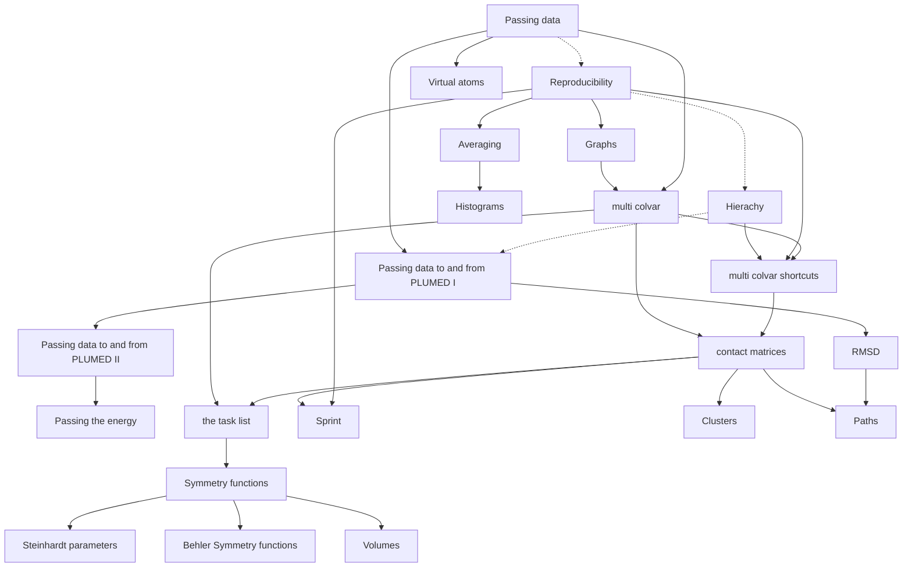

# Revising PLUMED 

After the Trieste meeting in 2017, I (Gareth Tribello) started revising some of the code in PLUMED in a separate branch called hack-the-tree.
The code in this new branch quickly diverged from the code in the master branch. This divergence, I now realise, was a good thing. The extensive
code base for a piece of scientific software places innumerable constraints on its development. Sometimes it helps to free yourself of these
constraints and to allow yourself to "break" some things. I think this process has allowed me to improve how some of the CVs
and methods I have written for PLUMED are implemented.

I think it is now time to merge some of these features from the hack-the-tree branch back into the master branch of PLUMED. I decided to write these pages as
I made the code from hack-the-tree amenable to the rest of the code. I hope they explain my thinking and help others use the
new features I have implemented. I also hope they inspire discussions about how we approach code development for a particular research community.
When I started this process I identified the following three themes that have driven a lot of my thinking over the last three years:

* [Passing data between actions](Passing.md) 
* [Reproducibility and extensibility](Reproducibility.md)
* [Hierachy and community](Community.md)

A lot of the posts in the pages that follow expand on these three ideas.


<b><a href="https://www.plumed.org/doc-master/user-doc/html/actionlist/?actions=CUSTOM,MATRIX_PRODUCT,AVERAGE,PRINT,DOMAIN_DECOMPOSITION,GSYMFUNC_THREEBODY,REFERENCE_GRID,PDB2CONSTANT,DISPLACEMENT,FIXEDATOM,SORT,DIFFERENCE,GPATH,LOCAL_AVERAGE,SPRINT,DUMPGRID,MATRIX_VECTOR_PRODUCT,CONCATENATE,GROUP,INSPHERE,CENTER,DISTANCE,INTERPOLATE_GRID,LOWEST,TRANSPOSE,ONES,BIASVALUE,GATHER_REPLICAS,PATH,INTEGRATE_GRID,SUM,GEOMETRIC_PATH,RESTRAINT,VSTACK,LESS_THAN,SPHERICAL_HARMONIC,COORDINATIONNUMBER,DISTANCE_MATRIX,COMBINE,CLUSTER_PROPERTIES,WHOLEMOLECULES,PAIRENTROPY,EUCLIDEAN_DISTANCE,CONSTANT,KDE,ACCUMULATE,VOLUME,DFSCLUSTERING,RMSD,PCAVARS,TORSION,GET_VOLUME_ELEMENT,CLUSTER_WEIGHTS,LOCAL_Q1,DIAGONALIZE,OUTER_PRODUCT,MORE_THAN,Q1,HISTOGRAM,RDF,SELECT_COMPONENTS,CONTACT_MATRIX,MEAN,POSITION,Q6,RMSD_VECTOR,Q4,DISTANCES,COM" target="_blank">Click here</a> to open manual pages for actions discussed in this tutorial.</b>

