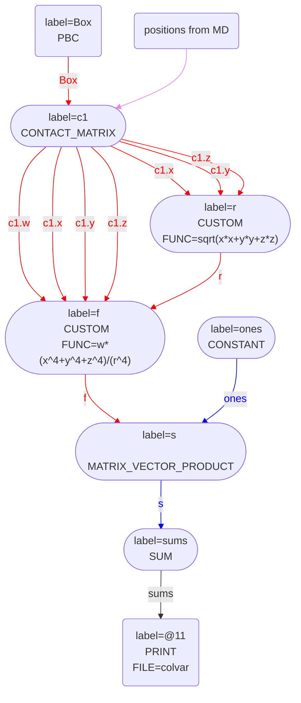

# Calculating symmetry functions

In the other blog articles on these pages I have written a great deal about how you can calculate coordination numbers 
using inputs such as the one below:



 Click on the labels of the actions for more information on what each action computes 

<pre class="plumedlisting">
# Calculate the contact matrix.  This is a square 7x7 matrix
<b name="data/SymmetryFunction.md_working_1.datc1" onclick='showPath("data/SymmetryFunction.md_working_1.dat","data/SymmetryFunction.md_working_1.datc1","data/SymmetryFunction.md_working_1.datc1","red")'>c1</b>The CONTACT_MATRIX action with label <b>c1</b> calculates the following quantities:<table  align="center" frame="void" width="95%" cellpadding="5%"><tr><td width="5%"><b> Quantity </b>  </td><td width="5%"><b> Type </b>  </td><td><b> Description </b> </td></tr><tr><td width="5%">c1</td><td width="5%">matrix</td><td>a matrix containing the weights for the bonds between each pair of atoms</td></tr></table>: CONTACT_MATRIXAdjacency matrix in which two atoms are adjacent if they are within a certain cutoff. <a href="https://www.plumed.org/doc-master/user-doc/html/CONTACT_MATRIX" style="color:green">More details</a><i></i> GROUPspecifies the list of atoms that should be assumed indistinguishable<i></i>=1-7 SWITCHthe input for the switching function that acts upon the distance between each pair of atoms. Options for this keyword are explained in the documentation for <a href="https://www.plumed.org/doc-master/user-doc/html/LESS_THAN">LESS_THAN</a>.<i></i>={RATIONAL R_0=2.6 NN=6 MM=12}
# Calculate the coordination numbers for the 7 atoms by a vector that contains all ones
<b name="data/SymmetryFunction.md_working_1.datones" onclick='showPath("data/SymmetryFunction.md_working_1.dat","data/SymmetryFunction.md_working_1.datones","data/SymmetryFunction.md_working_1.datones_shortcut","blue")'>ones</b>The ONES action with label <b>ones</b> calculates the following quantities:<table  align="center" frame="void" width="95%" cellpadding="5%"><tr><td width="5%"><b> Quantity </b>  </td><td width="5%"><b> Type </b>  </td><td><b> Description </b> </td></tr><tr><td width="5%">ones</td><td width="5%">vector</td><td>a vector of ones with the required number of elements</td></tr></table>: ONESCreate a constant vector with all elements equal to one This action is <a class="toggler" href='javascript:;' onclick='toggleDisplay("data/SymmetryFunction.md_working_1.datones");'>a shortcut</a>. <a href="https://www.plumed.org/doc-master/user-doc/html/ONES">More details</a><i></i> SIZEthe number of ones that you would like to create<i></i>=7
# PLUMED interprets the command:
# ones: ONES SIZE=7
# as follows (Click the red comment above to revert to the short version of the input):
<b name="data/SymmetryFunction.md_working_1.datones" onclick='showPath("data/SymmetryFunction.md_working_1.dat","data/SymmetryFunction.md_working_1.datones","data/SymmetryFunction.md_working_1.datones","blue")'>ones</b>The CONSTANT action with label <b>ones</b> calculates the following quantities:<table  align="center" frame="void" width="95%" cellpadding="5%"><tr><td width="5%"><b> Quantity </b>  </td><td width="5%"><b> Type </b>  </td><td><b> Description </b> </td></tr><tr><td width="5%">ones</td><td width="5%">vector</td><td>the constant value that was read from the plumed input</td></tr></table>: CONSTANTCreate a constant value that can be passed to actions <a href="https://www.plumed.org/doc-master/user-doc/html/CONSTANT" style="color:green">More details</a><i></i> NOLOG do not report all the read in scalars in the log<i></i> VALUESthe numbers that are in your constant value<i></i>=1,1,1,1,1,1,1
# --- End of included input --- <b name="data/SymmetryFunction.md_working_1.datcc" onclick='showPath("data/SymmetryFunction.md_working_1.dat","data/SymmetryFunction.md_working_1.datcc","data/SymmetryFunction.md_working_1.datcc","blue")'>cc</b>The MATRIX_VECTOR_PRODUCT action with label <b>cc</b> calculates the following quantities:<table  align="center" frame="void" width="95%" cellpadding="5%"><tr><td width="5%"><b> Quantity </b>  </td><td width="5%"><b> Type </b>  </td><td><b> Description </b> </td></tr><tr><td width="5%">cc</td><td width="5%">vector</td><td>the vector that is obtained by taking the product between the matrix and the vector that were input</td></tr></table>: MATRIX_VECTOR_PRODUCTCalculate the product of the matrix and the vector <a href="https://www.plumed.org/doc-master/user-doc/html/MATRIX_VECTOR_PRODUCT" style="color:green">More details</a><i></i> ARGthe label for the matrix and the vector/scalar that are being multiplied<i></i>=<b name="data/SymmetryFunction.md_working_1.datc1">c1</b>,<b name="data/SymmetryFunction.md_working_1.datones">ones</b>
# And output the 7 coordination numbers for the atoms
PRINTPrint quantities to a file. <a href="https://www.plumed.org/doc-master/user-doc/html/PRINT" style="color:green">More details</a><i></i> ARGthe labels of the values that you would like to print to the file<i></i>=<b name="data/SymmetryFunction.md_working_1.datcc">cc</b> FILEthe name of the file on which to output these quantities<i></i>=colvar
</pre>
  

In this article I want to explain how we can use PLUMED input files that are similar to the one above to calculate 
other input files.

## CONTACT_MATRIX and the COMPONENTS flag

In the input at the top of this file I used a CONTACT_MATRIX.  This command outputs a matrix, $\mathbf{A}$, in which element $i,j$ is given by:

$$
A_{ij} = \sigma(r_{ij})
$$

where $\sigma$ is a switching function and $r_{ij}$ is the distance between atom $i$ and atom $j$.  

Switching functions like $\sigma(r_{ij})$ are used in the definitions symmetry functions such as those used in the FCCUBIC, TETRAHEDRAL and SIMPLECUBIC actions.  These functions have the following general form:

$$
s_i = \sum_{j\ne i } f(x_{ij},y_{ij},z_{ij})\sigma(r_{ij})
$$

where $f$ is some function of the $x_{ij}$, $y_{ij}$ and $z_{ij}$ components of the vector that connects atom $i$ to atom $j$.  To make it easy to implement such functions I have introduced a 
COMPONENTS flag on the CONTACT_MATRIX command that can be used as shown below:



 Click on the labels of the actions for more information on what each action computes 

<pre class="plumedlisting">
# Calculate the contact matrix and the three matrices that contain the components of the vectors connecting atom i and atom j.  In other words, calculate four 7x7 matrices
<b name="data/SymmetryFunction.md_working_2.datc1" onclick='showPath("data/SymmetryFunction.md_working_2.dat","data/SymmetryFunction.md_working_2.datc1","data/SymmetryFunction.md_working_2.datc1","red")'>c1</b>The CONTACT_MATRIX action with label <b>c1</b> calculates the following quantities:<table  align="center" frame="void" width="95%" cellpadding="5%"><tr><td width="5%"><b> Quantity </b>  </td><td width="5%"><b> Type </b>  </td><td><b> Description </b> </td></tr><tr><td width="5%">c1.w</td><td width="5%">matrix</td><td>a matrix containing the weights for the bonds between each pair of atoms</td></tr><tr><td width="5%">c1.x</td><td width="5%">matrix</td><td>the projection of the bond on the x axis</td></tr><tr><td width="5%">c1.y</td><td width="5%">matrix</td><td>the projection of the bond on the y axis</td></tr><tr><td width="5%">c1.z</td><td width="5%">matrix</td><td>the projection of the bond on the z axis</td></tr></table>: CONTACT_MATRIXAdjacency matrix in which two atoms are adjacent if they are within a certain cutoff. <a href="https://www.plumed.org/doc-master/user-doc/html/CONTACT_MATRIX" style="color:green">More details</a><i></i> COMPONENTS also calculate the components of the vector connecting the atoms in the contact matrix<i></i> GROUPspecifies the list of atoms that should be assumed indistinguishable<i></i>=1-7 SWITCHthe input for the switching function that acts upon the distance between each pair of atoms. Options for this keyword are explained in the documentation for <a href="https://www.plumed.org/doc-master/user-doc/html/LESS_THAN">LESS_THAN</a>.<i></i>={RATIONAL R_0=2.6 NN=6 MM=12}
# Output the four 7x7 matrices calculated by the command above to a file.
PRINTPrint quantities to a file. <a href="https://www.plumed.org/doc-master/user-doc/html/PRINT" style="color:green">More details</a><i></i> ARGthe labels of the values that you would like to print to the file<i></i>=<b name="data/SymmetryFunction.md_working_2.datc1">c1.w</b>,<b name="data/SymmetryFunction.md_working_2.datc1">c1.x</b>,<b name="data/SymmetryFunction.md_working_2.datc1">c1.y</b>,<b name="data/SymmetryFunction.md_working_2.datc1">c1.z</b> FILEthe name of the file on which to output these quantities<i></i>=colvar
</pre>
  

The COMPONENTS flag for the CONTACT_MATRIX action is specfically designed to make calculating symmetry functions such as $s_i$ striaghforward.  The elements of the matrix `c1.x` are 
thus calculated as:

$$
X_{ij} = \begin{cases}
x_{ij} & \textrm{if} \quad \sigma(r_{ij})>0 \\
0 & \textrm{otherwise}
\end{cases}
$$

The elements of `c1.y` and `c1.z` are also calculated in a similar fashion.  __In other words, the $i,j$ element of these three matrices are only non-zero if atom $j$ is within the first coordination sphere 
of atom $i$.__

## Combining CONTACT_MATRIX and CUSTOM

We can use the CONTACT_MATRIX command with the COMPONENTS keyword to calculate a function similar to $s_i$ above as follows:



 Click on the labels of the actions for more information on what each action computes 

<pre class="plumedlisting">
# Calculate the contact matrix and the three matrices that contain the components of the vectors connecting atom i and atom j.  In other words, calculate four 7x7 matrices
<b name="data/SymmetryFunction.md_working_3.datc1" onclick='showPath("data/SymmetryFunction.md_working_3.dat","data/SymmetryFunction.md_working_3.datc1","data/SymmetryFunction.md_working_3.datc1","red")'>c1</b>The CONTACT_MATRIX action with label <b>c1</b> calculates the following quantities:<table  align="center" frame="void" width="95%" cellpadding="5%"><tr><td width="5%"><b> Quantity </b>  </td><td width="5%"><b> Type </b>  </td><td><b> Description </b> </td></tr><tr><td width="5%">c1.w</td><td width="5%">matrix</td><td>a matrix containing the weights for the bonds between each pair of atoms</td></tr><tr><td width="5%">c1.x</td><td width="5%">matrix</td><td>the projection of the bond on the x axis</td></tr><tr><td width="5%">c1.y</td><td width="5%">matrix</td><td>the projection of the bond on the y axis</td></tr><tr><td width="5%">c1.z</td><td width="5%">matrix</td><td>the projection of the bond on the z axis</td></tr></table>: CONTACT_MATRIXAdjacency matrix in which two atoms are adjacent if they are within a certain cutoff. <a href="https://www.plumed.org/doc-master/user-doc/html/CONTACT_MATRIX" style="color:green">More details</a><i></i> COMPONENTS also calculate the components of the vector connecting the atoms in the contact matrix<i></i> GROUPspecifies the list of atoms that should be assumed indistinguishable<i></i>=1-7 SWITCHthe input for the switching function that acts upon the distance between each pair of atoms. Options for this keyword are explained in the documentation for <a href="https://www.plumed.org/doc-master/user-doc/html/LESS_THAN">LESS_THAN</a>.<i></i>={RATIONAL R_0=2.6 NN=6 MM=12}
# This applies the function to the three input matrices element-wise and thus outputs a 7x7 matrix
<b name="data/SymmetryFunction.md_working_3.datr" onclick='showPath("data/SymmetryFunction.md_working_3.dat","data/SymmetryFunction.md_working_3.datr","data/SymmetryFunction.md_working_3.datr","red")'>r</b>The CUSTOM action with label <b>r</b> calculates the following quantities:<table  align="center" frame="void" width="95%" cellpadding="5%"><tr><td width="5%"><b> Quantity </b>  </td><td width="5%"><b> Type </b>  </td><td><b> Description </b> </td></tr><tr><td width="5%">r</td><td width="5%">matrix</td><td>the matrix obtained by doing an element-wise application of an arbitrary function to the input matrix</td></tr></table>: CUSTOMCalculate a combination of variables using a custom expression. <a href="https://www.plumed.org/doc-master/user-doc/html/CUSTOM" style="color:green">More details</a><i></i> ARGthe values input to this function<i></i>=<b name="data/SymmetryFunction.md_working_3.datc1">c1.x</b>,<b name="data/SymmetryFunction.md_working_3.datc1">c1.y</b>,<b name="data/SymmetryFunction.md_working_3.datc1">c1.z</b> FUNCthe function you wish to evaluate<i></i>=sqrt(x*x+y*y+z*z) PERIODICif the output of your function is periodic then you should specify the periodicity of the function<i></i>=NO
# Again we are applying the function element wise to the five input matrices and thus outputting a 7x7 matrix
<b name="data/SymmetryFunction.md_working_3.datf" onclick='showPath("data/SymmetryFunction.md_working_3.dat","data/SymmetryFunction.md_working_3.datf","data/SymmetryFunction.md_working_3.datf","red")'>f</b>The CUSTOM action with label <b>f</b> calculates the following quantities:<table  align="center" frame="void" width="95%" cellpadding="5%"><tr><td width="5%"><b> Quantity </b>  </td><td width="5%"><b> Type </b>  </td><td><b> Description </b> </td></tr><tr><td width="5%">f</td><td width="5%">matrix</td><td>the matrix obtained by doing an element-wise application of an arbitrary function to the input matrix</td></tr></table>: CUSTOMCalculate a combination of variables using a custom expression. <a href="https://www.plumed.org/doc-master/user-doc/html/CUSTOM" style="color:green">More details</a><i></i> ARGthe values input to this function<i></i>=<b name="data/SymmetryFunction.md_working_3.datc1">c1.w</b>,<b name="data/SymmetryFunction.md_working_3.datc1">c1.x</b>,<b name="data/SymmetryFunction.md_working_3.datc1">c1.y</b>,<b name="data/SymmetryFunction.md_working_3.datc1">c1.z</b>,<b name="data/SymmetryFunction.md_working_3.datr">r</b> FUNCthe function you wish to evaluate<i></i>=w*(x^4+y^4+z^4)/(r^4) VARthe names to give each of the arguments in the function<i></i>=w,x,y,z,<b name="data/SymmetryFunction.md_working_3.datr">r</b> PERIODICif the output of your function is periodic then you should specify the periodicity of the function<i></i>=NO
# We now multiply the 7x7 by a vector of ones to calculate the symmetry function
<b name="data/SymmetryFunction.md_working_3.datones" onclick='showPath("data/SymmetryFunction.md_working_3.dat","data/SymmetryFunction.md_working_3.datones","data/SymmetryFunction.md_working_3.datones_shortcut","blue")'>ones</b>The ONES action with label <b>ones</b> calculates the following quantities:<table  align="center" frame="void" width="95%" cellpadding="5%"><tr><td width="5%"><b> Quantity </b>  </td><td width="5%"><b> Type </b>  </td><td><b> Description </b> </td></tr><tr><td width="5%">ones</td><td width="5%">vector</td><td>a vector of ones with the required number of elements</td></tr></table>: ONESCreate a constant vector with all elements equal to one This action is <a class="toggler" href='javascript:;' onclick='toggleDisplay("data/SymmetryFunction.md_working_3.datones");'>a shortcut</a>. <a href="https://www.plumed.org/doc-master/user-doc/html/ONES">More details</a><i></i> SIZEthe number of ones that you would like to create<i></i>=7
# PLUMED interprets the command:
# ones: ONES SIZE=7
# as follows (Click the red comment above to revert to the short version of the input):
<b name="data/SymmetryFunction.md_working_3.datones" onclick='showPath("data/SymmetryFunction.md_working_3.dat","data/SymmetryFunction.md_working_3.datones","data/SymmetryFunction.md_working_3.datones","blue")'>ones</b>The CONSTANT action with label <b>ones</b> calculates the following quantities:<table  align="center" frame="void" width="95%" cellpadding="5%"><tr><td width="5%"><b> Quantity </b>  </td><td width="5%"><b> Type </b>  </td><td><b> Description </b> </td></tr><tr><td width="5%">ones</td><td width="5%">vector</td><td>the constant value that was read from the plumed input</td></tr></table>: CONSTANTCreate a constant value that can be passed to actions <a href="https://www.plumed.org/doc-master/user-doc/html/CONSTANT" style="color:green">More details</a><i></i> NOLOG do not report all the read in scalars in the log<i></i> VALUESthe numbers that are in your constant value<i></i>=1,1,1,1,1,1,1
# --- End of included input --- <b name="data/SymmetryFunction.md_working_3.dats" onclick='showPath("data/SymmetryFunction.md_working_3.dat","data/SymmetryFunction.md_working_3.dats","data/SymmetryFunction.md_working_3.dats","blue")'>s</b>The MATRIX_VECTOR_PRODUCT action with label <b>s</b> calculates the following quantities:<table  align="center" frame="void" width="95%" cellpadding="5%"><tr><td width="5%"><b> Quantity </b>  </td><td width="5%"><b> Type </b>  </td><td><b> Description </b> </td></tr><tr><td width="5%">s</td><td width="5%">vector</td><td>the vector that is obtained by taking the product between the matrix and the vector that were input</td></tr></table>: MATRIX_VECTOR_PRODUCTCalculate the product of the matrix and the vector <a href="https://www.plumed.org/doc-master/user-doc/html/MATRIX_VECTOR_PRODUCT" style="color:green">More details</a><i></i> ARGthe label for the matrix and the vector/scalar that are being multiplied<i></i>=<b name="data/SymmetryFunction.md_working_3.datf">f</b>,<b name="data/SymmetryFunction.md_working_3.datones">ones</b> 
# And print the sum of the symmetry function to a file
<b name="data/SymmetryFunction.md_working_3.datsums" onclick='showPath("data/SymmetryFunction.md_working_3.dat","data/SymmetryFunction.md_working_3.datsums","data/SymmetryFunction.md_working_3.datsums","black")'>sums</b>The SUM action with label <b>sums</b> calculates the following quantities:<table  align="center" frame="void" width="95%" cellpadding="5%"><tr><td width="5%"><b> Quantity </b>  </td><td width="5%"><b> Type </b>  </td><td><b> Description </b> </td></tr><tr><td width="5%">sums</td><td width="5%">scalar</td><td>the SUM of the elements in the input value</td></tr></table>: SUMCalculate the sum of the arguments <a href="https://www.plumed.org/doc-master/user-doc/html/SUM" style="color:green">More details</a><i></i> ARGthe vector/matrix/grid whose elements shuld be added together<i></i>=<b name="data/SymmetryFunction.md_working_3.dats">s</b> PERIODICif the output of your function is periodic then you should specify the periodicity of the function<i></i>=NO
PRINTPrint quantities to a file. <a href="https://www.plumed.org/doc-master/user-doc/html/PRINT" style="color:green">More details</a><i></i> ARGthe labels of the values that you would like to print to the file<i></i>=<b name="data/SymmetryFunction.md_working_3.datsums">sums</b> FILEthe name of the file on which to output these quantities<i></i>=colvar
</pre>
  

The graph for this input is shown below:

Notice that all the commands are done in a single chain.  There is no need to store any matrix elements as the functions in `r` and `f` are applied to the elements of the matrices calculated
by `c1` immediately after they are calculated.  Furthermore, if one were to sum the elements of the vector `s` and add a bias upon the sum, the forces on `s` are passed back through the code as
shown below:

This is possible because the chain of actions the $(i,j)$ matrix elements for `r` and `f` (and their derivatives with respect to the atomic positions) are calculated immediately after $(i,j)$ matrix elements
for `c1.w`, `c1.x`, `c1.y` and `c1.z`.  In other words, in calculating `sums` we do a single loop over $i$ and $j$ and can thus accumulate values and derivatives without storing any matrices or vectors.

## Extending these symmetry functions

There are ways of defining the neighbourhood of atom $i$ that do not involve using the CONTACT_MATRIX keyword.  For example, you can define a matrix in which element $i,j$ is only non-zero if there is a hydrogen
bond between atom $i$ and atom $j$ (HBOND_MATRIX or HBPAMM_MATRIX) or, if you have molecules, you can say that molecule $i$ and $j$ are connected if they are within a cutoff of each other and if the two molecules
have some favourable orientation with respect to each other.  In all these cases you can also use a COMPONENTS keywords to get the direction of the bonds in the first coordination sphere as I have described in the 
article above.  You are thus not forced to use a switching function to define the $\sigma(r_{ij})$ part of the symmetry function that was defined above.  You can use other methods to determine whether atom $i$ and 
atom $j$ are adjacent or not.  Consequently, the implementation of these symmetry function in PLUMED is quite flexible and allows users to try many things without modifying the code.
