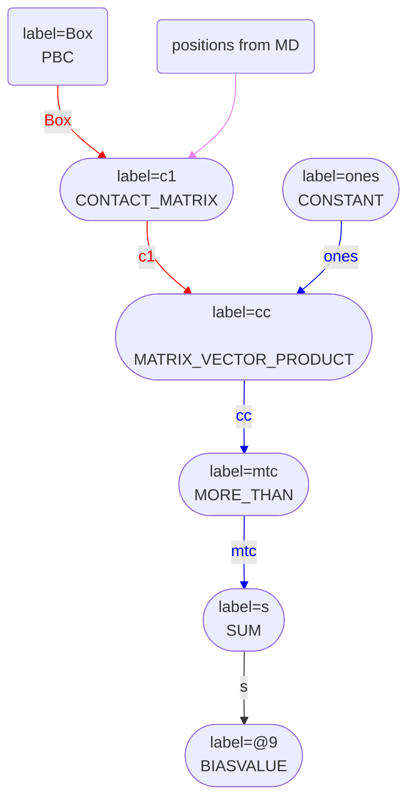
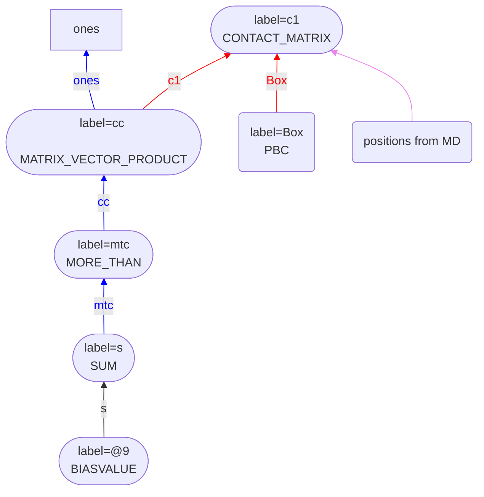
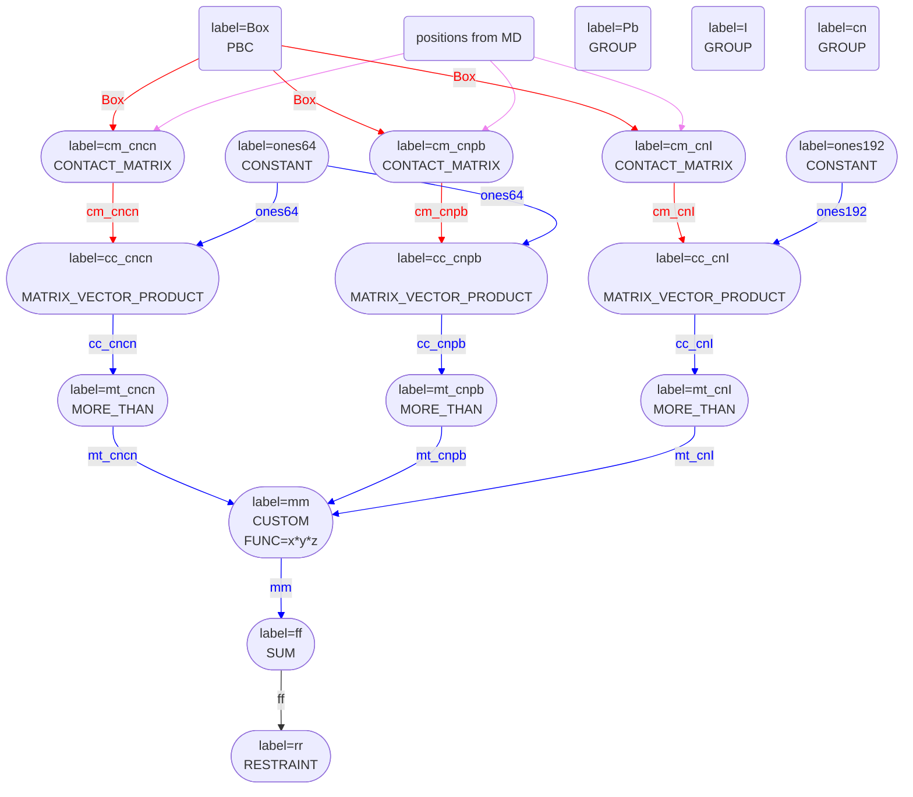
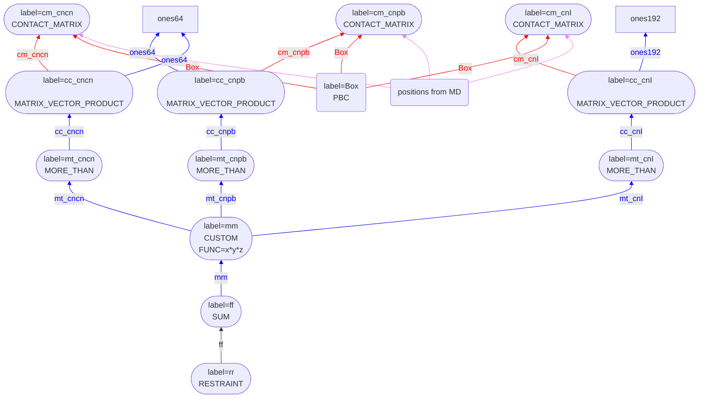

# Contact matices and coordination numbers

The $i$, $j$ element of the conntact matrix, $\mathbf{C}_{ij}$, is one if atoms $i$ and $j$ are within a certain distance $r_c$ of each other and zero otherwise.
Consequently, if $\mathbf{C}$ is multiplied from the back by a vector of ones the $i$th element of the resulting matrix tells you the number of atoms that are 
within $r_c$ of atom $i$.  In other words, the coordination numbers of the atoms can be calculated from the contact matrix by doing matrix vector multiplication.

This realisation about the relationship between the contact map and the coordination number is heavily used in the new version of PLUMED.  For example, to calculate 
and print the coordination numbers of the first 7 atoms in the system with themselves you would use an input something like this:



 Click on the labels of the actions for more information on what each action computes 

<pre class="plumedlisting">
<b name="data/contactMatrix.md_working_1.datc1" onclick='showPath("data/contactMatrix.md_working_1.dat","data/contactMatrix.md_working_1.datc1","data/contactMatrix.md_working_1.datc1","red")'>c1</b>The CONTACT_MATRIX action with label <b>c1</b> calculates the following quantities:<table  align="center" frame="void" width="95%" cellpadding="5%"><tr><td width="5%"><b> Quantity </b>  </td><td width="5%"><b> Type </b>  </td><td><b> Description </b> </td></tr><tr><td width="5%">c1</td><td width="5%">matrix</td><td>a matrix containing the weights for the bonds between each pair of atoms</td></tr></table>: CONTACT_MATRIXAdjacency matrix in which two atoms are adjacent if they are within a certain cutoff. <a href="https://www.plumed.org/doc-master/user-doc/html/CONTACT_MATRIX" style="color:green">More details</a><i></i> GROUPspecifies the list of atoms that should be assumed indistinguishable<i></i>=1-7 SWITCHthe input for the switching function that acts upon the distance between each pair of atoms. Options for this keyword are explained in the documentation for <a href="https://www.plumed.org/doc-master/user-doc/html/LESS_THAN">LESS_THAN</a>.<i></i>={RATIONAL R_0=2.6 NN=6 MM=12}
<b name="data/contactMatrix.md_working_1.datones" onclick='showPath("data/contactMatrix.md_working_1.dat","data/contactMatrix.md_working_1.datones","data/contactMatrix.md_working_1.datones_shortcut","blue")'>ones</b>The ONES action with label <b>ones</b> calculates the following quantities:<table  align="center" frame="void" width="95%" cellpadding="5%"><tr><td width="5%"><b> Quantity </b>  </td><td width="5%"><b> Type </b>  </td><td><b> Description </b> </td></tr><tr><td width="5%">ones</td><td width="5%">vector</td><td>a vector of ones with the required number of elements</td></tr></table>: ONESCreate a constant vector with all elements equal to one This action is <a class="toggler" href='javascript:;' onclick='toggleDisplay("data/contactMatrix.md_working_1.datones");'>a shortcut</a>. <a href="https://www.plumed.org/doc-master/user-doc/html/ONES">More details</a><i></i> SIZEthe number of ones that you would like to create<i></i>=7
# PLUMED interprets the command:
# ones: ONES SIZE=7
# as follows (Click the red comment above to revert to the short version of the input):
<b name="data/contactMatrix.md_working_1.datones" onclick='showPath("data/contactMatrix.md_working_1.dat","data/contactMatrix.md_working_1.datones","data/contactMatrix.md_working_1.datones","blue")'>ones</b>The CONSTANT action with label <b>ones</b> calculates the following quantities:<table  align="center" frame="void" width="95%" cellpadding="5%"><tr><td width="5%"><b> Quantity </b>  </td><td width="5%"><b> Type </b>  </td><td><b> Description </b> </td></tr><tr><td width="5%">ones</td><td width="5%">vector</td><td>the constant value that was read from the plumed input</td></tr></table>: CONSTANTCreate a constant value that can be passed to actions <a href="https://www.plumed.org/doc-master/user-doc/html/CONSTANT" style="color:green">More details</a><i></i> NOLOG do not report all the read in scalars in the log<i></i> VALUESthe numbers that are in your constant value<i></i>=1,1,1,1,1,1,1
# --- End of included input --- <b name="data/contactMatrix.md_working_1.datcc" onclick='showPath("data/contactMatrix.md_working_1.dat","data/contactMatrix.md_working_1.datcc","data/contactMatrix.md_working_1.datcc","blue")'>cc</b>The MATRIX_VECTOR_PRODUCT action with label <b>cc</b> calculates the following quantities:<table  align="center" frame="void" width="95%" cellpadding="5%"><tr><td width="5%"><b> Quantity </b>  </td><td width="5%"><b> Type </b>  </td><td><b> Description </b> </td></tr><tr><td width="5%">cc</td><td width="5%">vector</td><td>the vector that is obtained by taking the product between the matrix and the vector that were input</td></tr></table>: MATRIX_VECTOR_PRODUCTCalculate the product of the matrix and the vector <a href="https://www.plumed.org/doc-master/user-doc/html/MATRIX_VECTOR_PRODUCT" style="color:green">More details</a><i></i> ARGthe label for the matrix and the vector/scalar that are being multiplied<i></i>=<b name="data/contactMatrix.md_working_1.datc1">c1</b>,<b name="data/contactMatrix.md_working_1.datones">ones</b>
PRINTPrint quantities to a file. <a href="https://www.plumed.org/doc-master/user-doc/html/PRINT" style="color:green">More details</a><i></i> ARGthe labels of the values that you would like to print to the file<i></i>=<b name="data/contactMatrix.md_working_1.datcc">cc</b> FILEthe name of the file on which to output these quantities<i></i>=colvar
</pre>
  

Implmenting the coordination number this way is useful as there are many different ways to define whether two atoms/molecules and to construct a "contact" matrix based on 
the result.  For example:

* You could say that two molecules are connected if they are within a certain distance of each other and if they have the same orientation.
* You could say that two water molecules are connected if they are hydrogen bonded to each other.
* You could say that two atoms are connected if they are within a certain distance of each other and if they have similar values for a CV.

When the coordination numbers is implemented in the way described above (by doing the matrix-vector multiplication) you have the flexibility to define the contact matrix that 
is used in the multiplication in whatever way you choose.  In other words, the newer implementation of the coordination number is much more flexible.

## Contact map chains

As discussed on [this page](MultiColvar.md), PLUMED avoids storing the derivatives for each element of a vector by creating a chain of actions instead of passing the vectors.  
We also use these chains of actions when passing matrices.  When we compute the CV defined by the input below:



 Click on the labels of the actions for more information on what each action computes 

<pre class="plumedlisting">
# Calculate the contact matrix for the first seven atoms in the system
<b name="data/contactMatrix.md_working_2.datc1" onclick='showPath("data/contactMatrix.md_working_2.dat","data/contactMatrix.md_working_2.datc1","data/contactMatrix.md_working_2.datc1","red")'>c1</b>The CONTACT_MATRIX action with label <b>c1</b> calculates the following quantities:<table  align="center" frame="void" width="95%" cellpadding="5%"><tr><td width="5%"><b> Quantity </b>  </td><td width="5%"><b> Type </b>  </td><td><b> Description </b> </td></tr><tr><td width="5%">c1</td><td width="5%">matrix</td><td>a matrix containing the weights for the bonds between each pair of atoms</td></tr></table>: CONTACT_MATRIXAdjacency matrix in which two atoms are adjacent if they are within a certain cutoff. <a href="https://www.plumed.org/doc-master/user-doc/html/CONTACT_MATRIX" style="color:green">More details</a><i></i> GROUPspecifies the list of atoms that should be assumed indistinguishable<i></i>=1-7 SWITCHthe input for the switching function that acts upon the distance between each pair of atoms. Options for this keyword are explained in the documentation for <a href="https://www.plumed.org/doc-master/user-doc/html/LESS_THAN">LESS_THAN</a>.<i></i>={RATIONAL R_0=2.6 NN=6 MM=12}
# Calculate the coordination numbers for the first seven atoms in the system
<b name="data/contactMatrix.md_working_2.datones" onclick='showPath("data/contactMatrix.md_working_2.dat","data/contactMatrix.md_working_2.datones","data/contactMatrix.md_working_2.datones_shortcut","blue")'>ones</b>The ONES action with label <b>ones</b> calculates the following quantities:<table  align="center" frame="void" width="95%" cellpadding="5%"><tr><td width="5%"><b> Quantity </b>  </td><td width="5%"><b> Type </b>  </td><td><b> Description </b> </td></tr><tr><td width="5%">ones</td><td width="5%">vector</td><td>a vector of ones with the required number of elements</td></tr></table>: ONESCreate a constant vector with all elements equal to one This action is <a class="toggler" href='javascript:;' onclick='toggleDisplay("data/contactMatrix.md_working_2.datones");'>a shortcut</a>. <a href="https://www.plumed.org/doc-master/user-doc/html/ONES">More details</a><i></i> SIZEthe number of ones that you would like to create<i></i>=7
# PLUMED interprets the command:
# ones: ONES SIZE=7
# as follows (Click the red comment above to revert to the short version of the input):
<b name="data/contactMatrix.md_working_2.datones" onclick='showPath("data/contactMatrix.md_working_2.dat","data/contactMatrix.md_working_2.datones","data/contactMatrix.md_working_2.datones","blue")'>ones</b>The CONSTANT action with label <b>ones</b> calculates the following quantities:<table  align="center" frame="void" width="95%" cellpadding="5%"><tr><td width="5%"><b> Quantity </b>  </td><td width="5%"><b> Type </b>  </td><td><b> Description </b> </td></tr><tr><td width="5%">ones</td><td width="5%">vector</td><td>the constant value that was read from the plumed input</td></tr></table>: CONSTANTCreate a constant value that can be passed to actions <a href="https://www.plumed.org/doc-master/user-doc/html/CONSTANT" style="color:green">More details</a><i></i> NOLOG do not report all the read in scalars in the log<i></i> VALUESthe numbers that are in your constant value<i></i>=1,1,1,1,1,1,1
# --- End of included input --- <b name="data/contactMatrix.md_working_2.datcc" onclick='showPath("data/contactMatrix.md_working_2.dat","data/contactMatrix.md_working_2.datcc","data/contactMatrix.md_working_2.datcc","blue")'>cc</b>The MATRIX_VECTOR_PRODUCT action with label <b>cc</b> calculates the following quantities:<table  align="center" frame="void" width="95%" cellpadding="5%"><tr><td width="5%"><b> Quantity </b>  </td><td width="5%"><b> Type </b>  </td><td><b> Description </b> </td></tr><tr><td width="5%">cc</td><td width="5%">vector</td><td>the vector that is obtained by taking the product between the matrix and the vector that were input</td></tr></table>: MATRIX_VECTOR_PRODUCTCalculate the product of the matrix and the vector <a href="https://www.plumed.org/doc-master/user-doc/html/MATRIX_VECTOR_PRODUCT" style="color:green">More details</a><i></i> ARGthe label for the matrix and the vector/scalar that are being multiplied<i></i>=<b name="data/contactMatrix.md_working_2.datc1">c1</b>,<b name="data/contactMatrix.md_working_2.datones">ones</b>
# Set the ith element of the vector mtc equal to one if the coordination number of atom i is greater than 3.
<b name="data/contactMatrix.md_working_2.datmtc" onclick='showPath("data/contactMatrix.md_working_2.dat","data/contactMatrix.md_working_2.datmtc","data/contactMatrix.md_working_2.datmtc","blue")'>mtc</b>The MORE_THAN action with label <b>mtc</b> calculates the following quantities:<table  align="center" frame="void" width="95%" cellpadding="5%"><tr><td width="5%"><b> Quantity </b>  </td><td width="5%"><b> Type </b>  </td><td><b> Description </b> </td></tr><tr><td width="5%">mtc</td><td width="5%">vector</td><td>the vector obtained by doing an element-wise application of a function that is one if the if the input is more than a threshold to the input vectors</td></tr></table>: MORE_THANUse a switching function to determine how many of the input variables are more than a certain cutoff. <a href="https://www.plumed.org/doc-master/user-doc/html/MORE_THAN" style="color:green">More details</a><i></i> ARGthe values input to this function<i></i>=<b name="data/contactMatrix.md_working_2.datcc">cc</b> SWITCHThis keyword is used if you want to employ an alternative to the continuous swiching function defined above<i></i>={RATIONAL D_0=3 R_0=1}
# Calculate the number of atoms with a coordination number greater than 3.
<b name="data/contactMatrix.md_working_2.dats" onclick='showPath("data/contactMatrix.md_working_2.dat","data/contactMatrix.md_working_2.dats","data/contactMatrix.md_working_2.dats","black")'>s</b>The SUM action with label <b>s</b> calculates the following quantities:<table  align="center" frame="void" width="95%" cellpadding="5%"><tr><td width="5%"><b> Quantity </b>  </td><td width="5%"><b> Type </b>  </td><td><b> Description </b> </td></tr><tr><td width="5%">s</td><td width="5%">scalar</td><td>the SUM of the elements in the input value</td></tr></table>: SUMCalculate the sum of the arguments <a href="https://www.plumed.org/doc-master/user-doc/html/SUM" style="color:green">More details</a><i></i> ARGthe vector/matrix/grid whose elements shuld be added together<i></i>=<b name="data/contactMatrix.md_working_2.datmtc">mtc</b> PERIODICif the output of your function is periodic then you should specify the periodicity of the function<i></i>=NO
# Add a bias on s that is equal to the value of s
BIASVALUETakes the value of one variable and use it as a bias <a href="https://www.plumed.org/doc-master/user-doc/html/BIASVALUE" style="color:green">More details</a><i></i> ARGthe labels of the scalar/vector arguments whose values will be used as a bias on the system<i></i>=<b name="data/contactMatrix.md_working_2.dats">s</b>
</pre>
  

for example, the diagram showing how data passes through the PLUMED actions as the values and derivatives are calculated is as follows:

Notice that the CONTACT_MATRIX, MATRIX_VECTOR_PRODUCT, MORE_THAN and SUM actions are all in the same subgraph.  The grouping of these actions indicates that the 
first row of the contact matrix is calculated at the same time as the first elements of the vectors with labels cc and mtc.  In other words, PLUMED only starts calculating 
the second row of the matrix with label c1 once the first element of the vector mtc has been added to the scalar s.  Furthermore, the derivatives of s with respect to the 
atoms input to c1 are accumulated during the forward loop.  Consequently, when the forces from the biasvalue are applied on s they are passed through the actions as shown below:

In short, we do not need to calculate the matrix elements of c1 twice in order to apply the forces as we accumulate the derivatives of the final scalar s during the forward loop.

## Optimisation details

The contact matrix is sparse.  Each atom is only be connected to a small number of neighbours and the vast majority of the elements of the contact matrix are thus zero.  To reduce 
the amount of memory that PLUMED requires I have thus implemented sparse matrix storage.  If you do calculate and store a contact matrix only the elements of the matrix that are 
non-zero are stored.

We can also use the sparsity of the contact matrix to make the time required to compute a contact matrix scale linearly rather than quadratically with the number of atoms.  Element 
$i,j$ of the contact matrix is only non-zero if two atoms are within a cutoff, $r_c$.  We can determine that many pairs of atoms are further appart than $r_c$ without computing the 
distance between these atoms by using divide and conquer strategies such as linked lists and neighbour lists.  These optimisation tricks are implemented in the base class AgencyMatrixBase.  
This class therefore ensures that only the subset of elements of the contact matrix that are definitely non-zero are computed.  Furthermore, because coordination numbers are computed 
within the chain of actions only the non-zero elements of the matrix are propegated onwards through the chain when we multiply by the vector of ones.  In the flowchart diagrams that I have 
shown previously the blue subgraphs illustrate how data is passed through actions as the elements of the matrix row are evaluated.

## A complicated CV

Consider the CV that was used to study perovskite nucleation in [this paper](https://pubs.acs.org/doi/abs/10.1021/acs.chemmater.9b04259).  The CV here measures the number of 
methylamonium molecules that are attached to at least 5 other methylamoniusm molecules, at least 7 lead atoms and at least 11 ionide ions.  We can calculate something akin to this 
CV and apply a restraint on the resulting quantity by using the following input file:



 Click on the labels of the actions for more information on what each action computes 

<pre class="plumedlisting">
# Lead ions
<b name="data/contactMatrix.md_working_5.datPb" onclick='showPath("data/contactMatrix.md_working_5.dat","data/contactMatrix.md_working_5.datPb","data/contactMatrix.md_working_5.datPb","violet")'>Pb</b>The GROUP action with label <b>Pb</b> calculates the following quantities:<table  align="center" frame="void" width="95%" cellpadding="5%"><tr><td width="5%"><b> Quantity </b>  </td><td width="5%"><b> Type </b>  </td><td><b> Description </b> </td></tr><tr><td width="5%">Pb</td><td width="5%">atoms</td><td>indices of atoms specified in GROUP</td></tr></table>: GROUPDefine a group of atoms so that a particular list of atoms can be referenced with a single label in definitions of CVs or virtual atoms. <a href="https://www.plumed.org/doc-master/user-doc/html/GROUP" style="color:green">More details</a><i></i> ATOMSthe numerical indexes for the set of atoms in the group<i></i>=1-64
# Iodide atoms
<b name="data/contactMatrix.md_working_5.datI" onclick='showPath("data/contactMatrix.md_working_5.dat","data/contactMatrix.md_working_5.datI","data/contactMatrix.md_working_5.datI","violet")'>I</b>The GROUP action with label <b>I</b> calculates the following quantities:<table  align="center" frame="void" width="95%" cellpadding="5%"><tr><td width="5%"><b> Quantity </b>  </td><td width="5%"><b> Type </b>  </td><td><b> Description </b> </td></tr><tr><td width="5%">I</td><td width="5%">atoms</td><td>indices of atoms specified in GROUP</td></tr></table>: GROUPDefine a group of atoms so that a particular list of atoms can be referenced with a single label in definitions of CVs or virtual atoms. <a href="https://www.plumed.org/doc-master/user-doc/html/GROUP" style="color:green">More details</a><i></i> ATOMSthe numerical indexes for the set of atoms in the group<i></i>=65-256  
# Methylamonium &quot;atoms&quot; -- in the real CV these are centers of mass rather than single atoms
<b name="data/contactMatrix.md_working_5.datcn" onclick='showPath("data/contactMatrix.md_working_5.dat","data/contactMatrix.md_working_5.datcn","data/contactMatrix.md_working_5.datcn","violet")'>cn</b>The GROUP action with label <b>cn</b> calculates the following quantities:<table  align="center" frame="void" width="95%" cellpadding="5%"><tr><td width="5%"><b> Quantity </b>  </td><td width="5%"><b> Type </b>  </td><td><b> Description </b> </td></tr><tr><td width="5%">cn</td><td width="5%">atoms</td><td>indices of atoms specified in GROUP</td></tr></table>: GROUPDefine a group of atoms so that a particular list of atoms can be referenced with a single label in definitions of CVs or virtual atoms. <a href="https://www.plumed.org/doc-master/user-doc/html/GROUP" style="color:green">More details</a><i></i> ATOMSthe numerical indexes for the set of atoms in the group<i></i>=257-320

<b name="data/contactMatrix.md_working_5.datones64" onclick='showPath("data/contactMatrix.md_working_5.dat","data/contactMatrix.md_working_5.datones64","data/contactMatrix.md_working_5.datones64_shortcut","blue")'>ones64</b>The ONES action with label <b>ones64</b> calculates the following quantities:<table  align="center" frame="void" width="95%" cellpadding="5%"><tr><td width="5%"><b> Quantity </b>  </td><td width="5%"><b> Type </b>  </td><td><b> Description </b> </td></tr><tr><td width="5%">ones64</td><td width="5%">vector</td><td>a vector of ones with the required number of elements</td></tr></table>: ONESCreate a constant vector with all elements equal to one This action is <a class="toggler" href='javascript:;' onclick='toggleDisplay("data/contactMatrix.md_working_5.datones64");'>a shortcut</a>. <a href="https://www.plumed.org/doc-master/user-doc/html/ONES">More details</a><i></i> SIZEthe number of ones that you would like to create<i></i>=64
# PLUMED interprets the command:
# ones64: ONES SIZE=64
# as follows (Click the red comment above to revert to the short version of the input):
<b name="data/contactMatrix.md_working_5.datones64" onclick='showPath("data/contactMatrix.md_working_5.dat","data/contactMatrix.md_working_5.datones64","data/contactMatrix.md_working_5.datones64","blue")'>ones64</b>The CONSTANT action with label <b>ones64</b> calculates the following quantities:<table  align="center" frame="void" width="95%" cellpadding="5%"><tr><td width="5%"><b> Quantity </b>  </td><td width="5%"><b> Type </b>  </td><td><b> Description </b> </td></tr><tr><td width="5%">ones64</td><td width="5%">vector</td><td>the constant value that was read from the plumed input</td></tr></table>: CONSTANTCreate a constant value that can be passed to actions <a href="https://www.plumed.org/doc-master/user-doc/html/CONSTANT" style="color:green">More details</a><i></i> NOLOG do not report all the read in scalars in the log<i></i> VALUESthe numbers that are in your constant value<i></i>=1,1,1,1,1,1,1,1,1,1,1,1,1,1,1,1,1,1,1,1,1,1,1,1,1,1,1,1,1,1,1,1,1,1,1,1,1,1,1,1,1,1,1,1,1,1,1,1,1,1,1,1,1,1,1,1,1,1,1,1,1,1,1,1
# --- End of included input --- # Contact matrix that determines if methylamonium molecules are within 8 A of each other
<b name="data/contactMatrix.md_working_5.datcm_cncn" onclick='showPath("data/contactMatrix.md_working_5.dat","data/contactMatrix.md_working_5.datcm_cncn","data/contactMatrix.md_working_5.datcm_cncn","red")'>cm_cncn</b>The CONTACT_MATRIX action with label <b>cm_cncn</b> calculates the following quantities:<table  align="center" frame="void" width="95%" cellpadding="5%"><tr><td width="5%"><b> Quantity </b>  </td><td width="5%"><b> Type </b>  </td><td><b> Description </b> </td></tr><tr><td width="5%">cm_cncn</td><td width="5%">matrix</td><td>a matrix containing the weights for the bonds between each pair of atoms</td></tr></table>: CONTACT_MATRIXAdjacency matrix in which two atoms are adjacent if they are within a certain cutoff. <a href="https://www.plumed.org/doc-master/user-doc/html/CONTACT_MATRIX" style="color:green">More details</a><i></i> GROUPspecifies the list of atoms that should be assumed indistinguishable<i></i>=<b name="data/contactMatrix.md_working_5.datcn">cn</b> SWITCHthe input for the switching function that acts upon the distance between each pair of atoms. Options for this keyword are explained in the documentation for <a href="https://www.plumed.org/doc-master/user-doc/html/LESS_THAN">LESS_THAN</a>.<i></i>={RATIONAL R_0=0.8}
# Coordination number of methylamounium with methylamonium
<b name="data/contactMatrix.md_working_5.datcc_cncn" onclick='showPath("data/contactMatrix.md_working_5.dat","data/contactMatrix.md_working_5.datcc_cncn","data/contactMatrix.md_working_5.datcc_cncn","blue")'>cc_cncn</b>The MATRIX_VECTOR_PRODUCT action with label <b>cc_cncn</b> calculates the following quantities:<table  align="center" frame="void" width="95%" cellpadding="5%"><tr><td width="5%"><b> Quantity </b>  </td><td width="5%"><b> Type </b>  </td><td><b> Description </b> </td></tr><tr><td width="5%">cc_cncn</td><td width="5%">vector</td><td>the vector that is obtained by taking the product between the matrix and the vector that were input</td></tr></table>: MATRIX_VECTOR_PRODUCTCalculate the product of the matrix and the vector <a href="https://www.plumed.org/doc-master/user-doc/html/MATRIX_VECTOR_PRODUCT" style="color:green">More details</a><i></i> ARGthe label for the matrix and the vector/scalar that are being multiplied<i></i>=<b name="data/contactMatrix.md_working_5.datcm_cncn">cm_cncn</b>,<b name="data/contactMatrix.md_working_5.datones64">ones64</b>
# Vector with elements that are one if coordiantion of methylamonium with methylamonium &gt;5
<b name="data/contactMatrix.md_working_5.datmt_cncn" onclick='showPath("data/contactMatrix.md_working_5.dat","data/contactMatrix.md_working_5.datmt_cncn","data/contactMatrix.md_working_5.datmt_cncn","blue")'>mt_cncn</b>The MORE_THAN action with label <b>mt_cncn</b> calculates the following quantities:<table  align="center" frame="void" width="95%" cellpadding="5%"><tr><td width="5%"><b> Quantity </b>  </td><td width="5%"><b> Type </b>  </td><td><b> Description </b> </td></tr><tr><td width="5%">mt_cncn</td><td width="5%">vector</td><td>the vector obtained by doing an element-wise application of a function that is one if the if the input is more than a threshold to the input vectors</td></tr></table>: MORE_THANUse a switching function to determine how many of the input variables are more than a certain cutoff. <a href="https://www.plumed.org/doc-master/user-doc/html/MORE_THAN" style="color:green">More details</a><i></i> ARGthe values input to this function<i></i>=<b name="data/contactMatrix.md_working_5.datcc_cncn">cc_cncn</b> SWITCHThis keyword is used if you want to employ an alternative to the continuous swiching function defined above<i></i>={RATIONAL R_0=5 NN=12 MM=24}
 # Contact matrix that determines if methylamoinium moleulcule and Pb atom are within 7.5 A of each other
<b name="data/contactMatrix.md_working_5.datcm_cnpb" onclick='showPath("data/contactMatrix.md_working_5.dat","data/contactMatrix.md_working_5.datcm_cnpb","data/contactMatrix.md_working_5.datcm_cnpb","red")'>cm_cnpb</b>The CONTACT_MATRIX action with label <b>cm_cnpb</b> calculates the following quantities:<table  align="center" frame="void" width="95%" cellpadding="5%"><tr><td width="5%"><b> Quantity </b>  </td><td width="5%"><b> Type </b>  </td><td><b> Description </b> </td></tr><tr><td width="5%">cm_cnpb</td><td width="5%">matrix</td><td>a matrix containing the weights for the bonds between each pair of atoms</td></tr></table>: CONTACT_MATRIXAdjacency matrix in which two atoms are adjacent if they are within a certain cutoff. <a href="https://www.plumed.org/doc-master/user-doc/html/CONTACT_MATRIX" style="color:green">More details</a><i></i> GROUPAwhen you are calculating the adjacency matrix between two sets of atoms this keyword is used to specify the atoms along with the keyword GROUPB<i></i>=<b name="data/contactMatrix.md_working_5.datcn">cn</b> GROUPBwhen you are calculating the adjacency matrix between two sets of atoms this keyword is used to specify the atoms along with the keyword GROUPA<i></i>=<b name="data/contactMatrix.md_working_5.datPb">Pb</b> SWITCHthe input for the switching function that acts upon the distance between each pair of atoms. Options for this keyword are explained in the documentation for <a href="https://www.plumed.org/doc-master/user-doc/html/LESS_THAN">LESS_THAN</a>.<i></i>={RATIONAL R_0=0.75}
# Coordination number of methylamonium with Pb
<b name="data/contactMatrix.md_working_5.datcc_cnpb" onclick='showPath("data/contactMatrix.md_working_5.dat","data/contactMatrix.md_working_5.datcc_cnpb","data/contactMatrix.md_working_5.datcc_cnpb","blue")'>cc_cnpb</b>The MATRIX_VECTOR_PRODUCT action with label <b>cc_cnpb</b> calculates the following quantities:<table  align="center" frame="void" width="95%" cellpadding="5%"><tr><td width="5%"><b> Quantity </b>  </td><td width="5%"><b> Type </b>  </td><td><b> Description </b> </td></tr><tr><td width="5%">cc_cnpb</td><td width="5%">vector</td><td>the vector that is obtained by taking the product between the matrix and the vector that were input</td></tr></table>: MATRIX_VECTOR_PRODUCTCalculate the product of the matrix and the vector <a href="https://www.plumed.org/doc-master/user-doc/html/MATRIX_VECTOR_PRODUCT" style="color:green">More details</a><i></i> ARGthe label for the matrix and the vector/scalar that are being multiplied<i></i>=<b name="data/contactMatrix.md_working_5.datcm_cnpb">cm_cnpb</b>,<b name="data/contactMatrix.md_working_5.datones64">ones64</b>
# Vector with elements that are one if coordination of methylamounium with lead is &gt;7
<b name="data/contactMatrix.md_working_5.datmt_cnpb" onclick='showPath("data/contactMatrix.md_working_5.dat","data/contactMatrix.md_working_5.datmt_cnpb","data/contactMatrix.md_working_5.datmt_cnpb","blue")'>mt_cnpb</b>The MORE_THAN action with label <b>mt_cnpb</b> calculates the following quantities:<table  align="center" frame="void" width="95%" cellpadding="5%"><tr><td width="5%"><b> Quantity </b>  </td><td width="5%"><b> Type </b>  </td><td><b> Description </b> </td></tr><tr><td width="5%">mt_cnpb</td><td width="5%">vector</td><td>the vector obtained by doing an element-wise application of a function that is one if the if the input is more than a threshold to the input vectors</td></tr></table>: MORE_THANUse a switching function to determine how many of the input variables are more than a certain cutoff. <a href="https://www.plumed.org/doc-master/user-doc/html/MORE_THAN" style="color:green">More details</a><i></i> ARGthe values input to this function<i></i>=<b name="data/contactMatrix.md_working_5.datcc_cnpb">cc_cnpb</b> SWITCHThis keyword is used if you want to employ an alternative to the continuous swiching function defined above<i></i>={RATIONAL R_0=7 NN=12 MM=24}
 <b name="data/contactMatrix.md_working_5.datones192" onclick='showPath("data/contactMatrix.md_working_5.dat","data/contactMatrix.md_working_5.datones192","data/contactMatrix.md_working_5.datones192_shortcut","blue")'>ones192</b>The ONES action with label <b>ones192</b> calculates the following quantities:<table  align="center" frame="void" width="95%" cellpadding="5%"><tr><td width="5%"><b> Quantity </b>  </td><td width="5%"><b> Type </b>  </td><td><b> Description </b> </td></tr><tr><td width="5%">ones192</td><td width="5%">vector</td><td>a vector of ones with the required number of elements</td></tr></table>: ONESCreate a constant vector with all elements equal to one This action is <a class="toggler" href='javascript:;' onclick='toggleDisplay("data/contactMatrix.md_working_5.datones192");'>a shortcut</a>. <a href="https://www.plumed.org/doc-master/user-doc/html/ONES">More details</a><i></i> SIZEthe number of ones that you would like to create<i></i>=192
# PLUMED interprets the command:
# ones192: ONES SIZE=192
# as follows (Click the red comment above to revert to the short version of the input):
<b name="data/contactMatrix.md_working_5.datones192" onclick='showPath("data/contactMatrix.md_working_5.dat","data/contactMatrix.md_working_5.datones192","data/contactMatrix.md_working_5.datones192","blue")'>ones192</b>The CONSTANT action with label <b>ones192</b> calculates the following quantities:<table  align="center" frame="void" width="95%" cellpadding="5%"><tr><td width="5%"><b> Quantity </b>  </td><td width="5%"><b> Type </b>  </td><td><b> Description </b> </td></tr><tr><td width="5%">ones192</td><td width="5%">vector</td><td>the constant value that was read from the plumed input</td></tr></table>: CONSTANTCreate a constant value that can be passed to actions <a href="https://www.plumed.org/doc-master/user-doc/html/CONSTANT" style="color:green">More details</a><i></i> NOLOG do not report all the read in scalars in the log<i></i> VALUESthe numbers that are in your constant value<i></i>=1,1,1,1,1,1,1,1,1,1,1,1,1,1,1,1,1,1,1,1,1,1,1,1,1,1,1,1,1,1,1,1,1,1,1,1,1,1,1,1,1,1,1,1,1,1,1,1,1,1,1,1,1,1,1,1,1,1,1,1,1,1,1,1,1,1,1,1,1,1,1,1,1,1,1,1,1,1,1,1,1,1,1,1,1,1,1,1,1,1,1,1,1,1,1,1,1,1,1,1,1,1,1,1,1,1,1,1,1,1,1,1,1,1,1,1,1,1,1,1,1,1,1,1,1,1,1,1,1,1,1,1,1,1,1,1,1,1,1,1,1,1,1,1,1,1,1,1,1,1,1,1,1,1,1,1,1,1,1,1,1,1,1,1,1,1,1,1,1,1,1,1,1,1,1,1,1,1,1,1,1,1,1,1,1,1,1,1,1,1,1,1
# --- End of included input --- # Contact matrix that determines if methylamoinium moleulcule and I atom are within 6.5 A of each other
<b name="data/contactMatrix.md_working_5.datcm_cnI" onclick='showPath("data/contactMatrix.md_working_5.dat","data/contactMatrix.md_working_5.datcm_cnI","data/contactMatrix.md_working_5.datcm_cnI","red")'>cm_cnI</b>The CONTACT_MATRIX action with label <b>cm_cnI</b> calculates the following quantities:<table  align="center" frame="void" width="95%" cellpadding="5%"><tr><td width="5%"><b> Quantity </b>  </td><td width="5%"><b> Type </b>  </td><td><b> Description </b> </td></tr><tr><td width="5%">cm_cnI</td><td width="5%">matrix</td><td>a matrix containing the weights for the bonds between each pair of atoms</td></tr></table>: CONTACT_MATRIXAdjacency matrix in which two atoms are adjacent if they are within a certain cutoff. <a href="https://www.plumed.org/doc-master/user-doc/html/CONTACT_MATRIX" style="color:green">More details</a><i></i> GROUPAwhen you are calculating the adjacency matrix between two sets of atoms this keyword is used to specify the atoms along with the keyword GROUPB<i></i>=<b name="data/contactMatrix.md_working_5.datcn">cn</b> GROUPBwhen you are calculating the adjacency matrix between two sets of atoms this keyword is used to specify the atoms along with the keyword GROUPA<i></i>=<b name="data/contactMatrix.md_working_5.datI">I</b> SWITCHthe input for the switching function that acts upon the distance between each pair of atoms. Options for this keyword are explained in the documentation for <a href="https://www.plumed.org/doc-master/user-doc/html/LESS_THAN">LESS_THAN</a>.<i></i>={RATIONAL R_0=0.65}
# Coordination number of methylamonium with I
<b name="data/contactMatrix.md_working_5.datcc_cnI" onclick='showPath("data/contactMatrix.md_working_5.dat","data/contactMatrix.md_working_5.datcc_cnI","data/contactMatrix.md_working_5.datcc_cnI","blue")'>cc_cnI</b>The MATRIX_VECTOR_PRODUCT action with label <b>cc_cnI</b> calculates the following quantities:<table  align="center" frame="void" width="95%" cellpadding="5%"><tr><td width="5%"><b> Quantity </b>  </td><td width="5%"><b> Type </b>  </td><td><b> Description </b> </td></tr><tr><td width="5%">cc_cnI</td><td width="5%">vector</td><td>the vector that is obtained by taking the product between the matrix and the vector that were input</td></tr></table>: MATRIX_VECTOR_PRODUCTCalculate the product of the matrix and the vector <a href="https://www.plumed.org/doc-master/user-doc/html/MATRIX_VECTOR_PRODUCT" style="color:green">More details</a><i></i> ARGthe label for the matrix and the vector/scalar that are being multiplied<i></i>=<b name="data/contactMatrix.md_working_5.datcm_cnI">cm_cnI</b>,<b name="data/contactMatrix.md_working_5.datones192">ones192</b>
# Vector with elements that are one if coordination of methylamounium with lead is &gt;11
<b name="data/contactMatrix.md_working_5.datmt_cnI" onclick='showPath("data/contactMatrix.md_working_5.dat","data/contactMatrix.md_working_5.datmt_cnI","data/contactMatrix.md_working_5.datmt_cnI","blue")'>mt_cnI</b>The MORE_THAN action with label <b>mt_cnI</b> calculates the following quantities:<table  align="center" frame="void" width="95%" cellpadding="5%"><tr><td width="5%"><b> Quantity </b>  </td><td width="5%"><b> Type </b>  </td><td><b> Description </b> </td></tr><tr><td width="5%">mt_cnI</td><td width="5%">vector</td><td>the vector obtained by doing an element-wise application of a function that is one if the if the input is more than a threshold to the input vectors</td></tr></table>: MORE_THANUse a switching function to determine how many of the input variables are more than a certain cutoff. <a href="https://www.plumed.org/doc-master/user-doc/html/MORE_THAN" style="color:green">More details</a><i></i> ARGthe values input to this function<i></i>=<b name="data/contactMatrix.md_working_5.datcc_cnI">cc_cnI</b> SWITCHThis keyword is used if you want to employ an alternative to the continuous swiching function defined above<i></i>={RATIONAL R_0=11 NN=12 MM=24}
 # Element wise product of these three input vectors.
# mm[i]==1 if coordination number of corrsponding methylamounium with methylamonium is &gt;5
# and if coordination of methylamounium with Pb is &gt;7 and if coordination of methylamounium with I &gt; 11
<b name="data/contactMatrix.md_working_5.datmm" onclick='showPath("data/contactMatrix.md_working_5.dat","data/contactMatrix.md_working_5.datmm","data/contactMatrix.md_working_5.datmm","blue")'>mm</b>The CUSTOM action with label <b>mm</b> calculates the following quantities:<table  align="center" frame="void" width="95%" cellpadding="5%"><tr><td width="5%"><b> Quantity </b>  </td><td width="5%"><b> Type </b>  </td><td><b> Description </b> </td></tr><tr><td width="5%">mm</td><td width="5%">vector</td><td>the vector obtained by doing an element-wise application of an arbitrary function to the input vectors</td></tr></table>: CUSTOMCalculate a combination of variables using a custom expression. <a href="https://www.plumed.org/doc-master/user-doc/html/CUSTOM" style="color:green">More details</a><i></i> ARGthe values input to this function<i></i>=<b name="data/contactMatrix.md_working_5.datmt_cncn">mt_cncn</b>,<b name="data/contactMatrix.md_working_5.datmt_cnpb">mt_cnpb</b>,<b name="data/contactMatrix.md_working_5.datmt_cnI">mt_cnI</b> FUNCthe function you wish to evaluate<i></i>=x*y*z PERIODICif the output of your function is periodic then you should specify the periodicity of the function<i></i>=NO

# Sum of coordination numbers and thus equal to number of methylamoniums with desired coordination numbers
<b name="data/contactMatrix.md_working_5.datff" onclick='showPath("data/contactMatrix.md_working_5.dat","data/contactMatrix.md_working_5.datff","data/contactMatrix.md_working_5.datff","black")'>ff</b>The SUM action with label <b>ff</b> calculates the following quantities:<table  align="center" frame="void" width="95%" cellpadding="5%"><tr><td width="5%"><b> Quantity </b>  </td><td width="5%"><b> Type </b>  </td><td><b> Description </b> </td></tr><tr><td width="5%">ff</td><td width="5%">scalar</td><td>the SUM of the elements in the input value</td></tr></table>: SUMCalculate the sum of the arguments <a href="https://www.plumed.org/doc-master/user-doc/html/SUM" style="color:green">More details</a><i></i> ARGthe vector/matrix/grid whose elements shuld be added together<i></i>=<b name="data/contactMatrix.md_working_5.datmm">mm</b> PERIODICif the output of your function is periodic then you should specify the periodicity of the function<i></i>=NO

<b name="data/contactMatrix.md_working_5.datrr" onclick='showPath("data/contactMatrix.md_working_5.dat","data/contactMatrix.md_working_5.datrr","data/contactMatrix.md_working_5.datrr","black")'>rr</b>The RESTRAINT action with label <b>rr</b> calculates the following quantities:<table  align="center" frame="void" width="95%" cellpadding="5%"><tr><td width="5%"><b> Quantity </b>  </td><td width="5%"><b> Type </b>  </td><td><b> Description </b> </td></tr><tr><td width="5%">rr.bias</td><td width="5%">scalar</td><td>the instantaneous value of the bias potential</td></tr><tr><td width="5%">rr.force2</td><td width="5%">scalar</td><td>the instantaneous value of the squared force due to this bias potential</td></tr></table>: RESTRAINTAdds harmonic and/or linear restraints on one or more variables. This action has <a class="toggler" href='javascript:;' onclick='toggleDisplay("data/contactMatrix.md_working_5.datdefrr");'>hidden defaults</a>. <a href="https://www.plumed.org/doc-master/user-doc/html/RESTRAINT">More details</a><i></i> ARGthe values the harmonic restraint acts upon<i></i>=<b name="data/contactMatrix.md_working_5.datff">ff</b> ATthe position of the restraint<i></i>=62 KAPPA specifies that the restraint is harmonic and what the values of the force constants on each of the variables are<i></i>=10
<b name="data/contactMatrix.md_working_5.datrr" onclick='showPath("data/contactMatrix.md_working_5.dat","data/contactMatrix.md_working_5.datrr","data/contactMatrix.md_working_5.datrr","black")'>rr</b>: RESTRAINTAdds harmonic and/or linear restraints on one or more variables. This action uses the <a class="toggler" href='javascript:;' onclick='toggleDisplay("data/contactMatrix.md_working_5.datdefrr");'>defaults shown here</a>. <a href="https://www.plumed.org/doc-master/user-doc/html/RESTRAINT">More details</a><i></i> ARGthe values the harmonic restraint acts upon<i></i>=<b name="data/contactMatrix.md_working_5.datff">ff</b> ATthe position of the restraint<i></i>=62 KAPPA specifies that the restraint is harmonic and what the values of the force constants on each of the variables are<i></i>=10  SLOPE specifies that the restraint is linear and what the values of the force constants on each of the variables are<i></i>=0.0
</pre>
  

When the forward loop through the actions in the above input file is performed data is passed as follows:

You can clearly see from this diagram that all the actions that are needed to calculate the final biased quantity ff are in the same subgraph.  We thus calculate the derivatives of ff with respect to the input 
atomic positions in the forward loop so the forces from the restraint can be passed backwards through the actions as follows:

In other words, we can quickly prototype a really rather complicated CV directly from the input file.  Furthermore, because this complicated CV is constructed from simpler pieces it is 
hopefully easier for other researchers to quickly understand what the CV is calculating.
