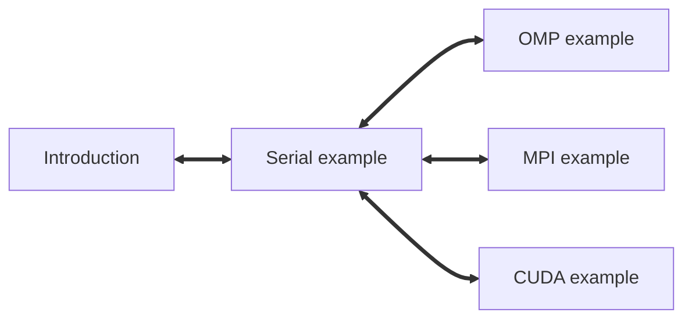

# Parallelism in Plumed2

This lesson is a pratical introduction (with some exercises with code to modify) to the parallel functionality of PLUMED for the developers.

The code is hosted [here](https://github.com/Iximiel/PlumedFlagship_parallelism). You can start from the [introduction](Readme.md), and then read the [serial example](Readme_Serial.md) that contains the base idea of the CV.

You can then navigate the three cases ([openMP](Readme_OMP.md), [MPI](Readme_MPI.md), [Cuda](Readme_CUDA.md)) in any order

NB: For this lesson the CV is presented with no explicit derivatives calculated.


<b><a href="https://www.plumed.org/doc-master/user-doc/html/actionlist/?actions=" target="_blank">Click here</a> to open manual pages for actions discussed in this tutorial.</b>

