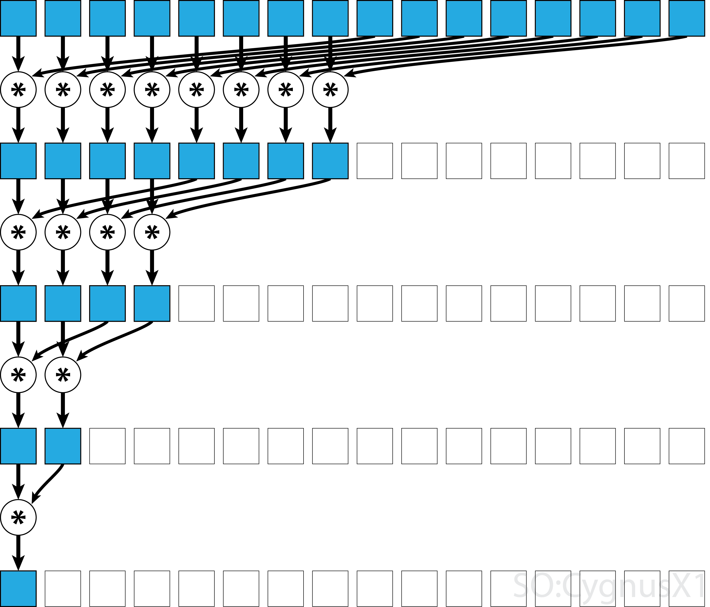

## EXTRA: GPU offloading with Cuda
To get the cuda code compiled I set up an ad hoc alternative to `plumed mklib`, that uses nvcc to compile the kernel and to link the shared object. The example is extremely simplified and should not be used in the real world as is, because it contains a collection of **bad ideas**.

The calculate insterface is simple:
```c++
void MyCoordination::calculate() {
  auto pos = getPositions();
  double ncoord = getCoordination(pos, R_0);
  setValue(ncoord);
}
```
it calls `getCoordination(pos, R_0)`, that is an interface to the kernel:
```c++
double getCoordination(std::vector<PLMD::Vector> positions, double R_0) {
  auto nat = positions.size();
  double *d_data;
  double *ncoords;
  cudaMalloc(&d_data, 3 * nat * sizeof(double));
  cudaMalloc(&ncoords, nat * sizeof(double));
  for (size_t i = 0; i < nat; i++) {
    cudaMemcpy(d_data + i * 3, &positions[i][0], 3 * sizeof(double),
               cudaMemcpyHostToDevice);
  }

  double Rsqr = R_0 * R_0;
  getCoord<<<1, nat>>>(d_data, ncoords, nat, Rsqr);
  reduction<<<1, nat / 2>>>(ncoords);
  double result;
  cudaMemcpy(&result, ncoords, sizeof(double), cudaMemcpyDeviceToHost);

  cudaFree(d_data);
  cudaFree(ncoords);
  return result;
}
```
there the data is initialized and loaded on the GPU with a combination of `cudaMalloc` and `cudaMemcpy` and then the two kernels are called with the `<<<NBlocks,threadPerBlock>>>` syntax.

Citing the Nvidia blog:
>A group of threads is called a CUDA block. CUDA blocks are grouped into a grid. A kernel is executed as a grid of blocks of threads.

Each thread execute the instructions in the kernel.

In this case we have a kernel for calculation the `ncoord` value of each atom:
```c
__global__ void getCoord(double *coordinates, double *coordination,
                         unsigned Nat, double Rsqr) {
  const int i = threadIdx.x + blockIdx.x; // * blockDim.x;
  double x = coordinates[3 * i];
  double y = coordinates[3 * i + 1];
  double z = coordinates[3 * i + 2];
  coordination[i] = 0.0;
  double dx, dy, dz;
  for (unsigned j = 0; j < Nat; j++) {
    if (i == j) {
      continue;
    }
    dx = x - coordinates[3 * j];
    dy = y - coordinates[3 * j + 1];
    dz = z - coordinates[3 * j + 2];
    if ((dx * dx + dy * dy + dz * dz) < Rsqr) {
      coordination[i] += 1.0;
    }
  }
}
```
You have to imagine that the kernel is more or less the body of the outer for loop of the previous examples and to get the outer index you have to check in which thread you are: `threadIdx` and `blockIdx` that contains the information about the index of the thread or of the block. In this case the kernel is called as a block of `nat` threads (and that is a very **bad idea**, since `nat` may be not a power of 2 or be bigger than the maximum number of thread avaiable in the gpu).

<details>
  <summary>EXTRA REMARKS</summary>
  
Also the kernel is made in order that can be called with `<<<1, nat>>>` or `<<<nat, 1>>>` without any error, due to the index bein calculated always as a sum `const int i = threadIdx.x + blockIdx.x;` that is `0+something` or `something+0`if the threads or the blocks are 1. This is a **bad idea**.
</details>

Then the coordination must be summed (in a very simple case like this it may be faster doing the process in for loop on the cpu) with a reduction algorithm:
```c
__global__ void reduction(double *input) {
  const int tid = threadIdx.x;
  auto step_size = 1;
  int number_of_threads = blockDim.x;
  while (number_of_threads > 0) {
    if (tid < number_of_threads) {// still alive?
      const auto fst = tid * step_size * 2;
      const auto snd = fst + step_size;
      input[fst] += input[snd];
    }
    step_size <<= 1;//multiplies by 2
    number_of_threads >>= 1;//divides by 2
  }
}
```
`blockDim` contains the number of thread in the block

The sum is made in pair to each element of the passed array and stored in one of the two used indexes of the array. And the operation is repeaded on half of the array, and so on until we are reduced to one element that is the result.

Visually the operation is the following:
<!-- source: https://riptutorial.com/cuda/topic/6566/parallel-reduction--e-g--how-to-sum-an-array-  -->


<details>
  <summary>HOMEWORK</summary>

the reduction algorithm does not return the correct result: why?

</details>

[back](Readme.md)

See also:
[serial](Readme_Serial.md) [openMP](Readme_OMP.md) [MPI](Readme_MPI.md) [Cuda](Readme_CUDA.md)
