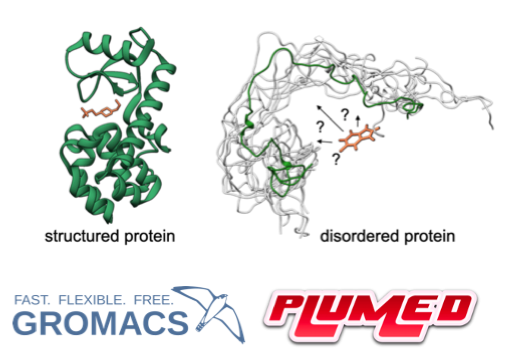
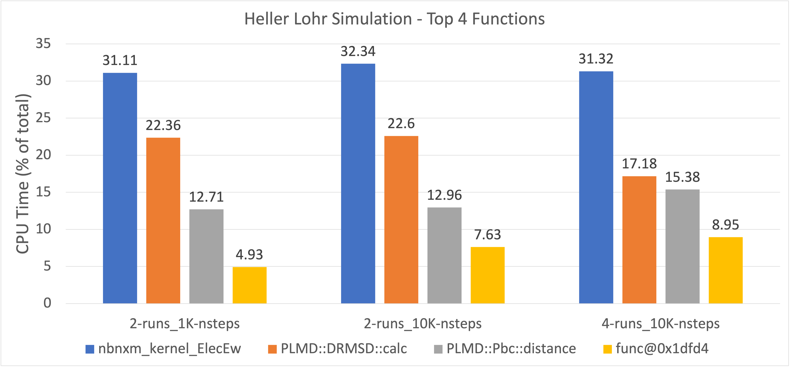
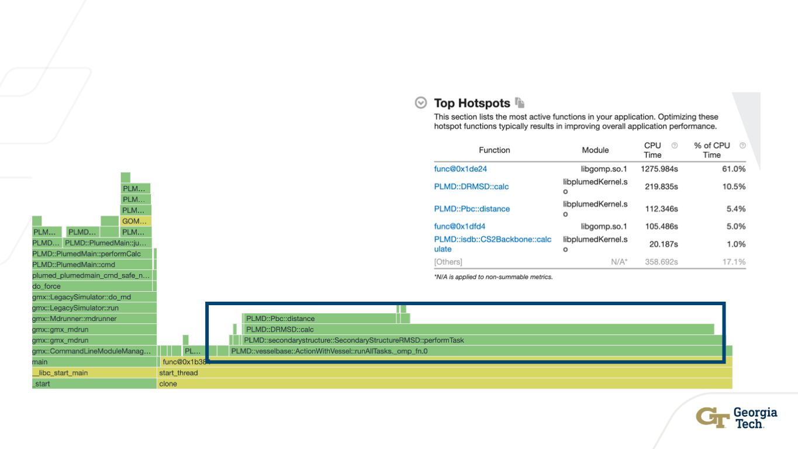
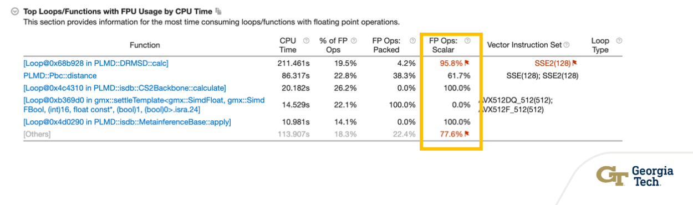
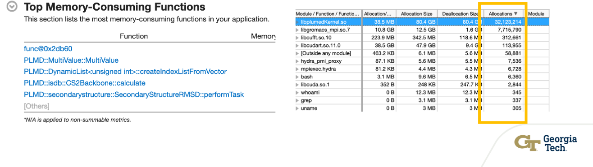
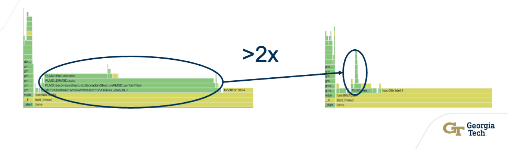

# Blog: Experience Accelerating Metainferencing Simulations Through Profiling


This blog shares our experience of trying to accelerate metainferencing simulations through profiling with the hope that it benefits anyone in the community who is interested in, or might benefit from, faster PLUMED simulations.

---

**Final outcome: ~2x faster simulations**

---

## Who we are?

We are members of the Scientific Software Engineering [(SSE)](https://ssecenter.cc.gatech.edu/) Center at Georgia Tech which is a new effort that is part of the Virtual Institute for Scientific Software [(VISS)](https://www.schmidtfutures.com/our-work/virtual-institute-for-scientific-software/). VISS was launched by Schmidt Futures to address the need for training and educating software engineers, and the SSE center at Georgia Tech is focused on developing new methodologies for improving high-performance scientific codes and for training tomorrow’s software engineers.

## Why did we investigate?

This work was performed as part of request to VISS by PIs - [Gabi Heller](https://scholar.google.com/citations?user=xB2BOkQAAAAJ&hl=en)  and [Thomas Löhr](https://scholar.google.com/citations?user=_FDAncsAAAAJ&hl=en)
The original expression of interest from PIs outlined how their metainferencing simulations using [GROMACS](https://gromacs.bioexcel.eu/) and [PLUMED](https://www.plumed.org/) were slowing down their scientific exploration. They observed that it seemed that the slowdown was severe when they used PLUMED, potentially due to lack of GPU support in PLUMED as Gromacs support for GPUs if fairly mature. PIs requested the addition of GPU support within PLUMED to reduce the time spend running simulations, thereby increasing the pace of scientific discovery.

## What we did?

1. Without prior experience, the first step we took was to identify a representative target simulation. PIs were gracious enough to share their work on [small molecule sequestration of amyloid-β as a drug discovery strategy for Alzheimer's disease](https://github.com/vendruscolo-lab/amyloid-beta_small_mol) as the target simulation. 

<p align="center">
    
</p>

2. We setup the simulation and profiled simulation on [Georgia Tech (GT) Rougues Gallery](https://crnch.gatech.edu/rogues-gallery/) to identify hotspots in PLUMED and that are amenable for GPU acceleration. [^1] 

3. We shared our [findings](Findings) with PLUMED team who suggested changes in the configuration options to run the exact same target simulations without requiring any GPU support. This gave us a new baseline to consider for GPU offloading as it led to ~2x faster simulations.

4. We reprofiled the target simulation with the suggested options and found that PLUMED overheads were infact not significant and thus, pointing to diminishing returns on effort of offloading it to GPUs. However, we were able to point to some additional opportunities for optimizations in PLUMED.

5. We verified the outcomes for a different (bigger) simulation and confirmed with PIs that this outcome indeed was significant. 

## What we discovered?
In this post, we provide details on how we got to a point of ~2x faster simulation. We used [Intel vTune](https://www.intel.com/content/www/us/en/developer/tools/oneapi/vtune-profiler.html) to carry our analysis.  

### Identified hotspots

**Hotspots on CPU only**: We started with CPU only hardware setup and profiled the simulation run to identify the hotspots. We discovered that there was a significant overhead from PLUMED (~35%) in the overall simulation runtime and 2 out of top 4 hotspot functions are PLUMED functions. 
<p align="center">
    
</p>

**Hotspots on GPU**: Next step was to verify if the same hotspots persist with Gromacs running with CUDA support and PLUMED on CPU. Although, the overall simulation was sped up by ~50%, our hotspot analysis pointed out that 3 out of 5 hotspots functions were PLUMED functions. Here is the snapshot of our observations: 

<p align="center">
    
</p>

However, we noted that the contribution of PLUMED overhead in simulation run time reduced from ~35% to ~23%. Moreover, we also performed hpc-performance and memory consumption analysis to discover that there were opportunities for optimizations in PLUMED specific to vectorization and memory allocations which can further reduce PLUMED overhead.

<p align="center">
    
    
</p>

### Towards a least disrup  tive solution

Before moving ahead with trying to blindly pursue PLUMED GPU offload (or the hotspot functions), we shared our findings with PLUMED team to get their take / feedback on these observations. While they did agree with our findings which we also verified with standalone metadynamics simulation - [simplemd](https://www.plumed.org/doc-master/user-doc/html/simplemd.html) from [PLUMED Testcenter](https://plumed-testcenter.github.io/browse.html), they also pointed out something interesting.

On discussion, it was apparent that there were some potential modifications on how the target metainferencing simulations were using PLUMED. Specifically, the target simulations were not using some of the techniques already available and well [documented](https://www.plumed.org/doc-v2.9/user-doc/html/_secondary.html):

1. **STRANDS-CUTOFF** for collective variables ANTIBETARMSD and PARABETARMSD 
2. **OPTIMAL-FAST** to change the metric used to calculate distance from ideal structure elements

We then used these options in the target simulation to see what impact do they have and also to get the correct baseline for considering GPU offload for PLUMED. Our overall observations can be summarized in the following table:

|             | Baseline | +STRANDS_CUTOFF=1 | + OPTIMAL-FAST |
|-------------|----------|-------------------|----------------|
|Elapsed time |259.7 s   |121.8s             |117.9s          |
|CPU Time     |30227.8s  |12923.2s           |12417.9s        |
|             |          | **~53%**              | **~55%**           |

<p align="center">
    
</p>

We then verified our observations with a larger system being simulated which was in its spirit similar to our target simulation. We observed that with larger simulation, the overhead of PLUMED was further reduced. This affirmed us that going forward when simulations are going to become larger, the overhead of PLUMED will reduce and overall benefit of offloading PLUMED to GPUs may deliver diminishing returns especially considering the effort and technical effort needed to achieve it.

### TL;DR 

To make your simulations go faster, we recommend using these options in your simulations. To use them, you can make modify you CVs (in CVs.dat for the target simulation) file to the line which specifies to ANTIBETARMSD and PARABETARMSD as follows:  

**Original**
```
PARABETARMSD RESIDUES=1-42 TYPE=DRMSD LESS_THAN={RATIONAL R_0=0.08 NN=8 MM=12} LABEL=par
ANTIBETARMSD RESIDUES=1-42 TYPE=DRMSD LESS_THAN={RATIONAL R_0=0.08 NN=8 MM=12} LABEL=anti
```

**Modified**
```
PARABETARMSD RESIDUES=1-42 TYPE=OPTIMAL-FAST LESS_THAN={RATIONAL R_0=0.08 NN=8 MM=12} LABEL=par STRANDS-CUTOFF=1
ANTIBETARMSD RESIDUES=1-42 TYPE=OPTIMAL-FAST LESS_THAN={RATIONAL R_0=0.08 NN=8 MM=12} LABEL=anti STRANDS-CUTOFF=1
```
## Reflections
Even though these observations are made on a specific hardware infrastructure and a specific kind of simulation, they are fairly general which should hold for other hardware and software setups except one may find different bottlenecks for their simulations. Based on these observations, it may or may not be beneficial to consider GPU offloading for PLUMED In future. 

Perhaps more importantly, the steps we took and our experience could help in you carrying out your own profiling and guide your future steps or optimizations you may need for your PLUMED simulations.


[^1]: Detailed instructions on running and profiling [link](https://github.gatech.edu/sse-center/plumed-investigation/blob/main/GETTINGSTARTED.md)

<b><a href="https://www.plumed.org/doc-master/user-doc/html/actionlist/?actions=" target="_blank">Click here</a> to open manual pages for actions discussed in this tutorial.</b>

