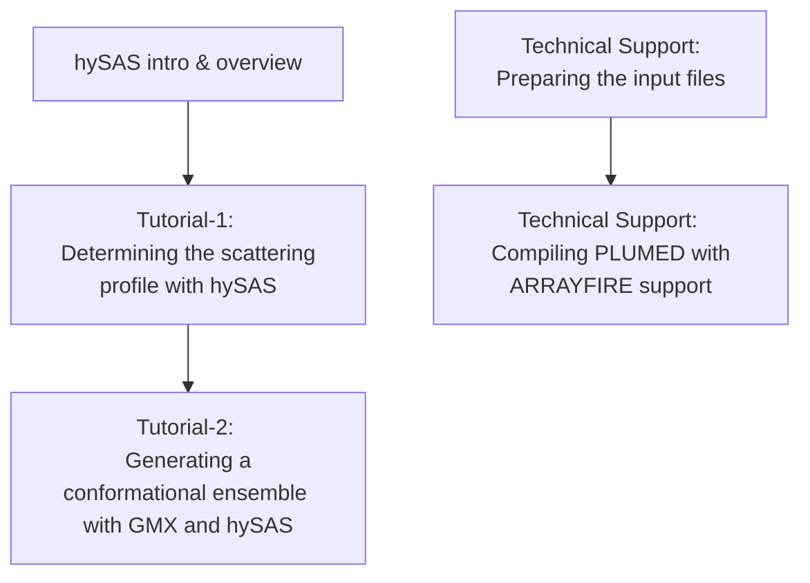

# hybrid Small Angle Scattering — hands-on guide

This guide is designed to provide users with practical advice on using the hySAS module. For theoretical information about the method, please refer to the related [manuscript](https://pubs.acs.org/doi/full/10.1021/acs.jctc.3c00864). The guide is divided into several sections:

#### [hySAS Intro & Overview](intro.md)
A brief introduction to the method, basic concepts, and an overview of the analyses that can be performed.

#### [Determining the Scattering Profile with hySAS](01.md)
From coordinates to a SAS curve: steps and examples to analyse a PDB file or a trajectory.

#### [Generating a Conformational Ensemble with GMX and hySAS](02.md)
Combining GROMACS and PLUMED to generate conformational ensembles restrained by SAS data using different coupling methods.

#### [Preparing the Input Files](input.md)
Guidelines and tips for preparing the input files.

#### [Compiling PLUMED with ARRAYFIRE Support](arrayfire.md)
Technical suggestions and a real-case example for installing PLUMED with ARRAYFIRE support on a SLURM-based HPC.


<b><a href="https://www.plumed.org/doc-master/user-doc/html/actionlist/?actions=PRINT,ENSEMBLE,STATS,GYRATION,BIASVALUE,SAXS,RESTRAINT,MOLINFO" target="_blank">Click here</a> to open manual pages for actions discussed in this tutorial.</b>

