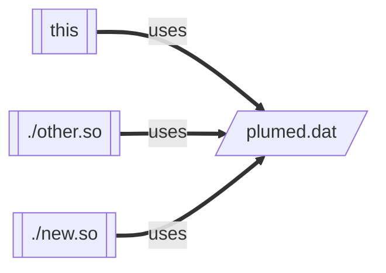
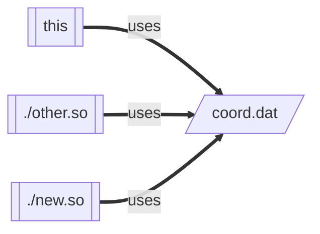
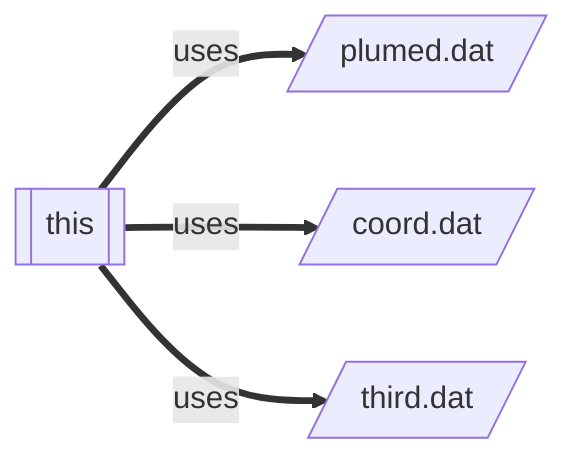
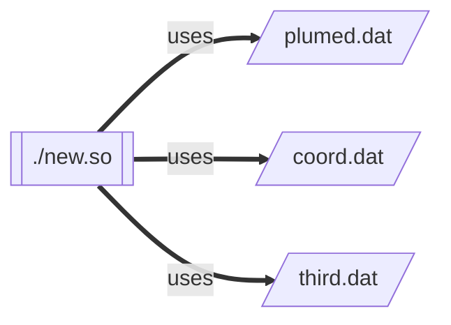
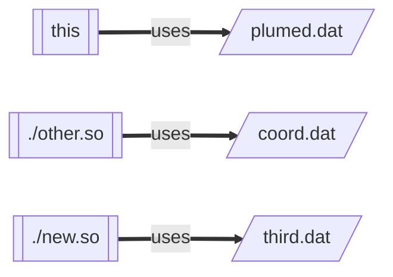
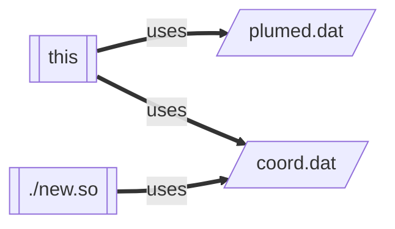
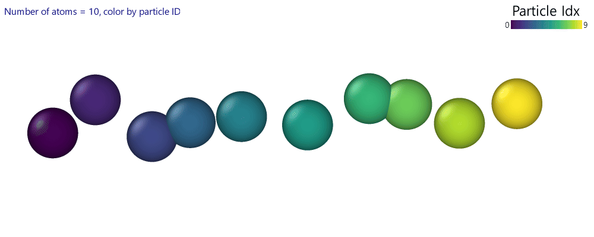
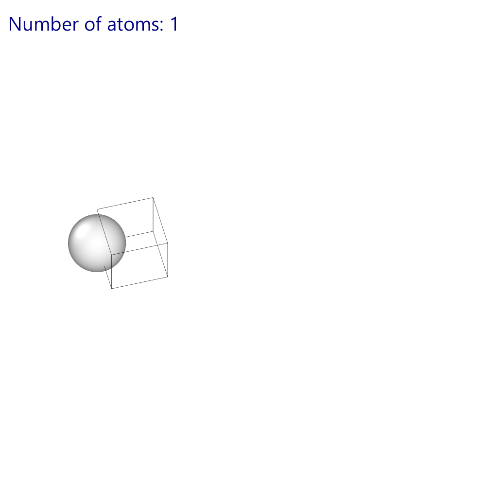
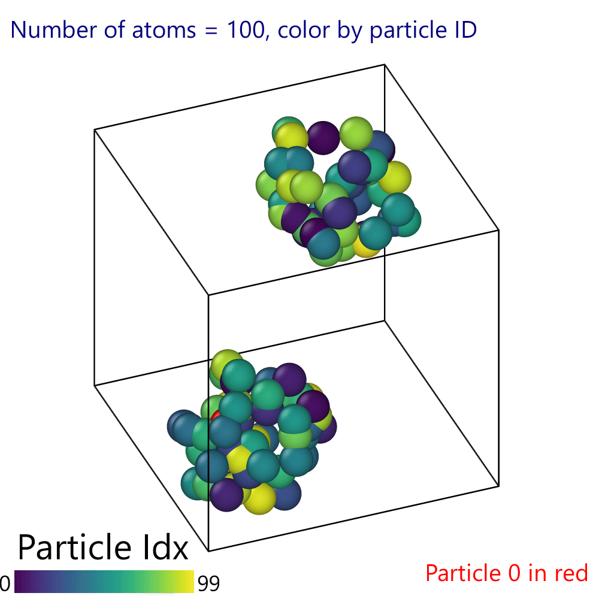

# Using plumed benchmark

## Options

Let's go through the options one by one,
By inputting  `plumed benchmark --help` in the terminal we get
```
Usage: benchmark [options] 


The following arguments are compulsory: 

               --plumed - ( default=plumed.dat ) colon separated path(s) to the input 
                          file(s) 
               --kernel - ( default=this ) colon separated path(s) to kernel(s) 
               --natoms - ( default=100000 ) the number of atoms to use for the 
                          simulation 
               --nsteps - ( default=2000 ) number of steps of MD to perform (-1 means 
                          forever) 
              --maxtime - ( default=-1 ) maximum number of seconds (-1 means forever) 
                --sleep - ( default=0 ) number of seconds of sleep, mimicking MD 
                          calculation 
    --atom-distribution - ( default=line ) the kind of possible atomic displacement 
                          at each step 

In addition you may use the following options: 

              --help/-h - ( default=off ) print this help 
 --domain-decomposition - ( default=off ) simulate domain decomposition, implies 
                          --shuffled 
             --shuffled - ( default=off ) reshuffle atoms 
      --dump-trajectory - dump the trajectory to this file
```

 - [`--plumed`](#input-files) is used to pass one or more input files to the benchmark
 - [`--kernel`](#kernels) is used to pass one or more plumed kernels
 - `--natoms` sets the number of atoms
 - `--nsteps` sets the number of steps
 - [`--maxtime`](#time-limit)  stops gracefully the benchmark after the a certain amount of time has elapsed.
 - `--sleep`  add a sleep timer during the loop, simulating an MD program doing its calculations
 - [`--atom-distribution`](#atom-distributions) chose between a few different kinds of atom distributions: "line", "cube", "sphere", "globs" and "sc"
 - [`--domain-decomposition`](#domain-decomposition-and-shuffled-atoms) emulates a domain decomposition and forces the `--shuffled` option
 - [`--shuffled`](#domain-decomposition-and-shuffled-atoms) shuffles the atom indexes
 - `--dump-trajectory` dumps the trajectory to a file


A few words on the execution order. 

When specifying more than 1 input file or more than 1 plumed kernels the benchmark will store more than one kernel-file combination (see below [here](#input-files),[here](#kernels) and [here](#combining---kernel-and---plumed)) and run the benchmark on each one of these.

Each benchmark step will compute the atomic distribution only once and then execute the plumed command chain with all the specified kernels, so if you ask for 100 steps and 5 kernels and/or 5 input files, your machine will run 500 plumed steps.

The order of execution of the kernel-file combinations is randomly determined at each benchmark step, this should remove skew due to the execution order.

In the following paragraphs, the more complex options are explained.

### Time limit

With `--maxtime` you can control how much time the benchmark will run for. This option is useful if you are using an HPC queue system as it ensures that the benchmark will exit gracefully and then produce the final output with the times report when the asked time has elapsed.

The input string is parsed by plumed, so you can even ask for "pi" seconds, or, on a more practical example you can ask for `--maxtime="60*5"` to ask for 5 minutes of benchmark. **Remember the quotes**, since the asterisk will be used as a wildcard by your shell.

### Input files

With `--plumed` we can specify a series of input files, column separated, like `--plumed "plumed.dat:coord.dat:third.dat"`,
without any other options this will run the "this" kernel as three separated instances against the 3 input files

#### Examples


>`plumed benchmark --kernel "this:./other.so:./new.so"`



>`plumed benchmark --kernel "this:./other.so:./new.so" --plumed "coord.dat"`




### Kernels
You can use the `--kernel` option to specify a series of **paths** to various libplumedKernel.so or "this", "this" is the kernel "bundled" with the plumed installation from which you are running plumed benchmark.
The benchmark will run the specified kernels (like `--kernel "this:./kenel1.so:../../src/lib/install/libplumedKernel.so`) against the specified plumed file.

If you have moved the kernels in the working directory please specify the kernel using `./kernelName.so`, as if you use `kernelName.so` plumed benchmark searches for the so file in the LD_LIBRARY_PATH and not in your local directory, usually this brings a crash, but if a library with the same name is in the LD_LIBRARY_PATH that will be loaded!.

#### Examples

>`plumed benchmark --plumed "plumed.dat:coord.dat:third.dat"`



>`plumed benchmark --kernel "./new.so" --plumed "plumed.dat:coord.dat:third.dat"`



### Combining --kernel and --plumed

You can specify multiple kernels **and** multiple input files together.
In this case, the number of kernels and input files must be equal: the kernel in the first position will be used with the file in the first position, the kernel in the second position will be used with the file in the second position and so on.

#### Examples

>`plumed benchmark --kernel "this:./other.so:./new.so" --plumed "plumed.dat:coord.dat:third.dat"`



>`plumed benchmark --kernel "this:this:./new.so" --plumed "plumed.dat:coord.dat:coord.dat"`



### Domain decomposition and shuffled atoms

The `--shuffled` option simply shuffles the indices of the atoms before starting the benchmark. This will force plumed to adopt a more complex communication with the "MD engine"

The `--domain-decomposition` option will emulate a domain decomposition from an MD engine. With this option the `--shuffled` option is forced

If the user wants to run a benchmark with more than 1 mpi threads (with `mpirun -np x plumed benchmark ...`) the `--domain-decomposition` option and the `--shuffled` options will be forced on automatically.


### Atom Distributions
When specifying `--atom-distribution` you can choose one among "line", "cube", "sphere", "globs" and "sc"

The atom distribution can be divided into two categories:
- standard: the base is that each atom is in a grid with each atom at a distance of 1 nm  (so that the atom radius is 0.5nm).
    - "line" the atoms are displaced in a line at 1nm from each other, then at each step they are displaced in a sphere or radius 0.5nm around the initial position
    - "sc" the atoms are displaced in a simple cubic crystal, as of the time of writing this there are no extra movements, the cube is always a perfect cube (1,8,27,64...) but it is filled bottom-up with the number of atoms requested 
 - Random distributions: the atoms are distributed uniformly with a density of 1 atom per nm^3 (the total volume is equal to the number of atoms). In these distributions, the atoms are randomly displaced in the available volume at each step, so they are **not** compatible with a neighbor list that updates every n>1 steps :
    - "sphere" the atoms are uniformly distributed in a sphere
    - "cube" the atoms are uniformly distributed in a cube
    - "globs" the atoms are uniformly distributed in two spheres


#### Examples
In the examples here the atoms are visualized with a radius of 0.5nm.

In the cube, sphere and globs example, atom 0 is highlighted in red to show that is randomly displaced at each step

##### line
The first 50 frames of a line with 10 atoms, the atoms are colored by their index to underline that they move around their initial position


##### sc
How the simple cubic system is made with the increasing number of atoms


#### cube


#### sphere


#### globs

