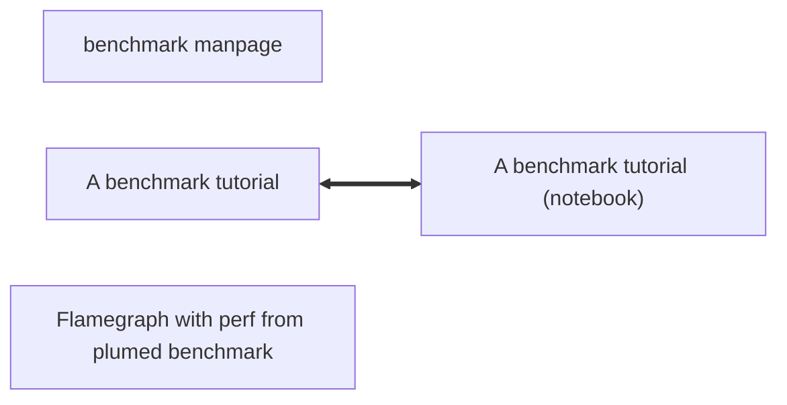

# How to use the plumed benchmark command

The lesson contains: 
- a [manual](README.md) for plumed benchmark
- a [small tutorial](Tutorial.md) in which I show how to measure and confront performances working with the COORDINATION action
- a small introduction to creating a [flame graph](Perf.md) from a plumed benchmark run.
- a [list of input files](Inputs.md) that we have used in the past when benchmarking PLUMED.

The tutorial has also a companion [notebook](Tutorial_notebook.ipynb), with all the scripts I used to make the images

You should try to follow the tutorial with the manual opened in a second tab.


<b><a href="https://www.plumed.org/doc-master/user-doc/html/actionlist/?actions=FLUSH,PRINT,COORDINATION" target="_blank">Click here</a> to open manual pages for actions discussed in this tutorial.</b>

