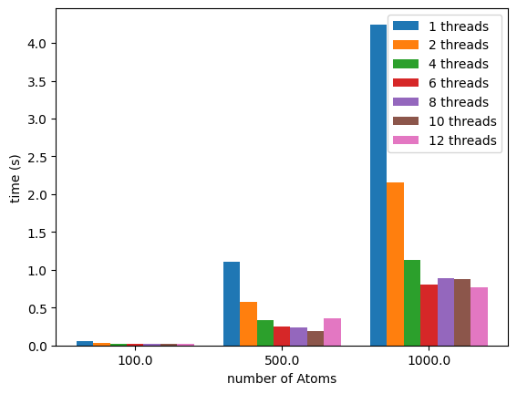
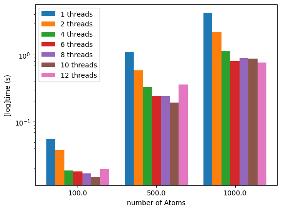
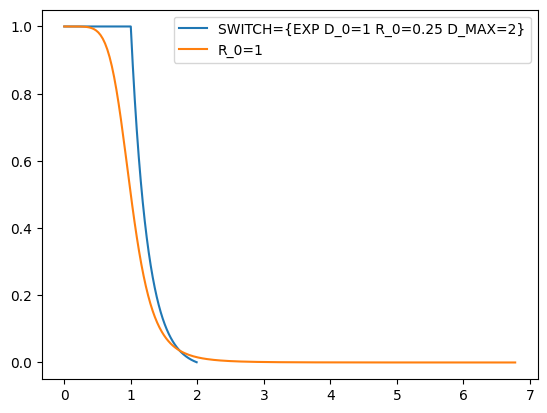
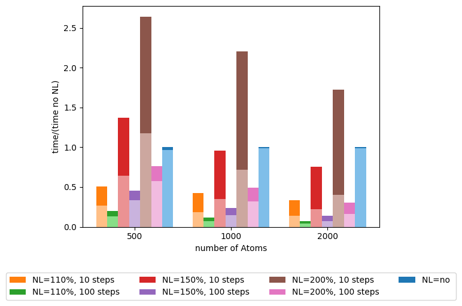

# A simple benchmark example


Now we'll get our hands dirty.

I will make a short demonstration only using the COORDINATION command in plumed, since it is available with a zero-configuration plumed.

We will use the following input as a base for the benchmark

<div class="plumedpreheader">
<div class="headerInfo" id="value_details_data/Tutorial.md_working_1.dat"> Click on the labels of the actions for more information on what each action computes </div>
<div class="containerBadge">
<div class="headerBadge"><a href="Tutorial.md_working_1.dat.plumed.stderr"></a></div>
<div class="headerBadge"><a href="Tutorial.md_working_1.dat.plumed_master.stderr"></a></div>
</div>
</div>
<pre class="plumedlisting">
<b name="data/Tutorial.md_working_1.datcpu" onclick='showPath("data/Tutorial.md_working_1.dat","data/Tutorial.md_working_1.datcpu","data/Tutorial.md_working_1.datcpu","brown")'>cpu</b>: <span class="plumedtooltip" style="color:green">COORDINATION<span class="right">Calculate coordination numbers. <a href="https://www.plumed.org/doc-master/user-doc/html/COORDINATION" style="color:green">More details</a><i></i></span></span> <span class="plumedtooltip">GROUPA<span class="right">First list of atoms<i></i></span></span>=<span class="plumedtooltip">@mdatoms<span class="right">refers to all the MD codes atoms but not PLUMEDs vatoms. <a href="https://www.plumed.org/doc-master/user-doc/html/specifying_atoms">Click here</a> for more information. <i></i></span></span> <span class="plumedtooltip">R_0<span class="right">The r_0 parameter of the switching function<i></i></span></span>=1

<span style="display:none;" id="data/Tutorial.md_working_1.datcpu">The COORDINATION action with label <b>cpu</b> calculates the following quantities:<table  align="center" frame="void" width="95%" cellpadding="5%"><tr><td width="5%"><b> Quantity </b>  </td><td><b> Description </b> </td></tr><tr><td width="5%">cpu.value</td><td>the value of the coordination</td></tr></table></span><span class="plumedtooltip" style="color:green">PRINT<span class="right">Print quantities to a file. <a href="https://www.plumed.org/doc-master/user-doc/html/PRINT" style="color:green">More details</a><i></i></span></span> <span class="plumedtooltip">ARG<span class="right">the labels of the values that you would like to print to the file<i></i></span></span>=* <span class="plumedtooltip">FILE<span class="right">the name of the file on which to output these quantities<i></i></span></span>=Colvar <span class="plumedtooltip">FMT<span class="right"> the format that should be used to output real numbers<i></i></span></span>=%8.4f <span class="plumedtooltip">STRIDE<span class="right"> the frequency with which the quantities of interest should be output<i></i></span></span>=1

<span style="display:none;" id="data/Tutorial.md_working_1.dat">The PRINT action with label <b></b> calculates something</span><span class="plumedtooltip" style="color:green">FLUSH<span class="right">This command instructs plumed to flush all the open files with a user specified frequency. <a href="https://www.plumed.org/doc-master/user-doc/html/FLUSH" style="color:green">More details</a><i></i></span></span> <span class="plumedtooltip">STRIDE<span class="right">the frequency with which all the open files should be flushed<i></i></span></span>=1
</pre>
  

I will also remove the  backups of the output files by using the command `export PLUMED_MAXBACKUP=0`

## First look at the output

```bash
plumed benchmark --nsteps=500 --natoms=500 --atom-distribution=sc > sc_500.out
```

The first lines of the output are a header with the information needed to reproduce the benchmark run:

```
BENCH:  Welcome to PLUMED benchmark
BENCH:  Using --kernel=this
BENCH:  Using --plumed=plumed.dat
BENCH:  Using --nsteps=500
BENCH:  Using --natoms=500
BENCH:  Using --maxtime=-1
BENCH:  Using --sleep=0
BENCH:  Using --atom-distribution=sc
BENCH:  Initializing the setup of the kernel(s)
```
The header makes it easier to reproduce and store the result of the benchmark.

The final lines contain the time information collected by the internal plumed timers.
For each kernel+input combination, we have the usual plumed time report plus a few lines that show if the cost of the analysis varies along the run.
```
BENCH:  Single run, skipping comparative analysis
BENCH:  
BENCH:  Kernel:      this
BENCH:  Input:       plumed.dat
BENCH:                                                Cycles        Total      Average      Minimum      Maximum
BENCH:  A Initialization                                   1     0.001484     0.001484     0.001484     0.001484
BENCH:  B0 First step                                      1     0.002423     0.002423     0.002423     0.002423
BENCH:  B1 Warm-up                                        99     0.244222     0.002467     0.002401     0.002930
BENCH:  B2 Calculation part 1                            200     0.498634     0.002493     0.002421     0.003136
BENCH:  B3 Calculation part 2                            200     0.498418     0.002492     0.002405     0.003284
PLUMED:                                               Cycles        Total      Average      Minimum      Maximum
PLUMED:                                                    1     1.244841     1.244841     1.244841     1.244841
PLUMED: 1 Prepare dependencies                           500     0.000224     0.000000     0.000000     0.000002
PLUMED: 2 Sharing data                                   500     0.001107     0.000002     0.000002     0.000021
PLUMED: 3 Waiting for data                               500     0.000278     0.000001     0.000000     0.000002
PLUMED: 4 Calculating (forward loop)                     500     1.235230     0.002470     0.002370     0.003254
PLUMED: 5 Applying (backward loop)                       500     0.000402     0.000001     0.000000     0.000005
PLUMED: 6 Update                                         500     0.004534     0.000009     0.000005     0.000056

```
Most of our conclusions will be taken from these parts of the output

## Benchmarking the COORDINATION with OpenMP



<div class="plumedpreheader">
<div class="headerInfo" id="value_details_data/Tutorial.md_working_2.dat"> Click on the labels of the actions for more information on what each action computes </div>
<div class="containerBadge">
<div class="headerBadge"><a href="Tutorial.md_working_2.dat.plumed.stderr"></a></div>
<div class="headerBadge"><a href="Tutorial.md_working_2.dat.plumed_master.stderr"></a></div>
</div>
</div>
<pre class="plumedlisting">
<b name="data/Tutorial.md_working_2.datcpu" onclick='showPath("data/Tutorial.md_working_2.dat","data/Tutorial.md_working_2.datcpu","data/Tutorial.md_working_2.datcpu","brown")'>cpu</b>: <span class="plumedtooltip" style="color:green">COORDINATION<span class="right">Calculate coordination numbers. <a href="https://www.plumed.org/doc-master/user-doc/html/COORDINATION" style="color:green">More details</a><i></i></span></span> <span class="plumedtooltip">GROUPA<span class="right">First list of atoms<i></i></span></span>=<span class="plumedtooltip">@mdatoms<span class="right">refers to all the MD codes atoms but not PLUMEDs vatoms. <a href="https://www.plumed.org/doc-master/user-doc/html/specifying_atoms">Click here</a> for more information. <i></i></span></span> <span class="plumedtooltip">SWITCH<span class="right">This keyword is used if you want to employ an alternative to the continuous switching function defined above. Options for this keyword are explained in the documentation for <a href="https://www.plumed.org/doc-master/user-doc/html/LESS_THAN">LESS_THAN</a>.<i></i></span></span>={EXP D_0=1 R_0=0.25 D_MAX=2}
<br/><span style="display:none;" id="data/Tutorial.md_working_2.datcpu">The COORDINATION action with label <b>cpu</b> calculates the following quantities:<table  align="center" frame="void" width="95%" cellpadding="5%"><tr><td width="5%"><b> Quantity </b>  </td><td><b> Description </b> </td></tr><tr><td width="5%">cpu.value</td><td>the value of the coordination</td></tr></table></span><span class="plumedtooltip" style="color:green">PRINT<span class="right">Print quantities to a file. <a href="https://www.plumed.org/doc-master/user-doc/html/PRINT" style="color:green">More details</a><i></i></span></span> <span class="plumedtooltip">ARG<span class="right">the labels of the values that you would like to print to the file<i></i></span></span>=* <span class="plumedtooltip">FILE<span class="right">the name of the file on which to output these quantities<i></i></span></span>=Colvar <span class="plumedtooltip">FMT<span class="right"> the format that should be used to output real numbers<i></i></span></span>=%8.4f <span class="plumedtooltip">STRIDE<span class="right"> the frequency with which the quantities of interest should be output<i></i></span></span>=1

<span style="display:none;" id="data/Tutorial.md_working_2.dat">The PRINT action with label <b></b> calculates something</span><span class="plumedtooltip" style="color:green">FLUSH<span class="right">This command instructs plumed to flush all the open files with a user specified frequency. <a href="https://www.plumed.org/doc-master/user-doc/html/FLUSH" style="color:green">More details</a><i></i></span></span> <span class="plumedtooltip">STRIDE<span class="right">the frequency with which all the open files should be flushed<i></i></span></span>=1
</pre>
  

```bash
for nt in 1 2 4 6 8 10 12; do
    export PLUMED_NUM_THREADS=$nt
    for nat in 100 500 1000; do
        plumed benchmark --nsteps=500 --natoms=$nat --atom-distribution=sc > sc_${nt}_${nat}.out
    done
done
```

My CPU has 6 physical cores but can execute 12 threads. By looking at all the possibilities we can see how plumed performs with different numbers of threads.

To extract the data we can use a bash script like:
```bash
for threads in 1 2 4 6 8 10 12; do
    {
    for natoms in 100 500 1000; do
        echo -n "$natoms "
        fname=sc_${threads}_${natoms}.out
        sed -n '/PLUMED: *Cycles *Total *Average *Minimum *Maximum/{n ; p}' "${fname}" |
            awk '{printf "%f ", $3}'
        echo ""
    done
    } > "times_${threads}.out"
done
```

and obtain for each set of threads (here with 6) a table like this :
```
100 0.021471 
500 0.308065 
1000 1.150924 
```

Using the following simple Python script:
```python
import matplotlib.pyplot as plt
import numpy as np
nthreads=[1,2,4,6,8,10,12]
simPerThread={}
for threads in nthreads:
    simPerThread[threads]=np.loadtxt(f"./run/times_{threads}.out")
fig,ax =plt.subplots()

ncols = len(simPerThread)
x = simPerThread[nthreads[0]][:,0]
x_coord=np.arange(len(x))
width = 0.8/ncols
ax.set_xticks(x_coord + width * 0.5 * (ncols - 1), x)

for multiplier, nt in enumerate(nthreads):
    offset = width * multiplier

    toplot = simPerThread[nt][:,1]
    ax.bar(
            x_coord + offset,
            toplot,
            width,
            label=f"{nt} threads",
        )
       
ax.legend()
ax.set_xlabel("number of Atoms")
ax.set_ylabel("time (s)")
```

We can then obtain:



If we use a logarithmic y-axis we can better visualize the timings for the the 100 atoms runs:


We can see how the number of threads can speed up the calculation. Using all the threads might not be a good idea if you are editing files or if you have a browser opened on the same computer.

## How to wrongly set up the neighbor list

<details>
<summary>The choice of the switching function</summary>

I choose `SWITCH={EXP D_0=1 R_0=0.25 D_MAX=2}` as a switching function not to demonstrate something physical, but to have a small cutoff and to use it with the neighbor list (NL), since only using R_0=1 will result in needing at least 6 nm of cutoff.



</details>

Computing the NL is costly, but the coordination calculation can be sped up considerably if the NL is set up correctly. 
The neighbor list operation compiles a list of atom pairs within the cutoff every `NL_STRIDE` steps, this makes the calculation of the coordination more efficient since it will be run on a subset of the total possible pairs of atoms.

`NL_STRIDE` should be set up with the system in mind: if the system is expected to show low atom mobility it is possible to choose a higher stride
In the following run we can see how the benchmark can help when choosing the correct settings for your analysis/run.

Now we prepare two series of inputs with the neighbor list cutoff at 110, 150 and 200% of `R_0`, and with `NL_STRIDE` set to 100 or 10 steps.

The files will be called `plumedNL%.dat`  and `plumedNL%_shortstride.dat`, for example `plumedNL200_shortstride.dat` will be:


<div class="plumedpreheader">
<div class="headerInfo" id="value_details_data/Tutorial.md_working_3.dat"> Click on the labels of the actions for more information on what each action computes </div>
<div class="containerBadge">
<div class="headerBadge"><a href="Tutorial.md_working_3.dat.plumed.stderr"></a></div>
<div class="headerBadge"><a href="Tutorial.md_working_3.dat.plumed_master.stderr"></a></div>
</div>
</div>
<pre class="plumedlisting">
<b name="data/Tutorial.md_working_3.datcpu" onclick='showPath("data/Tutorial.md_working_3.dat","data/Tutorial.md_working_3.datcpu","data/Tutorial.md_working_3.datcpu","brown")'>cpu</b>: <span class="plumedtooltip" style="color:green">COORDINATION<span class="right">Calculate coordination numbers. <a href="https://www.plumed.org/doc-master/user-doc/html/COORDINATION" style="color:green">More details</a><i></i></span></span> <span class="plumedtooltip">GROUPA<span class="right">First list of atoms<i></i></span></span>=<span class="plumedtooltip">@mdatoms<span class="right">refers to all the MD codes atoms but not PLUMEDs vatoms. <a href="https://www.plumed.org/doc-master/user-doc/html/specifying_atoms">Click here</a> for more information. <i></i></span></span> <span class="plumedtooltip">SWITCH<span class="right">This keyword is used if you want to employ an alternative to the continuous switching function defined above. Options for this keyword are explained in the documentation for <a href="https://www.plumed.org/doc-master/user-doc/html/LESS_THAN">LESS_THAN</a>.<i></i></span></span>={EXP D_0=1 R_0=0.25 D_MAX=2} <span class="plumedtooltip">NLIST<span class="right"> Use a neighbor list to speed up the calculation<i></i></span></span> <span class="plumedtooltip">NL_CUTOFF<span class="right">The cutoff for the neighbor list<i></i></span></span>=0.50 <span class="plumedtooltip">NL_STRIDE<span class="right">The frequency with which we are updating the atoms in the neighbor list<i></i></span></span>=10

<span style="display:none;" id="data/Tutorial.md_working_3.datcpu">The COORDINATION action with label <b>cpu</b> calculates the following quantities:<table  align="center" frame="void" width="95%" cellpadding="5%"><tr><td width="5%"><b> Quantity </b>  </td><td><b> Description </b> </td></tr><tr><td width="5%">cpu.value</td><td>the value of the coordination</td></tr></table></span><span class="plumedtooltip" style="color:green">PRINT<span class="right">Print quantities to a file. <a href="https://www.plumed.org/doc-master/user-doc/html/PRINT" style="color:green">More details</a><i></i></span></span> <span class="plumedtooltip">ARG<span class="right">the labels of the values that you would like to print to the file<i></i></span></span>=* <span class="plumedtooltip">FILE<span class="right">the name of the file on which to output these quantities<i></i></span></span>=Colvar <span class="plumedtooltip">FMT<span class="right"> the format that should be used to output real numbers<i></i></span></span>=%8.4f <span class="plumedtooltip">STRIDE<span class="right"> the frequency with which the quantities of interest should be output<i></i></span></span>=1

<span style="display:none;" id="data/Tutorial.md_working_3.dat">The PRINT action with label <b></b> calculates something</span><span class="plumedtooltip" style="color:green">FLUSH<span class="right">This command instructs plumed to flush all the open files with a user specified frequency. <a href="https://www.plumed.org/doc-master/user-doc/html/FLUSH" style="color:green">More details</a><i></i></span></span> <span class="plumedtooltip">STRIDE<span class="right">the frequency with which all the open files should be flushed<i></i></span></span>=1
</pre>
  

The script to run all the benchmarks looks like this:

```bash
export PLUMED_MAXBACKUP=0
export PLUMED_NUM_THREADS=8
for nat in 100 500 1000; do
    plumed benchmark --nsteps=500 \
        --natoms=$nat \
        --plumed="plumed.dat:plumedNL110_shortstride.dat:plumedNL150_shortstride.dat:plumedNL200_shortstride.dat" \
        --atom-distribution=sc > sc_NL_shortstride_${nat}.out

    plumed benchmark --nsteps=500 \
        --natoms=$nat \
        --plumed="plumed.dat:plumedNL110.dat:plumedNL150.dat:plumedNL200.dat" \
        --atom-distribution=sc > sc_NL_${nat}.out
done

```
The results obtained are:


In this image, the lighter part of each column is the time that plumed passes in the calculate() part of the analysis. And for each "number of atoms" the times are divided by the total time in the calculation without the NL.

As stated before the NL will reduce the number of computations done, but if set up incorrectly (too few steps between NL calculations or too much NL cutoff) it can hinder the performance.

This example mainly demonstrates the speedup and the costs of the NL: if you know your system an NL can be used to speed up the calculations significantly without changing the results.

There is something odd about this: see the notebook for some [details](Tutorial_notebook.ipynb#extra-cache)

<details>
  <summary>Script to produce the image</summary>


`plumed_bench_pp` is a python package (`pip install -U plumed-bench-pp`) that I wrote to speed up the post-processing of the result of the benchmark
```python
from plumed_bench_pp.parser import parse_full_benchmark_output
from plumed_bench_pp.tabulate import convert_to_table
from plumed_bench_pp.plot import plot_histo
import plumed_bench_pp.constants as plmdbppconst
import plumed_bench_pp.utils as plmdbpputils
import matplotlib.pyplot as plt
import numpy as np
nthreads=[1,2,4,6,8,10,12]

def lighten_color(color, amount=0.5):
    """
    Lightens the given color by multiplying (1-luminosity) by the given amount.
    Input can be matplotlib color string, hex string, or RGB tuple.

    Examples:
    >> lighten_color('g', 0.3)
    >> lighten_color('#F034A3', 0.6)
    >> lighten_color((.3,.55,.1), 0.5)
    """
    import matplotlib.colors as mc
    import colorsys

    try:
        c = mc.cnames[color]
    except:
        c = color
    c = colorsys.rgb_to_hls(*mc.to_rgb(c))
    return colorsys.hls_to_rgb(c[0], 1 - amount * (1 - c[1]), c[2])
benchmarks=[]

#preload the full files in memory
for atoms in [500, 1000, 2000]:
    with open(f"./run/sc_NL_all_{atoms}.out") as f:
        benchmarks.append(parse_full_benchmark_output(f.readlines()))

#extract the rows we want to plot from the preloaded files
rows_to_extract=[plmdbppconst.TOTALTIME,plmdbppconst.CALCULATE]
t=[]

for perc in [110, 150, 200]:
    t.append(convert_to_table(benchmarks,kernel="this",inputlist=f"plumedNL{perc}_shortstride.dat",rows_to_extract=rows_to_extract))
    t.append(convert_to_table(benchmarks,kernel="this",inputlist=f"plumedNL{perc}.dat",rows_to_extract=rows_to_extract))
t.append(convert_to_table(benchmarks,kernel="this",inputlist="plumed.dat",rows_to_extract=rows_to_extract))

#these are the label of the columns
NL=["110%, 10 steps" , "110%, 100 steps", "150%, 10 steps", "150%, 100 steps", "200%, 10 steps", "200%, 100 steps","no"]
#plot the histogram with a fancy layout
fig,ax =plt.subplots()
colors=[f"C{i}" for i in range(1,len(t))]+["C0"]
lc=[lighten_color(c) for c in colors]
plot_histo(ax,t,plmdbppconst.TOTALTIME, titles=[f"NL={nl} " for nl in NL],relative_to=-1,colors=colors) 
plot_histo(ax,t,plmdbppconst.CALCULATE, relative_to=-1, relative_to_row=plmdbppconst.TOTALTIME,colors=lc) 

ax.set_xlabel("number of Atoms")
ax.legend(ncols=4,loc="lower center", bbox_to_anchor=(0.5, -0.35))
ax.set_ylabel("time/(time no NL)")
```
  
</details>


#### Extra: NL and mobility

I have prepared an extra run just to show that if a system is too mobile a poorly calibrated NL could hurt the results.


```bash
plumed benchmark --nsteps=30 \
    --natoms=500 \
    --plumed="plumedCube.dat:plumedNL110Cube.dat" \
    --atom-distribution=cube >cube_500.out
```

This is of course an exaggerated situation, but here is the outcome of the run: 

| Time      | no NL     | with NL   |
|-----------|-----------|-----------|
| 0.000000  | 2793.8154 | 2793.8154 |
| 1.000000  | 2854.5198 | 260.2413  |
| 2.000000  | 2807.1155 | 243.2450  |
| 3.000000  | 2745.9334 | 241.3951  |
| 4.000000  | 2750.2184 | 262.4823  |
| 5.000000  | 2740.7679 | 252.7629  |
| 6.000000  | 2789.0852 | 247.3527  |
| 7.000000  | 2777.2453 | 263.9747  |
| 8.000000  | 2717.9418 | 249.0033  |
| 9.000000  | 2750.4339 | 266.5452  |
| 10.000000 | 2787.1510 | 2787.1510 |
| 11.000000 | 2729.6960 | 219.8660  |
| 12.000000 | 2769.4332 | 239.1089  |
| 13.000000 | 2800.0669 | 236.0175  |
| 14.000000 | 2821.9031 | 232.1127  |
| 15.000000 | 2795.2123 | 237.1388  |
| 16.000000 | 2772.5462 | 247.0777  |
| 17.000000 | 2718.8079 | 240.0205  |
| 18.000000 | 2878.6407 | 251.6854  |
| 19.000000 | 2707.2066 | 235.6310  |
| 20.000000 | 2702.6129 | 2702.6129 |
| 21.000000 | 2746.6672 | 224.0185  |
| 22.000000 | 2801.7203 | 257.2787  |
| 23.000000 | 2778.8634 | 215.8421  |
| 24.000000 | 2835.9103 | 236.1376  |
| 25.000000 | 2750.2037 | 234.6288  |
| 26.000000 | 2736.9416 | 255.8959  |
| 27.000000 | 2866.4852 | 241.4338  |
| 28.000000 | 2780.0264 | 257.7402  |
| 29.000000 | 2739.1195 | 259.7919  |

Since the NL is calculated every 10 steps and the atoms are always randomly displaced the results are correct only every 10 steps.
 
NB.: at the time of writing this, "sc" is not mobile at all, while "cube" randomly displaces all the atoms at each single step
