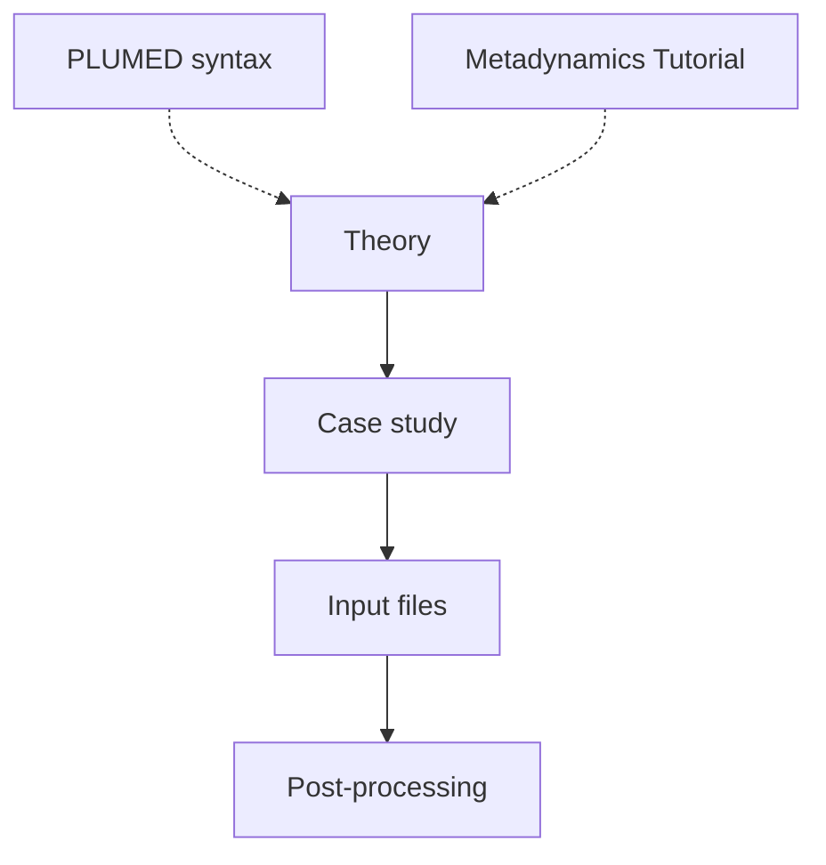

# VMetaD-tutorial
A tutorial to setup and run Volume-based Metadynamics simulations. The original work which explains the theory for Volume-based Metadynamics (VMetaD) is [this](https://doi.org/10.1021/acs.jpclett.9b01183). Some time later, in [this](https://doi.org/10.1021/acs.jctc.1c00649) paper we added some details (the RMSD restraining) which we will use in this tutorial.

This guide is divided in different sections

#### [Volume-based Metadynamics theory](theory.md)
A brief introduction to the rationale behind the use of VMetaD.

#### [Case study: L99A T4 Lysozyme:Benzene](lysozyme_benzene.md)
We will present the case study for this tutorial, a small engineered protein which binds benzene. We will use, to favor the possibility to test the method without that need of HPC resources, a simplified model called multi-eGO (more details [here](https://doi.org/10.26434/chemrxiv-2024-jcmgc)) which can run on laptop/workstation at the timescales of interest. 

#### [Input files preparation](input.md)
We will discuss all the preliminary steps to set up VMetaD, from the restraining potential size to the selection of the atoms that define the reference frame. We will also discuss all the PLUMED instructions to implement the method.

#### [Post-processing, reweighting and entropic correction](postprocessing.md)
Finally, we will discuss how to analyze the VMetaD files to get the binding free energy difference, reweighting the free energy surface on apt CVs. We will also discuss how to compute the entropic correction due to the presence of the restraining potential. 

___NB:___ This tutorial assumes that you know metadynamics theory and practice in PLUMED (if not, a good start can be the [PLUMED tutorial](https://www.plumed-tutorials.org/lessons/21/004/data/NAVIGATION.html) about it).


<b><a href="https://www.plumed.org/doc-master/user-doc/html/actionlist/?actions=CONVERT_TO_FES,WRAPAROUND,ONES,COM,ACCUMULATE,RMSD,FLUSH,POSITION,FIT_TO_TEMPLATE,WHOLEMOLECULES,KDE,GROUP,REWEIGHT_BIAS,RESTRAINT,HISTOGRAM,METAD,COORDINATION,UPPER_WALLS,MATHEVAL,READ,CUSTOM,PRINT,DUMPGRID" target="_blank">Click here</a> to open manual pages for actions discussed in this tutorial.</b>

