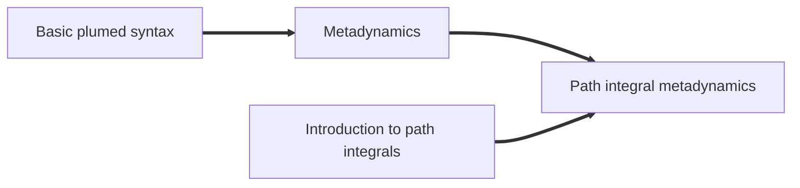

# Path integral metadynamics

Path integrals simulatins are able to describe the quantum thermodynamics
of distinguishable particles at finite temperature, and are the most accurate
approach to describe the behavior of light nuclei (e.g. hydrogen) at 
room temperature and above. 

They can be combined with metadynamics to accelerate the sampling of rare
events, and compute a "quantum free energies" that reflect (in an approximate
way) the effect of zero-point energy and tunneling on reaction rates. 

## Free-energy of the Zundel cation

This lecture provide a hands-on interactive tutorial (that you can also 
download and run locally) that uses the [i-PI code](http://ipi-code.org)
to perform path-integral simulations for the Zundel cation, a protonated
water dimer. PLUMED is used to compute appropriate collective variables,
using an input as follows



 Click on the labels of the actions for more information on what each action computes 

<pre class="plumedlisting">
# default units are LENGTH=nm ENERGY=kJ/mol TIME=ps
<b name="data/NAVIGATION.md_working_1.datdoo" onclick='showPath("data/NAVIGATION.md_working_1.dat","data/NAVIGATION.md_working_1.datdoo","data/NAVIGATION.md_working_1.datdoo","black")'>doo</b>The DISTANCE action with label <b>doo</b> calculates the following quantities:<table  align="center" frame="void" width="95%" cellpadding="5%"><tr><td width="5%"><b> Quantity </b>  </td><td width="5%"><b> Type </b>  </td><td><b> Description </b> </td></tr><tr><td width="5%">doo</td><td width="5%">scalar</td><td>the DISTANCE between this pair of atoms</td></tr></table>: DISTANCECalculate the distance/s between pairs of atoms. <a href="https://www.plumed.org/doc-master/user-doc/html/DISTANCE" style="color:green">More details</a><i></i> ATOMSthe pair of atom that we are calculating the distance between<i></i>=1,2 
<b name="data/NAVIGATION.md_working_1.datco1" onclick='showPath("data/NAVIGATION.md_working_1.dat","data/NAVIGATION.md_working_1.datco1","data/NAVIGATION.md_working_1.datco1_shortcut","blue")'>co1</b>The DISTANCES action with label <b>co1</b> calculates the following quantities:<table  align="center" frame="void" width="95%" cellpadding="5%"><tr><td width="5%"><b> Quantity </b>  </td><td width="5%"><b> Type </b>  </td><td><b> Description </b> </td></tr><tr><td width="5%">co1</td><td width="5%">vector</td><td>the DISTANCES between the each pair of atoms that were specified</td></tr><tr><td width="5%">co1_lessthan</td><td width="5%">scalar</td><td>the number of colvars that have a value less than a threshold</td></tr></table>: DISTANCESCalculate the distances between multiple piars of atoms This action is <a class="toggler" href='javascript:;' onclick='toggleDisplay("data/NAVIGATION.md_working_1.datco1");'>a shortcut</a>. <a href="https://www.plumed.org/doc-master/user-doc/html/DISTANCES">More details</a><i></i> GROUPACalculate the distances between all the atoms in GROUPA and all the atoms in GROUPB<i></i>=1 GROUPBCalculate the distances between all the atoms in GROUPA and all the atoms in GROUPB<i></i>=3-7 LESS_THANcalculate the number of variables that are less than a certain target value. Options for this keyword are explained in the documentation for <a href="https://www.plumed.org/doc-master/user-doc/html/LESS_THAN">LESS_THAN</a>.<i></i>={RATIONAL R_0=0.14}
# PLUMED interprets the command:
# co1: DISTANCES GROUPA=1 GROUPB=3-7 LESS_THAN={RATIONAL R_0=0.14}
# as follows (Click the red comment above to revert to the short version of the input):
<b name="data/NAVIGATION.md_working_1.datco1" onclick='showPath("data/NAVIGATION.md_working_1.dat","data/NAVIGATION.md_working_1.datco1","data/NAVIGATION.md_working_1.datco1","blue")'>co1</b>The DISTANCE action with label <b>co1</b> calculates the following quantities:<table  align="center" frame="void" width="95%" cellpadding="5%"><tr><td width="5%"><b> Quantity </b>  </td><td width="5%"><b> Type </b>  </td><td><b> Description </b> </td></tr><tr><td width="5%">co1</td><td width="5%">vector</td><td>the DISTANCE for each set of specified atoms</td></tr></table>: DISTANCECalculate the distance/s between pairs of atoms. <a href="https://www.plumed.org/doc-master/user-doc/html/DISTANCE" style="color:green">More details</a><i></i> ATOMS1the pair of atom that we are calculating the distance between<i></i>=1,3 ATOMS2the pair of atom that we are calculating the distance between<i></i>=1,4 ATOMS3the pair of atom that we are calculating the distance between<i></i>=1,5 ATOMS4the pair of atom that we are calculating the distance between<i></i>=1,6 ATOMS5the pair of atom that we are calculating the distance between<i></i>=1,7
<b name="data/NAVIGATION.md_working_1.datco1_lt" onclick='showPath("data/NAVIGATION.md_working_1.dat","data/NAVIGATION.md_working_1.datco1_lt","data/NAVIGATION.md_working_1.datco1_lt","blue")'>co1_lt</b>The LESS_THAN action with label <b>co1_lt</b> calculates the following quantities:<table  align="center" frame="void" width="95%" cellpadding="5%"><tr><td width="5%"><b> Quantity </b>  </td><td width="5%"><b> Type </b>  </td><td><b> Description </b> </td></tr><tr><td width="5%">co1_lt</td><td width="5%">vector</td><td>the vector obtained by doing an element-wise application of a function that is one if the input is less than a threshold to the input vectors</td></tr></table>: LESS_THANUse a switching function to determine how many of the input variables are less than a certain cutoff. <a href="https://www.plumed.org/doc-master/user-doc/html/LESS_THAN" style="color:green">More details</a><i></i> ARGthe values input to this function<i></i>=<b name="data/NAVIGATION.md_working_1.datco1">co1</b> SWITCHThis keyword is used if you want to employ an alternative to the continuous swiching function defined above<i></i>={RATIONAL R_0=0.14}
<b name="data/NAVIGATION.md_working_1.datco1_lessthan" onclick='showPath("data/NAVIGATION.md_working_1.dat","data/NAVIGATION.md_working_1.datco1_lessthan","data/NAVIGATION.md_working_1.datco1_lessthan","black")'>co1_lessthan</b>The SUM action with label <b>co1_lessthan</b> calculates the following quantities:<table  align="center" frame="void" width="95%" cellpadding="5%"><tr><td width="5%"><b> Quantity </b>  </td><td width="5%"><b> Type </b>  </td><td><b> Description </b> </td></tr><tr><td width="5%">co1_lessthan</td><td width="5%">scalar</td><td>the SUM of the elements in the input value</td></tr></table>: SUMCalculate the sum of the arguments <a href="https://www.plumed.org/doc-master/user-doc/html/SUM" style="color:green">More details</a><i></i> ARGthe vector/matrix/grid whose elements shuld be added together<i></i>=<b name="data/NAVIGATION.md_working_1.datco1_lt">co1_lt</b> PERIODICif the output of your function is periodic then you should specify the periodicity of the function<i></i>=NO
# --- End of included input --- <b name="data/NAVIGATION.md_working_1.datco2" onclick='showPath("data/NAVIGATION.md_working_1.dat","data/NAVIGATION.md_working_1.datco2","data/NAVIGATION.md_working_1.datco2_shortcut","blue")'>co2</b>The DISTANCES action with label <b>co2</b> calculates the following quantities:<table  align="center" frame="void" width="95%" cellpadding="5%"><tr><td width="5%"><b> Quantity </b>  </td><td width="5%"><b> Type </b>  </td><td><b> Description </b> </td></tr><tr><td width="5%">co2</td><td width="5%">vector</td><td>the DISTANCES between the each pair of atoms that were specified</td></tr><tr><td width="5%">co2_lessthan</td><td width="5%">scalar</td><td>the number of colvars that have a value less than a threshold</td></tr></table>: DISTANCESCalculate the distances between multiple piars of atoms This action is <a class="toggler" href='javascript:;' onclick='toggleDisplay("data/NAVIGATION.md_working_1.datco2");'>a shortcut</a>. <a href="https://www.plumed.org/doc-master/user-doc/html/DISTANCES">More details</a><i></i> GROUPACalculate the distances between all the atoms in GROUPA and all the atoms in GROUPB<i></i>=2 GROUPBCalculate the distances between all the atoms in GROUPA and all the atoms in GROUPB<i></i>=3-7 LESS_THANcalculate the number of variables that are less than a certain target value. Options for this keyword are explained in the documentation for <a href="https://www.plumed.org/doc-master/user-doc/html/LESS_THAN">LESS_THAN</a>.<i></i>={RATIONAL R_0=0.14}
# PLUMED interprets the command:
# co2: DISTANCES GROUPA=2 GROUPB=3-7 LESS_THAN={RATIONAL R_0=0.14}
# as follows (Click the red comment above to revert to the short version of the input):
<b name="data/NAVIGATION.md_working_1.datco2" onclick='showPath("data/NAVIGATION.md_working_1.dat","data/NAVIGATION.md_working_1.datco2","data/NAVIGATION.md_working_1.datco2","blue")'>co2</b>The DISTANCE action with label <b>co2</b> calculates the following quantities:<table  align="center" frame="void" width="95%" cellpadding="5%"><tr><td width="5%"><b> Quantity </b>  </td><td width="5%"><b> Type </b>  </td><td><b> Description </b> </td></tr><tr><td width="5%">co2</td><td width="5%">vector</td><td>the DISTANCE for each set of specified atoms</td></tr></table>: DISTANCECalculate the distance/s between pairs of atoms. <a href="https://www.plumed.org/doc-master/user-doc/html/DISTANCE" style="color:green">More details</a><i></i> ATOMS1the pair of atom that we are calculating the distance between<i></i>=2,3 ATOMS2the pair of atom that we are calculating the distance between<i></i>=2,4 ATOMS3the pair of atom that we are calculating the distance between<i></i>=2,5 ATOMS4the pair of atom that we are calculating the distance between<i></i>=2,6 ATOMS5the pair of atom that we are calculating the distance between<i></i>=2,7
<b name="data/NAVIGATION.md_working_1.datco2_lt" onclick='showPath("data/NAVIGATION.md_working_1.dat","data/NAVIGATION.md_working_1.datco2_lt","data/NAVIGATION.md_working_1.datco2_lt","blue")'>co2_lt</b>The LESS_THAN action with label <b>co2_lt</b> calculates the following quantities:<table  align="center" frame="void" width="95%" cellpadding="5%"><tr><td width="5%"><b> Quantity </b>  </td><td width="5%"><b> Type </b>  </td><td><b> Description </b> </td></tr><tr><td width="5%">co2_lt</td><td width="5%">vector</td><td>the vector obtained by doing an element-wise application of a function that is one if the input is less than a threshold to the input vectors</td></tr></table>: LESS_THANUse a switching function to determine how many of the input variables are less than a certain cutoff. <a href="https://www.plumed.org/doc-master/user-doc/html/LESS_THAN" style="color:green">More details</a><i></i> ARGthe values input to this function<i></i>=<b name="data/NAVIGATION.md_working_1.datco2">co2</b> SWITCHThis keyword is used if you want to employ an alternative to the continuous swiching function defined above<i></i>={RATIONAL R_0=0.14}
<b name="data/NAVIGATION.md_working_1.datco2_lessthan" onclick='showPath("data/NAVIGATION.md_working_1.dat","data/NAVIGATION.md_working_1.datco2_lessthan","data/NAVIGATION.md_working_1.datco2_lessthan","black")'>co2_lessthan</b>The SUM action with label <b>co2_lessthan</b> calculates the following quantities:<table  align="center" frame="void" width="95%" cellpadding="5%"><tr><td width="5%"><b> Quantity </b>  </td><td width="5%"><b> Type </b>  </td><td><b> Description </b> </td></tr><tr><td width="5%">co2_lessthan</td><td width="5%">scalar</td><td>the SUM of the elements in the input value</td></tr></table>: SUMCalculate the sum of the arguments <a href="https://www.plumed.org/doc-master/user-doc/html/SUM" style="color:green">More details</a><i></i> ARGthe vector/matrix/grid whose elements shuld be added together<i></i>=<b name="data/NAVIGATION.md_working_1.datco2_lt">co2_lt</b> PERIODICif the output of your function is periodic then you should specify the periodicity of the function<i></i>=NO
# --- End of included input --- <b name="data/NAVIGATION.md_working_1.datdc" onclick='showPath("data/NAVIGATION.md_working_1.dat","data/NAVIGATION.md_working_1.datdc","data/NAVIGATION.md_working_1.datdc","black")'>dc</b>The COMBINE action with label <b>dc</b> calculates the following quantities:<table  align="center" frame="void" width="95%" cellpadding="5%"><tr><td width="5%"><b> Quantity </b>  </td><td width="5%"><b> Type </b>  </td><td><b> Description </b> </td></tr><tr><td width="5%">dc</td><td width="5%">scalar</td><td>a linear compbination</td></tr></table>: COMBINECalculate a polynomial combination of a set of other variables. <a href="https://www.plumed.org/doc-master/user-doc/html/COMBINE" style="color:green">More details</a><i></i> ARGthe values input to this function<i></i>=<b name="data/NAVIGATION.md_working_1.datco1">co1.lessthan</b>,<b name="data/NAVIGATION.md_working_1.datco2">co2.lessthan</b> COEFFICIENTS the coefficients of the arguments in your function<i></i>=1,-1 PERIODICif the output of your function is periodic then you should specify the periodicity of the function<i></i>=NO
<b name="data/NAVIGATION.md_working_1.datmtd" onclick='showPath("data/NAVIGATION.md_working_1.dat","data/NAVIGATION.md_working_1.datmtd","data/NAVIGATION.md_working_1.datmtd","black")'>mtd</b>The METAD action with label <b>mtd</b> calculates the following quantities:<table  align="center" frame="void" width="95%" cellpadding="5%"><tr><td width="5%"><b> Quantity </b>  </td><td width="5%"><b> Type </b>  </td><td><b> Description </b> </td></tr><tr><td width="5%">mtd.bias</td><td width="5%">scalar</td><td>the instantaneous value of the bias potential</td></tr></table>:   METADUsed to performed metadynamics on one or more collective variables. <a href="https://www.plumed.org/doc-master/user-doc/html/METAD" style="color:green">More details</a><i></i> ARGthe labels of the scalars on which the bias will act<i></i>=<b name="data/NAVIGATION.md_working_1.datdoo">doo</b>,<b name="data/NAVIGATION.md_working_1.datdc">dc</b> PACEthe frequency for hill addition<i></i>=10 SIGMAthe widths of the Gaussian hills<i></i>=0.005,0.05 HEIGHTthe heights of the Gaussian hills<i></i>=4 FILE a file in which the list of added hills is stored<i></i>=HILLS-pimd BIASFACTORuse well tempered metadynamics and use this bias factor<i></i>=10 TEMPthe system temperature - this is only needed if you are doing well-tempered metadynamics<i></i>=300
<b name="data/NAVIGATION.md_working_1.datuwall" onclick='showPath("data/NAVIGATION.md_working_1.dat","data/NAVIGATION.md_working_1.datuwall","data/NAVIGATION.md_working_1.datuwall","black")'>uwall</b>The UPPER_WALLS action with label <b>uwall</b> calculates the following quantities:<table  align="center" frame="void" width="95%" cellpadding="5%"><tr><td width="5%"><b> Quantity </b>  </td><td width="5%"><b> Type </b>  </td><td><b> Description </b> </td></tr><tr><td width="5%">uwall.bias</td><td width="5%">scalar</td><td>the instantaneous value of the bias potential</td></tr><tr><td width="5%">uwall.force2</td><td width="5%">scalar</td><td>the instantaneous value of the squared force due to this bias potential</td></tr></table>: UPPER_WALLSDefines a wall for the value of one or more collective variables, <a href="https://www.plumed.org/doc-master/user-doc/html/UPPER_WALLS" style="color:green">More details</a><i></i> ARGthe arguments on which the bias is acting<i></i>=<b name="data/NAVIGATION.md_working_1.datdoo">doo</b> ATthe positions of the wall<i></i>=0.4 KAPPAthe force constant for the wall<i></i>=250

PRINTPrint quantities to a file. <a href="https://www.plumed.org/doc-master/user-doc/html/PRINT" style="color:green">More details</a><i></i> ARGthe labels of the values that you would like to print to the file<i></i>=<b name="data/NAVIGATION.md_working_1.datdoo">doo</b>,<b name="data/NAVIGATION.md_working_1.datco1">co1.*</b>,<b name="data/NAVIGATION.md_working_1.datco2">co2.*</b>,<b name="data/NAVIGATION.md_working_1.datdc">dc</b>,<b name="data/NAVIGATION.md_working_1.datmtd">mtd.*</b>,<b name="data/NAVIGATION.md_working_1.datuwall">uwall.*</b> STRIDE the frequency with which the quantities of interest should be output<i></i>=10 FILEthe name of the file on which to output these quantities<i></i>=COLVAR-pimd
The PRINT action with label <b></b> calculates somethingFLUSHThis command instructs plumed to flush all the open files with a user specified frequency. <a href="https://www.plumed.org/doc-master/user-doc/html/FLUSH" style="color:green">More details</a><i></i> STRIDEthe frequency with which all the open files should be flushed<i></i>=1
</pre>
  

Depending on your previous experience, you may want to follow the 
lessons on metadynamics, and the external tutorial on path integral
simulations.


<b><a href="https://www.plumed.org/doc-master/user-doc/html/actionlist/?actions=METAD,PRINT,DISTANCES,DISTANCE,SUM,LESS_THAN,COMBINE,UPPER_WALLS,FLUSH" target="_blank">Click here</a> to open manual pages for actions discussed in this tutorial.</b>

