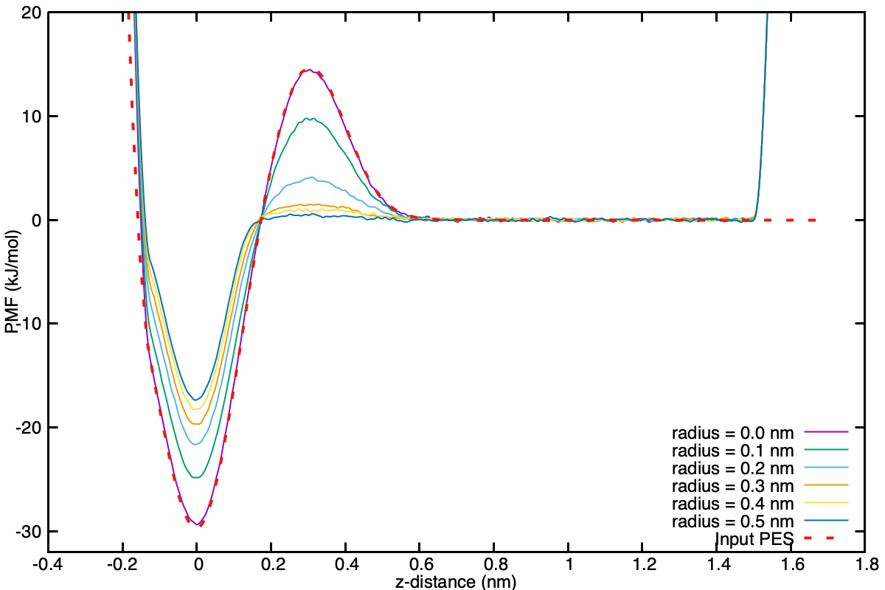

For your benefit the [repository](https://github.com/blake-armstrong/binding-tutorial-PLUMED/) contains a directory called `reference_data` which contains all of the outputs that are produced from the [running your simulations](inputs.md) section. If for some reason you can't or don't want to run the simulations yourself, you can use the raw data provided for analysis, or look at the analysis that is also included.

<h3>Installations</h3>

Before proceeding with the analysis, the script `mtd_analysis.py` requires a couple of Python packages to be installed. Run the following command to install them into your conda environment:

```
conda install pandas lmfit
```

<h3>Analysis</h3>


Once your simulations have finished the BIAS directory will contain all of your HILLS files. If you see any `bck.HILLS.x` it is because there were already HILLS files in the BIAS directory when the simulation began, and were moved to backup before beginning to prevent overwriting them.

In each `data/radius_0.x` directory you will find an 'analysis.sh' file. Running the command `bash analysis.sh` will do the following:

```
tmp=$(plumed kt --temp 300 | awk '{print $11" " $12}')
echo "kBT is ${tmp}"
kt=$(echo ${tmp} | awk '{print $1}')
```
This section will grab the value of $k_BT$ at 300 K using the PLUMED command line tool. This value is required when producing the PMF.

```
cat BIAS/HILLS* > HILLS
```
Here all of the `HILLS.x` files in the `BIAS` directory will be concatenated together to produce one main HILLS file.

```
plumed sum_hills --hills HILLS --mintozero --kt ${kt} --outfile fes_1D.dat
```
Here we use the `sum_hills` tool to process the combined HILLS file and produce the one dimensional PMF. We manually pass in the value of kt and tell PLUMED to translate the profile such that the minimum becomes zero.

```
python3 ../../scripts/mtd_analysis.py fes_1D.dat 14473.0 300 ${radius} | tee dG.dat
```
This Python script will perform the analysis described in the [theory section](theory.md), taking the file containing the 1D PMF, the spring constant and radius for the flat-bottom cylindrical restraint, and the temperature as input. To demonstrate this for the case of radius_0.0, once completed it will print the following to the screen (and written to the file `dG.dat`):

```
---------------------- Binding Energy ---------------------
FES Filename   : fes_1D.dat
Spring constant: 14473.0000000000 kJ / mol / nm^2
Cylinder radius: 0.0000000000 nm
Temperature    : 300.0000000000 K
  kBT          : 2.4943387854 kJ/mol
Integral limits:
 Bound         : -0.5000000000 - 0.3000000000 nm
 Unbound       : 0.3000000000 - 1.4000000000 nm
Standard volume: 1.6610000000 nm^3
Potential energy surface aligned to unbound region in file aligned_fes.dat
Unbound volume : 0.0011911582 nm^3
-----------------------------------------------------------
Binding free energy (dG)        :      23.08 kJ/mol
Volume correction   (dG)        :     -18.06 kJ/mol
Total corrected free energy (dG):       5.02 kJ/mol
-----------------------------------------------------------
--------------------- Bound correction --------------------
Fit limits:
 Lower         : -0.1500000000 nm
 Upper         : 0.1500000000 nm
Fitted spring constant: 2266.6153171129 kJ / mol / nm^2
Harmonic fit written to fit_harmonic.dat
Estimated unrestrained bound volume: 0.0005749581 nm^3
Estimated restrained bound volume: 0.0000900441 nm^3
-----------------------------------------------------------
Estimated volume correction free energy (dG):       4.62 kJ/mol
-----------------------------------------------------------
Final corrected binding free energy:       9.65 kJ/mol
```

The first section, "Binding Energy", has computed the binding free energy $\Delta G_{PMF}$ as 23.08 kJ/mol using a set of hard-coded boundaries (which can be modified if desired). The volume correction free energy $\Delta G_V$ for the unbound region is computed to be -18.06 kJ/mol from an unbound volume of 0.0006497226 nm^3. Combining these two give a total correction of 5.02 kJ/mol. This script also writes out the PMF with the unbound region aligned to zero (`aligned_fes.dat`), making comparison with other radii easier.

The final correction for the bound volume explored $\Delta G_R$ is usually performed with alchemical free energy perturbation, however, in this simple system we make an analytical estimate, which is presented as 4.62 kJ/mol in the "Bound Correction" section of the output. Briefly, the analytical estimate works by fitting a harmonic potential to the minimum produced by the Gaussian and using that to compute an estimate of the unrestrained bound volume using the equation for the volume of a 3D harmonic oscillator in the [theory section](theory.md). This fit is written to `fit_harmonic.dat`. The volume of the restrained bound volume is then estimated using the equations for the area of a 2D harmonic oscillator (for the area in the xy plane) and the length for a 1D harmonic oscillator (to estimate the height of the restrained cylinder along z using the fit). The ratio of these two produce a free energy correction very similar to that produced by alchemical methods. In the case of radii greater than zero, the restrained bound volume is greater than the unrestrained bound volume, resulting in a free energy correction of 0 kJ/mol for the removal of the cylindrical restraint.

Combing $\Delta G_{PMF}$, $\Delta G_V$ and $\Delta G_R$ produces a final standard binding free energy of 9.65 kJ/mol. This value should be the same for every radius (to within $k_BT$), given the entire unbound volume is sampled completely.

Included below is a table of the standard binding free energies as a function of the radius of the flat-bottom cylindrical harmonic restraint.

| Radius (nm)   | $\Delta G_{PMF}$ (kJ/mol) | $\Delta G_{V}$ (kJ/mol) | $\Delta G_{R}$ (kJ/mol)  | $\Delta G^{⦵}$ (kJ/mol) |
| :--------: | :-------: | :--------: | :--------: | :-------: |
|0.0 | 23.08 | -18.06 | 4.62 | 9.65 |
|0.1 | 18.74 | -8.89 | 0.00 | 9.85 |
|0.2 | 15.39 | -5.80 | 0.00 | 9.59 |
|0.3 | 13.32 | -3.91 | 0.00 | 9.41 |
|0.4 | 11.82 | -2.54 | 0.00 | 9.28 |
|0.5 | 10.75 | -1.47 | 0.00 | 9.28 |


Qualitatively, one can see the agreement to within $k_BT$. A keen student might feel inclined to run replicates and perform a statistical analysis to quantitatively show that they are in agreement, but that is left as further work and not performed here.

A simple gnuplot script for visualising the PMFs of the different radii all together has been provided as `scripts/fes.gnuplot`. Once the simulations have all run the data can be visualised as follow:

```
cp scripts/fes.gnuplot data/
gnuplot fes.gnuplot
display fes_radiuses.png
```
<figure>
<p align="center" >
<a href="link">
</a></p>
<figcaption>One-dimensional PMFs (aligned to the unbound region) as a function of the radius of the flat-bottom cylindrical restraining potential, and how they compared to the input potential energy surface (shown with the dashed red line). This representation highlights how the relative stability of the bound region to the unbound region decreases with increasing radius. The dissolution barrier decreases with increasing radius, as the ligand can more freely move around the barrier in the x and y directions. </figcaption>
</figure>

This figure makes apparent how the height of the free energy barrier is dependent on the radius of the cylinder, and why it is important to be able to use large flat-bottom cylinders when performing actual binding simulations when the barriers are of interest.

---

[Back to binding tutorial main page.](../NAVIGATION.md)
