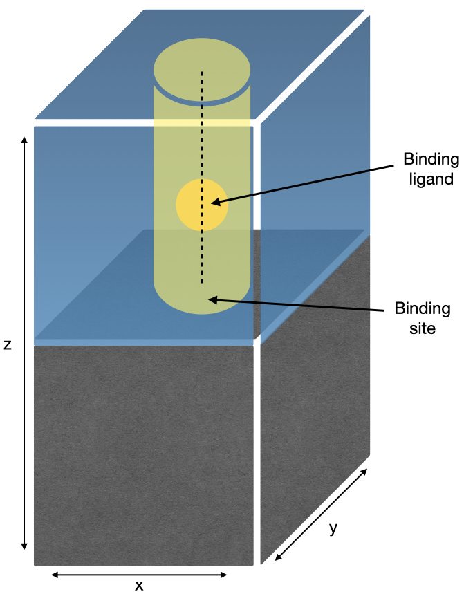
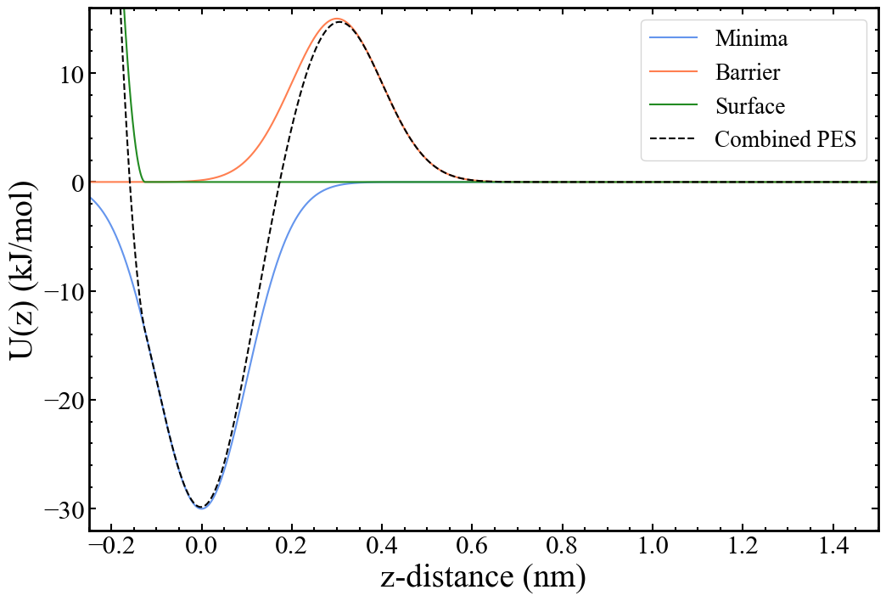

There are many situations where binding processes and their thermodynamics are important; some of the more well-known examples including protein-ligand docking, interfacial chemistry and crystal growth. The model system described herein will aim to reproduce a typical simulation of crystal growth, though is also representative of other binding processes that occur via a species moving along a Cartesian direction. Crystal growth is the process by which matter, typically in the form of ions and/or molecules will diffuse from solution and add to the surface of a crystal at the interface. The intricacies and details of this process will ultimately govern the shape and properties of the final crystal. Common examples include biomineralisation processes where organic impurities inhibit and modify the growth of ionic crystals and industrial crystallisation where chemical modifiers are used to prevent the growth of needle-like crystals that are difficult to work with and have unfavourable properties.

Atomistic simulation of the above processes can give us insight into how to exert highly specific control over crystals to produce materials with finely-tuned properties. Ideally, we aim to obtain free energy profiles of the binding process that are correct not only for the bound and unbound states, but also along the whole pathway for binding, including the transition state region. Accurate barrier heights will provide a good starting point for estimating kinetic processes and paving the way for larger-scale coarse-grained and Monte Carlo simulation methods.

This tutorial will take a simple system consisting of a surface in the xy-plane, with a binding ligand restrained along the z-direction, as shown below:

<figure>

<figcaption>Simplistic representation of a system used in molecular dynamics simulations to model the binding of a ligand to a surface. The surface has been created in the xy-plane. The yellow cylinder represents the cylindrical harmonic restraint applied to the ligand. The binding ligand can freely move in the z-direction, which is used as the collective variable in the Metadynamics runs.</figcaption>
</figure>

A system containing one atom of argon with a global potential energy surface aimed to reproduce the important parts of an actual surface-binding profile has been constructed. Specifically, one would expect there to be a minimum at the binding site, produced by attractive interactions between surface and adsorbate. Also, there would likely be a barrier between the binding site and solution, caused by overcoming the attractive forces with the surface, and by moving through any ordered and slow-to-diffuse solvent on the surface. Lastly, there needs to be a restraining potential acting on the binding ligand to mimic the effects of the surface itself, i.e., to prevent the binding ligand from moving into where the surface would be. The resulting potential energy surface looks as follows:

<figure>

<figcaption>One-dimensional representation of the model binding potential energy surface created through the use of two Gaussians and a one-sided harmonic wall. In detail, an inverted three-dimensional Gaussian with a height of 30 kJ/mol is placed at the centre of the box to create the minimum (blue); another three-dimensional Gaussian with height 15 kJ/mol is placed 0.3 nm away in the z-direction to mimic a barrier to dissolution (orange); and a one-sided harmonic wall is placed at -0.125 nm relative to the minimum to act as the repulsive surface region (green). The combined potential energy surface is shown using the dotted black line.  </figcaption>
</figure>

The details of how the potential energy surface is implemented in PLUMED are discussed in the [input files](inputs.md) section. We are avoiding simulating a binding process to an actual surface in the presence of a solvent in an attempt to produce a simple tutorial free of excessive and/or complicated files which can be performed on virtually any hardware at reasonable speeds. However, all of the underlying principles remain the same for a real system.

---

[Back to binding tutorial main page.](../NAVIGATION.md)
