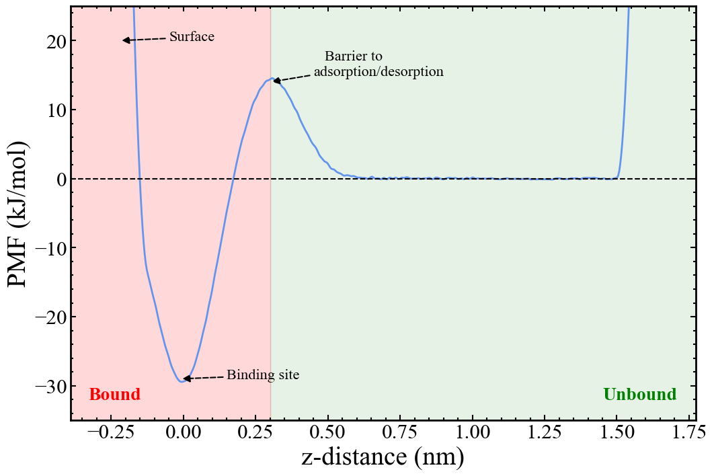

The in-depth underlying theory for obtaining standard binding free energies is explained in the original paper by Doudou <em>et al.</em> (1). However, a brief summary is given below.

Given a system containing a surface, interface or arbitrary binding site, a collective variable is defined as the orthogonal distance between the binding site and binding ligand. For simplicity, this distance will be taken as the Cartesian z-component of the radial distance. Harmonic restraints are then placed in the x and y plane to tether the binding ligand to the x and y components of its bound configuration, restraining the ligand to a known volume which it is capable of exploring fully over the course of the simulation. See the following papers by our group for how exactly this has been done for systems of halite and calcite surfaces (2, 3) where the z-direction represents the surface normal for a solid-liquid interface.

Once the simulation is sufficiently converged, the PMF as a function of the z-distance collective variable is constructed.

<figure>

<figcaption>One-dimensional PMF of an idealised surface-binding profile. Important points along the profile have been labelled with what they would physically correspond to in the simulation. The red-shaded region indicates the section along the profile where the ligand is bound to the surface. The green-shaded region indicates the section along the profile where the ligand is unbound and no longer interacts with the surface.</figcaption>
</figure>

The free energy change between regions along the PMF defined as bound and unbound is calculated from the ratio of the integrals of these regions as given by the following equation:

$$
\Delta G_{PMF} = -RT \ln{\left(\frac{\int_{bound} \exp{\left(\frac{-W_R{(z)}}{RT}\right)}}{\int_{unbound} \exp{\left(\frac{-W_R{(z)}}{RT}\right)}}\right)}
$$

where $W_R{(z)}$ is the PMF as a function of our collective variable, the z-distance. As it stands $\Delta G_{PMF}$ is dependent on the volume of the bound and unbound regions that the binding ligand can explore and so $\Delta G_{PMF}$ must be standardised by these volumes to allow comparison between different simulations and experiment. First, we will define a correction for the volume explored in the unbound region. The area sampled in the x and y plane is given by the partition function of the cylindrical restraining potential:

$$
U(r) = \frac{1}{2}K \cdot r^2
$$

$$
r^2 = x^2 + y^2
$$

$$
\begin{align*}
\text{area} &= \int_{-\infty}^{+\infty}\int_{-\infty}^{+\infty}\exp \left (-\frac{U(r)}{k_BT}\right) dx\ dy \\
&= \int_{0}^{+\infty}\int_{0}^{2\pi}r \exp\left(-\frac{U(r)}{k_BT}\right) dr\ d\theta \\
&= 2\pi\left[\int_{0}^{+\infty}r \exp\left(-\frac{K \cdot r^2}{2k_BT}\right) dr\right] \\
&= 2\pi\left[\frac{k_BT}{K} \right]
\end{align*}
$$

which is identical to the definition given by Doudou <em>et al.</em> in Equation 8. We follow the same derivation for the area explored by a flat-bottom harmonic restraining potential in 2D:

$$
U(r) =
\begin{cases}
    0 & \text{if } |r| \leq R \\
    \frac{1}{2}K(r-R)^2 & \text{otherwise}
\end{cases}
$$

<h3>2D</h3>

$$
r^2 = x^2 + y^2
$$

$$
\begin{align*}
\text{area} &= \int_{-\infty}^{+\infty}\int_{-\infty}^{+\infty}\exp\left(-\frac{U(r)}{k_BT}\right) dx\ dy \\
&= \int_{0}^{+\infty}\int_{0}^{2\pi}r \exp\left(-\frac{U(r)}{k_BT}\right) dr\ d\theta \\
&= 2\pi\left[\int_{0}^{R}r dr + \int_{R}^{+\infty}r \exp\left(-\frac{K(r-R)^2}{2k_BT}\right) dr\right] \\
&= 2\pi\left[\frac{1}{2}R^2 + \int_{0}^{+\infty}(r+R) \exp\left(-\frac{Kr^2}{2k_BT}\right) dr\right] \\
&= 2\pi\left[\frac{1}{2}R^2 + R\sqrt{\frac{\pi k_BT}{2K}} +\frac{k_BT}{K} \right]
\end{align*}
$$

The corresponding quantities for orthogonal direction(s) explored by a flat-bottom harmonic restraining potential in 1D and 3D can be similarly derived.

<h3>1D</h3>

$$
r^2 = x^2
$$

$$\begin{align*}
\text{length} &= \int_{-\infty}^{+\infty}\exp\left(-\frac{U(r)}{k_BT}\right) dx \\
&= 2\left[\int_{0}^{R} dr + \int_{R}^{+\infty} \exp\left(-\frac{U(r)}{k_BT}\right) dx \right] \\
&= 2\left[\int_{0}^{R} dr + \int_{R}^{+\infty} \exp\left(-\frac{K(r-R)^2}{2k_BT}\right) dx \right] \\
&= 2\left[\int_{0}^{R} dr + \int_{0}^{+\infty} \exp\left(-\frac{Kr^2}{2k_BT}\right) dx \right] \\
&= 2\left[R + \sqrt{\frac{\pi k_BT}{2K}} \right]
\end{align*}$$

<h3>3D</h3>

$$
r^2 = x^2 + y^2 + z^2
$$

$$
\begin{align*}
\text{volume} &= \int_{-\infty}^{+\infty}\int_{-\infty}^{+\infty}\int_{-\infty}^{+\infty}\exp\left(-\frac{U(r)}{k_BT}\right) dx\ dy\ dz \\
&= \int_{0}^{+\infty}\int_{0}^{2\pi}\int_{0}^{\pi}r^2 \sin\phi \exp\left(-\frac{U(r)}{k_BT}\right) dr\ d\theta \ d\phi \\
&= 4\pi\left[\int_{0}^{R}r^2 dr + \int_{R}^{+\infty}r^2 \exp\left(-\frac{K(r-R)^2}{2k_BT}\right) dr\right] \\
&= 4\pi\left[\frac{1}{3}R^3 + \int_{0}^{+\infty}(r+R)^2 \exp\left(-\frac{Kr^2}{2k_BT}\right) dr\right] \\
&= 4\pi\left[\frac{1}{3}R^3 + \frac{(R^2K+k_BT)}{K}\sqrt{\frac{\pi k_BT}{2K}} +\frac{2Rk_BT}{K} \right] \\
\end{align*}
$$

The 1D length and 3D volume will become relevant when estimating the free energy correction for the bound region in the simple toy system, which will be discussed in more detail later.

The volume of a cylindrical restraint can then be taken as the 2D area multiplied by the height of the cylinder. In the context of the original paper by Doudou <em>et al.</em> (1), their Equation 8 (the area of the unbound binding ligand) can be replaced by our equation for the area explored by a flat-bottom harmonic restraining potential in 2D. When R = 0, i.e., there is no flat-bottom, our equation reduces to the original one.

The free energy correction for the unbound volume ($\Delta G_V$) is then given by the ratio of our unbound volume ($V_u$) to the standard-state volume ($V^{⦵} = 1661~Å^3 $) of a 1 M solution.

$$
\Delta G_V = -RT \ln{\bigg( \frac{V_u}{V^{⦵}} \bigg)}
$$

To correct for the volume explored in the bound region, the simplest way to accurately account for the change in volume before and after applying the cylindrical restraining potential is to use an alchemical free energy perturbation technique. The theory behind alchemical perturbation is beyond the scope of this tutorial, but an in-depth explanation can be found in any free energy calculation text book or [online](https://alchemistry.org/wiki/Main_Page). The restraining potential is incrementally turned off by a scaling parameter ($\lambda$) while the binding ligand remains in the binding site to give a free energy correction for the bound volume ($\Delta G_R$):

$$
\Delta G_R = -RT \sum^{n-1}_{i=0} \ln{\bigg \langle  \exp{\bigg( -\frac{U(\lambda_{i+1}) - U(\lambda_i)}{RT} \bigg)}  \bigg \rangle}
$$

Another method with improved accuracy to calculate free energy differences is the [Bennett acceptance ratio method](https://alchemistry.org/wiki/Bennett_Acceptance_Ratio) (4). Many MD software packages have these free energy perturbation techniques already implemented (e.g., [LAMMPS](https://docs.lammps.org/compute_fep.html)), or can be easily implemented by yourself (e.g., [OpenMM](http://docs.openmm.org/7.4.0/api-python/generated/simtk.openmm.app.simulation.Simulation.html) via a custom Reporter for the Simulation object). There are also Python packages that can analyse the raw potential energy changes from an alchemical perturbation simulation and perform the Bennett acceptance ratio method to produce a free energy, see [pymbar](https://github.com/choderalab/pymbar). In the case of our model system, the alchemical perturbation step will be replaced with an analytical estimate due to the simplicity of the potential energy surface. See the sections on [system setup](system.md) and [analysis](analysis.md) for more detail. Here the focus will remain on PLUMED and Metadynamics.

Finally, the standard binding free energy is obtained from the PMF free energy in combination with the two volume correction steps:

$$
\Delta G^{⦵} = \Delta G_{PMF} + \Delta G_{V} + \Delta G_{R}
$$

Standardising this quantity allows it to be compared with other simulations and experiments.

<h3>References</h3>

1. Doudou S, Burton NA, Henchman RH. Standard free energy of binding from a one-dimensional potential of mean force. Journal of Chemical Theory and Computation. 2009 Apr 14;5(4):909-18.
2. Silvestri A, Raiteri P, Gale JD. Obtaining consistent free energies for ion binding at surfaces from solution: pathways versus alchemy for determining kink site stability. Journal of Chemical Theory and Computation. 2022 Sep 8;18(10):5901-19.
3. Armstrong BI, Silvestri A, De La Pierre M, Raiteri P, Gale JD. Determining the complete stability of calcite kink sites: Real vs ideal. The Journal of Physical Chemistry C. 2023 Jul 5;127(28):13958-68.
4. Bennett CH. Efficient estimation of free energy differences from Monte Carlo data. Journal of Computational Physics. 1976 Oct 1;22(2):245-68.

---

[Back to binding tutorial main page.](../NAVIGATION.md)
