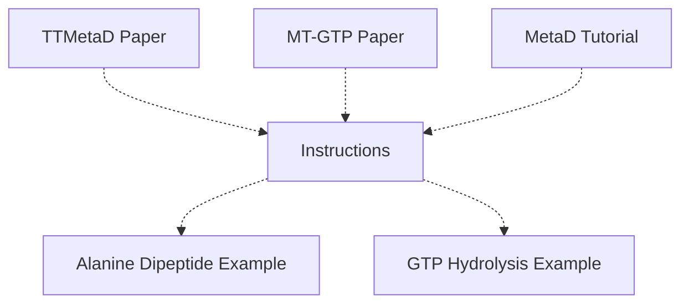

This lesson gives a introduction to the transition-tempered metadynamics (TTMetaD). The lesson is divided into two parts. The first part is a brief introduction to the TTMetaD method, and the second part is an exercise where you will apply the TTMetaD method to a simple system and a more advanced system - the dihedral angles of alanine dipeptide using vanilla MD TTMetaD and the GTP hydrolysis of the β-tubulin of a tubulin interdimer complex in microtubules using QM/MM TTMetaD, respectively.

The flow chart below shows the relationship between the different resources available for this lesson. The resources are divided into three categories: papers, tutorials, and instructions. The papers are the TTMetaD paper and the mechanism of MT-GTP hydrolysis paper. The tutorial is the basic MetaD tutorial. The flow chart shows that the TTMetaD paper is a prerequisite for the exercise, the MT-GTP paper is recommended but not required, and the MetaD tutorial is a previous tutorial that introduces the basics of MetaD. You can find the plumed input files of the two examples: the alanine dipeptide example and the GTP hydrolysis in microtubules example. You may click on the different boxes to access them.


<b><a href="https://www.plumed.org/doc-master/user-doc/html/actionlist/?actions=FLUSH,EXTENDED_LAGRANGIAN,MOLINFO,PRINT,METAD,DISTANCE,WHOLEMOLECULES,RESTART,LOWER_WALLS,GROUP,UNITS,COM,COORDINATION,RESTRAINT,UPPER_WALLS,TORSION" target="_blank">Click here</a> to open manual pages for actions discussed in this tutorial.</b>

