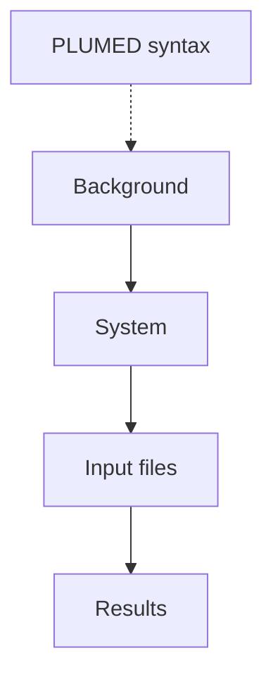

### `maze` Tutorial
A PLUMED tutorial to run ligand unbinding trajectories with `maze`. The original work, which explains the background of `maze` simulations, is published in [[1]](#1). Implementation details are summarized in [[2]](#2).

**This tutoral uses a recent implementation of `maze` which differs from the original one**. 

The new version is accessible [here](https://github.com/jakryd/plumed2-maze) and will be merged into PLUMED soon. For information on how to compile it, see [here](https://www.plumed.org/doc-v2.4/user-doc/html/_installation.html). The `maze` module must be enabled during compilation.

This tutorial covers the following:

#### [Background](background.md)
A brief introduction to the background behind the use of `maze`.

#### [L99A T4 Lysozyme-Benzene](system.md) 
A case study for this tutorial is a small protein that binds benzene.

#### [Input files preparation](input.md)
Input setup for `maze`.

#### [Results](results.md)
Presentation of results obtained with `maze`.

---

<a id="1">[1]</a>  J. Rydzewski, and O. Valsson, *Finding Multiple Reaction Pathways of Ligand Unbinding* J. Chem. Phys. 150, 221101 (2019) [doi:10.1063/1.5108638](https://doi.org/10.1063/1.5108638).

<a id="2">[2]</a> J. Rydzewski, *maze: Heterogeneous Ligand Unbinding along Transient Protein Tunnels* Comp. Phys. Commun. 247, 106865 (2020) [doi:10.1016/j.cpc.2019.106865](https://doi.org/10.1016/j.cpc.2019.106865).

---


<b><a href="https://www.plumed.org/doc-master/user-doc/html/actionlist/?actions=GROUP,CENTER,DISTANCE,COMMITTOR" target="_blank">Click here</a> to open manual pages for actions discussed in this tutorial.</b>

