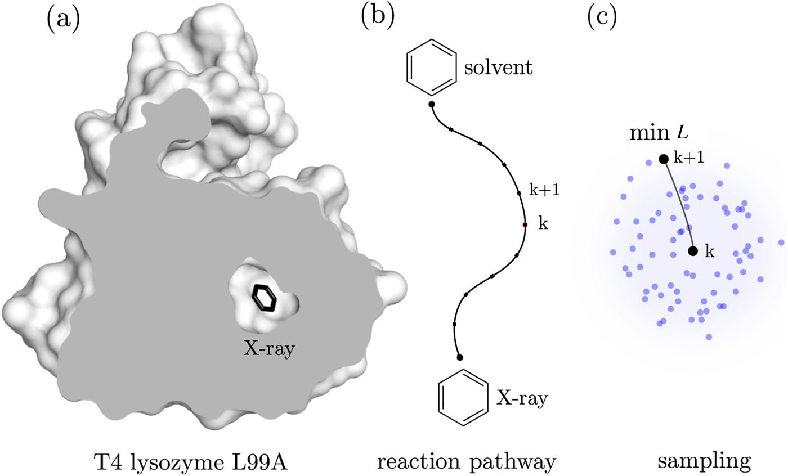

##### [&larr; Home](NAVIGATION.md)

### Background of `maze`

In molecular dynamics, it has been challenging to search for reaction pathways that describe rare events in complex systems. Incorrectly computed reaction pathways can lead to issues with calculating free energies and kinetic rates.

In this tutorial, we will explore an enhanced sampling technique to identify ligand unbinding pathways from proteins. This will involve optimizing a loss function that characterizes ligand-protein interactions. Our analysis will focus on the T4 lysozyme L99A mutant (T4L) with benzene in its binding pocket. This mutant is commonly utilized as a model system for studying how ligands bind to proteins.

#### Loss Function
Because fluctuations in binding pockets are important for dissociation, we will employ a loss function that scores how deeply buried a ligand is within the protein matrix. This loss function should have a maximum within the protein and decrease to zero as the ligand dissociates to solvent.

For simplicity, we will use a very simple model for ligand-protein interactions:

$$
L = \sum_k \frac{e^{-r_k}}{r_0}
$$

where the sum goes over ligand-protein atom pairs in the local neighborhood of the ligand and $r_0$ is a cutoff. The new version of `maze` can use any loss function implemented in PLUMED as a [switching function](https://www.plumed.org/doc-v2.9/user-doc/html/switchingfunction.html).

#### Minimization
We will minimize the loss function using simulated annealing. In this method, we check if a randomly chosen neighboring position of the ligand corresponds to a decrease in the loss function. The probability of accepting a randomly generated neighbor is given by:

$$
p = \min(1, \mathrm{e}^{-\beta \Delta L}),
$$

where $\Delta L$ is the difference between the current loss function and the loss function of the neighbor, and $\beta$ is a tempering parameter (see [Input](input.md)).

#### Adaptive Biasing
After minimization converges and identifies the optimal unbinding direction $w_k$ is determined, the current position of the ligand $x$ is biased toward $w_k$. This is accomplished by applying an adaptive harmonic potential:

$$
V(x)=h\left(v\Delta t - (x - w_{k-1}) \frac{w_k - w_{k-1}}{\|w_k-w_{k-1}\|}\right)^2,
$$

where $w_k$ is the optimal solution at step $k$, $v$ is the biasing rate, $h$ is the scale constant, and $\Delta t$ is the MD time between subsequent loss function minimizations. A detailed explanation can be found in [[1]](#1).

*Figure* Unbinding is initiated from the bound state (X-ray binding site) of the T4L-benzene complex and ends once the ligand reaches the solvent. (a) The cross-section through the X-ray structure of T4L shows no apparent tunnels for benzene to leave the protein, which means that the protein must undergo structural changes to open possible exits. (b) A reaction pathway characterizing the unbinding along the exit tunnel is identified locally during MD simulations. (c) To determine the (k+1)-th intermediate, the conformations of benzene are sampled in the neighborhood of the k-th intermediate. Then, the optimal biasing direction is calculated from the sampled ligand conformations by selecting the ligand conformation with the lowest loss function value.

##### [System &rarr;](system.md)

---

<a id="1">[1]</a>  J. Rydzewski, and O. Valsson, *Finding Multiple Reaction Pathways of Ligand Unbinding* J. Chem. Phys. 150, 221101 (2019) [doi:10.1063/1.5108638](https://doi.org/10.1063/1.5108638).

---
