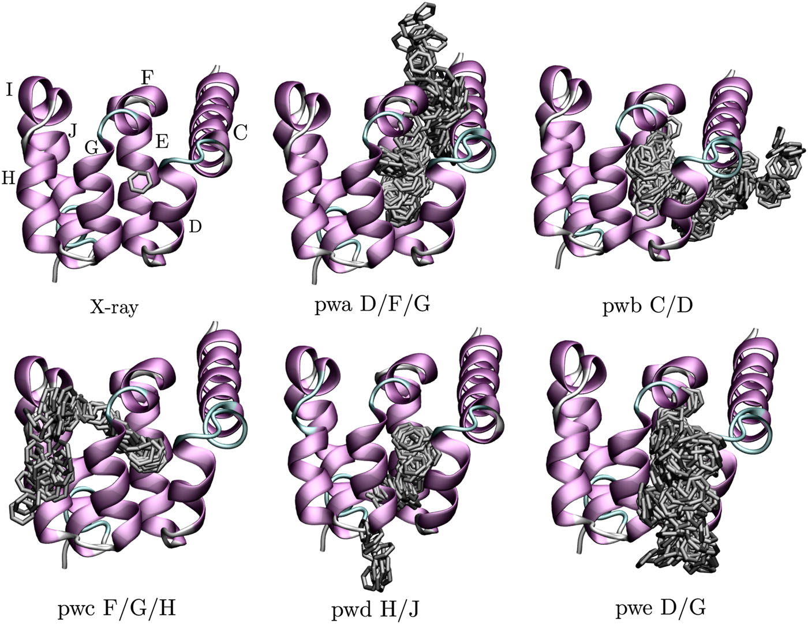
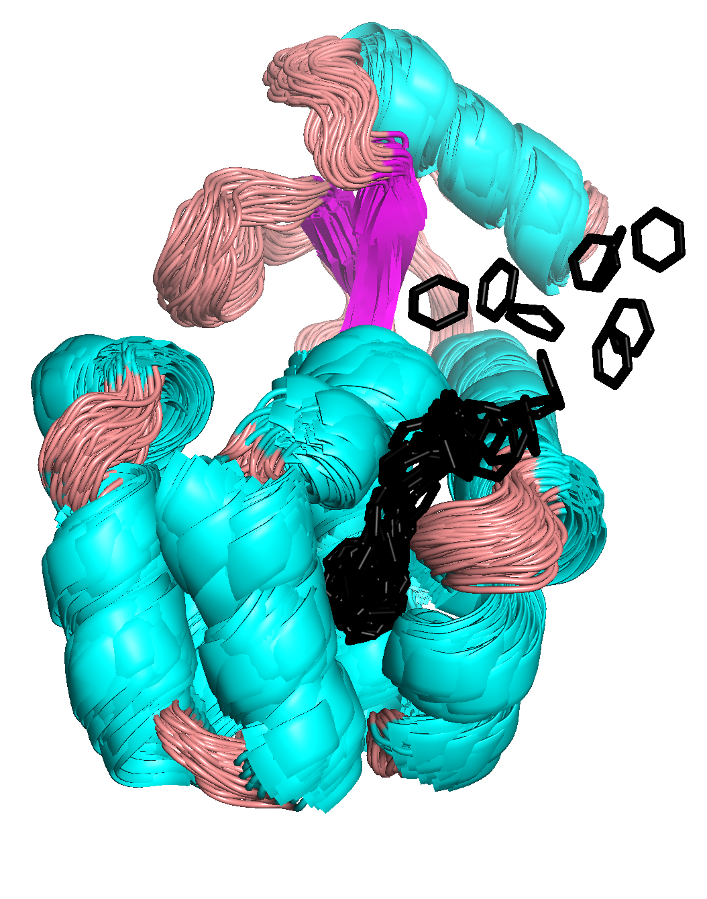
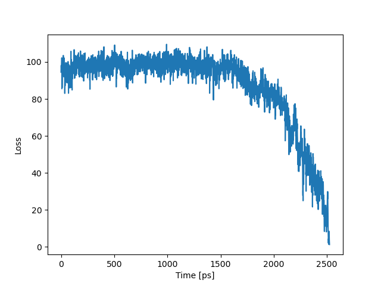
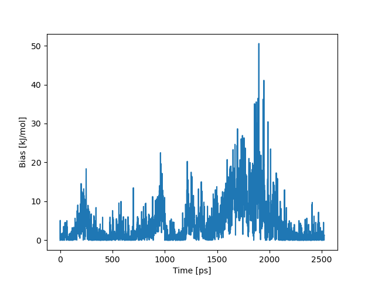

##### [&larr; Home](NAVIGATION.md)

### Results

In our previous paper [[1]](#1), we ran around 300 short trajectories and identified dissociation pathways shown in Figure, where each pathway is named pwa, pwb, ..., and by T4L helices through which benzene dissociated. 

Using the parameters selected in this tutorial, we should be able to obtain one of these pathways within 10 ns.

In the example calculated here, the simulation ends around 2.5 ns, resulting in an unbinding pathway shown below. To find an exit from T4L, the pulling direction of benzene was optimized three times (at 0, 1, and 2 ns). 

By displaying overlayed conformations of the T4L-benzene complex sampled during the simulation, we can see which helices fluctuate the most during the dissociation. 

The next figure shows how the loss function behaves in time. We can see that starting from 1.5 ns, it decays to zero, which means that benzene unbinds from the binding pocket of T4L and diffuses toward solvent.

This point also coincides with the peak in the bias potential, suggesting that this is the point where benzene overcomes the highest energy barrier.

*Note* Dissociation pathways obtained using the `maze` module can define reference frames for path collective variables, which can be used to run a metadynamics simulation and calculate a free-energy profile. For further details on this, see [here](https://www.plumed.org/doc-v2.9/user-doc/html/_p_a_t_h.html).

---

<a id="1">[1]</a>  J. Rydzewski, and O. Valsson, *Finding Multiple Reaction Pathways of Ligand Unbinding* J. Chem. Phys. 150, 221101 (2019) [doi:10.1063/1.5108638](https://doi.org/10.1063/1.5108638).
