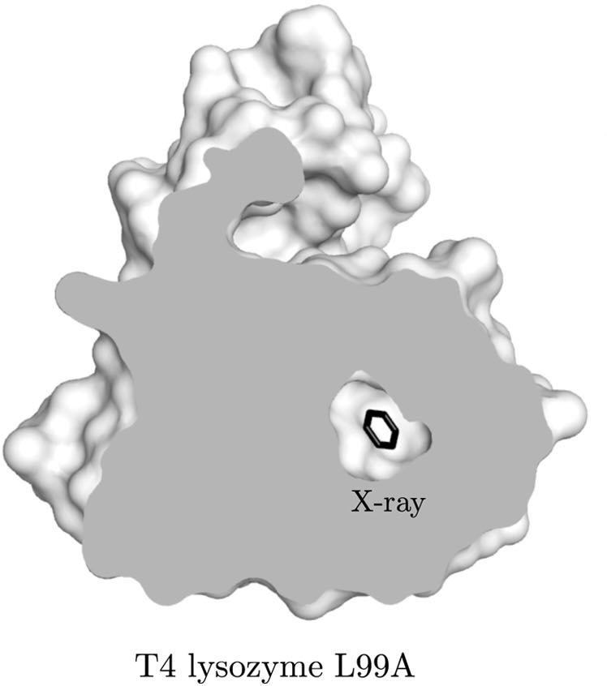

##### [&larr; Home](NAVIGATION.md)

### L99A T4 Lysozyme (T4L)

T4L has a specific mutation: leucine (L) substitution at position 99 with alanine (A). This change creates a hydrophobic cavity in the C-terminal domain, altering its stability and binding properties (see Figure). 

This variant is particularly useful as a model system for studying protein-ligand interactions because the introduced cavity can accommodate small hydrophobic molecules (benzene and its derivatives). 

In this tutorial, we will use a structure based on the PDB ID [4w52](https://www.rcsb.org/structure/4W52) with the CHARMM36 force field and run a T4L-benzene dissociation simulation in the NVT ensemble at 300 K using the velocity rescaling thermostat (see the `data` directory [here](https://github.com/jakryd/plumed2-maze-tutorial) for more details).

##### [Input &rarr;](input.md)
