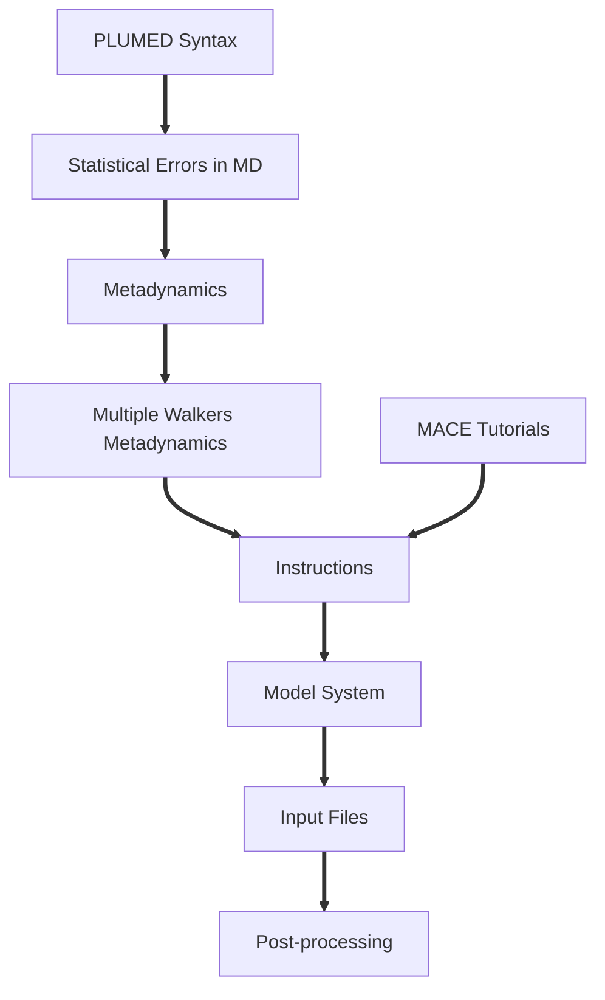

# Multiple Walkers Metadynamics Simulations with a Reactive Machine Learning Interatomic Potential

In molecular dynamics (MD) simulations, different kinds of empirical interatomic potentials have been used to study various problems. However, those empirical potentials are usually incapable of describing chemical reactions as they need a proper description of the formation and breakage of chemical bonds. On the other hand, interatomic potentials derived from first-principles methods (e.g., density functional theory) are often expensive and can only be applied to small systems. For a more extensive system, such as chemical reactions in a bulk solution with explicit solvent molecules, the timescale of the process is often too long for first-principles MD simulations to reach. Recently, reactive machine learning interatomic potentials (MLIP) have been of great interest to the community as they can provide atomistic details to a system of interest with first-principles insights and a speed comparable to empirical potentials. They can be combined with various enhanced sampling techniques (e.g., umbrella sampling, metadynamics, etc.) to more efficiently explore the free energy space of a chemical reaction.

This tutorial uses Atomic Simulation Environment (ASE) to perform multiple walkers metadynamics simulations with a trained equivariant message-passing neural network potential, MACE, to explore the free energy surface of nitrate anion dissociation at its triplet state in an aqueous solution. In principle, multiple walkers metadynamics can be more efficient than standard metadynamics when the free energy surface of interest has more than two local minima. This tutorial uses MACE as the MLIP of choice, but different MLIPs can be used in ASE without additional compilation if the ASE calculator for that particular MLIP is available in the version used.

Depending on your previous exposure and interest in the topics, you may want to look at the lessons on PLUMED syntax, metadynamics, and external tutorials on training a MACE potential by its developer group.


<b><a href="https://www.plumed.org/doc-master/user-doc/html/actionlist/?actions=ANGLE,CUSTOM,UPPER_WALLS,PRINT,UNITS,READ,DUMPGRID,DISTANCE,COORDINATION,GROUP,FLUSH,HBOND_MATRIX,HISTOGRAM,METAD,REWEIGHT_METAD" target="_blank">Click here</a> to open manual pages for actions discussed in this tutorial.</b>

