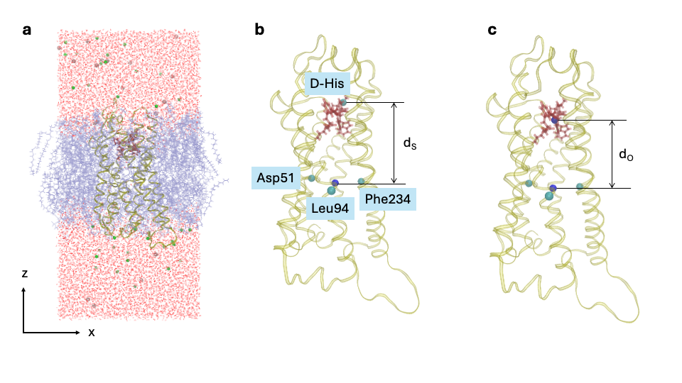
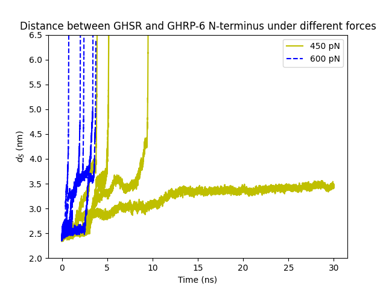
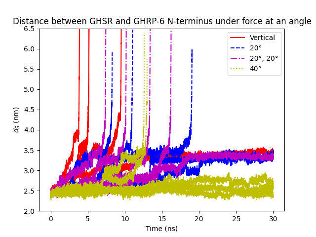
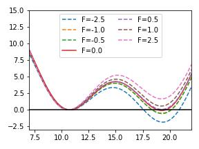
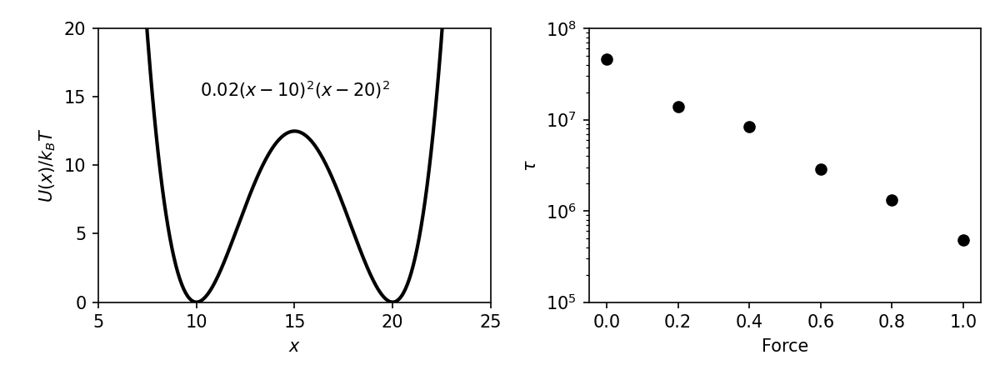

# Modelling mechanobiological processes

## Origin

This tutorial was authored by Claire Pritchard, Guillaume Stirnemann, and Glen M. Hocky in October 2024.

## Aims

This Masterclass explains how mechanical forces can be modeled using PLUMED, and how to compute their result using free energy and kinetics calculations.

## Objectives

The objectives of this Masterclass are:
- Learn how to apply a constant force in PLUMED;
- See how transition rates change with different forces.

## Prerequisites

We assume that the person that will follow this tutorial is familiar with the Linux terminal, Gromacs and basic functionality of PLUMED.

Familiarity with python and matplotlib is recommended for plotting

## Setting up PLUMED

We will use GROMACS, PLUMED, and PLUMED's pesmd function to perform the calculations.
Conda packages with the software required for this class have been prepared and you can install them following the instructions in [this link](https://github.com/plumed/masterclass-2022).

The data needed to run the exercises of this Masterclass can be found on [GitHub](https://github.com/hockyg/plumed-tutorial-force2).

You can clone this repository locally on your machine if you want, but specific data will be linked to below.

## Background

### Force basics

A force along some direction here is defined as the negative gradient of the potential energy along that direction. 

A constant force $F$ on a scalar collective variable $Q(\vec{X})$ therefore is a simple addition to the system's energy function.

$$
 U(\vec{X},F) = U(\vec{X}) - F Q(\vec{X}) 
$$

Notice that, because of the negative sign, a postive value of $F$ results in a lower energy for large values of $Q$, meaning $F\gt0$ corresponds to a "pulling" force.

A mechanical force would often in reality would correspond to pulling apart two atoms, and so $Q$ would often be a simple distance coordinate.

Note however, that other quantities could be used, such as an area which would mean $F$ corresponds to a pressure.

Dimensional analysis implies that the units of $F$ must be [Energy]/[Q].

The effect of constant force can be assessed using any enhanced sampling method.

The work done by the bias in this case is very simple:

$$
W = \int_a^b F \cdot d Q = F ( Q_b - Q_a )
$$

Constant forces can be applied in PLUMED with the SLOPE keyword of the RESTRAINT bias.

### Steered MD

Steered molecular dynamics (SMD) is one way of pulling on a molecular coordinate, and has a connection to experiments done where a molecule is attached via a "spring" to an object such as an optical tweezer or AFM tip. To represent this in simulation, instead of applying a constant force, we impose a Harmonic restraint on $Q$ with a center that moves:

$$
 U(\vec{X},F) = U(\vec{X}) + \frac{1}{2} k (Q-Q_0(t))^2
$$

Typically $Q_0(t)$ would move linearly, with $Q_0(t) = Q_0(0)-\lambda\ t$ although that is not a requirement. 

At any given time, the force along $Q$ from the moving bias is given as:

$$
 F(t) = -\frac{\partial U}{\partial Q} = -k(Q-Q_0(t))
$$

This force is positive (pulling) when $Q_0(t)$ is bigger than $Q$, and it can get very large if the spring moves quickly to larger values.

SMD is implemented in PLUMED using the MOVINGRESTRAINT bias, and the work is computed automatically:

$$
 W = \int_a^b F dQ \approx \sum_{i=1}^{N_{steps}}  \bar{F_i} (Q_0(t_i)-Q_0(t_{i-1})) = \lambda dt \sum_{i=1}^{N_{steps}} \bar{F_i} 
$$

where,

$$
 \bar{F_i}=\frac{1}{2}( F_{i}+F_{i-1} ) = -\frac{k}{2}( Q(t_i)-Q_0(t_i) -Q(t_{i-1})+Q_0(t_{i-1})) = -\frac{k}{2} (\Delta Q_i - \lambda d t)
$$

### Dynamics from Infrequent Metadynamics

To compute the rate constant of unbinding in a standard molecular dynamics simulation, one would run many simulations starting from the bound pose, and then compute the mean time of escape, by averaging the times at which unbinding is deemed to have occured, $\tau=\frac{1}{N} \sum_{i=1}^N t^{unbind}_i$ (this assumes every simulation ends in an unbinding event). 

In this case, the unbinding rate constant is $k_{off}=1/\tau$. 


One way to compute dynamics from biased simulations is [Infrequent Metadynamics](https://doi.org/10.1103/PhysRevLett.111.230602). In this approach, we apply bias with a slow PACE so that the transition over the barrier to escape is not likely to be biased. In this case with some other assumptions, $\tau = \frac{1}{N} \sum_{i=1}^{N} \alpha_i \t_i$, where 

$$
\alpha_i = \frac{1}{t_i} \int_0^{t_i} e^{\beta V_i(t)} dt
$$

Where $V_i(t)$ is the Metadynamics bias at time $t$.

$\alpha_i$ is called the _acceleration factor_ and can be computed by PLUMED for METAD automatically.

Note - there are other approaches to take the same data and compute $\tau$ by fitting the survival distribution, but we will not discuss that here. 

### Dependence of unbinding rate constants with force

For a double well potential, the rate of crossing a high barrier with a small pulling force follows what is sometimes called Bell's law, and is a simple consequence of the linear response of the barrier to pulling:

$$
k_{off}(F)=k_{off}(F=0) e^{\beta F \Delta Q^*}
$$

This means that the unbinding accelerates exponentially with force relative to zero force, and this speedup depends on $\Delta Q^*$ which is the "distance to the transition state", assumed to be constant (in reality, this distance moves even for a double well potential, and it is easy to correct for this motion for a quadratic barrier. Feel free to tackle this as an exercise!).

## Exercises

The exercises are presented below.


### Part 1 - Ligand dissociation from a membrane protein system 

#### System and context 

In the following, we illustrate how Plumed can be used to probe ligand-protein interactions in a constant force set-up mimicking single-molecule force spectroscopy experiments that can produce such forces from the pN to the nN regime. 

On purpuse, we apply it here to a large system comprising the ghrelin receptor GHSR bound to a model peptide GHRP-6 embedded in a model infinite lipid bilayer and solvated by water molecules. 

All input files necessary to run these simulations are available [in this zip file](https://github.com/hockyg/plumed-tutorial-force2/raw/refs/heads/main/plumed-tutorial-force2-data-part1.zip).

Given the system size, and required simulation lengths, it is highly recommended that you perform these simulations on a cluster, preferably on GPUs. Note that these simulations can be run on a laptop or desktop computer, but you will be limited to quite short simulation times which would require the use of much larger forces to see dissociation within a short time window. 

We start by giving a little bit of context on the system chosen for this example, which is shown in the figure below: 

.

 Panel a gives an overview of the system {GHSR+ligand+membrane+water} which is periodic in all directions. In panel b and c, we show the geometric definition of two collective variables, $d_S$ and $d_O$, corresponding respectively to the distance between an anchor in the protein (center of mass between three residues), and either the N-terminal alpha carbon ($d_S$) or the center of mass of the ligand ($d_O$). In plumed, this is achieved as follows: 


<div class="plumedpreheader">
<div class="headerInfo" id="value_details_data/INSTRUCTIONS.md_working_1.dat"> Click on the labels of the actions for more information on what each action computes </div>
<div class="containerBadge">
<div class="headerBadge"><a href="INSTRUCTIONS.md_working_1.dat.plumed.stderr"></a></div>
<div class="headerBadge"><a href="INSTRUCTIONS.md_working_1.dat.plumed_master.stderr"></a></div>
</div>
</div>
<pre class="plumedlisting">
<b name="data/INSTRUCTIONS.md_working_1.datGHRP6_COM" onclick='showPath("data/INSTRUCTIONS.md_working_1.dat","data/INSTRUCTIONS.md_working_1.datGHRP6_COM","data/INSTRUCTIONS.md_working_1.datGHRP6_COM","violet")'>GHRP6_COM</b><span style="display:none;" id="data/INSTRUCTIONS.md_working_1.datGHRP6_COM">The COM action with label <b>GHRP6_COM</b> calculates the following quantities:<table  align="center" frame="void" width="95%" cellpadding="5%"><tr><td width="5%"><b> Quantity </b>  </td><td width="5%"><b> Type </b>  </td><td><b> Description </b> </td></tr><tr><td width="5%">GHRP6_COM</td><td width="5%"><font color="violet">atoms</font></td><td>virtual atom calculated by COM action</td></tr></table></span>: <span class="plumedtooltip" style="color:green">COM<span class="right">Calculate the center of mass for a group of atoms. <a href="https://www.plumed.org/doc-master/user-doc/html/COM" style="color:green">More details</a><i></i></span></span> <span class="plumedtooltip">ATOMS<span class="right">the list of atoms which are involved the virtual atom's definition<i></i></span></span>=4822-4942
<b name="data/INSTRUCTIONS.md_working_1.datGHSR_COM" onclick='showPath("data/INSTRUCTIONS.md_working_1.dat","data/INSTRUCTIONS.md_working_1.datGHSR_COM","data/INSTRUCTIONS.md_working_1.datGHSR_COM","violet")'>GHSR_COM</b><span style="display:none;" id="data/INSTRUCTIONS.md_working_1.datGHSR_COM">The COM action with label <b>GHSR_COM</b> calculates the following quantities:<table  align="center" frame="void" width="95%" cellpadding="5%"><tr><td width="5%"><b> Quantity </b>  </td><td width="5%"><b> Type </b>  </td><td><b> Description </b> </td></tr><tr><td width="5%">GHSR_COM</td><td width="5%"><font color="violet">atoms</font></td><td>virtual atom calculated by COM action</td></tr></table></span>: <span class="plumedtooltip" style="color:green">COM<span class="right">Calculate the center of mass for a group of atoms. <a href="https://www.plumed.org/doc-master/user-doc/html/COM" style="color:green">More details</a><i></i></span></span> <span class="plumedtooltip">ATOMS<span class="right">the list of atoms which are involved the virtual atom's definition<i></i></span></span>=769,1490,3760
<b name="data/INSTRUCTIONS.md_working_1.datdO" onclick='showPath("data/INSTRUCTIONS.md_working_1.dat","data/INSTRUCTIONS.md_working_1.datdO","data/INSTRUCTIONS.md_working_1.datdO","black")'>dO</b><span style="display:none;" id="data/INSTRUCTIONS.md_working_1.datdO">The DISTANCE action with label <b>dO</b> calculates the following quantities:<table  align="center" frame="void" width="95%" cellpadding="5%"><tr><td width="5%"><b> Quantity </b>  </td><td width="5%"><b> Type </b>  </td><td><b> Description </b> </td></tr><tr><td width="5%">dO.x</td><td width="5%"><font color="black">scalar</font></td><td>the x-component of the vector connecting the two atoms</td></tr><tr><td width="5%">dO.y</td><td width="5%"><font color="black">scalar</font></td><td>the y-component of the vector connecting the two atoms</td></tr><tr><td width="5%">dO.z</td><td width="5%"><font color="black">scalar</font></td><td>the z-component of the vector connecting the two atoms</td></tr></table></span>: <span class="plumedtooltip" style="color:green">DISTANCE<span class="right">Calculate the distance/s between pairs of atoms. <a href="https://www.plumed.org/doc-master/user-doc/html/DISTANCE" style="color:green">More details</a><i></i></span></span> <span class="plumedtooltip">ATOMS<span class="right">the pair of atom that we are calculating the distance between<i></i></span></span>=<b name="data/INSTRUCTIONS.md_working_1.datGHRP6_COM">GHRP6_COM</b>,<b name="data/INSTRUCTIONS.md_working_1.datGHSR_COM">GHSR_COM</b> <span class="plumedtooltip">COMPONENTS<span class="right"> calculate the x, y and z components of the distance separately and store them as label<i></i></span></span> <span class="plumedtooltip">NOPBC<span class="right"> ignore the periodic boundary conditions when calculating distances<i></i></span></span>
<b name="data/INSTRUCTIONS.md_working_1.datdS" onclick='showPath("data/INSTRUCTIONS.md_working_1.dat","data/INSTRUCTIONS.md_working_1.datdS","data/INSTRUCTIONS.md_working_1.datdS","black")'>dS</b><span style="display:none;" id="data/INSTRUCTIONS.md_working_1.datdS">The DISTANCE action with label <b>dS</b> calculates the following quantities:<table  align="center" frame="void" width="95%" cellpadding="5%"><tr><td width="5%"><b> Quantity </b>  </td><td width="5%"><b> Type </b>  </td><td><b> Description </b> </td></tr><tr><td width="5%">dS.x</td><td width="5%"><font color="black">scalar</font></td><td>the x-component of the vector connecting the two atoms</td></tr><tr><td width="5%">dS.y</td><td width="5%"><font color="black">scalar</font></td><td>the y-component of the vector connecting the two atoms</td></tr><tr><td width="5%">dS.z</td><td width="5%"><font color="black">scalar</font></td><td>the z-component of the vector connecting the two atoms</td></tr></table></span>: <span class="plumedtooltip" style="color:green">DISTANCE<span class="right">Calculate the distance/s between pairs of atoms. <a href="https://www.plumed.org/doc-master/user-doc/html/DISTANCE" style="color:green">More details</a><i></i></span></span> <span class="plumedtooltip">ATOMS<span class="right">the pair of atom that we are calculating the distance between<i></i></span></span>=4826,<b name="data/INSTRUCTIONS.md_working_1.datGHSR_COM">GHSR_COM</b> <span class="plumedtooltip">COMPONENTS<span class="right"> calculate the x, y and z components of the distance separately and store them as label<i></i></span></span> <span class="plumedtooltip">NOPBC<span class="right"> ignore the periodic boundary conditions when calculating distances<i></i></span></span>
</pre>
  
Please note the NOPBC option that is important here as we don't want to calculate the minimal distance between these two ligand/protein sites. 

#### Applying a constant, vertical force 

Say now that we want to apply a vertical force of a given amplitude to one of these CVs. As detailed in the preambule, this can be achieved by playing with the SLOPE keyword of the RESTRAINT bias. The fact that we apply a vertical force is controlled by the fact that bias is acting on the z component of the CV: 

For example, 

<div class="plumedpreheader">
<div class="headerInfo" id="value_details_data/work/pulling_units.plumed.dat"> Click on the labels of the actions for more information on what each action computes </div>
<div class="containerBadge">
<div class="headerBadge"><a href="pulling_units.plumed.dat.plumed.stderr"></a></div>
<div class="headerBadge"><a href="pulling_units.plumed.dat.plumed_master.stderr"></a></div>
<div class="headerBadge"></div>
</div>
</div>
<div id="data/work/pulling_units.plumed.dat_short">
<pre class="plumedlisting">
<span class="plumedtooltip" style="color:green">UNITS<span class="right">This command sets the internal units for the code. <a href="https://www.plumed.org/doc-master/user-doc/html/UNITS" style="color:green">More details</a><i></i></span></span> <span style="background-color:yellow">__FILL__</span>
<br/><span style="display:none;" id="data/work/pulling_units.plumed.dat">The UNITS action with label <b></b> calculates something</span><b name="data/work/pulling_units.plumed.datGHRP6_COM" onclick='showPath("data/work/pulling_units.plumed.dat","data/work/pulling_units.plumed.datGHRP6_COM","data/work/pulling_units.plumed.datGHRP6_COM","brown")'>GHRP6_COM</b>: <span class="plumedtooltip" style="color:green">COM<span class="right">Calculate the center of mass for a group of atoms. <a href="https://www.plumed.org/doc-master/user-doc/html/COM" style="color:green">More details</a><i></i></span></span> <span class="plumedtooltip">ATOMS<span class="right">the list of atoms which are involved the virtual atom's definition<i></i></span></span>=4822-4942
<span style="display:none;" id="data/work/pulling_units.plumed.datGHRP6_COM">The COM action with label <b>GHRP6_COM</b> calculates something</span><b name="data/work/pulling_units.plumed.datGHSR_COM" onclick='showPath("data/work/pulling_units.plumed.dat","data/work/pulling_units.plumed.datGHSR_COM","data/work/pulling_units.plumed.datGHSR_COM","brown")'>GHSR_COM</b>: <span class="plumedtooltip" style="color:green">COM<span class="right">Calculate the center of mass for a group of atoms. <a href="https://www.plumed.org/doc-master/user-doc/html/COM" style="color:green">More details</a><i></i></span></span> <span class="plumedtooltip">ATOMS<span class="right">the list of atoms which are involved the virtual atom's definition<i></i></span></span>=769,1490,3760
<span style="display:none;" id="data/work/pulling_units.plumed.datGHSR_COM">The COM action with label <b>GHSR_COM</b> calculates something</span><b name="data/work/pulling_units.plumed.datdO" onclick='showPath("data/work/pulling_units.plumed.dat","data/work/pulling_units.plumed.datdO","data/work/pulling_units.plumed.datdO","brown")'>dO</b>: <span class="plumedtooltip" style="color:green">DISTANCE<span class="right">Calculate the distance/s between pairs of atoms. <a href="https://www.plumed.org/doc-master/user-doc/html/DISTANCE" style="color:green">More details</a><i></i></span></span> <span class="plumedtooltip">ATOMS<span class="right">the pair of atom that we are calculating the distance between<i></i></span></span>=<b name="data/work/pulling_units.plumed.datGHRP6_COM">GHRP6_COM</b>,<b name="data/work/pulling_units.plumed.datGHSR_COM">GHSR_COM</b> <span class="plumedtooltip">COMPONENTS<span class="right"> calculate the x, y and z components of the distance separately and store them as label<i></i></span></span> <span class="plumedtooltip">NOPBC<span class="right"> ignore the periodic boundary conditions when calculating distances<i></i></span></span>
<span style="display:none;" id="data/work/pulling_units.plumed.datdO">The DISTANCE action with label <b>dO</b> calculates the following quantities:<table  align="center" frame="void" width="95%" cellpadding="5%"><tr><td width="5%"><b> Quantity </b>  </td><td><b> Description </b> </td></tr><tr><td width="5%">dO.x</td><td>the x-component of the vector connecting the two atoms</td></tr><tr><td width="5%">dO.y</td><td>the y-component of the vector connecting the two atoms</td></tr><tr><td width="5%">dO.z</td><td>the z-component of the vector connecting the two atoms</td></tr><tr><td width="5%">dO.value</td><td>the DISTANCE between this pair of atoms</td></tr></table></span><b name="data/work/pulling_units.plumed.datdS" onclick='showPath("data/work/pulling_units.plumed.dat","data/work/pulling_units.plumed.datdS","data/work/pulling_units.plumed.datdS","brown")'>dS</b>: <span class="plumedtooltip" style="color:green">DISTANCE<span class="right">Calculate the distance/s between pairs of atoms. <a href="https://www.plumed.org/doc-master/user-doc/html/DISTANCE" style="color:green">More details</a><i></i></span></span> <span class="plumedtooltip">ATOMS<span class="right">the pair of atom that we are calculating the distance between<i></i></span></span>=4826,<b name="data/work/pulling_units.plumed.datGHSR_COM">GHSR_COM</b> <span class="plumedtooltip">COMPONENTS<span class="right"> calculate the x, y and z components of the distance separately and store them as label<i></i></span></span> <span class="plumedtooltip">NOPBC<span class="right"> ignore the periodic boundary conditions when calculating distances<i></i></span></span>
<br/><span style="display:none;" id="data/work/pulling_units.plumed.datdS">The DISTANCE action with label <b>dS</b> calculates the following quantities:<table  align="center" frame="void" width="95%" cellpadding="5%"><tr><td width="5%"><b> Quantity </b>  </td><td><b> Description </b> </td></tr><tr><td width="5%">dS.x</td><td>the x-component of the vector connecting the two atoms</td></tr><tr><td width="5%">dS.y</td><td>the y-component of the vector connecting the two atoms</td></tr><tr><td width="5%">dS.z</td><td>the z-component of the vector connecting the two atoms</td></tr><tr><td width="5%">dS.value</td><td>the DISTANCE between this pair of atoms</td></tr></table></span><b name="data/work/pulling_units.plumed.datrestraint" onclick='showPath("data/work/pulling_units.plumed.dat","data/work/pulling_units.plumed.datrestraint","data/work/pulling_units.plumed.datrestraint","brown")'>restraint</b>: <span class="plumedtooltip" style="color:green">RESTRAINT<span class="right">Adds harmonic and/or linear restraints on one or more variables. <a href="https://www.plumed.org/doc-master/user-doc/html/RESTRAINT" style="color:green">More details</a><i></i></span></span> <span class="plumedtooltip">ARG<span class="right">the values the harmonic restraint acts upon<i></i></span></span>=<b name="data/work/pulling_units.plumed.datdS">dS.z</b> <span class="plumedtooltip">AT<span class="right">the position of the restraint<i></i></span></span>=0 <span class="plumedtooltip">SLOPE<span class="right"> specifies that the restraint is linear and what the values of the force constants on each of the variables are<i></i></span></span>=-270

<span style="display:none;" id="data/work/pulling_units.plumed.datrestraint">The RESTRAINT action with label <b>restraint</b> calculates the following quantities:<table  align="center" frame="void" width="95%" cellpadding="5%"><tr><td width="5%"><b> Quantity </b>  </td><td><b> Description </b> </td></tr><tr><td width="5%">restraint.bias</td><td>the instantaneous value of the bias potential</td></tr><tr><td width="5%">restraint.force2</td><td>the instantaneous value of the squared force due to this bias potential</td></tr></table></span><span class="plumedtooltip" style="color:green">PRINT<span class="right">Print quantities to a file. <a href="https://www.plumed.org/doc-master/user-doc/html/PRINT" style="color:green">More details</a><i></i></span></span> <span style="background-color:yellow">__FILL__</span> <span class="plumedtooltip">STRIDE<span class="right"> the frequency with which the quantities of interest should be output<i></i></span></span>=100 <span class="plumedtooltip">FILE<span class="right">the name of the file on which to output these quantities<i></i></span></span>=pull_270.colvar.dat
</pre></div>
<div style="display:none;" id="data/work/pulling_units.plumed.dat_long"><pre class="plumedlisting">
<span class="plumedtooltip" style="color:green">UNITS<span class="right">This command sets the internal units for the code. <a href="https://www.plumed.org/doc-master/user-doc/html/UNITS" style="color:green">More details</a><i></i></span></span> <span class="plumedtooltip">LENGTH<span class="right">the units of lengths<i></i></span></span>=nm <span class="plumedtooltip">ENERGY<span class="right">the units of energy<i></i></span></span>=kj/mol

<span style="display:none;" id="data/work/pulling_units.plumed.dat_sol">The UNITS action with label <b></b> calculates something</span><b name="data/work/pulling_units.plumed.dat_solGHRP6_COM" onclick='showPath("data/work/pulling_units.plumed.dat","data/work/pulling_units.plumed.dat_solGHRP6_COM","data/work/pulling_units.plumed.dat_solGHRP6_COM","brown")'>GHRP6_COM</b>: <span class="plumedtooltip" style="color:green">COM<span class="right">Calculate the center of mass for a group of atoms. <a href="https://www.plumed.org/doc-master/user-doc/html/COM" style="color:green">More details</a><i></i></span></span> <span class="plumedtooltip">ATOMS<span class="right">the list of atoms which are involved the virtual atom's definition<i></i></span></span>=4822-4942
<span style="display:none;" id="data/work/pulling_units.plumed.dat_solGHRP6_COM">The COM action with label <b>GHRP6_COM</b> calculates something</span><b name="data/work/pulling_units.plumed.dat_solGHSR_COM" onclick='showPath("data/work/pulling_units.plumed.dat","data/work/pulling_units.plumed.dat_solGHSR_COM","data/work/pulling_units.plumed.dat_solGHSR_COM","brown")'>GHSR_COM</b>: <span class="plumedtooltip" style="color:green">COM<span class="right">Calculate the center of mass for a group of atoms. <a href="https://www.plumed.org/doc-master/user-doc/html/COM" style="color:green">More details</a><i></i></span></span> <span class="plumedtooltip">ATOMS<span class="right">the list of atoms which are involved the virtual atom's definition<i></i></span></span>=769,1490,3760
<span style="display:none;" id="data/work/pulling_units.plumed.dat_solGHSR_COM">The COM action with label <b>GHSR_COM</b> calculates something</span><b name="data/work/pulling_units.plumed.dat_soldO" onclick='showPath("data/work/pulling_units.plumed.dat","data/work/pulling_units.plumed.dat_soldO","data/work/pulling_units.plumed.dat_soldO","brown")'>dO</b>: <span class="plumedtooltip" style="color:green">DISTANCE<span class="right">Calculate the distance/s between pairs of atoms. <a href="https://www.plumed.org/doc-master/user-doc/html/DISTANCE" style="color:green">More details</a><i></i></span></span> <span class="plumedtooltip">ATOMS<span class="right">the pair of atom that we are calculating the distance between<i></i></span></span>=<b name="data/work/pulling_units.plumed.dat_solGHRP6_COM">GHRP6_COM</b>,<b name="data/work/pulling_units.plumed.dat_solGHSR_COM">GHSR_COM</b> <span class="plumedtooltip">COMPONENTS<span class="right"> calculate the x, y and z components of the distance separately and store them as label<i></i></span></span> <span class="plumedtooltip">NOPBC<span class="right"> ignore the periodic boundary conditions when calculating distances<i></i></span></span>
<span style="display:none;" id="data/work/pulling_units.plumed.dat_soldO">The DISTANCE action with label <b>dO</b> calculates the following quantities:<table  align="center" frame="void" width="95%" cellpadding="5%"><tr><td width="5%"><b> Quantity </b>  </td><td><b> Description </b> </td></tr><tr><td width="5%">dO.x</td><td>the x-component of the vector connecting the two atoms</td></tr><tr><td width="5%">dO.y</td><td>the y-component of the vector connecting the two atoms</td></tr><tr><td width="5%">dO.z</td><td>the z-component of the vector connecting the two atoms</td></tr><tr><td width="5%">dO.value</td><td>the DISTANCE between this pair of atoms</td></tr></table></span><b name="data/work/pulling_units.plumed.dat_soldS" onclick='showPath("data/work/pulling_units.plumed.dat","data/work/pulling_units.plumed.dat_soldS","data/work/pulling_units.plumed.dat_soldS","brown")'>dS</b>: <span class="plumedtooltip" style="color:green">DISTANCE<span class="right">Calculate the distance/s between pairs of atoms. <a href="https://www.plumed.org/doc-master/user-doc/html/DISTANCE" style="color:green">More details</a><i></i></span></span> <span class="plumedtooltip">ATOMS<span class="right">the pair of atom that we are calculating the distance between<i></i></span></span>=4826,<b name="data/work/pulling_units.plumed.dat_solGHSR_COM">GHSR_COM</b> <span class="plumedtooltip">COMPONENTS<span class="right"> calculate the x, y and z components of the distance separately and store them as label<i></i></span></span> <span class="plumedtooltip">NOPBC<span class="right"> ignore the periodic boundary conditions when calculating distances<i></i></span></span>
<br/><span style="display:none;" id="data/work/pulling_units.plumed.dat_soldS">The DISTANCE action with label <b>dS</b> calculates the following quantities:<table  align="center" frame="void" width="95%" cellpadding="5%"><tr><td width="5%"><b> Quantity </b>  </td><td><b> Description </b> </td></tr><tr><td width="5%">dS.x</td><td>the x-component of the vector connecting the two atoms</td></tr><tr><td width="5%">dS.y</td><td>the y-component of the vector connecting the two atoms</td></tr><tr><td width="5%">dS.z</td><td>the z-component of the vector connecting the two atoms</td></tr><tr><td width="5%">dS.value</td><td>the DISTANCE between this pair of atoms</td></tr></table></span><b name="data/work/pulling_units.plumed.dat_solrestraint" onclick='showPath("data/work/pulling_units.plumed.dat","data/work/pulling_units.plumed.dat_solrestraint","data/work/pulling_units.plumed.dat_solrestraint","brown")'>restraint</b>: <span class="plumedtooltip" style="color:green">RESTRAINT<span class="right">Adds harmonic and/or linear restraints on one or more variables. <a href="https://www.plumed.org/doc-master/user-doc/html/RESTRAINT" style="color:green">More details</a><i></i></span></span> <span class="plumedtooltip">ARG<span class="right">the values the harmonic restraint acts upon<i></i></span></span>=<b name="data/work/pulling_units.plumed.dat_soldS">dS.z</b> <span class="plumedtooltip">AT<span class="right">the position of the restraint<i></i></span></span>=0 <span class="plumedtooltip">SLOPE<span class="right"> specifies that the restraint is linear and what the values of the force constants on each of the variables are<i></i></span></span>=-270

<span style="display:none;" id="data/work/pulling_units.plumed.dat_solrestraint">The RESTRAINT action with label <b>restraint</b> calculates the following quantities:<table  align="center" frame="void" width="95%" cellpadding="5%"><tr><td width="5%"><b> Quantity </b>  </td><td><b> Description </b> </td></tr><tr><td width="5%">restraint.bias</td><td>the instantaneous value of the bias potential</td></tr><tr><td width="5%">restraint.force2</td><td>the instantaneous value of the squared force due to this bias potential</td></tr></table></span><span class="plumedtooltip" style="color:green">PRINT<span class="right">Print quantities to a file. <a href="https://www.plumed.org/doc-master/user-doc/html/PRINT" style="color:green">More details</a><i></i></span></span> <span class="plumedtooltip">ARG<span class="right">the labels of the values that you would like to print to the file<i></i></span></span>=* <span class="plumedtooltip">STRIDE<span class="right"> the frequency with which the quantities of interest should be output<i></i></span></span>=100 <span class="plumedtooltip">FILE<span class="right">the name of the file on which to output these quantities<i></i></span></span>=pull_270.colvar.dat
</pre></div>

  

Set the energy and distance units to kJ/mol and nm respectively. In these units, what does a SLOPE of -270 correspond to in Piconewtons? (And remember from above,  why is the SLOPE defined with a negative sign?)

Make sure to print out the distances you are interested in, as well as the work done by the bias.

The amplitude of the force can be tuned by changing the SLOPE, and this can be applied to any CV you like. Steered and constant force MD are by essence out-of-equilibrium set-ups, therefore, if the force is high enough, you don't expect the unbinding event to be reversible. This means that to calculate converged quantities (e.g. unbinding times), you need to repeat such simulations multiple times. 

For example, the following figures shows the results (CV vs time) of 5 trajectories at two different forces acting on $d_S$. How does the unbinding time depends on force? Is this expected?

.

As an exercise, set SLOPE to match these different conditions. You can either try to play with force further and re-run some simulations to see how this affects the unbinding time, or try to apply force to a different CV, $d_O$ for example. 

#### Pulling at an angle

Finally, it could be interesting and relevant for the comparision with experimental results to change the directionnality of the force. 

For example, providing you with the following plumed file, and based on what we did above, can you guess what is done exactly to the system? Is is expected to have a significant influnce on the unbinding kinetics?

For example, 

<div class="plumedpreheader">
<div class="headerInfo" id="value_details_data/work/pull_angle.plumed.dat"> Click on the labels of the actions for more information on what each action computes </div>
<div class="containerBadge">
<div class="headerBadge"><a href="pull_angle.plumed.dat.plumed.stderr"></a></div>
<div class="headerBadge"><a href="pull_angle.plumed.dat.plumed_master.stderr"></a></div>
<div class="headerBadge"></div>
</div>
</div>
<div id="data/work/pull_angle.plumed.dat_short">
<pre class="plumedlisting">
<span class="plumedtooltip" style="color:green">UNITS<span class="right">This command sets the internal units for the code. <a href="https://www.plumed.org/doc-master/user-doc/html/UNITS" style="color:green">More details</a><i></i></span></span> <span style="background-color:yellow">__FILL__</span>
<br/><span style="display:none;" id="data/work/pull_angle.plumed.dat">The UNITS action with label <b></b> calculates something</span><b name="data/work/pull_angle.plumed.datGHSR_COM" onclick='showPath("data/work/pull_angle.plumed.dat","data/work/pull_angle.plumed.datGHSR_COM","data/work/pull_angle.plumed.datGHSR_COM","brown")'>GHSR_COM</b>: <span class="plumedtooltip" style="color:green">COM<span class="right">Calculate the center of mass for a group of atoms. <a href="https://www.plumed.org/doc-master/user-doc/html/COM" style="color:green">More details</a><i></i></span></span> <span class="plumedtooltip">ATOMS<span class="right">the list of atoms which are involved the virtual atom's definition<i></i></span></span>=769,1490,3760
<span style="display:none;" id="data/work/pull_angle.plumed.datGHSR_COM">The COM action with label <b>GHSR_COM</b> calculates something</span><b name="data/work/pull_angle.plumed.datdS" onclick='showPath("data/work/pull_angle.plumed.dat","data/work/pull_angle.plumed.datdS","data/work/pull_angle.plumed.datdS","brown")'>dS</b>: <span class="plumedtooltip" style="color:green">DISTANCE<span class="right">Calculate the distance/s between pairs of atoms. <a href="https://www.plumed.org/doc-master/user-doc/html/DISTANCE" style="color:green">More details</a><i></i></span></span> <span class="plumedtooltip">ATOMS<span class="right">the pair of atom that we are calculating the distance between<i></i></span></span>=4826,<b name="data/work/pull_angle.plumed.datGHSR_COM">GHSR_COM</b> <span class="plumedtooltip">COMPONENTS<span class="right"> calculate the x, y and z components of the distance separately and store them as label<i></i></span></span> <span class="plumedtooltip">NOPBC<span class="right"> ignore the periodic boundary conditions when calculating distances<i></i></span></span>
<span style="display:none;" id="data/work/pull_angle.plumed.datdS">The DISTANCE action with label <b>dS</b> calculates the following quantities:<table  align="center" frame="void" width="95%" cellpadding="5%"><tr><td width="5%"><b> Quantity </b>  </td><td><b> Description </b> </td></tr><tr><td width="5%">dS.x</td><td>the x-component of the vector connecting the two atoms</td></tr><tr><td width="5%">dS.y</td><td>the y-component of the vector connecting the two atoms</td></tr><tr><td width="5%">dS.z</td><td>the z-component of the vector connecting the two atoms</td></tr><tr><td width="5%">dS.value</td><td>the DISTANCE between this pair of atoms</td></tr></table></span><b name="data/work/pull_angle.plumed.datrestraint_x" onclick='showPath("data/work/pull_angle.plumed.dat","data/work/pull_angle.plumed.datrestraint_x","data/work/pull_angle.plumed.datrestraint_x","brown")'>restraint_x</b>: <span class="plumedtooltip" style="color:green">RESTRAINT<span class="right">Adds harmonic and/or linear restraints on one or more variables. <a href="https://www.plumed.org/doc-master/user-doc/html/RESTRAINT" style="color:green">More details</a><i></i></span></span> <span class="plumedtooltip">ARG<span class="right">the values the harmonic restraint acts upon<i></i></span></span>=<b name="data/work/pull_angle.plumed.datdS">dS.x</b> <span class="plumedtooltip">AT<span class="right">the position of the restraint<i></i></span></span>=0 <span class="plumedtooltip">SLOPE<span class="right"> specifies that the restraint is linear and what the values of the force constants on each of the variables are<i></i></span></span>=<span style="background-color:yellow">__FILL__</span>
<span style="display:none;" id="data/work/pull_angle.plumed.datrestraint_x">The RESTRAINT action with label <b>restraint_x</b> calculates the following quantities:<table  align="center" frame="void" width="95%" cellpadding="5%"><tr><td width="5%"><b> Quantity </b>  </td><td><b> Description </b> </td></tr><tr><td width="5%">restraint_x.bias</td><td>the instantaneous value of the bias potential</td></tr><tr><td width="5%">restraint_x.force2</td><td>the instantaneous value of the squared force due to this bias potential</td></tr></table></span><b name="data/work/pull_angle.plumed.datrestraint_z" onclick='showPath("data/work/pull_angle.plumed.dat","data/work/pull_angle.plumed.datrestraint_z","data/work/pull_angle.plumed.datrestraint_z","brown")'>restraint_z</b>: <span class="plumedtooltip" style="color:green">RESTRAINT<span class="right">Adds harmonic and/or linear restraints on one or more variables. <a href="https://www.plumed.org/doc-master/user-doc/html/RESTRAINT" style="color:green">More details</a><i></i></span></span> <span class="plumedtooltip">ARG<span class="right">the values the harmonic restraint acts upon<i></i></span></span>=<b name="data/work/pull_angle.plumed.datdS">dS.z</b> <span class="plumedtooltip">AT<span class="right">the position of the restraint<i></i></span></span>=0 <span class="plumedtooltip">SLOPE<span class="right"> specifies that the restraint is linear and what the values of the force constants on each of the variables are<i></i></span></span>=<span style="background-color:yellow">__FILL__</span>
<br/><span style="display:none;" id="data/work/pull_angle.plumed.datrestraint_z">The RESTRAINT action with label <b>restraint_z</b> calculates the following quantities:<table  align="center" frame="void" width="95%" cellpadding="5%"><tr><td width="5%"><b> Quantity </b>  </td><td><b> Description </b> </td></tr><tr><td width="5%">restraint_z.bias</td><td>the instantaneous value of the bias potential</td></tr><tr><td width="5%">restraint_z.force2</td><td>the instantaneous value of the squared force due to this bias potential</td></tr></table></span><span class="plumedtooltip" style="color:green">PRINT<span class="right">Print quantities to a file. <a href="https://www.plumed.org/doc-master/user-doc/html/PRINT" style="color:green">More details</a><i></i></span></span> <span class="plumedtooltip">FMT<span class="right"> the format that should be used to output real numbers<i></i></span></span>=%g <span class="plumedtooltip">ARG<span class="right">the labels of the values that you would like to print to the file<i></i></span></span>=<b name="data/work/pull_angle.plumed.datdS">dS.*</b>,<b name="data/work/pull_angle.plumed.datrestraint_x">restraint_x.*</b>,<b name="data/work/pull_angle.plumed.datrestraint_z">restraint_z.*</b> <span class="plumedtooltip">STRIDE<span class="right"> the frequency with which the quantities of interest should be output<i></i></span></span>=500 <span class="plumedtooltip">FILE<span class="right">the name of the file on which to output these quantities<i></i></span></span>=pull_40degrees.dat
</pre></div>
<div style="display:none;" id="data/work/pull_angle.plumed.dat_long"><pre class="plumedlisting">
<span class="plumedtooltip" style="color:green">UNITS<span class="right">This command sets the internal units for the code. <a href="https://www.plumed.org/doc-master/user-doc/html/UNITS" style="color:green">More details</a><i></i></span></span> <span class="plumedtooltip">LENGTH<span class="right">the units of lengths<i></i></span></span>=nm <span class="plumedtooltip">ENERGY<span class="right">the units of energy<i></i></span></span>=kj/mol

<span style="display:none;" id="data/work/pull_angle.plumed.dat_sol">The UNITS action with label <b></b> calculates something</span><b name="data/work/pull_angle.plumed.dat_solGHSR_COM" onclick='showPath("data/work/pull_angle.plumed.dat","data/work/pull_angle.plumed.dat_solGHSR_COM","data/work/pull_angle.plumed.dat_solGHSR_COM","brown")'>GHSR_COM</b>: <span class="plumedtooltip" style="color:green">COM<span class="right">Calculate the center of mass for a group of atoms. <a href="https://www.plumed.org/doc-master/user-doc/html/COM" style="color:green">More details</a><i></i></span></span> <span class="plumedtooltip">ATOMS<span class="right">the list of atoms which are involved the virtual atom's definition<i></i></span></span>=769,1490,3760
<span style="display:none;" id="data/work/pull_angle.plumed.dat_solGHSR_COM">The COM action with label <b>GHSR_COM</b> calculates something</span><b name="data/work/pull_angle.plumed.dat_soldS" onclick='showPath("data/work/pull_angle.plumed.dat","data/work/pull_angle.plumed.dat_soldS","data/work/pull_angle.plumed.dat_soldS","brown")'>dS</b>: <span class="plumedtooltip" style="color:green">DISTANCE<span class="right">Calculate the distance/s between pairs of atoms. <a href="https://www.plumed.org/doc-master/user-doc/html/DISTANCE" style="color:green">More details</a><i></i></span></span> <span class="plumedtooltip">ATOMS<span class="right">the pair of atom that we are calculating the distance between<i></i></span></span>=4826,<b name="data/work/pull_angle.plumed.dat_solGHSR_COM">GHSR_COM</b> <span class="plumedtooltip">COMPONENTS<span class="right"> calculate the x, y and z components of the distance separately and store them as label<i></i></span></span> <span class="plumedtooltip">NOPBC<span class="right"> ignore the periodic boundary conditions when calculating distances<i></i></span></span>
<span style="display:none;" id="data/work/pull_angle.plumed.dat_soldS">The DISTANCE action with label <b>dS</b> calculates the following quantities:<table  align="center" frame="void" width="95%" cellpadding="5%"><tr><td width="5%"><b> Quantity </b>  </td><td><b> Description </b> </td></tr><tr><td width="5%">dS.x</td><td>the x-component of the vector connecting the two atoms</td></tr><tr><td width="5%">dS.y</td><td>the y-component of the vector connecting the two atoms</td></tr><tr><td width="5%">dS.z</td><td>the z-component of the vector connecting the two atoms</td></tr><tr><td width="5%">dS.value</td><td>the DISTANCE between this pair of atoms</td></tr></table></span><b name="data/work/pull_angle.plumed.dat_solrestraint_x" onclick='showPath("data/work/pull_angle.plumed.dat","data/work/pull_angle.plumed.dat_solrestraint_x","data/work/pull_angle.plumed.dat_solrestraint_x","brown")'>restraint_x</b>: <span class="plumedtooltip" style="color:green">RESTRAINT<span class="right">Adds harmonic and/or linear restraints on one or more variables. <a href="https://www.plumed.org/doc-master/user-doc/html/RESTRAINT" style="color:green">More details</a><i></i></span></span> <span class="plumedtooltip">ARG<span class="right">the values the harmonic restraint acts upon<i></i></span></span>=<b name="data/work/pull_angle.plumed.dat_soldS">dS.x</b> <span class="plumedtooltip">AT<span class="right">the position of the restraint<i></i></span></span>=0 <span class="plumedtooltip">SLOPE<span class="right"> specifies that the restraint is linear and what the values of the force constants on each of the variables are<i></i></span></span>=-173
<span style="display:none;" id="data/work/pull_angle.plumed.dat_solrestraint_x">The RESTRAINT action with label <b>restraint_x</b> calculates the following quantities:<table  align="center" frame="void" width="95%" cellpadding="5%"><tr><td width="5%"><b> Quantity </b>  </td><td><b> Description </b> </td></tr><tr><td width="5%">restraint_x.bias</td><td>the instantaneous value of the bias potential</td></tr><tr><td width="5%">restraint_x.force2</td><td>the instantaneous value of the squared force due to this bias potential</td></tr></table></span><b name="data/work/pull_angle.plumed.dat_solrestraint_z" onclick='showPath("data/work/pull_angle.plumed.dat","data/work/pull_angle.plumed.dat_solrestraint_z","data/work/pull_angle.plumed.dat_solrestraint_z","brown")'>restraint_z</b>: <span class="plumedtooltip" style="color:green">RESTRAINT<span class="right">Adds harmonic and/or linear restraints on one or more variables. <a href="https://www.plumed.org/doc-master/user-doc/html/RESTRAINT" style="color:green">More details</a><i></i></span></span> <span class="plumedtooltip">ARG<span class="right">the values the harmonic restraint acts upon<i></i></span></span>=<b name="data/work/pull_angle.plumed.dat_soldS">dS.z</b> <span class="plumedtooltip">AT<span class="right">the position of the restraint<i></i></span></span>=0 <span class="plumedtooltip">SLOPE<span class="right"> specifies that the restraint is linear and what the values of the force constants on each of the variables are<i></i></span></span>=-207

<span style="display:none;" id="data/work/pull_angle.plumed.dat_solrestraint_z">The RESTRAINT action with label <b>restraint_z</b> calculates the following quantities:<table  align="center" frame="void" width="95%" cellpadding="5%"><tr><td width="5%"><b> Quantity </b>  </td><td><b> Description </b> </td></tr><tr><td width="5%">restraint_z.bias</td><td>the instantaneous value of the bias potential</td></tr><tr><td width="5%">restraint_z.force2</td><td>the instantaneous value of the squared force due to this bias potential</td></tr></table></span><span class="plumedtooltip" style="color:green">PRINT<span class="right">Print quantities to a file. <a href="https://www.plumed.org/doc-master/user-doc/html/PRINT" style="color:green">More details</a><i></i></span></span> <span class="plumedtooltip">FMT<span class="right"> the format that should be used to output real numbers<i></i></span></span>=%g <span class="plumedtooltip">ARG<span class="right">the labels of the values that you would like to print to the file<i></i></span></span>=<b name="data/work/pull_angle.plumed.dat_soldS">dS.*</b>,<b name="data/work/pull_angle.plumed.dat_solrestraint_x">restraint_x.*</b>,<b name="data/work/pull_angle.plumed.dat_solrestraint_z">restraint_z.*</b> <span class="plumedtooltip">STRIDE<span class="right"> the frequency with which the quantities of interest should be output<i></i></span></span>=500 <span class="plumedtooltip">FILE<span class="right">the name of the file on which to output these quantities<i></i></span></span>=pull_40degrees.dat
</pre></div>

  

Fill in this PLUMED file so that constant force pulling is performed with a total magnitude of 450 pN at an angle of 40 degrees from the vertical.

In the following figure, we show the results of the application of a force of 450 pN to the N-terminal residue of the ligand peptide, pulling at different angles. The first angle is that corresponds to the tilt along x, and the second one, if shown, to that along y. 

.

#### Conclusion

You should now be able to apply constant forces to any CV in a given system, and to tune the direction of this force. 

### Part 2 - Effect of force on unbinding rates

In this section, we will demonstrate how unbinding rate constants can be computed via Infrequent Metadynamics. This will be demonstrated on a double-well potential, and simulations will be performed using plumed's `pesmd` function.

Note, the first step is a recap from the earlier [FISST module masterclass/tutorial](https://www.plumed-tutorials.org/lessons/22/015/data/INSTRUCTIONS.html). 

#### Reminder - Effect of force on a 2-dimensional potential

Use the RESTRAINT function to add a constant force of different magnitudes (e.g. -2.5 to 2.5 in these units) and look at how the force changes the resulting free energy surface.


<div class="plumedpreheader">
<div class="headerInfo" id="value_details_data/work/pulling_example_doublewell.plumed.dat"> Click on the labels of the actions for more information on what each action computes </div>
<div class="containerBadge">
<div class="headerBadge"><a href="pulling_example_doublewell.plumed.dat.plumed.stderr"></a></div>
<div class="headerBadge"><a href="pulling_example_doublewell.plumed.dat.plumed_master.stderr"></a></div>
<div class="headerBadge"></div>
</div>
</div>
<div id="data/work/pulling_example_doublewell.plumed.dat_short">
<pre class="plumedlisting">
<span class="plumedtooltip" style="color:green">UNITS<span class="right">This command sets the internal units for the code. <a href="https://www.plumed.org/doc-master/user-doc/html/UNITS" style="color:green">More details</a><i></i></span></span> <span class="plumedtooltip">ENERGY<span class="right">the units of energy<i></i></span></span>=kcal/mol

<span style="display:none;" id="data/work/pulling_example_doublewell.plumed.dat">The UNITS action with label <b></b> calculates something</span><b name="data/work/pulling_example_doublewell.plumed.datd1" onclick='showPath("data/work/pulling_example_doublewell.plumed.dat","data/work/pulling_example_doublewell.plumed.datd1","data/work/pulling_example_doublewell.plumed.datd1","brown")'>d1</b>: <span class="plumedtooltip" style="color:green">DISTANCE<span class="right">Calculate the distance/s between pairs of atoms. <a href="https://www.plumed.org/doc-master/user-doc/html/DISTANCE" style="color:green">More details</a><i></i></span></span> <span class="plumedtooltip">ATOMS<span class="right">the pair of atom that we are calculating the distance between<i></i></span></span>=1,2
<span style="display:none;" id="data/work/pulling_example_doublewell.plumed.datd1">The DISTANCE action with label <b>d1</b> calculates the following quantities:<table  align="center" frame="void" width="95%" cellpadding="5%"><tr><td width="5%"><b> Quantity </b>  </td><td><b> Description </b> </td></tr><tr><td width="5%">d1.value</td><td>the DISTANCE between this pair of atoms</td></tr></table></span><b name="data/work/pulling_example_doublewell.plumed.datff" onclick='showPath("data/work/pulling_example_doublewell.plumed.dat","data/work/pulling_example_doublewell.plumed.datff","data/work/pulling_example_doublewell.plumed.datff","brown")'>ff</b>: <span class="plumedtooltip" style="color:green">MATHEVAL<span class="right">An alias to the CUSTOM function that can also be used to calaculate combinations of variables using a custom expression. <a href="https://www.plumed.org/doc-master/user-doc/html/MATHEVAL" style="color:green">More details</a><i></i></span></span> <span class="plumedtooltip">ARG<span class="right">the values input to this function<i></i></span></span>=<b name="data/work/pulling_example_doublewell.plumed.datd1">d1</b> <span class="plumedtooltip">PERIODIC<span class="right">if the output of your function is periodic then you should specify the periodicity of the function<i></i></span></span>=NO <span class="plumedtooltip">FUNC<span class="right">the function you wish to evaluate<i></i></span></span>=0.2*(((x-10)^2)*((x-20)^2))

<span style="display:none;" id="data/work/pulling_example_doublewell.plumed.datff">The MATHEVAL action with label <b>ff</b> calculates the following quantities:<table  align="center" frame="void" width="95%" cellpadding="5%"><tr><td width="5%"><b> Quantity </b>  </td><td><b> Description </b> </td></tr><tr><td width="5%">ff.value</td><td>an arbitrary function</td></tr></table></span><b name="data/work/pulling_example_doublewell.plumed.datmetad" onclick='showPath("data/work/pulling_example_doublewell.plumed.dat","data/work/pulling_example_doublewell.plumed.datmetad","data/work/pulling_example_doublewell.plumed.datmetad","brown")'>metad</b>: <span class="plumedtooltip" style="color:green">METAD<span class="right">Used to performed metadynamics on one or more collective variables. <a href="https://www.plumed.org/doc-master/user-doc/html/METAD" style="color:green">More details</a><i></i></span></span> <span class="plumedtooltip">ARG<span class="right">the labels of the scalars on which the bias will act<i></i></span></span>=<b name="data/work/pulling_example_doublewell.plumed.datd1">d1</b> <span class="plumedtooltip">PACE<span class="right">the frequency for hill addition<i></i></span></span>=500 <span class="plumedtooltip">HEIGHT<span class="right">the heights of the Gaussian hills<i></i></span></span>=0.1 <span class="plumedtooltip">SIGMA<span class="right">the widths of the Gaussian hills<i></i></span></span>=2.5 <span class="plumedtooltip">FILE<span class="right"> a file in which the list of added hills is stored<i></i></span></span>=<span style="background-color:yellow">__FILL__</span> <span class="plumedtooltip">BIASFACTOR<span class="right">use well tempered metadynamics and use this bias factor<i></i></span></span>=10 <span class="plumedtooltip">TEMP<span class="right">the system temperature - this is only needed if you are doing well-tempered metadynamics<i></i></span></span>=300.0 <span class="plumedtooltip">GRID_WFILE<span class="right">the file on which to write the grid<i></i></span></span>=<span style="background-color:yellow">__FILL__</span> <span class="plumedtooltip">GRID_MIN<span class="right">the lower bounds for the grid<i></i></span></span>=0 <span class="plumedtooltip">GRID_MAX<span class="right">the upper bounds for the grid<i></i></span></span>=30 <span class="plumedtooltip">GRID_BIN<span class="right">the number of bins for the grid<i></i></span></span>=251 <span class="plumedtooltip">GRID_WSTRIDE<span class="right">write the grid to a file every N steps<i></i></span></span>=10000

<span style="display:none;" id="data/work/pulling_example_doublewell.plumed.datmetad">The METAD action with label <b>metad</b> calculates the following quantities:<table  align="center" frame="void" width="95%" cellpadding="5%"><tr><td width="5%"><b> Quantity </b>  </td><td><b> Description </b> </td></tr><tr><td width="5%">metad.bias</td><td>the instantaneous value of the bias potential</td></tr></table></span><span class="plumedtooltip" style="color:green">RESTRAINT<span class="right">Adds harmonic and/or linear restraints on one or more variables. <a href="https://www.plumed.org/doc-master/user-doc/html/RESTRAINT" style="color:green">More details</a><i></i></span></span> <span style="background-color:yellow">__FILL__</span>
<br/><span class="plumedtooltip" style="color:green">PRINT<span class="right">Print quantities to a file. <a href="https://www.plumed.org/doc-master/user-doc/html/PRINT" style="color:green">More details</a><i></i></span></span> <span class="plumedtooltip">ARG<span class="right">the labels of the values that you would like to print to the file<i></i></span></span>=* <span class="plumedtooltip">FILE<span class="right">the name of the file on which to output these quantities<i></i></span></span>=<span style="background-color:yellow">__FILL__</span> <span class="plumedtooltip">STRIDE<span class="right"> the frequency with which the quantities of interest should be output<i></i></span></span>=100
</pre></div>
<div style="display:none;" id="data/work/pulling_example_doublewell.plumed.dat_long"><pre class="plumedlisting">
<span class="plumedtooltip" style="color:green">UNITS<span class="right">This command sets the internal units for the code. <a href="https://www.plumed.org/doc-master/user-doc/html/UNITS" style="color:green">More details</a><i></i></span></span> <span class="plumedtooltip">ENERGY<span class="right">the units of energy<i></i></span></span>=kcal/mol

<span style="display:none;" id="data/work/pulling_example_doublewell.plumed.dat_sol">The UNITS action with label <b></b> calculates something</span><b name="data/work/pulling_example_doublewell.plumed.dat_sold1" onclick='showPath("data/work/pulling_example_doublewell.plumed.dat","data/work/pulling_example_doublewell.plumed.dat_sold1","data/work/pulling_example_doublewell.plumed.dat_sold1","brown")'>d1</b>: <span class="plumedtooltip" style="color:green">DISTANCE<span class="right">Calculate the distance/s between pairs of atoms. <a href="https://www.plumed.org/doc-master/user-doc/html/DISTANCE" style="color:green">More details</a><i></i></span></span> <span class="plumedtooltip">ATOMS<span class="right">the pair of atom that we are calculating the distance between<i></i></span></span>=1,2
<span style="display:none;" id="data/work/pulling_example_doublewell.plumed.dat_sold1">The DISTANCE action with label <b>d1</b> calculates the following quantities:<table  align="center" frame="void" width="95%" cellpadding="5%"><tr><td width="5%"><b> Quantity </b>  </td><td><b> Description </b> </td></tr><tr><td width="5%">d1.value</td><td>the DISTANCE between this pair of atoms</td></tr></table></span><b name="data/work/pulling_example_doublewell.plumed.dat_solff" onclick='showPath("data/work/pulling_example_doublewell.plumed.dat","data/work/pulling_example_doublewell.plumed.dat_solff","data/work/pulling_example_doublewell.plumed.dat_solff","brown")'>ff</b>: <span class="plumedtooltip" style="color:green">MATHEVAL<span class="right">An alias to the CUSTOM function that can also be used to calaculate combinations of variables using a custom expression. <a href="https://www.plumed.org/doc-master/user-doc/html/MATHEVAL" style="color:green">More details</a><i></i></span></span> <span class="plumedtooltip">ARG<span class="right">the values input to this function<i></i></span></span>=<b name="data/work/pulling_example_doublewell.plumed.dat_sold1">d1</b> <span class="plumedtooltip">PERIODIC<span class="right">if the output of your function is periodic then you should specify the periodicity of the function<i></i></span></span>=NO <span class="plumedtooltip">FUNC<span class="right">the function you wish to evaluate<i></i></span></span>=0.2*(((x-10)^2)*((x-20)^2))
<span style="display:none;" id="data/work/pulling_example_doublewell.plumed.dat_solff">The MATHEVAL action with label <b>ff</b> calculates the following quantities:<table  align="center" frame="void" width="95%" cellpadding="5%"><tr><td width="5%"><b> Quantity </b>  </td><td><b> Description </b> </td></tr><tr><td width="5%">ff.value</td><td>an arbitrary function</td></tr></table></span><b name="data/work/pulling_example_doublewell.plumed.dat_solbb" onclick='showPath("data/work/pulling_example_doublewell.plumed.dat","data/work/pulling_example_doublewell.plumed.dat_solbb","data/work/pulling_example_doublewell.plumed.dat_solbb","brown")'>bb</b>: <span class="plumedtooltip" style="color:green">BIASVALUE<span class="right">Takes the value of one variable and use it as a bias <a href="https://www.plumed.org/doc-master/user-doc/html/BIASVALUE" style="color:green">More details</a><i></i></span></span> <span class="plumedtooltip">ARG<span class="right">the labels of the scalar/vector arguments whose values will be used as a bias on the system<i></i></span></span>=<b name="data/work/pulling_example_doublewell.plumed.dat_solff">ff</b>

<span style="display:none;" id="data/work/pulling_example_doublewell.plumed.dat_solbb">The BIASVALUE action with label <b>bb</b> calculates the following quantities:<table  align="center" frame="void" width="95%" cellpadding="5%"><tr><td width="5%"><b> Quantity </b>  </td><td><b> Description </b> </td></tr><tr><td width="5%">bb.bias</td><td>the instantaneous value of the bias potential</td></tr><tr><td width="5%">bb._bias</td><td>one or multiple instances of this quantity can be referenced elsewhere in the input file</td></tr></table></span><b name="data/work/pulling_example_doublewell.plumed.dat_solmetad" onclick='showPath("data/work/pulling_example_doublewell.plumed.dat","data/work/pulling_example_doublewell.plumed.dat_solmetad","data/work/pulling_example_doublewell.plumed.dat_solmetad","brown")'>metad</b>: <span class="plumedtooltip" style="color:green">METAD<span class="right">Used to performed metadynamics on one or more collective variables. <a href="https://www.plumed.org/doc-master/user-doc/html/METAD" style="color:green">More details</a><i></i></span></span> <span class="plumedtooltip">ARG<span class="right">the labels of the scalars on which the bias will act<i></i></span></span>=<b name="data/work/pulling_example_doublewell.plumed.dat_sold1">d1</b> <span class="plumedtooltip">PACE<span class="right">the frequency for hill addition<i></i></span></span>=500 <span class="plumedtooltip">HEIGHT<span class="right">the heights of the Gaussian hills<i></i></span></span>=0.1 <span class="plumedtooltip">SIGMA<span class="right">the widths of the Gaussian hills<i></i></span></span>=2.5 <span class="plumedtooltip">FILE<span class="right"> a file in which the list of added hills is stored<i></i></span></span>=run_metad_F2.5.hills <span class="plumedtooltip">BIASFACTOR<span class="right">use well tempered metadynamics and use this bias factor<i></i></span></span>=10 <span class="plumedtooltip">TEMP<span class="right">the system temperature - this is only needed if you are doing well-tempered metadynamics<i></i></span></span>=300.0 <span class="plumedtooltip">GRID_WFILE<span class="right">the file on which to write the grid<i></i></span></span>=run_metad_F2.5.grid <span class="plumedtooltip">GRID_MIN<span class="right">the lower bounds for the grid<i></i></span></span>=0 <span class="plumedtooltip">GRID_MAX<span class="right">the upper bounds for the grid<i></i></span></span>=30 <span class="plumedtooltip">GRID_BIN<span class="right">the number of bins for the grid<i></i></span></span>=251 <span class="plumedtooltip">GRID_WSTRIDE<span class="right">write the grid to a file every N steps<i></i></span></span>=10000

<span style="display:none;" id="data/work/pulling_example_doublewell.plumed.dat_solmetad">The METAD action with label <b>metad</b> calculates the following quantities:<table  align="center" frame="void" width="95%" cellpadding="5%"><tr><td width="5%"><b> Quantity </b>  </td><td><b> Description </b> </td></tr><tr><td width="5%">metad.bias</td><td>the instantaneous value of the bias potential</td></tr></table></span><b name="data/work/pulling_example_doublewell.plumed.dat_solF" onclick='showPath("data/work/pulling_example_doublewell.plumed.dat","data/work/pulling_example_doublewell.plumed.dat_solF","data/work/pulling_example_doublewell.plumed.dat_solF","brown")'>F</b>: <span class="plumedtooltip" style="color:green">RESTRAINT<span class="right">Adds harmonic and/or linear restraints on one or more variables. <a href="https://www.plumed.org/doc-master/user-doc/html/RESTRAINT" style="color:green">More details</a><i></i></span></span> <span class="plumedtooltip">ARG<span class="right">the values the harmonic restraint acts upon<i></i></span></span>=<b name="data/work/pulling_example_doublewell.plumed.dat_sold1">d1</b> <span class="plumedtooltip">AT<span class="right">the position of the restraint<i></i></span></span>=0.0 <span class="plumedtooltip">KAPPA<span class="right"> specifies that the restraint is harmonic and what the values of the force constants on each of the variables are<i></i></span></span>=0 <span class="plumedtooltip">SLOPE<span class="right"> specifies that the restraint is linear and what the values of the force constants on each of the variables are<i></i></span></span>=2.5

<span style="display:none;" id="data/work/pulling_example_doublewell.plumed.dat_solF">The RESTRAINT action with label <b>F</b> calculates the following quantities:<table  align="center" frame="void" width="95%" cellpadding="5%"><tr><td width="5%"><b> Quantity </b>  </td><td><b> Description </b> </td></tr><tr><td width="5%">F.bias</td><td>the instantaneous value of the bias potential</td></tr><tr><td width="5%">F.force2</td><td>the instantaneous value of the squared force due to this bias potential</td></tr></table></span><span class="plumedtooltip" style="color:green">DUMPATOMS<span class="right">Dump selected atoms on a file. <a href="https://www.plumed.org/doc-master/user-doc/html/DUMPATOMS" style="color:green">More details</a><i></i></span></span> <span class="plumedtooltip">STRIDE<span class="right"> the frequency with which the atoms should be output<i></i></span></span>=2000 <span class="plumedtooltip">FILE<span class="right">file on which to output coordinates; extension is automatically detected<i></i></span></span>=run_metad_F2.5.xyz <span class="plumedtooltip">ATOMS<span class="right">the atom indices whose positions you would like to print out<i></i></span></span>=1-2,<b name="data/work/pulling_example_doublewell.plumed.dat_sol"></b>

<span class="plumedtooltip" style="color:green">PRINT<span class="right">Print quantities to a file. <a href="https://www.plumed.org/doc-master/user-doc/html/PRINT" style="color:green">More details</a><i></i></span></span> <span class="plumedtooltip">ARG<span class="right">the labels of the values that you would like to print to the file<i></i></span></span>=* <span class="plumedtooltip">FILE<span class="right">the name of the file on which to output these quantities<i></i></span></span>=run_metad_F2.5.metad.dat <span class="plumedtooltip">STRIDE<span class="right"> the frequency with which the quantities of interest should be output<i></i></span></span>=100
</pre></div>

  

Then download the [pesmd input file](inputs/doublewell_prod.pesmd.input) run the simulation using the command:

````
plumed pesmd < doublewell_prod.pesmd.input
````

Plot the free energy surface from the GRID or after using sum_hills to compute the surface, and zero the potential at the left minimum. What do you notice about the other minimum and barrier?



### Getting transition times versus force for a double well

Perform MetaD using the options below to predict kinetics at different forces. In the figure, we show results from computing the unbinding time using 40 runs with independent seeds for each _pulling_ force from 0 to 1 (be careful with the sign). As you can see, the time goes down exponentially, following Bell's law. Can you extract the transition distance from this figure? 

Note that here we used reduced units. An example pesmd input file is given at [this link](inputs/doublewell_rates.pesmd.input). 

Fill in the blanks below to turn on calculation of the acceleration factor, and use the COMMITTOR function to stop simulations when the system crosses the barrier (e.g. at x=15.5)


<div class="plumedpreheader">
<div class="headerInfo" id="value_details_data/work/pulling_rate_example.plumed.dat"> Click on the labels of the actions for more information on what each action computes </div>
<div class="containerBadge">
<div class="headerBadge"><a href="pulling_rate_example.plumed.dat.plumed.stderr"></a></div>
<div class="headerBadge"><a href="pulling_rate_example.plumed.dat.plumed_master.stderr"></a></div>
<div class="headerBadge"></div>
</div>
</div>
<div id="data/work/pulling_rate_example.plumed.dat_short">
<pre class="plumedlisting">
<span class="plumedtooltip" style="color:green">UNITS<span class="right">This command sets the internal units for the code. <a href="https://www.plumed.org/doc-master/user-doc/html/UNITS" style="color:green">More details</a><i></i></span></span> <span class="plumedtooltip">NATURAL<span class="right"> use natural units<i></i></span></span>
<br/><span style="display:none;" id="data/work/pulling_rate_example.plumed.dat">The UNITS action with label <b></b> calculates something</span><b name="data/work/pulling_rate_example.plumed.datd1" onclick='showPath("data/work/pulling_rate_example.plumed.dat","data/work/pulling_rate_example.plumed.datd1","data/work/pulling_rate_example.plumed.datd1","brown")'>d1</b>: <span class="plumedtooltip" style="color:green">DISTANCE<span class="right">Calculate the distance/s between pairs of atoms. <a href="https://www.plumed.org/doc-master/user-doc/html/DISTANCE" style="color:green">More details</a><i></i></span></span> <span class="plumedtooltip">ATOMS<span class="right">the pair of atom that we are calculating the distance between<i></i></span></span>=1,2
<span style="display:none;" id="data/work/pulling_rate_example.plumed.datd1">The DISTANCE action with label <b>d1</b> calculates the following quantities:<table  align="center" frame="void" width="95%" cellpadding="5%"><tr><td width="5%"><b> Quantity </b>  </td><td><b> Description </b> </td></tr><tr><td width="5%">d1.value</td><td>the DISTANCE between this pair of atoms</td></tr></table></span><b name="data/work/pulling_rate_example.plumed.datff" onclick='showPath("data/work/pulling_rate_example.plumed.dat","data/work/pulling_rate_example.plumed.datff","data/work/pulling_rate_example.plumed.datff","brown")'>ff</b>: <span class="plumedtooltip" style="color:green">MATHEVAL<span class="right">An alias to the CUSTOM function that can also be used to calaculate combinations of variables using a custom expression. <a href="https://www.plumed.org/doc-master/user-doc/html/MATHEVAL" style="color:green">More details</a><i></i></span></span> <span class="plumedtooltip">ARG<span class="right">the values input to this function<i></i></span></span>=<b name="data/work/pulling_rate_example.plumed.datd1">d1</b> <span class="plumedtooltip">PERIODIC<span class="right">if the output of your function is periodic then you should specify the periodicity of the function<i></i></span></span>=NO <span class="plumedtooltip">FUNC<span class="right">the function you wish to evaluate<i></i></span></span>=0.02*(((x-10)^2)*((x-20)^2))
<span style="display:none;" id="data/work/pulling_rate_example.plumed.datff">The MATHEVAL action with label <b>ff</b> calculates the following quantities:<table  align="center" frame="void" width="95%" cellpadding="5%"><tr><td width="5%"><b> Quantity </b>  </td><td><b> Description </b> </td></tr><tr><td width="5%">ff.value</td><td>an arbitrary function</td></tr></table></span><b name="data/work/pulling_rate_example.plumed.datbb" onclick='showPath("data/work/pulling_rate_example.plumed.dat","data/work/pulling_rate_example.plumed.datbb","data/work/pulling_rate_example.plumed.datbb","brown")'>bb</b>: <span class="plumedtooltip" style="color:green">BIASVALUE<span class="right">Takes the value of one variable and use it as a bias <a href="https://www.plumed.org/doc-master/user-doc/html/BIASVALUE" style="color:green">More details</a><i></i></span></span> <span class="plumedtooltip">ARG<span class="right">the labels of the scalar/vector arguments whose values will be used as a bias on the system<i></i></span></span>=<b name="data/work/pulling_rate_example.plumed.datff">ff</b>

<span style="display:none;" id="data/work/pulling_rate_example.plumed.datbb">The BIASVALUE action with label <b>bb</b> calculates the following quantities:<table  align="center" frame="void" width="95%" cellpadding="5%"><tr><td width="5%"><b> Quantity </b>  </td><td><b> Description </b> </td></tr><tr><td width="5%">bb.bias</td><td>the instantaneous value of the bias potential</td></tr><tr><td width="5%">bb._bias</td><td>one or multiple instances of this quantity can be referenced elsewhere in the input file</td></tr></table></span><b name="data/work/pulling_rate_example.plumed.datmetad" onclick='showPath("data/work/pulling_rate_example.plumed.dat","data/work/pulling_rate_example.plumed.datmetad","data/work/pulling_rate_example.plumed.datmetad","brown")'>metad</b>: <span class="plumedtooltip" style="color:green">METAD<span class="right">Used to performed metadynamics on one or more collective variables. <a href="https://www.plumed.org/doc-master/user-doc/html/METAD" style="color:green">More details</a><i></i></span></span> <span class="plumedtooltip">ARG<span class="right">the labels of the scalars on which the bias will act<i></i></span></span>=<b name="data/work/pulling_rate_example.plumed.datd1">d1</b> <span class="plumedtooltip">PACE<span class="right">the frequency for hill addition<i></i></span></span>=200 <span class="plumedtooltip">HEIGHT<span class="right">the heights of the Gaussian hills<i></i></span></span>=0.1 <span class="plumedtooltip">SIGMA<span class="right">the widths of the Gaussian hills<i></i></span></span>=2.5 <span class="plumedtooltip">FILE<span class="right"> a file in which the list of added hills is stored<i></i></span></span>=run_metad_F-1.0.hills <span class="plumedtooltip">BIASFACTOR<span class="right">use well tempered metadynamics and use this bias factor<i></i></span></span>=10 <span class="plumedtooltip">TEMP<span class="right">the system temperature - this is only needed if you are doing well-tempered metadynamics<i></i></span></span>=1.0 <span style="background-color:yellow">__FILL__</span>
<br/><span style="display:none;" id="data/work/pulling_rate_example.plumed.datmetad">The METAD action with label <b>metad</b> calculates the following quantities:<table  align="center" frame="void" width="95%" cellpadding="5%"><tr><td width="5%"><b> Quantity </b>  </td><td><b> Description </b> </td></tr><tr><td width="5%">metad.bias</td><td>the instantaneous value of the bias potential</td></tr></table></span><span class="plumedtooltip" style="color:green">COMMITTOR<span class="right">Does a committor analysis. <a href="https://www.plumed.org/doc-master/user-doc/html/COMMITTOR" style="color:green">More details</a><i></i></span></span> ...
    <span class="plumedtooltip">ARG<span class="right">the labels of the values which is being used to define the committor surface<i></i></span></span>=<b name="data/work/pulling_rate_example.plumed.datd1">d1</b>
    <span class="plumedtooltip">STRIDE<span class="right"> the frequency with which the CVs are analyzed<i></i></span></span>=10
    <span class="plumedtooltip">BASIN_LL1<span class="right">List of lower limits for basin #<i></i></span></span>=<span style="background-color:yellow">__FILL__</span>
    <span class="plumedtooltip">BASIN_UL1<span class="right">List of upper limits for basin #<i></i></span></span>=10000
    <span class="plumedtooltip">LABEL<span class="right">a label for the action so that its output can be referenced in the input to other actions<i></i></span></span>=<b name="data/work/pulling_rate_example.plumed.datc" onclick='showPath("data/work/pulling_rate_example.plumed.dat","data/work/pulling_rate_example.plumed.datc","data/work/pulling_rate_example.plumed.datc","brown")'>c</b>
...
<br/><span style="display:none;" id="data/work/pulling_rate_example.plumed.datc">The COMMITTOR action with label <b>c</b> calculates something</span><b name="data/work/pulling_rate_example.plumed.datF" onclick='showPath("data/work/pulling_rate_example.plumed.dat","data/work/pulling_rate_example.plumed.datF","data/work/pulling_rate_example.plumed.datF","brown")'>F</b>: <span class="plumedtooltip" style="color:green">RESTRAINT<span class="right">Adds harmonic and/or linear restraints on one or more variables. <a href="https://www.plumed.org/doc-master/user-doc/html/RESTRAINT" style="color:green">More details</a><i></i></span></span> <span class="plumedtooltip">ARG<span class="right">the values the harmonic restraint acts upon<i></i></span></span>=<b name="data/work/pulling_rate_example.plumed.datd1">d1</b> <span class="plumedtooltip">AT<span class="right">the position of the restraint<i></i></span></span>=0.0 <span class="plumedtooltip">KAPPA<span class="right"> specifies that the restraint is harmonic and what the values of the force constants on each of the variables are<i></i></span></span>=0 <span class="plumedtooltip">SLOPE<span class="right"> specifies that the restraint is linear and what the values of the force constants on each of the variables are<i></i></span></span>=<span style="background-color:yellow">__FILL__</span>
<br/><span style="display:none;" id="data/work/pulling_rate_example.plumed.datF">The RESTRAINT action with label <b>F</b> calculates the following quantities:<table  align="center" frame="void" width="95%" cellpadding="5%"><tr><td width="5%"><b> Quantity </b>  </td><td><b> Description </b> </td></tr><tr><td width="5%">F.bias</td><td>the instantaneous value of the bias potential</td></tr><tr><td width="5%">F.force2</td><td>the instantaneous value of the squared force due to this bias potential</td></tr></table></span><span class="plumedtooltip" style="color:green">PRINT<span class="right">Print quantities to a file. <a href="https://www.plumed.org/doc-master/user-doc/html/PRINT" style="color:green">More details</a><i></i></span></span> <span class="plumedtooltip">ARG<span class="right">the labels of the values that you would like to print to the file<i></i></span></span>=* <span class="plumedtooltip">FILE<span class="right">the name of the file on which to output these quantities<i></i></span></span>=run_metad_F-1.0.metad.dat <span class="plumedtooltip">STRIDE<span class="right"> the frequency with which the quantities of interest should be output<i></i></span></span>=10
</pre></div>
<div style="display:none;" id="data/work/pulling_rate_example.plumed.dat_long"><pre class="plumedlisting">
<span class="plumedtooltip" style="color:green">UNITS<span class="right">This command sets the internal units for the code. <a href="https://www.plumed.org/doc-master/user-doc/html/UNITS" style="color:green">More details</a><i></i></span></span> <span class="plumedtooltip">NATURAL<span class="right"> use natural units<i></i></span></span>
<br/><span style="display:none;" id="data/work/pulling_rate_example.plumed.dat_sol">The UNITS action with label <b></b> calculates something</span><b name="data/work/pulling_rate_example.plumed.dat_sold1" onclick='showPath("data/work/pulling_rate_example.plumed.dat","data/work/pulling_rate_example.plumed.dat_sold1","data/work/pulling_rate_example.plumed.dat_sold1","brown")'>d1</b>: <span class="plumedtooltip" style="color:green">DISTANCE<span class="right">Calculate the distance/s between pairs of atoms. <a href="https://www.plumed.org/doc-master/user-doc/html/DISTANCE" style="color:green">More details</a><i></i></span></span> <span class="plumedtooltip">ATOMS<span class="right">the pair of atom that we are calculating the distance between<i></i></span></span>=1,2
<span style="display:none;" id="data/work/pulling_rate_example.plumed.dat_sold1">The DISTANCE action with label <b>d1</b> calculates the following quantities:<table  align="center" frame="void" width="95%" cellpadding="5%"><tr><td width="5%"><b> Quantity </b>  </td><td><b> Description </b> </td></tr><tr><td width="5%">d1.value</td><td>the DISTANCE between this pair of atoms</td></tr></table></span><b name="data/work/pulling_rate_example.plumed.dat_solff" onclick='showPath("data/work/pulling_rate_example.plumed.dat","data/work/pulling_rate_example.plumed.dat_solff","data/work/pulling_rate_example.plumed.dat_solff","brown")'>ff</b>: <span class="plumedtooltip" style="color:green">MATHEVAL<span class="right">An alias to the CUSTOM function that can also be used to calaculate combinations of variables using a custom expression. <a href="https://www.plumed.org/doc-master/user-doc/html/MATHEVAL" style="color:green">More details</a><i></i></span></span> <span class="plumedtooltip">ARG<span class="right">the values input to this function<i></i></span></span>=<b name="data/work/pulling_rate_example.plumed.dat_sold1">d1</b> <span class="plumedtooltip">PERIODIC<span class="right">if the output of your function is periodic then you should specify the periodicity of the function<i></i></span></span>=NO <span class="plumedtooltip">FUNC<span class="right">the function you wish to evaluate<i></i></span></span>=0.02*(((x-10)^2)*((x-20)^2))
<span style="display:none;" id="data/work/pulling_rate_example.plumed.dat_solff">The MATHEVAL action with label <b>ff</b> calculates the following quantities:<table  align="center" frame="void" width="95%" cellpadding="5%"><tr><td width="5%"><b> Quantity </b>  </td><td><b> Description </b> </td></tr><tr><td width="5%">ff.value</td><td>an arbitrary function</td></tr></table></span><b name="data/work/pulling_rate_example.plumed.dat_solbb" onclick='showPath("data/work/pulling_rate_example.plumed.dat","data/work/pulling_rate_example.plumed.dat_solbb","data/work/pulling_rate_example.plumed.dat_solbb","brown")'>bb</b>: <span class="plumedtooltip" style="color:green">BIASVALUE<span class="right">Takes the value of one variable and use it as a bias <a href="https://www.plumed.org/doc-master/user-doc/html/BIASVALUE" style="color:green">More details</a><i></i></span></span> <span class="plumedtooltip">ARG<span class="right">the labels of the scalar/vector arguments whose values will be used as a bias on the system<i></i></span></span>=<b name="data/work/pulling_rate_example.plumed.dat_solff">ff</b>

<span style="display:none;" id="data/work/pulling_rate_example.plumed.dat_solbb">The BIASVALUE action with label <b>bb</b> calculates the following quantities:<table  align="center" frame="void" width="95%" cellpadding="5%"><tr><td width="5%"><b> Quantity </b>  </td><td><b> Description </b> </td></tr><tr><td width="5%">bb.bias</td><td>the instantaneous value of the bias potential</td></tr><tr><td width="5%">bb._bias</td><td>one or multiple instances of this quantity can be referenced elsewhere in the input file</td></tr></table></span><b name="data/work/pulling_rate_example.plumed.dat_solmetad" onclick='showPath("data/work/pulling_rate_example.plumed.dat","data/work/pulling_rate_example.plumed.dat_solmetad","data/work/pulling_rate_example.plumed.dat_solmetad","brown")'>metad</b>: <span class="plumedtooltip" style="color:green">METAD<span class="right">Used to performed metadynamics on one or more collective variables. <a href="https://www.plumed.org/doc-master/user-doc/html/METAD" style="color:green">More details</a><i></i></span></span> <span class="plumedtooltip">ARG<span class="right">the labels of the scalars on which the bias will act<i></i></span></span>=<b name="data/work/pulling_rate_example.plumed.dat_sold1">d1</b> <span class="plumedtooltip">PACE<span class="right">the frequency for hill addition<i></i></span></span>=200 <span class="plumedtooltip">HEIGHT<span class="right">the heights of the Gaussian hills<i></i></span></span>=0.1 <span class="plumedtooltip">SIGMA<span class="right">the widths of the Gaussian hills<i></i></span></span>=2.5 <span class="plumedtooltip">FILE<span class="right"> a file in which the list of added hills is stored<i></i></span></span>=run_metad_F-1.0.hills <span class="plumedtooltip">BIASFACTOR<span class="right">use well tempered metadynamics and use this bias factor<i></i></span></span>=10 <span class="plumedtooltip">TEMP<span class="right">the system temperature - this is only needed if you are doing well-tempered metadynamics<i></i></span></span>=1.0 <span class="plumedtooltip">ACCELERATION<span class="right"> Set to TRUE if you want to compute the metadynamics acceleration factor<i></i></span></span>
<br/><span style="display:none;" id="data/work/pulling_rate_example.plumed.dat_solmetad">The METAD action with label <b>metad</b> calculates the following quantities:<table  align="center" frame="void" width="95%" cellpadding="5%"><tr><td width="5%"><b> Quantity </b>  </td><td><b> Description </b> </td></tr><tr><td width="5%">metad.bias</td><td>the instantaneous value of the bias potential</td></tr><tr><td width="5%">metad.acc</td><td>the metadynamics acceleration factor</td></tr></table></span><span class="plumedtooltip" style="color:green">COMMITTOR<span class="right">Does a committor analysis. <a href="https://www.plumed.org/doc-master/user-doc/html/COMMITTOR" style="color:green">More details</a><i></i></span></span> ...
    <span class="plumedtooltip">ARG<span class="right">the labels of the values which is being used to define the committor surface<i></i></span></span>=<b name="data/work/pulling_rate_example.plumed.dat_sold1">d1</b>
    <span class="plumedtooltip">STRIDE<span class="right"> the frequency with which the CVs are analyzed<i></i></span></span>=10
    <span class="plumedtooltip">BASIN_LL1<span class="right">List of lower limits for basin #<i></i></span></span>=15.5
    <span class="plumedtooltip">BASIN_UL1<span class="right">List of upper limits for basin #<i></i></span></span>=10000
    <span class="plumedtooltip">LABEL<span class="right">a label for the action so that its output can be referenced in the input to other actions<i></i></span></span>=<b name="data/work/pulling_rate_example.plumed.dat_solc" onclick='showPath("data/work/pulling_rate_example.plumed.dat","data/work/pulling_rate_example.plumed.dat_solc","data/work/pulling_rate_example.plumed.dat_solc","brown")'>c</b>
...
<br/><span style="display:none;" id="data/work/pulling_rate_example.plumed.dat_solc">The COMMITTOR action with label <b>c</b> calculates something</span><b name="data/work/pulling_rate_example.plumed.dat_solF" onclick='showPath("data/work/pulling_rate_example.plumed.dat","data/work/pulling_rate_example.plumed.dat_solF","data/work/pulling_rate_example.plumed.dat_solF","brown")'>F</b>: <span class="plumedtooltip" style="color:green">RESTRAINT<span class="right">Adds harmonic and/or linear restraints on one or more variables. <a href="https://www.plumed.org/doc-master/user-doc/html/RESTRAINT" style="color:green">More details</a><i></i></span></span> <span class="plumedtooltip">ARG<span class="right">the values the harmonic restraint acts upon<i></i></span></span>=<b name="data/work/pulling_rate_example.plumed.dat_sold1">d1</b> <span class="plumedtooltip">AT<span class="right">the position of the restraint<i></i></span></span>=0.0 <span class="plumedtooltip">KAPPA<span class="right"> specifies that the restraint is harmonic and what the values of the force constants on each of the variables are<i></i></span></span>=0 <span class="plumedtooltip">SLOPE<span class="right"> specifies that the restraint is linear and what the values of the force constants on each of the variables are<i></i></span></span>=-1.0

<span style="display:none;" id="data/work/pulling_rate_example.plumed.dat_solF">The RESTRAINT action with label <b>F</b> calculates the following quantities:<table  align="center" frame="void" width="95%" cellpadding="5%"><tr><td width="5%"><b> Quantity </b>  </td><td><b> Description </b> </td></tr><tr><td width="5%">F.bias</td><td>the instantaneous value of the bias potential</td></tr><tr><td width="5%">F.force2</td><td>the instantaneous value of the squared force due to this bias potential</td></tr></table></span><span class="plumedtooltip" style="color:green">PRINT<span class="right">Print quantities to a file. <a href="https://www.plumed.org/doc-master/user-doc/html/PRINT" style="color:green">More details</a><i></i></span></span> <span class="plumedtooltip">ARG<span class="right">the labels of the values that you would like to print to the file<i></i></span></span>=* <span class="plumedtooltip">FILE<span class="right">the name of the file on which to output these quantities<i></i></span></span>=run_metad_F-1.0.metad.dat <span class="plumedtooltip">STRIDE<span class="right"> the frequency with which the quantities of interest should be output<i></i></span></span>=10
</pre></div>

  

Your results should look like the following:


