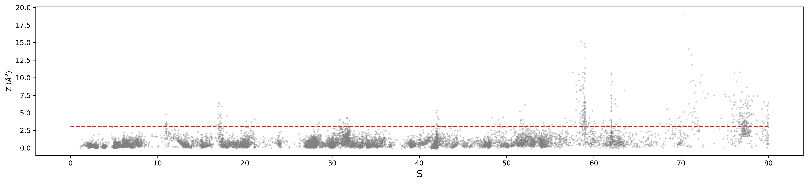

# Assessing the guessed path 

We can now use the *REPARAM.pdb* file as reference path for Path CVs. However, it is advisable to run some diagnostics to evaluate its reliability before utilizing it for resampling. For instance, we can see in practice how the Path CVs map the configurations of the system by projecting the SMD trajectory in the Path CV space. Fill in the following plumed template to re-analyze the SMD trajectory and get the values of $S(\mathbf{R})$ and $Z(\mathbf{R})$: 



 Click on the labels of the actions for more information on what each action computes 

<table><tr><td style="padding:1px"></td></tr><tr><td style="padding:1px"></td></tr><tr><td style="padding:0px"></td></tr>
</table>

<pre style="width=97%;">

MOLINFO
This command is used to provide information on the molecules that are present in your system. <a href="https://www.plumed.org/doc-master/user-doc/html/_m_o_l_i_n_f_o.html" style="color:green">More details</a><i></i>

 
STRUCTURE
a file in pdb format containing a reference structure<i></i>

=__FILL__
 The MOLINFO action with label <b></b> calculates something
WHOLEMOLECULES
This action is used to rebuild molecules that can become split by the periodic boundary conditions. <a href="https://www.plumed.org/doc-master/user-doc/html/_w_h_o_l_e_m_o_l_e_c_u_l_e_s.html" style="color:green">More details</a><i></i>

 
ENTITY0
the atoms that make up a molecule that you wish to align<i></i>

=__FILL__ 
ENTITY1
the atoms that make up a molecule that you wish to align<i></i>

=__FILL__
 <b name="data/data/plumed_Check.datp" onclick='showPath("data/data/plumed_Check.dat","data/data/plumed_Check.datp","data/data/plumed_Check.datp","brown")'>p</b>: 
PATHMSD
This Colvar calculates path collective variables. <a href="https://www.plumed.org/doc-master/user-doc/html/_p_a_t_h_m_s_d.html" style="color:green">More details</a><i></i>

 
REFERENCE
the pdb is needed to provide the various milestones<i></i>

=__FILL__  
LAMBDA
the lambda parameter is needed for smoothing, is in the units of plumed<i></i>

=__FILL__ 
NEIGH_STRIDE
how often the neighbor list needs to be calculated in time units<i></i>

=1 
NEIGH_SIZE
size of the neighbor list<i></i>

=8
 The PATHMSD action with label <b>p</b> calculates the following quantities:<table  align="center" frame="void" width="95%" cellpadding="5%"><tr><td width="5%"><b> Quantity </b>  </td><td><b> Description </b> </td></tr><tr><td width="5%">p.sss</td><td>the position on the path</td></tr><tr><td width="5%">p.zzz</td><td>the distance from the path</td></tr></table>
PRINT
Print quantities to a file. <a href="https://www.plumed.org/doc-master/user-doc/html/_p_r_i_n_t.html" style="color:green">More details</a><i></i>

 
ARG
the labels of the values that you would like to print to the file<i></i>

 
STRIDE
 the frequency with which the quantities of interest should be output<i></i>

=1 
FILE
the name of the file on which to output these quantities<i></i>

=colvar_check.dat
</pre>

<pre style="width=97%;">

MOLINFO
This command is used to provide information on the molecules that are present in your system. <a href="https://www.plumed.org/doc-master/user-doc/html/_m_o_l_i_n_f_o.html" style="color:green">More details</a><i></i>

 
STRUCTURE
a file in pdb format containing a reference structure<i></i>

=structure_protlig.pdb
 The MOLINFO action with label <b></b> calculates something
WHOLEMOLECULES
This action is used to rebuild molecules that can become split by the periodic boundary conditions. <a href="https://www.plumed.org/doc-master/user-doc/html/_w_h_o_l_e_m_o_l_e_c_u_l_e_s.html" style="color:green">More details</a><i></i>

 
ENTITY0
the atoms that make up a molecule that you wish to align<i></i>

=1-2259 
ENTITY1
the atoms that make up a molecule that you wish to align<i></i>

=2260-2275
 <b name="data/data/plumed_Check.dat_solp" onclick='showPath("data/data/plumed_Check.dat","data/data/plumed_Check.dat_solp","data/data/plumed_Check.dat_solp","brown")'>p</b>: 
PATHMSD
This Colvar calculates path collective variables. <a href="https://www.plumed.org/doc-master/user-doc/html/_p_a_t_h_m_s_d.html" style="color:green">More details</a><i></i>

 
REFERENCE
the pdb is needed to provide the various milestones<i></i>

=REPARAM_FINAL.pdb  
LAMBDA
the lambda parameter is needed for smoothing, is in the units of plumed<i></i>

=175.8859805591339 
NEIGH_STRIDE
how often the neighbor list needs to be calculated in time units<i></i>

=1 
NEIGH_SIZE
size of the neighbor list<i></i>

=8
 The PATHMSD action with label <b>p</b> calculates the following quantities:<table  align="center" frame="void" width="95%" cellpadding="5%"><tr><td width="5%"><b> Quantity </b>  </td><td><b> Description </b> </td></tr><tr><td width="5%">p.sss</td><td>the position on the path</td></tr><tr><td width="5%">p.zzz</td><td>the distance from the path</td></tr></table>
PRINT
Print quantities to a file. <a href="https://www.plumed.org/doc-master/user-doc/html/_p_r_i_n_t.html" style="color:green">More details</a><i></i>

 
ARG
the labels of the values that you would like to print to the file<i></i>

 
STRIDE
 the frequency with which the quantities of interest should be output<i></i>

=1 
FILE
the name of the file on which to output these quantities<i></i>

=colvar_check.dat
</pre>

  
As already mentioned, you can take the value of ``LAMBDA`` from the *out_rmsdmc.dat* file, generated by the last round of the **``rmsd_mc.sh``** script. We set ``NEIGH_STRIDE`` to 1, meaning that we update the neighbor list at each trajectory frame. Increasing such value during production runs is advisable to improve performance. However, note that here we are re-analizing _a posteriori_ an MD trajectory where frames were save every 500 steps, meaning that subsequent frames have a 1 ps separation in time. Finally, we want to compute Path CV values for each frame of the SMD trajectory, so we set a ``PRINT STRIDE`` of 1. 

We can now plot the data in *colvar_check.dat*, specifically $S(\mathbf{R})$ vs $Z(\mathbf{R})$: 

 

As we can see, the configurations sampled in the original SMD trajectory span the whole $S(\mathbf{R})$ space, ranging from $S(\mathbf{R})=1$, corresponding to the bound state, to $S(\mathbf{R})=80$, corresponding to the unbound state. Concerning the $Z(\mathbf{R})$ Path CV, we can see how the vast majority of configurations lay within a 3.0 $Å^2$ distance from the reference path, which sits at $Z(\mathbf{R})=0$. We can use this observation as a qualitative information regarding the reliability of the path, allowing us to evaluate its effectiveness in representing the underlying dissociation process. 

Note that as we move from the bound to the unbound states, the likelihood of encountering configurations lying at higher $Z(\mathbf{R})$ values increases. In this example, this behavior becomes particularly evident when approaching $S(\mathbf{R})=60$, where the ligand can already be considered partially detached (or, alternatively, weekly interacting) 
with the protein target. At this point, the configurational space of the ligand significantly increases, as the volumetric confinement imposed by the binding site is no longer present. Consequently, we cannot expect to strictly satisfy the above reported criterion for assessing the reliability of the path in this segment of the trajectory. 

