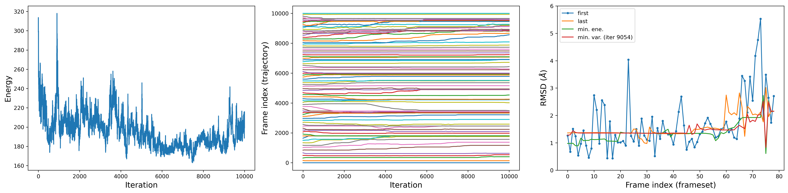
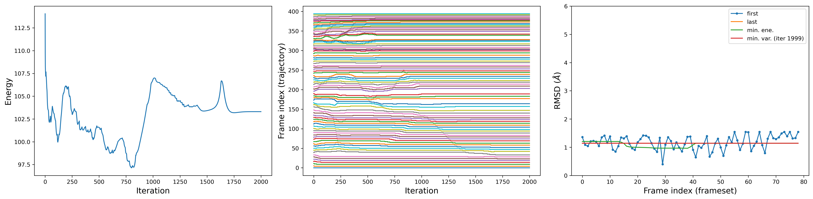

# Generating a guess path

Goal of the path parameterization stage is to identify a set (or frameset) of equidistant $N$ nodes (or frames) that provide a discrete representation of the process under investigation, here ligand binding. This significantly affects the quality of the resulting Path CVs, especially in the case of resampling efforts. Such frames should be as equidistant as possibile, and here we use the mean squared displacement (MSD) in the Cartesian space as metric. 

We use the 50 ns unbinding trajectory previously generated via SMD to pick these frames. Likely, we will not be able to strictly fulfill the equidistancy, as frames satisfying such condition may not exist in the original trajectory. Nevertheless, if the SMD trajectory is sufficiently enriched with configurations of the system progressively describing the unbinding process, we should be able to get reasonably close to our goal. We can then interpolate between the frames in this initial frameset to enrich it with intermediates, and finally repeat the search for equidistant frames on the enriched frameset. In this way, we should be able to converge to a series of subsequent frames with more uniform spacing.

We will take advantage of a few scripts, namely **``rmsd_mc.sh``**, **``morph_frameset.tcl``**, and **``occ_beta.tcl``**. Note that these are intended for use in the Visual Molecular Dynamics (VMD) software (https://www.ks.uiuc.edu/Research/vmd/), so you will need a working version of it. To set up the use of these scripts, source the **```env.sh```** file, which will set the environmental variable ``PATHTOOLS``.

[comment]: # (, which, to implement the described pipeline, we will use in the order rmsd_mc.sh -> morph_frameset.tcl -> rmsd_mc.sh.)
  

Although conceptually straighforward, this task in practice is non-trivial. Additionally, it consists of several technical steps, which we will go through.

### Search for equidistant frames (Round 1)

First, since the procedure is focused on the protein-ligand system, we can strip waters away for convenience of managing lighter files. There's plenty of alternatives to achieve this. As an example, if you use gromacs you can create an index file (e.g. *index_protlig.ndx*) containing a group with protein and ligand heavy atoms only, and use it on the SMD trajectory:
```
gmx trjconv -s steer.tpr -f steer.xtc -o steer_protlig.xtc -n index_protlig.ndx -pbc whole
```
In mapping ligand displacement, we may want to focus on a subselection of ligand's heavy atoms, for instance to exclude chemically equivalent or less relevant atoms. Already at this stage we can generate *steer_protlig.xtc* containing only the focused selection. In our case, we ecluded the two methyls from the isopropyl group in the ligand.

We can now use the **``rmsd_mc.sh``** script to seek for equidistant frames in the *steer_protlig.xtc* trajectory. To complete this task, the script computes the MSD between pairs of frames in the trajectory. To this end, we need to specify two atom selections: one to align the structure, and another to calculate the displacement. A suboptimal alignment can compromise the accurate tracking of ligand's displacement with respect to the binding site. To mitigate this effect, we should align the structure on a stable reference. For instance, here we use low-fluctuating $\alpha$ carbons of the intra-membrane region of the receptor, which were identified by measuring the root-mean-square fluctuation (RMSF) of all protein’s $\alpha$ carbons in plain (i.e. unbiased) MD simulations. As for the second selection, we use ligand's heavy atoms.

We can use the **occupancy** and **B-factor** fields of the PDB formatting to pass this information, i.e. the two selections, to **``rmsd_mc.sh``**. Here is an example showing that atoms 1146 and 1776 will be included for the alignment, and atoms 2260-2263 for the calculation.   
```
...
ATOM   1445  N   ILE X 184      60.430  32.080  40.340  0.00  0.00
ATOM   1446  CA  ILE X 184      60.590  31.740  38.910  1.00  0.00
ATOM   1447  CB  ILE X 184      60.770  30.200  38.800  0.00  0.00
...
ATOM   1775  N   TRP X 225      47.680  35.280  48.300  0.00  0.00
ATOM   1776  CA  TRP X 225      48.410  34.420  49.210  1.00  0.00
ATOM   1777  CB  TRP X 225      48.590  33.080  48.600  0.00  0.00
...
ATOM   2260  O17 ALP X 826      45.240  32.040  69.950  0.00  1.00
ATOM   2261  C16 ALP X 826      45.690  32.560  71.240  0.00  1.00
ATOM   2262  C18 ALP X 826      46.220  33.890  71.050  0.00  1.00
ATOM   2263  N19 ALP X 826      47.510  33.850  70.310  0.00  1.00
...
```
With this formatting in mind, we need to convert *steer_protlig.xtc* into a multipdb trajectory. For convenience, we can use the **``occ_beta.tcl``** script as follows:
```
vmd -dispdev text -e $PATHTOOLS/occ_beta.tcl -args -pdb ./structure_protlig.pdb -traj ./steer_protlig.xtc -protsel "resid 47 48 49 50 51 52 53 54 86 87 88 89 90 91 92 93 179 180 181 182 184 185 221 222 225 and name CA" -ligsel "resname ALP" -outpdb multipdb_occbeta.pdb >/dev/null
``` 
Note that, for application to different systems, you will need to adapt this command.

Here, *structure_protlig.pdb* is a pdb file of the protein-ligand complex only, consistent with *steer_protlig.xtc* trajectory, ``-protsel`` specifies the selection on which performing the alignment, and ``-ligsel`` is the selection for the displacement calculation. The script will generate a *multipdb_occbeta.pdb* trajectory, which can be used to feed the **``rmsd_mc.sh``** script as follows:
```
$PATHTOOLS/rmsd_mc.sh -f multipdb_occbeta.pdb -r 80 -n 10000 -c 1000 > out_rmsdmc.dat
```
With the above command, we perform 10000 iterations to generate a frameset comprising 80 frames. Note that the choice of 80 frames is a result of trial-and-error testing. Ideally, one should balance the need for high resolution in the chemical accuracy of the path, which requires a higher number of frames, with the practical availability of those configurations in the trajectory of the prior SMD simulation. As a general guideline, a frameset with a spacing between 1.0 - 1.5 $Å$ is recommended, and the number of frames should be adjusted accordingly.

Once the calculation is completed, you can visualize the obtained frameset (*REPARAM_FINAL.pdb*) in VMD.

Additional outputs are the *output.csv* and a series of *RMSD_DIAGONAL_N* files. The first column of *output.csv* monitors the energy at each iteration, while the second to last columns list the 80 frames selected from the original trajectory for each iteration. Finally, each *RMSD_DIAGONAL_N* file reports the distance between subsequent frames, in terms of root-mean-square deviation (RMSD), at iteration N. We can visualize these quantities in separate plots:



As you can see, the program did its best to identify equally spaced frames from the original trajectory, though the series of RMSD values is not uniform. 

### Enriching the frameset through interpolation

We can try to mitigate this by enriching the *REPARAM_FINAL.pdb* frameset with intermediate frames and then repeating the frame-selection procedure. To this end, we can use the **``morph_frameset.tcl``** script as follows:

```
vmd -dispdev text -e $PATHTOOLS/morph_frameset.tcl -args -pdb ./REPARAM_FINAL.pdb -morph 5 -outpdb REPARAM_FINAL_morphed.pdb >/dev/null
```

The script is set to interpolate between subsequent frames inserting 5 intermediate frames, generating an output trajectory named *REPARAM_FINAL_morphed.pdb*. You can easily modify the command to increase/reduce this parameter and check the effect yourself. As a general indication, generating a low number of intermediates reduces chances to produce non-physical structures, which may then be included in the final frameset.

### Search for equidistant frames (Round 2)

Finally, we repeat the frame selection procedure:
```
$PATHTOOLS/rmsd_mc.sh -f REPARAM_FINAL_morphed.pdb -r 80 -n 10000 -c 1000 > out_rmsdmc.dat
```
The task is relatively simpler now, so we should expect less iterations. Again, we can visulize the output quantities:



We can clearly see the improvement achieved in the last plot, which reports the RMSD between subsequent frames. Specifically, the RMSDs lay on a flat line, as we should expect when achieving equidistance, here sitting at an RMSD of about 1.1 $Å$.

Take now note of the last few lines of the *out_rmsdmc.dat* file, in particular of the entry ``LAMBDA``, as we will need to specify this value for using Path CVs. Note that here ``LAMBDA`` is expressed in $Å^{-2}$ units. In our example, we obtained a value of 1.759 $Å^{-2}$.

As a final remark, despite numbers may seem pretty, it is always advisable to visualize in VMD the resulting *REPARAM_FINAL.pdb*, to make sure to have not included remarkably unphysical structures.

We provide a script named **``README.sh``** through which you can carry out the whole pipeline.


