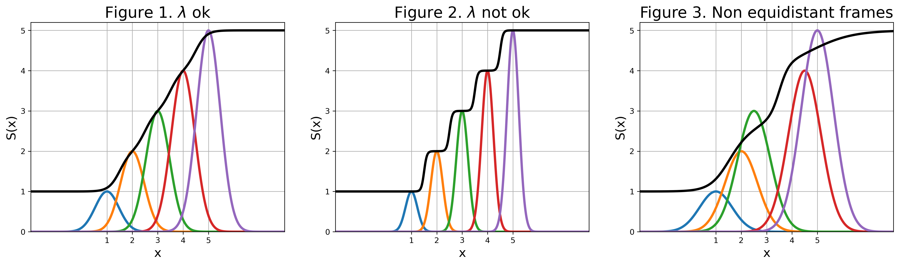

# PathCVs background & overview

Path Collective Variables (Path CVs) are designed to describe complex molecular transitions that are difficult to capture with a limited number of standard collective variables (https://doi.org/10.1063/1.2432340). The putative reaction coordinate is therefore mapped using two CVs, which are functions of the configurational space $\mathbf{R}$:  

$S(\mathbf{R})=\frac{\sum_{i=1}^{N}i\text{e}^{-\lambda (\mathbf{R}-\mathbf{R}(i))^{2}}}{\sum_{i=1}^{N}\text{e}^{-\lambda (\mathbf{R}-\mathbf{R}(i))^{2}}}$

$Z(\mathbf{R})=-\frac{1}{\lambda}\ln{\left(\sum_{i=1}^{N}\text{e}^{-\lambda (\mathbf{R}-\mathbf{R}(i))^{2}}\right)}$

where $i$ is an index ranging from $1$ to $N$. In this framework, $S(\mathbf{R})$ represents the progression along the guessed path from the initial to the final reference state, while $Z(\mathbf{R})$ measures the distance from it, providing the path with a certain degree of non-locality. Notably, both the initial and final states should correspond to thermodynamically stable minima, and should be known in advance. 

Path CVs must be parameterized in terms of a set of $N$ nodes (or frames) which provide a discrete representation of the reaction coordinate to be described. In their original implementation, $\left(\mathbf{R}-\mathbf{R}(i)\right)^{2}$ is calculated as the mean squared displacement (MSD) in the Cartesian space for a subset of atoms of the system, though alternative metrics may be employed. Finally, $\lambda$ is a tunable parameter that controls the smoothness of the mapping from the configurational space to the current set of frames (or frameset).  

For Path CVs to be effective, a set of conditions must be met:
1.	The nodal points $\mathbf{R}(i)$ in the frameset should be as equidistant as possible
2.	$\lambda$ should be commensurate with the inverse of the mean squared displacement between consecutive frames
3.	The frameset used to describe the reaction coordinate must provide a good approximation of the minimum free energy pathway from the initial and final reference states  
  
The third condition pertains to how accurately the parameterized $S(\mathbf{R})$ reflects the actual reaction coordinate, which can be addressed through variational optimization procedures. In contrast, points 1 and 2 concern with the proper parameterization of the guessed path, regardless of its physical relevance. Although primarily technical, these points significantly affect the quality of the resulting Path CVs, especially in the case of resampling efforts.

Consider, for instance, a path composed of five perfectly equidistant frames, where each frame is a function of the coordinate $x$ only, for simplicity. The variable $S(x)$ can be viewed as a normalized sum of Gaussian functions, with same width (determined by $\lambda$) but varying heights.
As **Figure 1** shows, a proper choice of $\lambda$ results in a smooth mapping of $S(x)$ (black line).
Conversely, if one had chosen an incorrect $\lambda$ value, such as one that is too large relative to the optimal range, the result would resemble the situation shown in **Figure 2**. In this case, the mapping is insufficiently smooth, potentially causing artifacts in the dynamics or even in the resulting free energy surface, when such a path is applied in metadynamics resampling.

As a rule of thumb, $\lambda$ shoud be chosen according to:

$\lambda=-\frac{\ln{0.1}}{\langle MSD\rangle}$

where $\langle  MSD\rangle$ is the average MSD evaluated along the entire frameset.

However, in practical applications, particularly when the path is parameterized using previously sampled configurations, satisfying the equidistance condition is not trivial, and one often runs into a situation like the one shown **Figure 3**. Note that in this case, the value of $\lambda$ is indeed consistent with the inverse of the average MSD (i.e. the rule of thumb for $\lambda$ applies). Nevertheless, the failure to maintain sufficiently equidistant consecutive frames leads to poor behavior of $S(x)$, as illustrated in the plot. 

This tutorial focuses on the parameterization of an initial guess path for a drug-target complex binding, using steered MD simulations to generate the initial frameset, and starting from the bound state of the complex. For the generation of the initial guess path we will make use of Tcl scripts kindly provided by the author of the method (<u>Davide Branduardi</u>).

At [this](https://github.com/mbernett/zip_for_tutorials/tree/master/analysis_path_tutorial.ipynb) link we provide a Jupyter Notebook to reproduce the plots shown in this tutorial. We also provide inputs to run the simulations, as well as a [sample output trajectory](https://github.com/mbernett/zip_for_tutorials/tree/master/tutorial_binding_path_outputs/SMD_50ns) from steered MD.

