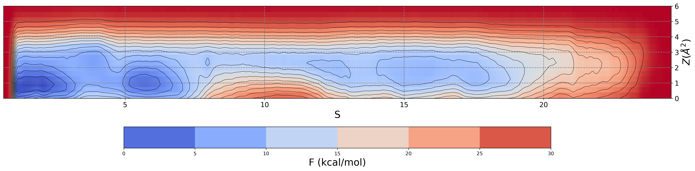
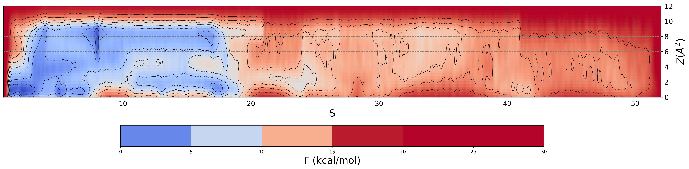

# Sampling the guessed path

We can use the parameterized guessed path in production simulations using any sampling method relying on the use of CVs. For instance, metadynamics (metad) simulations can be conducted to reconstruct the free energy surface in the Path CV space. Here, we will show how to set up a metad simulation leveraging Path CVs. Note that this is only an illustrative example, on how to set up and run the simulation, with no intention of achieving here a converged free energy surface. 

An important aspect here is that you may need to renumber the atom number column (second column) of the *REPARAM_FINAL.pdb* file. This is because the atom indices in *REPARAM_FINAL.pdb* are consistent with the lighter version of the system, i.e. no hydrogens, no membrane lipids, and no waters. Since we are now going to conduct a simulation of the whole system, atom information for the atoms inside the *REPARAM_FINAL.pdb*, particularly the atom index, need to be consistent with those in the whole system. Assuming we need to achieve such renumbering, we produce a *REPARAM_FINAL_renumber.pdb* file.

We now have all we need to set up a metad simulation. We will bias the $S(\mathbf{R})$ and $Z(\mathbf{R})$ CVs. We take metad simulation parameters from this publication: https://doi.org/10.1021/acs.jctc.9b00450
Specifically, we set Gaussian width to 0.1 for $S(\mathbf{R})$ and 1 $Å^2$ for $Z(\mathbf{R})$, Gaussian height to 0.2 kcal/mol, temperature to 310 K, bias factor to 15, and Gaussians deposition time  to 1 ps. Finally, we can re-sample remaining closer to the configurational space sampled by the original SMD that we have used to parameterize the guess path. To this end, we can limit the region of the phase space accessible during the simulation by placing a suitable ``UPPER_WALL`` on $Z(\mathbf{R})$, e.g. at 3.0 $Å^2$. Fill in the following plumed template to perform such a metad simulation:


<div class="plumedpreheader">
<div class="headerInfo" id="value_details_data/data/plumed_Metad.dat"> Click on the labels of the actions for more information on what each action computes </div>
<div class="containerBadge">
<div class="headerBadge"><a href="plumed_Metad.dat.plumed.stderr"></a></div>
<div class="headerBadge"><a href="plumed_Metad.dat.plumed_master.stderr"></a></div>
<div class="headerBadge"></div>
</div>
</div>
<div id="data/data/plumed_Metad.dat_short">
<pre class="plumedlisting">
<span class="plumedtooltip" style="color:green">MOLINFO<span class="right">This command is used to provide information on the molecules that are present in your system. <a href="https://www.plumed.org/doc-master/user-doc/html/MOLINFO" style="color:green">More details</a><i></i></span></span> <span class="plumedtooltip">STRUCTURE<span class="right">a file in pdb format containing a reference structure<i></i></span></span>=<span style="background-color:yellow">__FILL__</span>
<br/><span style="display:none;" id="data/data/plumed_Metad.dat">The MOLINFO action with label <b></b> calculates something</span><span class="plumedtooltip" style="color:green">WHOLEMOLECULES<span class="right">This action is used to rebuild molecules that can become split by the periodic boundary conditions. <a href="https://www.plumed.org/doc-master/user-doc/html/WHOLEMOLECULES" style="color:green">More details</a><i></i></span></span> <span class="plumedtooltip">ENTITY0<span class="right">the atoms that make up a molecule that you wish to align<i></i></span></span>=<span style="background-color:yellow">__FILL__</span> <span class="plumedtooltip">ENTITY1<span class="right">the atoms that make up a molecule that you wish to align<i></i></span></span>=<span style="background-color:yellow">__FILL__</span>
<br/><b name="data/data/plumed_Metad.datca" onclick='showPath("data/data/plumed_Metad.dat","data/data/plumed_Metad.datca","data/data/plumed_Metad.datca","brown")'>ca</b>: <span class="plumedtooltip" style="color:green">CENTER<span class="right">Calculate the center for a group of atoms, with arbitrary weights. <a href="https://www.plumed.org/doc-master/user-doc/html/CENTER" style="color:green">More details</a><i></i></span></span> <span class="plumedtooltip">ATOMS<span class="right">the group of atoms that appear in the definition of this center<i></i></span></span>=730,741,751,763,782,798,815,822,1338,1349,1365,1379,1389,1400,1419,1443,2823,2844,2868,2874,2909,2928,3534,3554,3598
<span style="display:none;" id="data/data/plumed_Metad.datca">The CENTER action with label <b>ca</b> calculates the following quantities:<table  align="center" frame="void" width="95%" cellpadding="5%"><tr><td width="5%"><b> Quantity </b>  </td><td><b> Description </b> </td></tr><tr><td width="5%">ca.value</td><td>the position of the center of mass</td></tr></table></span><b name="data/data/plumed_Metad.datalp" onclick='showPath("data/data/plumed_Metad.dat","data/data/plumed_Metad.datalp","data/data/plumed_Metad.datalp","brown")'>alp</b>: <span class="plumedtooltip" style="color:green">CENTER<span class="right">Calculate the center for a group of atoms, with arbitrary weights. <a href="https://www.plumed.org/doc-master/user-doc/html/CENTER" style="color:green">More details</a><i></i></span></span> <span class="plumedtooltip">ATOMS<span class="right">the group of atoms that appear in the definition of this center<i></i></span></span>=28695-28736

<span style="display:none;" id="data/data/plumed_Metad.datalp">The CENTER action with label <b>alp</b> calculates the following quantities:<table  align="center" frame="void" width="95%" cellpadding="5%"><tr><td width="5%"><b> Quantity </b>  </td><td><b> Description </b> </td></tr><tr><td width="5%">alp.value</td><td>the position of the center of mass</td></tr></table></span><b name="data/data/plumed_Metad.datd" onclick='showPath("data/data/plumed_Metad.dat","data/data/plumed_Metad.datd","data/data/plumed_Metad.datd","brown")'>d</b>: <span class="plumedtooltip" style="color:green">DISTANCE<span class="right">Calculate the distance/s between pairs of atoms. <a href="https://www.plumed.org/doc-master/user-doc/html/DISTANCE" style="color:green">More details</a><i></i></span></span> <span class="plumedtooltip">ATOMS<span class="right">the pair of atom that we are calculating the distance between<i></i></span></span>=<b name="data/data/plumed_Metad.datca">ca</b>,<b name="data/data/plumed_Metad.datalp">alp</b>

<span style="display:none;" id="data/data/plumed_Metad.datd">The DISTANCE action with label <b>d</b> calculates the following quantities:<table  align="center" frame="void" width="95%" cellpadding="5%"><tr><td width="5%"><b> Quantity </b>  </td><td><b> Description </b> </td></tr><tr><td width="5%">d.value</td><td>the DISTANCE between this pair of atoms</td></tr></table></span><b name="data/data/plumed_Metad.datp" onclick='showPath("data/data/plumed_Metad.dat","data/data/plumed_Metad.datp","data/data/plumed_Metad.datp","brown")'>p</b>: <span class="plumedtooltip" style="color:green">PATHMSD<span class="right">This Colvar calculates path collective variables. <a href="https://www.plumed.org/doc-master/user-doc/html/PATHMSD" style="color:green">More details</a><i></i></span></span> <span class="plumedtooltip">REFERENCE<span class="right">the pdb is needed to provide the various milestones<i></i></span></span>=<span style="background-color:yellow">__FILL__</span>  <span class="plumedtooltip">LAMBDA<span class="right">the lambda parameter is needed for smoothing, is in the units of plumed<i></i></span></span>=<span style="background-color:yellow">__FILL__</span> <span class="plumedtooltip">NEIGH_STRIDE<span class="right">how often the neighbor list needs to be calculated in time units<i></i></span></span>=4 <span class="plumedtooltip">NEIGH_SIZE<span class="right">size of the neighbor list<i></i></span></span>=8

<span style="display:none;" id="data/data/plumed_Metad.datp">The PATHMSD action with label <b>p</b> calculates the following quantities:<table  align="center" frame="void" width="95%" cellpadding="5%"><tr><td width="5%"><b> Quantity </b>  </td><td><b> Description </b> </td></tr><tr><td width="5%">p.sss</td><td>the position on the path</td></tr><tr><td width="5%">p.zzz</td><td>the distance from the path</td></tr></table></span><b name="data/data/plumed_Metad.datmeta" onclick='showPath("data/data/plumed_Metad.dat","data/data/plumed_Metad.datmeta","data/data/plumed_Metad.datmeta","brown")'>meta</b>: <span class="plumedtooltip" style="color:green">METAD<span class="right">Used to performed metadynamics on one or more collective variables. <a href="https://www.plumed.org/doc-master/user-doc/html/METAD" style="color:green">More details</a><i></i></span></span> <span class="plumedtooltip">ARG<span class="right">the labels of the scalars on which the bias will act<i></i></span></span>=<b name="data/data/plumed_Metad.datp">p.sss</b>,<b name="data/data/plumed_Metad.datp">p.zzz</b> <span class="plumedtooltip">SIGMA<span class="right">the widths of the Gaussian hills<i></i></span></span>=<span style="background-color:yellow">__FILL__</span><span style="background-color:yellow">__FILL__</span> <span class="plumedtooltip">HEIGHT<span class="right">the heights of the Gaussian hills<i></i></span></span>=<span style="background-color:yellow">__FILL__</span> <span class="plumedtooltip">TEMP<span class="right">the system temperature - this is only needed if you are doing well-tempered metadynamics<i></i></span></span>=<span style="background-color:yellow">__FILL__</span> <span class="plumedtooltip">BIASFACTOR<span class="right">use well tempered metadynamics and use this bias factor<i></i></span></span>=<span style="background-color:yellow">__FILL__</span> <span class="plumedtooltip">PACE<span class="right">the frequency for hill addition<i></i></span></span>=<span style="background-color:yellow">__FILL__</span>
<br/><span style="display:none;" id="data/data/plumed_Metad.datmeta">The METAD action with label <b>meta</b> calculates the following quantities:<table  align="center" frame="void" width="95%" cellpadding="5%"><tr><td width="5%"><b> Quantity </b>  </td><td><b> Description </b> </td></tr><tr><td width="5%">meta.bias</td><td>the instantaneous value of the bias potential</td></tr></table></span><b name="data/data/plumed_Metad.datuwall_z" onclick='showPath("data/data/plumed_Metad.dat","data/data/plumed_Metad.datuwall_z","data/data/plumed_Metad.datuwall_z","brown")'>uwall_z</b>: <span class="plumedtooltip" style="color:green">UPPER_WALLS<span class="right">Defines a wall for the value of one or more collective variables, <a href="https://www.plumed.org/doc-master/user-doc/html/UPPER_WALLS" style="color:green">More details</a><i></i></span></span> <span class="plumedtooltip">ARG<span class="right">the arguments on which the bias is acting<i></i></span></span>=<b name="data/data/plumed_Metad.datp">p.zzz</b> <span class="plumedtooltip">AT<span class="right">the positions of the wall<i></i></span></span>=<span style="background-color:yellow">__FILL__</span> <span class="plumedtooltip">KAPPA<span class="right">the force constant for the wall<i></i></span></span>=<span style="background-color:yellow">__FILL__</span>
<span style="display:none;" id="data/data/plumed_Metad.datuwall_z">The UPPER_WALLS action with label <b>uwall_z</b> calculates the following quantities:<table  align="center" frame="void" width="95%" cellpadding="5%"><tr><td width="5%"><b> Quantity </b>  </td><td><b> Description </b> </td></tr><tr><td width="5%">uwall_z.bias</td><td>the instantaneous value of the bias potential</td></tr><tr><td width="5%">uwall_z.force2</td><td>the instantaneous value of the squared force due to this bias potential</td></tr></table></span><b name="data/data/plumed_Metad.datlwall_s_o" onclick='showPath("data/data/plumed_Metad.dat","data/data/plumed_Metad.datlwall_s_o","data/data/plumed_Metad.datlwall_s_o","brown")'>lwall_s_o</b>: <span class="plumedtooltip" style="color:green">LOWER_WALLS<span class="right">Defines a wall for the value of one or more collective variables, <a href="https://www.plumed.org/doc-master/user-doc/html/LOWER_WALLS" style="color:green">More details</a><i></i></span></span> <span class="plumedtooltip">ARG<span class="right">the arguments on which the bias is acting<i></i></span></span>=<b name="data/data/plumed_Metad.datp">p.sss</b> <span class="plumedtooltip">AT<span class="right">the positions of the wall<i></i></span></span>=1  <span class="plumedtooltip">KAPPA<span class="right">the force constant for the wall<i></i></span></span>=<span style="background-color:yellow">__FILL__</span>
<span style="display:none;" id="data/data/plumed_Metad.datlwall_s_o">The LOWER_WALLS action with label <b>lwall_s_o</b> calculates the following quantities:<table  align="center" frame="void" width="95%" cellpadding="5%"><tr><td width="5%"><b> Quantity </b>  </td><td><b> Description </b> </td></tr><tr><td width="5%">lwall_s_o.bias</td><td>the instantaneous value of the bias potential</td></tr><tr><td width="5%">lwall_s_o.force2</td><td>the instantaneous value of the squared force due to this bias potential</td></tr></table></span><b name="data/data/plumed_Metad.datuwall_s_i" onclick='showPath("data/data/plumed_Metad.dat","data/data/plumed_Metad.datuwall_s_i","data/data/plumed_Metad.datuwall_s_i","brown")'>uwall_s_i</b>: <span class="plumedtooltip" style="color:green">UPPER_WALLS<span class="right">Defines a wall for the value of one or more collective variables, <a href="https://www.plumed.org/doc-master/user-doc/html/UPPER_WALLS" style="color:green">More details</a><i></i></span></span> <span class="plumedtooltip">ARG<span class="right">the arguments on which the bias is acting<i></i></span></span>=<b name="data/data/plumed_Metad.datp">p.sss</b> <span class="plumedtooltip">AT<span class="right">the positions of the wall<i></i></span></span>=80 <span class="plumedtooltip">KAPPA<span class="right">the force constant for the wall<i></i></span></span>=<span style="background-color:yellow">__FILL__</span>
<br/><span style="display:none;" id="data/data/plumed_Metad.datuwall_s_i">The UPPER_WALLS action with label <b>uwall_s_i</b> calculates the following quantities:<table  align="center" frame="void" width="95%" cellpadding="5%"><tr><td width="5%"><b> Quantity </b>  </td><td><b> Description </b> </td></tr><tr><td width="5%">uwall_s_i.bias</td><td>the instantaneous value of the bias potential</td></tr><tr><td width="5%">uwall_s_i.force2</td><td>the instantaneous value of the squared force due to this bias potential</td></tr></table></span><span class="plumedtooltip" style="color:green">PRINT<span class="right">Print quantities to a file. <a href="https://www.plumed.org/doc-master/user-doc/html/PRINT" style="color:green">More details</a><i></i></span></span> <span class="plumedtooltip">ARG<span class="right">the labels of the values that you would like to print to the file<i></i></span></span>=* <span class="plumedtooltip">STRIDE<span class="right"> the frequency with which the quantities of interest should be output<i></i></span></span>=500 <span class="plumedtooltip">FILE<span class="right">the name of the file on which to output these quantities<i></i></span></span>=colvar_metad.dat
</pre></div>
<div style="display:none;" id="data/data/plumed_Metad.dat_long"><pre class="plumedlisting">
<span class="plumedtooltip" style="color:green">MOLINFO<span class="right">This command is used to provide information on the molecules that are present in your system. <a href="https://www.plumed.org/doc-master/user-doc/html/MOLINFO" style="color:green">More details</a><i></i></span></span> <span class="plumedtooltip">STRUCTURE<span class="right">a file in pdb format containing a reference structure<i></i></span></span>=structure.pdb

<span style="display:none;" id="data/data/plumed_Metad.dat_sol">The MOLINFO action with label <b></b> calculates something</span><span class="plumedtooltip" style="color:green">WHOLEMOLECULES<span class="right">This action is used to rebuild molecules that can become split by the periodic boundary conditions. <a href="https://www.plumed.org/doc-master/user-doc/html/WHOLEMOLECULES" style="color:green">More details</a><i></i></span></span> <span class="plumedtooltip">ENTITY0<span class="right">the atoms that make up a molecule that you wish to align<i></i></span></span>=1-4570 <span class="plumedtooltip">ENTITY1<span class="right">the atoms that make up a molecule that you wish to align<i></i></span></span>=28695-28736

<b name="data/data/plumed_Metad.dat_solca" onclick='showPath("data/data/plumed_Metad.dat","data/data/plumed_Metad.dat_solca","data/data/plumed_Metad.dat_solca","brown")'>ca</b>: <span class="plumedtooltip" style="color:green">CENTER<span class="right">Calculate the center for a group of atoms, with arbitrary weights. <a href="https://www.plumed.org/doc-master/user-doc/html/CENTER" style="color:green">More details</a><i></i></span></span> <span class="plumedtooltip">ATOMS<span class="right">the group of atoms that appear in the definition of this center<i></i></span></span>=730,741,751,763,782,798,815,822,1338,1349,1365,1379,1389,1400,1419,1443,2823,2844,2868,2874,2909,2928,3534,3554,3598
<span style="display:none;" id="data/data/plumed_Metad.dat_solca">The CENTER action with label <b>ca</b> calculates the following quantities:<table  align="center" frame="void" width="95%" cellpadding="5%"><tr><td width="5%"><b> Quantity </b>  </td><td><b> Description </b> </td></tr><tr><td width="5%">ca.value</td><td>the position of the center of mass</td></tr></table></span><b name="data/data/plumed_Metad.dat_solalp" onclick='showPath("data/data/plumed_Metad.dat","data/data/plumed_Metad.dat_solalp","data/data/plumed_Metad.dat_solalp","brown")'>alp</b>: <span class="plumedtooltip" style="color:green">CENTER<span class="right">Calculate the center for a group of atoms, with arbitrary weights. <a href="https://www.plumed.org/doc-master/user-doc/html/CENTER" style="color:green">More details</a><i></i></span></span> <span class="plumedtooltip">ATOMS<span class="right">the group of atoms that appear in the definition of this center<i></i></span></span>=28695-28736

<span style="display:none;" id="data/data/plumed_Metad.dat_solalp">The CENTER action with label <b>alp</b> calculates the following quantities:<table  align="center" frame="void" width="95%" cellpadding="5%"><tr><td width="5%"><b> Quantity </b>  </td><td><b> Description </b> </td></tr><tr><td width="5%">alp.value</td><td>the position of the center of mass</td></tr></table></span><b name="data/data/plumed_Metad.dat_sold" onclick='showPath("data/data/plumed_Metad.dat","data/data/plumed_Metad.dat_sold","data/data/plumed_Metad.dat_sold","brown")'>d</b>: <span class="plumedtooltip" style="color:green">DISTANCE<span class="right">Calculate the distance/s between pairs of atoms. <a href="https://www.plumed.org/doc-master/user-doc/html/DISTANCE" style="color:green">More details</a><i></i></span></span> <span class="plumedtooltip">ATOMS<span class="right">the pair of atom that we are calculating the distance between<i></i></span></span>=<b name="data/data/plumed_Metad.dat_solca">ca</b>,<b name="data/data/plumed_Metad.dat_solalp">alp</b>

<span style="display:none;" id="data/data/plumed_Metad.dat_sold">The DISTANCE action with label <b>d</b> calculates the following quantities:<table  align="center" frame="void" width="95%" cellpadding="5%"><tr><td width="5%"><b> Quantity </b>  </td><td><b> Description </b> </td></tr><tr><td width="5%">d.value</td><td>the DISTANCE between this pair of atoms</td></tr></table></span><b name="data/data/plumed_Metad.dat_solp" onclick='showPath("data/data/plumed_Metad.dat","data/data/plumed_Metad.dat_solp","data/data/plumed_Metad.dat_solp","brown")'>p</b>: <span class="plumedtooltip" style="color:green">PATHMSD<span class="right">This Colvar calculates path collective variables. <a href="https://www.plumed.org/doc-master/user-doc/html/PATHMSD" style="color:green">More details</a><i></i></span></span> <span class="plumedtooltip">REFERENCE<span class="right">the pdb is needed to provide the various milestones<i></i></span></span>=REPARAM_FINAL_renum.pdb  <span class="plumedtooltip">LAMBDA<span class="right">the lambda parameter is needed for smoothing, is in the units of plumed<i></i></span></span>=175.8859805591339 <span class="plumedtooltip">NEIGH_STRIDE<span class="right">how often the neighbor list needs to be calculated in time units<i></i></span></span>=4 <span class="plumedtooltip">NEIGH_SIZE<span class="right">size of the neighbor list<i></i></span></span>=8

<span style="display:none;" id="data/data/plumed_Metad.dat_solp">The PATHMSD action with label <b>p</b> calculates the following quantities:<table  align="center" frame="void" width="95%" cellpadding="5%"><tr><td width="5%"><b> Quantity </b>  </td><td><b> Description </b> </td></tr><tr><td width="5%">p.sss</td><td>the position on the path</td></tr><tr><td width="5%">p.zzz</td><td>the distance from the path</td></tr></table></span><b name="data/data/plumed_Metad.dat_solmeta" onclick='showPath("data/data/plumed_Metad.dat","data/data/plumed_Metad.dat_solmeta","data/data/plumed_Metad.dat_solmeta","brown")'>meta</b>: <span class="plumedtooltip" style="color:green">METAD<span class="right">Used to performed metadynamics on one or more collective variables. <a href="https://www.plumed.org/doc-master/user-doc/html/METAD" style="color:green">More details</a><i></i></span></span> <span class="plumedtooltip">ARG<span class="right">the labels of the scalars on which the bias will act<i></i></span></span>=<b name="data/data/plumed_Metad.dat_solp">p.sss</b>,<b name="data/data/plumed_Metad.dat_solp">p.zzz</b> <span class="plumedtooltip">SIGMA<span class="right">the widths of the Gaussian hills<i></i></span></span>=0.1,0.01 <span class="plumedtooltip">HEIGHT<span class="right">the heights of the Gaussian hills<i></i></span></span>=0.84 <span class="plumedtooltip">TEMP<span class="right">the system temperature - this is only needed if you are doing well-tempered metadynamics<i></i></span></span>=310 <span class="plumedtooltip">BIASFACTOR<span class="right">use well tempered metadynamics and use this bias factor<i></i></span></span>=15 <span class="plumedtooltip">PACE<span class="right">the frequency for hill addition<i></i></span></span>=500

<span style="display:none;" id="data/data/plumed_Metad.dat_solmeta">The METAD action with label <b>meta</b> calculates the following quantities:<table  align="center" frame="void" width="95%" cellpadding="5%"><tr><td width="5%"><b> Quantity </b>  </td><td><b> Description </b> </td></tr><tr><td width="5%">meta.bias</td><td>the instantaneous value of the bias potential</td></tr></table></span><b name="data/data/plumed_Metad.dat_soluwall_z" onclick='showPath("data/data/plumed_Metad.dat","data/data/plumed_Metad.dat_soluwall_z","data/data/plumed_Metad.dat_soluwall_z","brown")'>uwall_z</b>: <span class="plumedtooltip" style="color:green">UPPER_WALLS<span class="right">Defines a wall for the value of one or more collective variables, <a href="https://www.plumed.org/doc-master/user-doc/html/UPPER_WALLS" style="color:green">More details</a><i></i></span></span> <span class="plumedtooltip">ARG<span class="right">the arguments on which the bias is acting<i></i></span></span>=<b name="data/data/plumed_Metad.dat_solp">p.zzz</b> <span class="plumedtooltip">AT<span class="right">the positions of the wall<i></i></span></span>=0.03 <span class="plumedtooltip">KAPPA<span class="right">the force constant for the wall<i></i></span></span>=418400.0
<span style="display:none;" id="data/data/plumed_Metad.dat_soluwall_z">The UPPER_WALLS action with label <b>uwall_z</b> calculates the following quantities:<table  align="center" frame="void" width="95%" cellpadding="5%"><tr><td width="5%"><b> Quantity </b>  </td><td><b> Description </b> </td></tr><tr><td width="5%">uwall_z.bias</td><td>the instantaneous value of the bias potential</td></tr><tr><td width="5%">uwall_z.force2</td><td>the instantaneous value of the squared force due to this bias potential</td></tr></table></span><b name="data/data/plumed_Metad.dat_sollwall_s_o" onclick='showPath("data/data/plumed_Metad.dat","data/data/plumed_Metad.dat_sollwall_s_o","data/data/plumed_Metad.dat_sollwall_s_o","brown")'>lwall_s_o</b>: <span class="plumedtooltip" style="color:green">LOWER_WALLS<span class="right">Defines a wall for the value of one or more collective variables, <a href="https://www.plumed.org/doc-master/user-doc/html/LOWER_WALLS" style="color:green">More details</a><i></i></span></span> <span class="plumedtooltip">ARG<span class="right">the arguments on which the bias is acting<i></i></span></span>=<b name="data/data/plumed_Metad.dat_solp">p.sss</b> <span class="plumedtooltip">AT<span class="right">the positions of the wall<i></i></span></span>=1  <span class="plumedtooltip">KAPPA<span class="right">the force constant for the wall<i></i></span></span>=20920.0
<span style="display:none;" id="data/data/plumed_Metad.dat_sollwall_s_o">The LOWER_WALLS action with label <b>lwall_s_o</b> calculates the following quantities:<table  align="center" frame="void" width="95%" cellpadding="5%"><tr><td width="5%"><b> Quantity </b>  </td><td><b> Description </b> </td></tr><tr><td width="5%">lwall_s_o.bias</td><td>the instantaneous value of the bias potential</td></tr><tr><td width="5%">lwall_s_o.force2</td><td>the instantaneous value of the squared force due to this bias potential</td></tr></table></span><b name="data/data/plumed_Metad.dat_soluwall_s_i" onclick='showPath("data/data/plumed_Metad.dat","data/data/plumed_Metad.dat_soluwall_s_i","data/data/plumed_Metad.dat_soluwall_s_i","brown")'>uwall_s_i</b>: <span class="plumedtooltip" style="color:green">UPPER_WALLS<span class="right">Defines a wall for the value of one or more collective variables, <a href="https://www.plumed.org/doc-master/user-doc/html/UPPER_WALLS" style="color:green">More details</a><i></i></span></span> <span class="plumedtooltip">ARG<span class="right">the arguments on which the bias is acting<i></i></span></span>=<b name="data/data/plumed_Metad.dat_solp">p.sss</b> <span class="plumedtooltip">AT<span class="right">the positions of the wall<i></i></span></span>=80 <span class="plumedtooltip">KAPPA<span class="right">the force constant for the wall<i></i></span></span>=20920.0

<span style="display:none;" id="data/data/plumed_Metad.dat_soluwall_s_i">The UPPER_WALLS action with label <b>uwall_s_i</b> calculates the following quantities:<table  align="center" frame="void" width="95%" cellpadding="5%"><tr><td width="5%"><b> Quantity </b>  </td><td><b> Description </b> </td></tr><tr><td width="5%">uwall_s_i.bias</td><td>the instantaneous value of the bias potential</td></tr><tr><td width="5%">uwall_s_i.force2</td><td>the instantaneous value of the squared force due to this bias potential</td></tr></table></span><span class="plumedtooltip" style="color:green">PRINT<span class="right">Print quantities to a file. <a href="https://www.plumed.org/doc-master/user-doc/html/PRINT" style="color:green">More details</a><i></i></span></span> <span class="plumedtooltip">ARG<span class="right">the labels of the values that you would like to print to the file<i></i></span></span>=* <span class="plumedtooltip">STRIDE<span class="right"> the frequency with which the quantities of interest should be output<i></i></span></span>=500 <span class="plumedtooltip">FILE<span class="right">the name of the file on which to output these quantities<i></i></span></span>=colvar_metad.dat
</pre></div>

  
To run the simulation with the GROMACS md engine, just enter:
```
gmx_mpi grompp -f md.mdp -c structure.gro -p box_system_GMX.top -o metad.tpr -maxwarn 2
mpirun -n 8 gmx_mpi mdrun -deffnm metad -plumed plumed_Metad.dat -ntomp 1
```
As in any metad simulation, plumed will produce a *HILLS* file, which you can use to reconstruct the free energy surface using the **``sum_hills``** module, as follows:

```
plumed sum_hills --hills HILLS --mintozero --kt 2.6
```
This results in a *fes.dat* file, that we can finally plot to visualize the reconstructed free energy surface. Here is the result of a 50 ns metad simulation:



In usual production scenarios, you may envisage a more generous exploration of the configurational space around the reference path. For instance, you can adapt the above plumed template to repeat the simulation with a larger ```UPPER_WALL```. Here is the resulting free energy surface using 9.0 $Å^2$, with the same simulation time of 50 ns:



Note that:

* Expanding the allowable range of $Z(\mathbf{R})$ for sampling might promote a broader, non-local search for additional routes along the reference path ($Z(\mathbf{R})=0$). As long as these routes remain reasonably close to it, they could suggest alternative and possibly more favourable mechanisms for the binding process.

* The further you go on $Z(\mathbf{R})$, the less meaningful and more degenerate will become the mapping on $S(\mathbf{R})$, so that sampling will become inconvenient and, most remarkably, less efficient the exploitation of your computational resources.

It is also important to note that the metad simulation time of 50 ns used here is solely intended for illustrative purposes, as no attempts have been made to assess the convergence of the free energy or evaluate the statistical error (the range covered by $S(\mathbf{R})$ was not even fully sampled!). We recommend dedicated Plumed Tutorials or Masterclasses for a thorough exploration of these issues. To provide an order of magnitude, a metad sampling of approximately 2 $\mu \text{s}$ was utilized in this study https://doi.org/10.1021/acs.jctc.9b00450 to obtain meaningful results.


