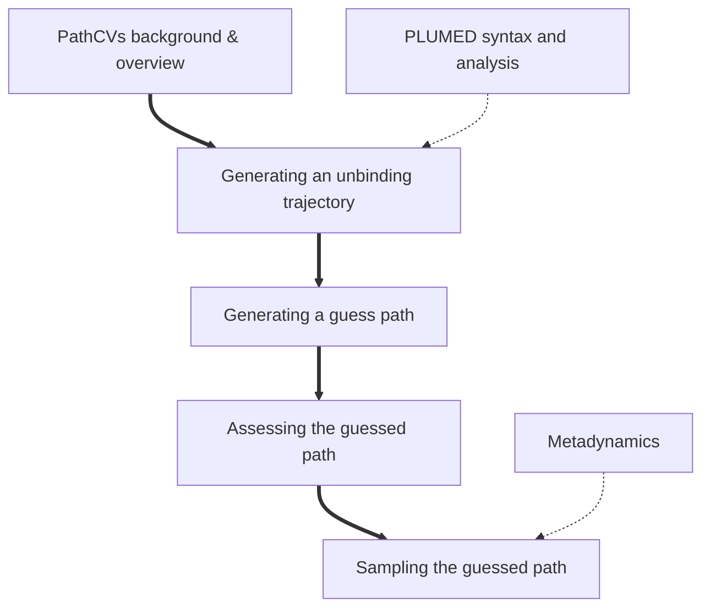


<b><a href="https://www.plumed.org/doc-master/user-doc/html/actionlist/?actions=MOLINFO,PRINT,DISTANCE,PATHMSD,WHOLEMOLECULES,METAD,LOWER_WALLS,CENTER,UPPER_WALLS,MOVINGRESTRAINT" target="_blank">Click here</a> to open manual pages for actions discussed in this tutorial.</b>

