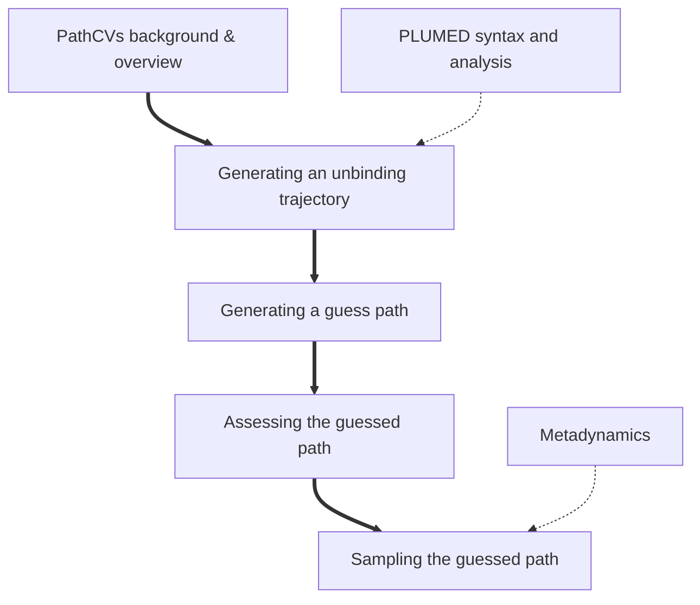

```mermaid
flowchart TD
A[PathCVs background & overview] ==> B[Generating an unbinding trajectory]
B ==> C[Generating a guess path]
C ==> D[Assessing the guessed path]
D ==> E[Sampling the guessed path]
F[PLUMED syntax and analysis] -.-> B
G[Metadynamics] -.-> E

click A "Intro.html" "A general introduction on path collective variables."
click B "SMD.html" "Generate a sample unbinding trajectory."
click C "Guess.html" "Parameterize a guess path."
click D "Check.html" "Qualitative check of guess path features."
click E "Metad.html" "Set up a metadynamics simulation to resample along the generated guess path."
click F "../../../21/001/data/NAVIGATION.html" "Basic features of the PLUMED input syntax."
click G "../../../21/004/data/NAVIGATION.html" "This lesson teaches you how to run metadynamics simulations."
```

<b><a href="https://www.plumed.org/doc-master/user-doc/html/actionlist/?actions=METAD,DISTANCE,PATHMSD,WHOLEMOLECULES,PRINT,MOVINGRESTRAINT,CENTER,UPPER_WALLS,LOWER_WALLS,MOLINFO" target="_blank">Click here</a> to open manual pages for actions discussed in this tutorial.</b>

