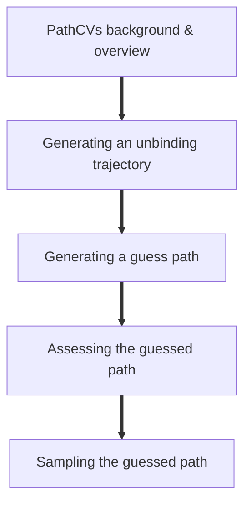

```mermaid 
flowchart TD 
A[PathCVs background & overview] ==> B[Generating an unbinding trajectory] 
B ==> C[Generating a guess path] 
C ==> D[Assessing the guessed path] 
D ==> E[Sampling the guessed path] 

click A "Intro.html" "A general introduction on path collective variables."
click B "SMD.html" "Generate a sample unbinding trajectory."
click C "Guess.html" "Parametrize a guess path."
click D "Check.html" "Qualitative check of guess path features."
click E "Metad.html" "Set up a metadynamics simulation to resample along the generated guess path."
``` 
