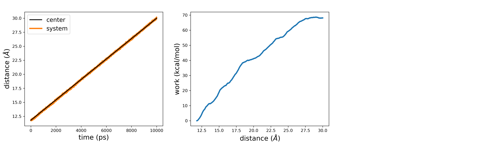
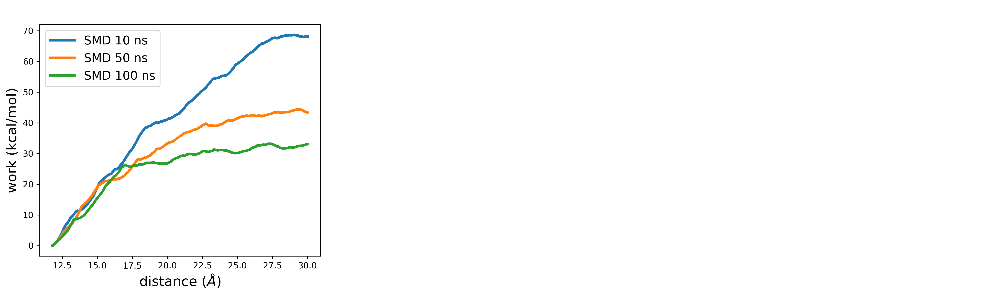

# Generating an unbinding trajectory

To generate a guess path for drug-target binding, we need the initial and final reference states along with a tentative sampling of the process. In most cases, the bound state of the drug-target complex is available either though known experimental structures or docking predictions. However, sampling the spontaneous drug-target dissociation with standard MD is usually impractical due to timescale issues. To overcome this limitation, one can leverage enhanced sampling methods. Herein, we resort to steered MD (SMD), though other equally valid alternatives, such as adiabatic-bias MD, are available.

As a test system to show the procedure for parameterizing a guess path, we take the complex between the drug alprenolol and the $\beta2$ adrenergic receptor, which was more extensively studied in this work: https://doi.org/10.1021/acs.jctc.9b00450 

Starting from the bound state of the complex, we pull along the distance between the ligand and the binding site. In particular, we take as CV the distance between the geometric centers of the low-fluctuating $\alpha$ carbons of the intra-membrane region of the receptor (ca) and the ligand's heavy atoms (alp). We do this in a 10 ns SMD simulation, where we increase the distance from its initial value to a target value of 30.0 Å and using a force constant of 100 kcal/(mol * $Å^2$). For the receptor's atoms, we can take the residue list from the published work. Fill in the following plumed template to perform the SMD simulation:



 Click on the labels of the actions for more information on what each action computes 

<pre class="plumedlisting">
MOLINFOThis command is used to provide information on the molecules that are present in your system. <a href="https://www.plumed.org/doc-master/user-doc/html/MOLINFO" style="color:green">More details</a><i></i> STRUCTUREa file in pdb format containing a reference structure<i></i>=__FILL__
 The MOLINFO action with label <b></b> calculates somethingWHOLEMOLECULESThis action is used to rebuild molecules that can become split by the periodic boundary conditions. <a href="https://www.plumed.org/doc-master/user-doc/html/WHOLEMOLECULES" style="color:green">More details</a><i></i> ENTITY0the atoms that make up a molecule that you wish to align<i></i>=__FILL__ ENTITY1the atoms that make up a molecule that you wish to align<i></i>=__FILL__
 <b name="data/data/plumed_SMD.datca" onclick='showPath("data/data/plumed_SMD.dat","data/data/plumed_SMD.datca","data/data/plumed_SMD.datca","brown")'>ca</b>: CENTERCalculate the center for a group of atoms, with arbitrary weights. <a href="https://www.plumed.org/doc-master/user-doc/html/CENTER" style="color:green">More details</a><i></i> ATOMSthe group of atoms that appear in the definition of this center<i></i>=730,741,751,763,782,798,815,822,1338,1349,1365,1379,1389,1400,1419,1443,2823,2844,2868,2874,2909,2928,3534,3554,3598

The CENTER action with label <b>ca</b> calculates the following quantities:<table  align="center" frame="void" width="95%" cellpadding="5%"><tr><td width="5%"><b> Quantity </b>  </td><td><b> Description </b> </td></tr><tr><td width="5%">ca.value</td><td>the position of the center of mass</td></tr></table><b name="data/data/plumed_SMD.datalp" onclick='showPath("data/data/plumed_SMD.dat","data/data/plumed_SMD.datalp","data/data/plumed_SMD.datalp","brown")'>alp</b>: CENTERCalculate the center for a group of atoms, with arbitrary weights. <a href="https://www.plumed.org/doc-master/user-doc/html/CENTER" style="color:green">More details</a><i></i> ATOMSthe group of atoms that appear in the definition of this center<i></i>=__FILL__
 The CENTER action with label <b>alp</b> calculates the following quantities:<table  align="center" frame="void" width="95%" cellpadding="5%"><tr><td width="5%"><b> Quantity </b>  </td><td><b> Description </b> </td></tr><tr><td width="5%">alp.value</td><td>the position of the center of mass</td></tr></table><b name="data/data/plumed_SMD.datd" onclick='showPath("data/data/plumed_SMD.dat","data/data/plumed_SMD.datd","data/data/plumed_SMD.datd","brown")'>d</b>: DISTANCECalculate the distance/s between pairs of atoms. <a href="https://www.plumed.org/doc-master/user-doc/html/DISTANCE" style="color:green">More details</a><i></i> ATOMSthe pair of atom that we are calculating the distance between<i></i>=__FILL__
 The DISTANCE action with label <b>d</b> calculates the following quantities:<table  align="center" frame="void" width="95%" cellpadding="5%"><tr><td width="5%"><b> Quantity </b>  </td><td><b> Description </b> </td></tr><tr><td width="5%">d.value</td><td>the DISTANCE between this pair of atoms</td></tr></table>MOVINGRESTRAINTAdd a time-dependent, harmonic restraint on one or more variables. <a href="https://www.plumed.org/doc-master/user-doc/html/MOVINGRESTRAINT" style="color:green">More details</a><i></i> ...
   ARGthe labels of the scalars on which the bias will act<i></i>=<b name="data/data/plumed_SMD.datd">d</b>
   STEP0This keyword appears multiple times as STEPx with x=0,1,2,<i></i>=0 AT0ATx is equal to the position of the restraint at time STEPx<i></i>=__FILL__ KAPPA0KAPPAx is equal to the value of the force constants at time STEPx<i></i>=__FILL__
   STEP1This keyword appears multiple times as STEPx with x=0,1,2,<i></i>=__FILL__ AT1ATx is equal to the position of the restraint at time STEPx<i></i>=__FILL__ KAPPA1KAPPAx is equal to the value of the force constants at time STEPx<i></i>=__FILL__
...
 PRINTPrint quantities to a file. <a href="https://www.plumed.org/doc-master/user-doc/html/PRINT" style="color:green">More details</a><i></i> ARGthe labels of the values that you would like to print to the file<i></i>=* STRIDE the frequency with which the quantities of interest should be output<i></i>=500 FILEthe name of the file on which to output these quantities<i></i>=colvar_SMD.dat
</pre>

<pre class="plumedlisting">
MOLINFOThis command is used to provide information on the molecules that are present in your system. <a href="https://www.plumed.org/doc-master/user-doc/html/MOLINFO" style="color:green">More details</a><i></i> STRUCTUREa file in pdb format containing a reference structure<i></i>=structure.pdb

The MOLINFO action with label <b></b> calculates somethingWHOLEMOLECULESThis action is used to rebuild molecules that can become split by the periodic boundary conditions. <a href="https://www.plumed.org/doc-master/user-doc/html/WHOLEMOLECULES" style="color:green">More details</a><i></i> ENTITY0the atoms that make up a molecule that you wish to align<i></i>=1-4570 ENTITY1the atoms that make up a molecule that you wish to align<i></i>=28695-28736

<b name="data/data/plumed_SMD.dat_solca" onclick='showPath("data/data/plumed_SMD.dat","data/data/plumed_SMD.dat_solca","data/data/plumed_SMD.dat_solca","brown")'>ca</b>: CENTERCalculate the center for a group of atoms, with arbitrary weights. <a href="https://www.plumed.org/doc-master/user-doc/html/CENTER" style="color:green">More details</a><i></i> ATOMSthe group of atoms that appear in the definition of this center<i></i>=730,741,751,763,782,798,815,822,1338,1349,1365,1379,1389,1400,1419,1443,2823,2844,2868,2874,2909,2928,3534,3554,3598

The CENTER action with label <b>ca</b> calculates the following quantities:<table  align="center" frame="void" width="95%" cellpadding="5%"><tr><td width="5%"><b> Quantity </b>  </td><td><b> Description </b> </td></tr><tr><td width="5%">ca.value</td><td>the position of the center of mass</td></tr></table><b name="data/data/plumed_SMD.dat_solalp" onclick='showPath("data/data/plumed_SMD.dat","data/data/plumed_SMD.dat_solalp","data/data/plumed_SMD.dat_solalp","brown")'>alp</b>: CENTERCalculate the center for a group of atoms, with arbitrary weights. <a href="https://www.plumed.org/doc-master/user-doc/html/CENTER" style="color:green">More details</a><i></i> ATOMSthe group of atoms that appear in the definition of this center<i></i>=28695-28736

The CENTER action with label <b>alp</b> calculates the following quantities:<table  align="center" frame="void" width="95%" cellpadding="5%"><tr><td width="5%"><b> Quantity </b>  </td><td><b> Description </b> </td></tr><tr><td width="5%">alp.value</td><td>the position of the center of mass</td></tr></table><b name="data/data/plumed_SMD.dat_sold" onclick='showPath("data/data/plumed_SMD.dat","data/data/plumed_SMD.dat_sold","data/data/plumed_SMD.dat_sold","brown")'>d</b>: DISTANCECalculate the distance/s between pairs of atoms. <a href="https://www.plumed.org/doc-master/user-doc/html/DISTANCE" style="color:green">More details</a><i></i> ATOMSthe pair of atom that we are calculating the distance between<i></i>=<b name="data/data/plumed_SMD.dat_solca">ca</b>,<b name="data/data/plumed_SMD.dat_solalp">alp</b>

The DISTANCE action with label <b>d</b> calculates the following quantities:<table  align="center" frame="void" width="95%" cellpadding="5%"><tr><td width="5%"><b> Quantity </b>  </td><td><b> Description </b> </td></tr><tr><td width="5%">d.value</td><td>the DISTANCE between this pair of atoms</td></tr></table>MOVINGRESTRAINTAdd a time-dependent, harmonic restraint on one or more variables. <a href="https://www.plumed.org/doc-master/user-doc/html/MOVINGRESTRAINT" style="color:green">More details</a><i></i> ...
   ARGthe labels of the scalars on which the bias will act<i></i>=<b name="data/data/plumed_SMD.dat_sold">d</b>
   STEP0This keyword appears multiple times as STEPx with x=0,1,2,<i></i>=0 AT0ATx is equal to the position of the restraint at time STEPx<i></i>=1.18 KAPPA0KAPPAx is equal to the value of the force constants at time STEPx<i></i>=41840
   STEP1This keyword appears multiple times as STEPx with x=0,1,2,<i></i>=5000000 AT1ATx is equal to the position of the restraint at time STEPx<i></i>=3.0 KAPPA1KAPPAx is equal to the value of the force constants at time STEPx<i></i>=41840
...
 PRINTPrint quantities to a file. <a href="https://www.plumed.org/doc-master/user-doc/html/PRINT" style="color:green">More details</a><i></i> ARGthe labels of the values that you would like to print to the file<i></i>=* STRIDE the frequency with which the quantities of interest should be output<i></i>=500 FILEthe name of the file on which to output these quantities<i></i>=colvar_SMD.dat
</pre>

  

For the subsequent stages of the procedure, it is important to have a trajectory that finely catches the system progression along the process. To this end, we need to increase the saving frequency of MD snapshots. Setting a dumping frequency value of 1 ps in the MD engine should be reasonable for most applications. 

Once the simulation has completed, we can read the plumed output *colvar_SMD.dat*, which stores different quantities recorded during the simulation. For instance, we can inspect how strictly the system follows the SMD restraint, and the work as a function of the distance CV:

As a final consideration, note that while the distance between ligand and binding site increases, both the ligand, as well as the surrounding residues from the target, are free to explore different configurations. For this reason, it is good practice to perform a series of SMD simulations, and pick the one where the work associated with the process is lowest. In first approximation, this should better point to the minimum free energy path.
Additionally, the simulation parameters used herein were suitable to this illustrative example and may need readjustements for application of different systems. For instance, consider that different force constant values or simulation time may be required. As an exercise, we can perform a single replicate of SMD at increasing simulation times, e.g. 50 and 100 ns. If we compare the work as a function of the distance CV in the three simulations, we should obtain something like this:

As expected, allowing more time to the system for readjusting to more favorable configurations as we pull the ligand outside the binding site results in lower work.

