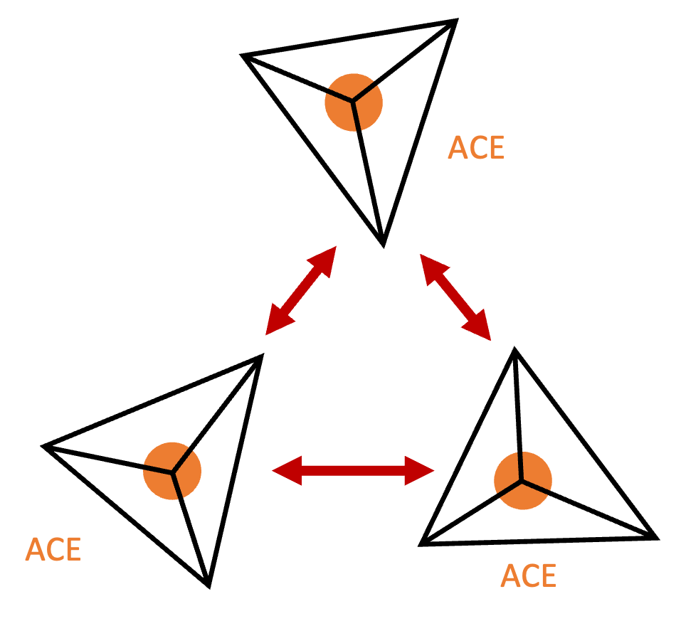

# Machine-learned potentials for atomistic simulations

Over the past two decades, a drastic change has emerged in the way we simulate atomistic systems. Machine-learned potentials (MLPs) have enabled *ab-initio*-level accuracy in force and energy predictions for a fraction of the cost associated with traditional methods. We can now access systems of a size and complexity that were previously inaccessible to first-princples simulation. An overview of some of the major MLP developments and achievements can be found in this recent introductory review: [Introduction to machine learning potentials for atomistic simulations](https://arxiv.org/abs/2410.00626)

At the forefront of MLP development is the Multi Atomic Cluster Expansion (MACE) framework [1](https://arxiv.org/abs/2206.07697). Developed in 2022, this model combines a complete high body order polynomial basis, the so-called Atomic Cluster Expansion, with a message-passing tensoral network. This architecture provides learnable representations of semi-local chemical environments to accurately reproduce reference *ab initio* energies and forces.

For this tutorial we will make use of a pre-trained MACE model, provided within this repository. This model can describe gaseous carbonic acid and has been trained on GGA-level DFT reference data. For more details on how to train MACE models for your own system of interest, we refer to [MACE tutorials](https://mace-docs.readthedocs.io/en/latest/examples/tutorials.html).

