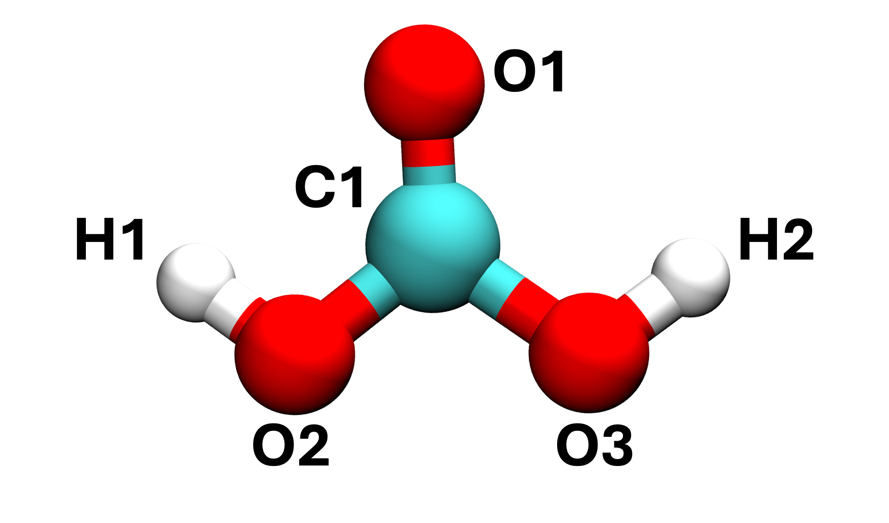
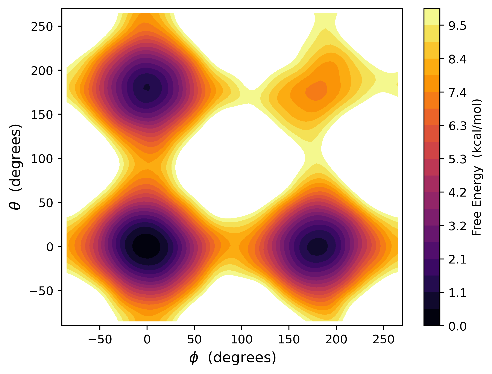

# Using MACE to run Metadynamics over Two Collective Variables

Now that we've run some simple MD, let us move on to the main task for this tutorial. In this section, we will be using PLUMED to drive a conformational change in our carbonic acid molecule. This molecule exists in three main conformations: cis-cis (CC), cis-trans (CT), and trans-trans (TT). It's up to you to determine which of these conformers is most stable, and which is least stable. 

The files needed to complete this part of the tutorial are located in the `resources` subdirectory (https://github.com/water-ice-group/plumed_tutorial_mace.git). 

---

Like in the previous task, we have a configuration file `init.xyz` and our ase file `run.py`. Looking at the latter, you should see some noticeable changes to the code. The code below gives the PLUMED input needed to perform our enhanced sampling:

```python
setup = [f"UNITS ... FILE=COLVAR"]
```

Converting from python to PLUMED format:


<div class="plumedpreheader">
<div class="headerInfo" id="value_details_data/04_metaD.md_working_1.dat"> Click on the labels of the actions for more information on what each action computes </div>
<div class="containerBadge">
<div class="headerBadge"><a href="04_metaD.md_working_1.dat.plumed.stderr"></a></div>
<div class="headerBadge"><a href="04_metaD.md_working_1.dat.plumed_master.stderr"></a></div>
</div>
</div>
<pre class="plumedlisting">
<span class="plumedtooltip" style="color:green">UNITS<span class="right">This command sets the internal units for the code. <a href="https://www.plumed.org/doc-master/user-doc/html/UNITS" style="color:green">More details</a><i></i></span></span> <span class="plumedtooltip">LENGTH<span class="right">the units of lengths<i></i></span></span>=A <span class="plumedtooltip">TIME<span class="right">the units of time<i></i></span></span>=ps <span class="plumedtooltip">ENERGY<span class="right">the units of energy<i></i></span></span>=eV
<span style="display:none;" id="data/04_metaD.md_working_1.dat">The UNITS action with label <b></b> calculates something</span><b name="data/04_metaD.md_working_1.datt1" onclick='showPath("data/04_metaD.md_working_1.dat","data/04_metaD.md_working_1.datt1","data/04_metaD.md_working_1.datt1","brown")'>t1</b>: <span class="plumedtooltip" style="color:green">[TORSION](https://www.plumed.org/doc-master/user-doc/html/_t_o_r_s_i_o_n.html<span class="right">This action is not part of PLUMED and was included by using a LOAD command <a href="https://www.plumed.org/doc-master/user-doc/html/LOAD" style="color:green">More details</a><i></i></span></span> ATOMS=1,6,4,5
<b name="data/04_metaD.md_working_1.datt2" onclick='showPath("data/04_metaD.md_working_1.dat","data/04_metaD.md_working_1.datt2","data/04_metaD.md_working_1.datt2","brown")'>t2</b>: <span class="plumedtooltip" style="color:green">[TORSION](https://www.plumed.org/doc-master/user-doc/html/_t_o_r_s_i_o_n.html<span class="right">This action is not part of PLUMED and was included by using a LOAD command <a href="https://www.plumed.org/doc-master/user-doc/html/LOAD" style="color:green">More details</a><i></i></span></span> ATOMS=2,3,4,5
<b name="data/04_metaD.md_working_1.datmtd" onclick='showPath("data/04_metaD.md_working_1.dat","data/04_metaD.md_working_1.datmtd","data/04_metaD.md_working_1.datmtd","brown")'>mtd</b>: <span class="plumedtooltip" style="color:green">[METAD](https://www.plumed.org/doc-master/user-doc/html/_m_e_t_a_d.html<span class="right">This action is not part of PLUMED and was included by using a LOAD command <a href="https://www.plumed.org/doc-master/user-doc/html/LOAD" style="color:green">More details</a><i></i></span></span> ARG=t1,t2 SIGMA=0.25,0.25 HEIGHT=0.013 PACE=100 FILE=HILLS BIASFACTOR=5 TEMP=300
<span class="plumedtooltip" style="color:green">PRINT<span class="right">Print quantities to a file. <a href="https://www.plumed.org/doc-master/user-doc/html/PRINT" style="color:green">More details</a><i></i></span></span> <span class="plumedtooltip">ARG<span class="right">the labels of the values that you would like to print to the file<i></i></span></span>=t1.*,t2.*,mtd.* <span class="plumedtooltip">STRIDE<span class="right"> the frequency with which the quantities of interest should be output<i></i></span></span>=100 <span class="plumedtooltip">FILE<span class="right">the name of the file on which to output these quantities<i></i></span></span>=COLVAR
</pre>
  


Line 1 gives the units used by PLUMED. Lines 2 and 3 define the collective variables (torsion) that we will use to probe the conformation change. Line 4 is used to define the parameters used in running metadynamics, including gaussian heights, widths, and the rate at which they are deposited. Line 5 tells us to print the important collective variable information. 

For this system, we differentiate between our three conformers using two torsional collective variables, $\phi$ and $\theta$, corresponding to the H1-O2-C1-O1 and H2-O3-C1-O1 dihedrals (see below for reference positions). When $\phi$ = $\theta$ = 0, we have the CC conformer. When $\phi$ = 0 (180) and $\theta$ = 180 (0), we have the CT conformer. And when both  $\phi$ = $\theta$ = 180, we have the TT conformer. 



Calling PLUMED during the run is achieved by the following block:
```python
init_conf.calc = Plumed(calc=calculator,
                    input=setup,
                    timestep=timestep,
                    atoms=init_conf,
                    kT=0.02585)
```
where we define the MACE calculator, PLUMED input, the starting configuration, timestep, and *kT*. 

Run the simulation using `python run.py`. Notice that two additional files will now be output alongside a trajectory and a log file. The `COLVAR` file gives details on the values of the two collective variable at each timestep. `HILLS` records the gaussians deposited at each step; this will be important for reconstructing the potential energy surface later. 

We can use `COLVAR` to build up a picture of what is happening as the metadynamics proceeds. We encourage you to plot both $\phi$ and $\theta$ as a function of time to understand which states the molecule occupies and their relative proportions. How many transitions have there been between CC, CT, and TT?

We have set the number of steps in this simulation to be 100,000. This should take around 1-2 hours to complete depending on your hardware. You can speed up computation by switching `device='cpu'` to `'cuda'`, if GPU computation is available. Feel free to increase the number of steps in this simulation to improve the convergence of our profile and obtain more accurate free energies. 

Following the completion of the simulation, we can look to extract a potential energy surface for the conformational changes of carbonic acid. 
1. Copy `HILLS` to a new directory.
2. Source your installed version of PLUMED and type `plumed sum_hills --hills HILLS --kt 0.02585`. This will add up the deposited gaussians and output the potential energies in `fes.dat`.
3. Use the data in `fes.dat` to plot the 2D energy surface for our molecule. We have provided scripts for you to do this, though we encourage you to try coding this yourself.

You profile should resemble something like this:



We can see four basins on this profile (if fewer, try running the simulations for longer). Are you able to identify which basin corresponds to which conformer? What is the most stable conformer? Can we provide a chemical rationale for these relative stabilities? 
