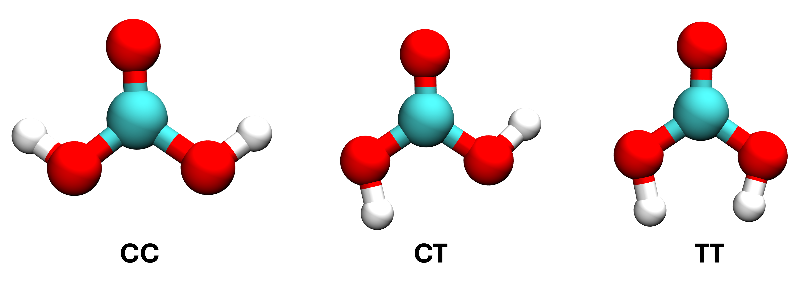
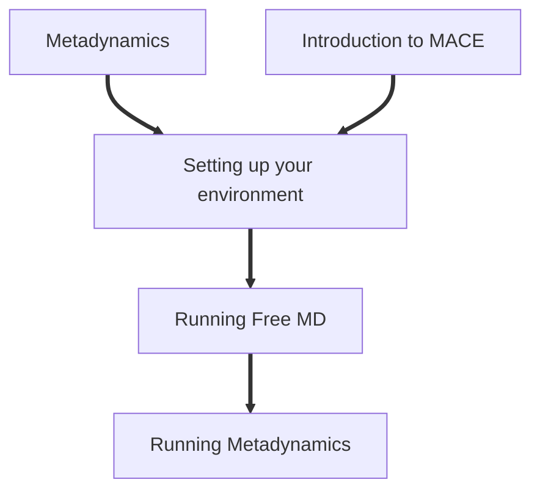

# Exploring Free Energy Surfaces with MACE-PLUMED Metadynamics

In this tutorial, we will learn how to link up the recently developed MACE potential with PLUMED to perform enhanced sampling simulations in the form of two-dimensional metadynamics. Our test system will be a molecule of gaseous carbonic acid (H2CO3). This tutorial will probe the various conformations carbonic acid can adopt and establish which are the most stable. 

Carbonic acid is important for carbon dioxide solvation chemistry, relating to processes like ocean acidification and the bicarbonate buffer system. The acid has two terminal OH groups that can either be in cis or trans orientation, giving rise to three conformers, cis-cis, cis-trans, and trans-trans as shown below.

In this tutorial, we will cover:
- Navigating the MACE-LAMMPS-PLUMED interface.
- Setting up your work environment.  
- Running simple MD simulations using a MACE potential. 
- Performing metadynamics using two collective variables.

By the end of this tutorial you should:
- Know how to run simple MD powered by MACE potentials.
- Integrate MACE with PLUMED to enable the accurate determination of free energy surfaces. 

The data and files needed to run the excercises of this tutorial can be found on Github. **Clone the following directory to your local machine**: https://github.com/water-ice-group/plumed_tutorial_mace.git

This tutorial is organized as follows:


<b><a href="https://www.plumed.org/doc-master/user-doc/html/actionlist/?actions=UNITS,PRINT" target="_blank">Click here</a> to open manual pages for actions discussed in this tutorial.</b>

