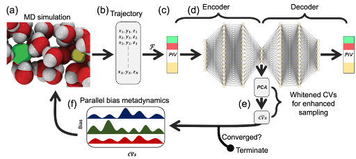

# Permutationally Invariant Network for Enhanced Sampling (PINES)

PINES is a data-driven method for the automatic discovery of high variance collective variables (CVs) and enhanced sampling to obtain free energy landscapes of both single and multi-component molecular systems. It can be conceived as a permutationally invariant extension to the Molecular Enhanced Sampling with Autoencoders (MESA) method. PINES comprises three main components:

## Components of PINES

1. **Permutation Invariant Vector (PIV) Featurization (F):**  
   Provides a translationally, rotationally, and permutationally invariant representation of the molecular system.
   
2. **Universal Function Approximators (Autoencoders):**  
   Used for discovering high-variance CVs {($\xi_1$, $\xi_2$, ...)} from the molecular dynamics data.
   
3. **Molecular Dynamics (MD) Simulations with CV Biasing:**  
   Enhanced sampling MD simulations are performed by biasing along the high-variance CVs learned by autoencoders. This tutorial uses **Parallel-Bias Metadynamics (PBMetaD)** for sampling, though any CV-enhanced sampling method can be employed.

    
    
<em>Figure 1: Overview of PINES for automatic discovery of high-variance CVs and biasing the system using CV-enhanced sampling to overcome the sampling challenges of MD simulations in determining free energy landscapes of both single and multi-molecular systems. (a) We perform MD simulations to sample the phase space of the system. The snapshot shows a representation of a NaCl system configuration in water with Na, Cl, O, and H colored in yellow, green, red, and white, respectively. (b) Representation of the system configurations sampled during MD simulation in Cartesian space, where {xi, yi, zi} represent the x, y, and z positions of atom i in the system. (c) Conversion of the system configurations sampled during MD simulation to a permutationally, rotationally, and translationally invariant representation using PIVs. (d) Learning differentiable and high-variance nonlinear CVs using autoencoders. We use a feed-forward network as a universal function approximator for both the encoder and decoder parts of the autoencoders. (e) Principal component analysis to align the manifold discovered using autoencoders with the highest variance directions. (f) CV enhanced sampling using PBMetaD or termination of PINES upon the convergence of discovered CVs. Figure adapted from 10.1021/acs.jctc.3c00923, copyright ACS.</em>

---

## Tutorial: NaCl Ion Pair Dissociation in Water

In this tutorial, we apply PINES to investigate the **association/dissociation process of a NaCl ion pair in water**. This is a classic system, where it is well known that the rearrangement of water molecules in the solvation shell of ions plays a critical role in driving the association or dissociation of NaCl. In other words, enhanced sampling of association or dissociation of Na+ and Cl- ions in water may require explicit biasing along water degrees of freedom.Traditional techniques struggle with this, as they do not naturally handle the **permutational symmetry** of water molecules, i.e., their indistinguishability.

### Why Use PINES?

PINES addresses the challenge of indistinguishable solvent molecules by using **PIV representation**. This feature of PINES automatically removes translational, rotational, and permutational variances, allowing us to discover **solvent-inclusive high-variance CVs** efficiently. This leads to more effective enhanced sampling for complex systems such as the dissociation of NaCl.

---

## Software Requirements

The tutorial was tested using:

- **GROMACS-2021.6**
- **PLUMED-2.8.3** patched with PINES.  
  Instructions for installing PINES can be found at [PINES GitHub Repository](https://github.com/Ferg-Lab/pines).

---

## Steps in the Tutorial

1. **Step 1: Featurization**  
   Represent the molecular simulation trajectory using a permutationally invariant representation.
   
2. **Step 2: CV Discovery with Autoencoders**  
   Train autoencoders to identify high-variance CVs from the molecular dynamics data.
   
3. **Step 3: Enhanced Sampling**  
   Perform enhanced sampling of the system by applying **Parallel-Bias Metadynamics** along the high-variance CVs to study the free energy landscape of NaCl association/dissociation in water.
