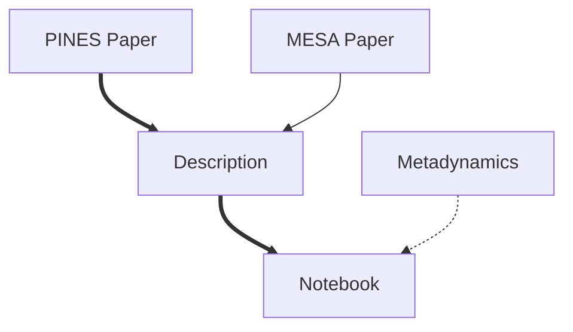

Permutationally Invariant Networks for Enhanced Sampling (PINES) is a data-driven
method for studying free energy landscapes of both single and multi-molecular systems.
PINES discovers collective variables (CVs) that are translationally, rotationally, and
permutationally invariant in an iterative manner by taking permutationally invariant
vectors (PIV) as input and passing them through a regularized autoencoder to discover
high-variance CVs  using the Molecular Enhanced Sampling with Autoencoders (MESA) technique.
In this advanced PLUMED tutorial, we first provide an overview of
the PINES method and demonstrate its application to study ion dissociation in water.

We use Jupyter notebooks that cover the entire iterative process of PINES — initial
simulation setup, feature determination for constructing PIVs, dimensionality reduction
using regularized autoencoders, whitening the latent space using principal component
analysis, and generating PLUMED files for biasing using parallel bias metadynamics. All
the input files required to run the tutorial will also be provided with the tutorial.

The primary learning objectives from this tutorial are permutationally invariant molecular representations,
high-variance CVs, autoencoders, and enhanced sampling methods at a high level
along with a practical understanding of PINES to molecular systems in PLUMED. We
assume the user is familiar with CV biasing enhanced sampling methods and usage of
metadynamics introduced in early PLUMED tutorials.


<b><a href="https://www.plumed.org/doc-master/user-doc/html/actionlist/?actions=" target="_blank">Click here</a> to open manual pages for actions discussed in this tutorial.</b>

