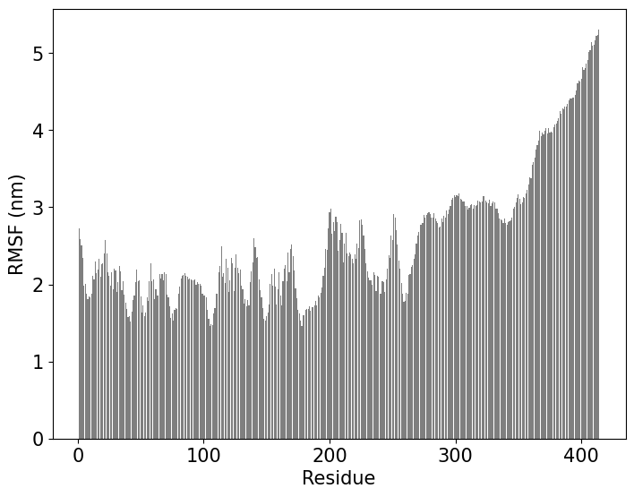

## Analysis

Copy relevant scripts in the analysis folder
```python
!cp ../scripts_prep/* .
!zip files.zip script.sh  pulchra.sh pulchra.py  backmap.py simulate*.py  dcd2xtc.py plumed_analysis.dat reconstruct.dat  resample.py  fes2.py  sequence.dat plumed.dat struct*pdb input_af.pdb r1_excl.pkl forcefield.xml residues.csv *npy *mean*csv pdb_af.pdb  keepH.sh

!mkdir analysis
!cp files.zip analysis/
os.chdir(dir+"/analysis")
!unzip files.zip
```

Run ```script.sh``` which:
- Convert dcds to xtc (dcd2xtc.py)
- Concatenate xtcs to a single xtc ```gmx trjcat -f nosolv_*.xtc -cat -o cat_trjcat.xtc -settime```
- Calculate the Torrie-Valeau weights (Fullbias.dat) and the CVs (COLVAR) ``` plumed driver --plumed plumed_analysis.dat --mf_xtc cat_trjcat.xtc ``` which are afterwards used to calculate Free Energy Surfaces.
- Generate a structural ensemble by sampling the concatenated trajectory by weights. ``` python resample.py ```
- Backmap coarse grained structural ensemble by using PULCHRA ``` python backmap.py $nrep 
sh pulchra.sh
sh keepH.sh ```

```python
!pwd
!chmod 755 script.sh
!./script.sh {NR}
#The final atomistic structural ensemble.
!ls segment_5_input_af_rebuilt.xtc
```

Plot the free energy surface per CV of interest. Note that the order of CVs in: ``` for i in $(echo CV1 CV2 CV3 etc);do .. ``` needs to follow the order these CVs appear as columns in the ```COLVAR``` file.

```python
#Time depentent FES
#For other proteins the entries CV1,CV2,CV3 etc need to follow the COLVAR columns like:
#for i in $(echo CV1 CV2 CV3 etc);do
!num=1
## For TDP-43 WtoA
!for i in $(echo Rg Rg1 Rg2 Rg3 Rg4 torsion1 torsion2 RMSD1 RMSD2 RMSD3);do python fes2.py --CV_col $num --CV_name $i ; num=$((num+1)) ; echo $num; done
```
<p align="center">
  
  
  
  
  

  <br> a)Rg, b)Rg1, c) Rg2,d) Rg3, e) Rg4
  <em> </em>
</p>


Calculation of the Root Mean Square Fluctuations (RMSF) per residue.

```python
!echo "0" |gmx rmsf -f segment_5_input_af_rebuilt.xtc -s  segment_5_input_af_0_sys.pdb -res -o rmsf.xvg
import numpy as np
from matplotlib import  pyplot as plt
x=np.loadtxt("rmsf.xvg",comments=['#', '$', '@'])[:, 0]
y=np.loadtxt("rmsf.xvg",comments=['#', '$', '@'])[:, 1]
#print(x)
#print(y)
fig = plt.figure()
ax = fig.add_axes([0,0,1,1])
ax.bar(x,y,color="black",alpha=0.5)

plt.yticks(fontsize=15)
plt.xticks(fontsize=15)
plt.xlabel('Residue',fontsize=15)
plt.ylabel('RMSF (nm)',fontsize=15)
ax.tick_params(axis='both', labelsize=15)
ax.legend=None
plt.savefig('rmsf.pdf',bbox_inches='tight')
```
    

    
Finally,to showcase the advantage of AF-MI, we show pair-distance distribution function (PDDF) from SAXS data, based on a single AF PDB structure and AF-MI structural ensemble [Ref](https://www.biorxiv.org/content/10.1101/2023.01.19.524720v1.full).

<p align="center">
  
  <br>
  <em> </em>
</p>


Download files

```python
print(home)
!pwd
!rm segment_5_input_af_*.rebuilt.xtc segment_5_input_af_*.rebuilt.pdb
!zip -r {home}/archive.zip {home}/AlphaFold-IDP/prep_run
#!zip -r {home}/archive.zip *png ../plumed.dat plumed_analysis.dat reconstruct.dat segment_5_input_af_rebuilt.xtc segment_5_input_af_0_sys.pdb rmsf.pdf ../pae_m.png FES*png FULLBIAS COLVAR ../HILLS* ../COLVAR*
```

```python
from google.colab import files
files.download(home+"/archive.zip")
```
##### [Back to AlphaFold-Metainference home](NAVIGATION.md)
