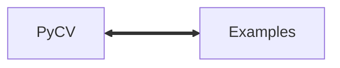

# How to use PyCV

The lesson contains a guide to set up PyCV and some simple examples.


<b><a href="https://www.plumed.org/doc-master/user-doc/html/actionlist/?actions=LOAD,PRINT,DISTANCE" target="_blank">Click here</a> to open manual pages for actions discussed in this tutorial.</b>

