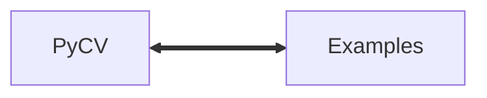

# How to use PyCV

The lesson contains a guide to set up PyCV and some simple examples.

```mermaid
flowchart LR
A[PyCV]
B[Examples]

A <===> B

click A "GAT_SAFE_README.html" "An introduction to PyCV"
click B "examples.html" "Some basic examples for PyCV"
```
