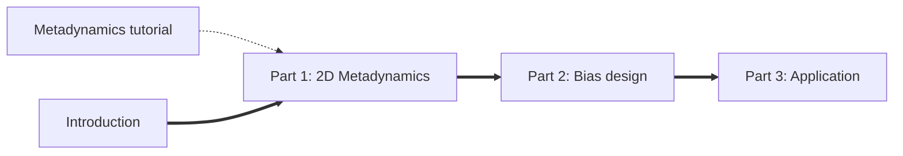

# Enhanced sampling for magnesium-RNA binding dynamics

This tutorial will teach you how to use PLUMED, GROMACS and Python notebooks to implement an enhanced sampling strategy for magnesium-RNA binding dynamics.

## Prerequisites

- [GROMACS basic usage](http://www.mdtutorials.com/gmx/)
- [PLUMED basic syntax and analysis](https://www.plumed-tutorials.org/lessons/21/001/data/NAVIGATION.html)
- Python notebooks


<b><a href="https://www.plumed.org/doc-master/user-doc/html/actionlist/?actions=UPPER_WALLS,PRINT,METAD,COORDINATION,CUSTOM,GROUP,BIASVALUE,LOWER_WALLS,DISTANCES" target="_blank">Click here</a> to open manual pages for actions discussed in this tutorial.</b>

