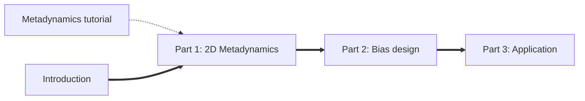

```mermaid 
flowchart LR 
intro[Introduction] 
metad[Metadynamics tutorial] 
part1[Part 1: 2D Metadynamics] 
part2[Part 2: Bias design] 
part3[Part 3: Application] 
metad -.-> part1 
intro ==> part1 
part1 ==> part2 
part2 ==> part3 
click intro "INTRO.html" "Introduction to the tutorial"
click metad "../../../21/004/data/NAVIGATION.html" "If you are new to Metadynamics, you should complete this masterclass"
click part1 "PART1.html" "Part 1: Use 2D Metadynamics to characterize the free-energy barriers for magnesium-phosphate binding"
click part2 "PART2.html" "Part 2: Design a barrier-flattening potential and test it"
``` 
