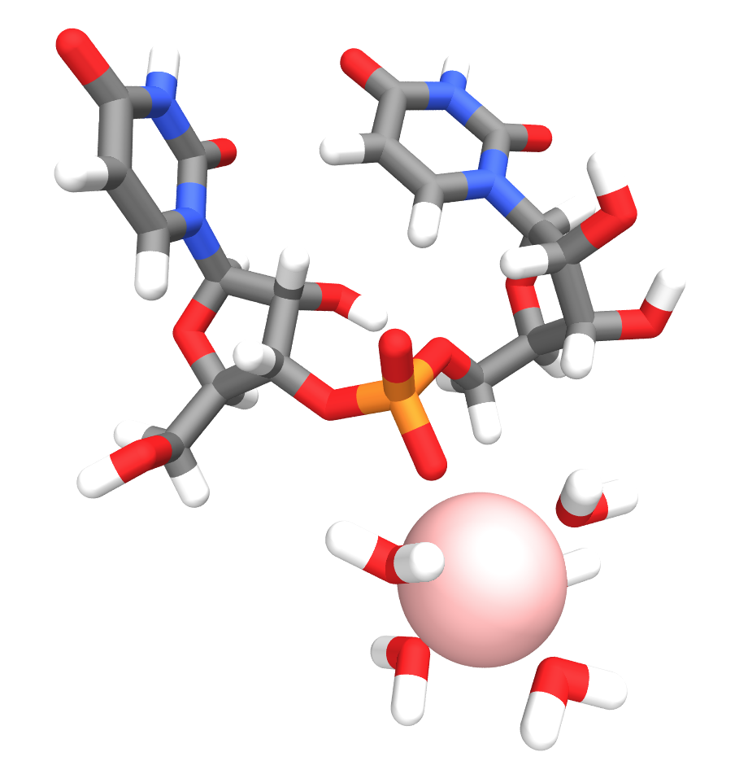
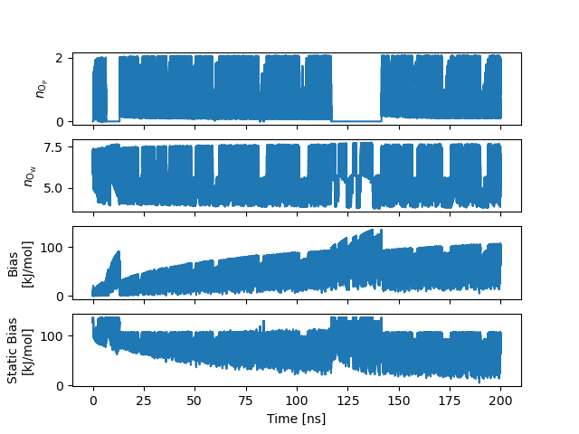
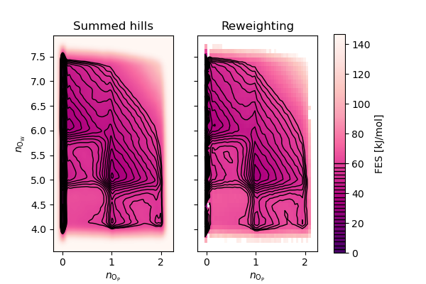

# Part 1: Characterize the free-energy landscape with 2D Metadynamics

Our strategy will consist first in characterizing on a simple system (diuridine) the rate-limiting step in Magnesium binding to the backbone phosphate groups. 

## Description of the approach

We make the assumption that the binding dynamics are well described by the two following collective variables (CVs):
- Coordination number of Mg<sup>2+</sup>  with water oxygen atoms (O<sub>W</sub>)
- Coordination number of Mg<sup>2+</sup>  with free phosphate oxygen atoms (O<sub>P</sub>)

> <details><summary><b>Q:</b> Are the two non-bridging oxygen atoms of the phosphate group strictly equivalent?</summary>
> <b>A:</b> No because of the chirality of both flanking nucleosides. However they have similar local environment and, for simplicity, the chosen CV does not distinguish between them.</details>


> [!NOTE]
> We could also simply use the distance between Mg<sup>2+</sup> and the *closest* O<sub>P</sub>, but it turns out convenient to treat both exchanging ligands in a similar way and has the additional advantage to allow binding to multiple O<sub>P</sub> in complex RNA motifs.

To be used as biasing CVs, the coordination numbers are defined as smooth functions of the Mg—O<sub>x</sub> pairwise distances. More precisely:

$$
\begin{equation}
n_\mathrm{O_x} = \sum_{\lbrace\mathrm{O_x}\rbrace} s(r_\mathrm{Mg\mbox{–}O_x})
\end{equation}
$$

where $s(r)$ is a switching function between 1 and 0. In the following we will use a cosine switching function 

$$
\begin{equation}
s(r) = \left\lbrace
    \begin{array}{ll}
        1 & \text{if }r \le d_0 \\
        0.5\left(\cos(\frac{r - d_0}{r_0}\pi) + 1\right)  & \text{if }d_0 \lt r \le d_0 + r_0 \\
        0 & \text{else.}
    \end{array}
\right.
\end{equation}
$$

with parameters $d_0 = 0.18~\text{nm}$ (to include with some margin the Mg—O<sub>W</sub> and Mg—O<sub>P</sub> equilibrium distance in the first shell, $r_\text{eq} = 0.21~\text{nm}$) and $r_0 = 0.24~\text{nm}$ (to reach the density peak of the second hydration shell).

> [!NOTE] 
> Since we are using a $d_0$ slightly below the equilibrium distance in the first shell ($r_\text{eq}$), we can rescale the final value by $s(r_\text{eq})^{-1} = 1.039661$ to recover "nice" integer values for the coordination states.

## Implementation

### Simulation set-up

<center></center>

We provide as input files:
- `input.gro`: equilibrated simulation box with a diuridine molecule and a single Mg²⁺ ion in water
- `run.mdp`: GROMACS MD parameter file
- `topol.top`: Standalone GROMACS topology file

[They can be downloaded here.](diuridine/diuridine.zip)

> [!NOTE]
> The simulation box has one net positive charge that will be compensated with a uniform background charge. This might lead to artifacts which are likely irrelevant for our purpose here of estimating free-energy barriers.

> [!NOTE]
> The provided topology uses [*microMg* force field parameters](https://github.com/bio-phys/optimizedMgFFs) from [Grotz *et al.* (2021)](https://doi.org/10.1021/acs.jctc.0c01281) [[1]](#references) for Mg<sup>2+</sup>. It was parameterized to reproduce solvation free energy, distance to oxygens in the first hydration shell, hydration number, activity coefficient derivative in MgCl₂ solutions, and the binding affinity and distance to the phosphate oxygens on nucleic acids.

For now we can just preprocess the input files (`-maxwarn 1` is needed for the non-zero total charge):

```bash
gmx grompp -f run.mdp -p topol.top -c input.gro -o run.tpr -maxwarn 1
```

### Instructions

1) In a new file `plumed_metad.dat`, declare the atom groups that will be used in CVs. You will need one for the Mg<sup>2+</sup>, one for the free phosphate oxygen atoms (O1P/O2P in the GRO file), and one for all the water oxygen atoms (OW).

   > [!TIP]
   > When working with GROMACS, an easy way is to use an `index.ndx` file. This limits errors and increase legibility when specifying large atom groups.
   > ```bash
   > gmx make_ndx -f run.tpr -o index.ndx
   > ```
   > To create a group for water oxygen atoms:
   > ```
   > "SOL" & a OW
   > ```
   > Finally we can rename this group for clarity, then save the index file:
   > ```
   > name 9 O_Water
   > q
   > ```
   > To use in a PLUMED file:
   > ```
   > ow: GROUP NDX_FILE=index.ndx NDX_GROUP=O_Water
   > ```
   > Another way is to use the [```MOLINFO```](https://www.plumed.org/doc-v2.9/user-doc/html/_m_o_l_i_n_f_o.html) selection features.

2) Declare a CV for Mg<sup>2+</sup> coordination number with non-bridging phosphate oxygens using the [`COORDINATION`](https://www.plumed.org/doc-v2.9/user-doc/html/_c_o_o_r_d_i_n_a_t_i_o_n.html) action. As explained [above](#description-of-the-approach), will use a `COSINE` [switching function](https://www.plumed.org/doc-v2.9/user-doc/html/switchingfunction.html). However, free to experiment with other possibilities!

1) Similarly, declare a CV for Mg<sup>2+</sup> coordination number with O<sub>W</sub> using the [`COORDINATION`](https://www.plumed.org/doc-v2.9/user-doc/html/_c_o_o_r_d_i_n_a_t_i_o_n.html) action.

2) Declare a (well-tempered) Metadynamics bias on the two CVs with [`METAD`](https://www.plumed.org/doc-v2.9/user-doc/html/_m_e_t_a_d.html).
   > [!NOTE]
   > The choice of the Gaussian widths is an important parameter. Chosing a too large $\sigma$ can oversmooth the underlying free-energy landscape, while a too small $\sigma$ will dramatically increase convergence time. A good rule of thumb is to take $\sigma$ on the scale of the smallest features you expect to resolve along the CV. We suggest $\sigma = 0.05$ for the coordination CV.

3) The metadynamics will encourage the system to explore the whole range of accessible coordination numbers. To avoid exploring a priori irrelevant areas of the configuration space and accelerate convergence we will add semiharmonic potential walls. Use [`LOWER_WALLS`](https://www.plumed.org/doc-v2.9/user-doc/html/_l_o_w_e_r__w_a_l_l_s.html) and [`UPPER_WALLS`](https://www.plumed.org/doc-v2.9/user-doc/html/_u_p_p_e_r__w_a_l_l_s.html) to restrain the O<sub>W</sub> coordination CV between $4$ and $7$.

### Template PLUMED input file


<div class="plumedpreheader">
<div class="headerInfo" id="value_details_data/solutions/inputs/plumed_metad.dat"> Click on the labels of the actions for more information on what each action computes </div>
<div class="containerBadge">
<div class="headerBadge"><a href="plumed_metad.dat.plumed.stderr"></a></div>
<div class="headerBadge"><a href="plumed_metad.dat.plumed_master.stderr"></a></div>
<div class="headerBadge"></div>
</div>
</div>
<div id="data/solutions/inputs/plumed_metad.dat_short">
<pre class="plumedlisting">
<span style="color:blue" class="comment"># Metadynamics for Mg²⁺ binding with diuridine&#x27;s non-bridging phosphate oxygen atoms</span>
<br/><b name="data/solutions/inputs/plumed_metad.datmg" onclick='showPath("data/solutions/inputs/plumed_metad.dat","data/solutions/inputs/plumed_metad.datmg","data/solutions/inputs/plumed_metad.datmg","brown")'>mg</b>: <span class="plumedtooltip" style="color:green">GROUP<span class="right">Define a group of atoms so that a particular list of atoms can be referenced with a single label in definitions of CVs or virtual atoms. <a href="https://www.plumed.org/doc-master/user-doc/html/GROUP" style="color:green">More details</a><i></i></span></span> <span style="background-color:yellow">__FILL__</span>
<span style="display:none;" id="data/solutions/inputs/plumed_metad.datmg">The GROUP action with label <b>mg</b> calculates something</span><b name="data/solutions/inputs/plumed_metad.datop" onclick='showPath("data/solutions/inputs/plumed_metad.dat","data/solutions/inputs/plumed_metad.datop","data/solutions/inputs/plumed_metad.datop","brown")'>op</b>: <span class="plumedtooltip" style="color:green">GROUP<span class="right">Define a group of atoms so that a particular list of atoms can be referenced with a single label in definitions of CVs or virtual atoms. <a href="https://www.plumed.org/doc-master/user-doc/html/GROUP" style="color:green">More details</a><i></i></span></span> <span style="background-color:yellow">__FILL__</span>
<span style="display:none;" id="data/solutions/inputs/plumed_metad.datop">The GROUP action with label <b>op</b> calculates something</span><b name="data/solutions/inputs/plumed_metad.datow" onclick='showPath("data/solutions/inputs/plumed_metad.dat","data/solutions/inputs/plumed_metad.datow","data/solutions/inputs/plumed_metad.datow","brown")'>ow</b>: <span class="plumedtooltip" style="color:green">GROUP<span class="right">Define a group of atoms so that a particular list of atoms can be referenced with a single label in definitions of CVs or virtual atoms. <a href="https://www.plumed.org/doc-master/user-doc/html/GROUP" style="color:green">More details</a><i></i></span></span> <span style="background-color:yellow">__FILL__</span>
<br/><span style="display:none;" id="data/solutions/inputs/plumed_metad.datow">The GROUP action with label <b>ow</b> calculates something</span><b name="data/solutions/inputs/plumed_metad.datnop" onclick='showPath("data/solutions/inputs/plumed_metad.dat","data/solutions/inputs/plumed_metad.datnop","data/solutions/inputs/plumed_metad.datnop","brown")'>nop</b>: <span class="plumedtooltip" style="color:green">COORDINATION<span class="right">Calculate coordination numbers. <a href="https://www.plumed.org/doc-master/user-doc/html/COORDINATION" style="color:green">More details</a><i></i></span></span> ...
   <span style="background-color:yellow">__FILL__</span>
...
<br/><span style="display:none;" id="data/solutions/inputs/plumed_metad.datnop">The COORDINATION action with label <b>nop</b> calculates the value of the coordination</span><b name="data/solutions/inputs/plumed_metad.datnow" onclick='showPath("data/solutions/inputs/plumed_metad.dat","data/solutions/inputs/plumed_metad.datnow","data/solutions/inputs/plumed_metad.datnow","brown")'>now</b>: <span class="plumedtooltip" style="color:green">COORDINATION<span class="right">Calculate coordination numbers. <a href="https://www.plumed.org/doc-master/user-doc/html/COORDINATION" style="color:green">More details</a><i></i></span></span> ...
   <span style="background-color:yellow">__FILL__</span>
...
<br/><span style="display:none;" id="data/solutions/inputs/plumed_metad.datnow">The COORDINATION action with label <b>now</b> calculates the value of the coordination</span><b name="data/solutions/inputs/plumed_metad.datmetad" onclick='showPath("data/solutions/inputs/plumed_metad.dat","data/solutions/inputs/plumed_metad.datmetad","data/solutions/inputs/plumed_metad.datmetad","brown")'>metad</b>: <span class="plumedtooltip" style="color:green">METAD<span class="right">Used to performed metadynamics on one or more collective variables. <a href="https://www.plumed.org/doc-master/user-doc/html/METAD" style="color:green">More details</a><i></i></span></span> ...
   <span style="background-color:yellow">__FILL__</span>
   <span class="plumedtooltip">HEIGHT<span class="right">the heights of the Gaussian hills<i></i></span></span>=1 <span class="plumedtooltip">PACE<span class="right">the frequency for hill addition<i></i></span></span>=500 <span class="plumedtooltip">TEMP<span class="right">the system temperature - this is only needed if you are doing well-tempered metadynamics<i></i></span></span>=300 <span class="plumedtooltip">BIASFACTOR<span class="right">use well tempered metadynamics and use this bias factor<i></i></span></span>=15
...
<br/><span style="display:none;" id="data/solutions/inputs/plumed_metad.datmetad">The METAD action with label <b>metad</b> calculates the following quantities:<table  align="center" frame="void" width="95%" cellpadding="5%"><tr><td width="5%"><b> Quantity </b>  </td><td><b> Description </b> </td></tr><tr><td width="5%">metad.bias</td><td>the instantaneous value of the bias potential</td></tr></table></span><b name="data/solutions/inputs/plumed_metad.datlwall" onclick='showPath("data/solutions/inputs/plumed_metad.dat","data/solutions/inputs/plumed_metad.datlwall","data/solutions/inputs/plumed_metad.datlwall","brown")'>lwall</b>: <span class="plumedtooltip" style="color:green">LOWER_WALLS<span class="right">Defines a wall for the value of one or more collective variables, <a href="https://www.plumed.org/doc-master/user-doc/html/LOWER_WALLS" style="color:green">More details</a><i></i></span></span> <span style="background-color:yellow">__FILL__</span>
<span style="display:none;" id="data/solutions/inputs/plumed_metad.datlwall">The LOWER_WALLS action with label <b>lwall</b> calculates the following quantities:<table  align="center" frame="void" width="95%" cellpadding="5%"><tr><td width="5%"><b> Quantity </b>  </td><td><b> Description </b> </td></tr><tr><td width="5%">lwall.bias</td><td>the instantaneous value of the bias potential</td></tr><tr><td width="5%">lwall.force2</td><td>the instantaneous value of the squared force due to this bias potential</td></tr></table></span><b name="data/solutions/inputs/plumed_metad.datuwall" onclick='showPath("data/solutions/inputs/plumed_metad.dat","data/solutions/inputs/plumed_metad.datuwall","data/solutions/inputs/plumed_metad.datuwall","brown")'>uwall</b>: <span class="plumedtooltip" style="color:green">UPPER_WALLS<span class="right">Defines a wall for the value of one or more collective variables, <a href="https://www.plumed.org/doc-master/user-doc/html/UPPER_WALLS" style="color:green">More details</a><i></i></span></span> <span style="background-color:yellow">__FILL__</span>
<br/><span style="display:none;" id="data/solutions/inputs/plumed_metad.datuwall">The UPPER_WALLS action with label <b>uwall</b> calculates the following quantities:<table  align="center" frame="void" width="95%" cellpadding="5%"><tr><td width="5%"><b> Quantity </b>  </td><td><b> Description </b> </td></tr><tr><td width="5%">uwall.bias</td><td>the instantaneous value of the bias potential</td></tr><tr><td width="5%">uwall.force2</td><td>the instantaneous value of the squared force due to this bias potential</td></tr></table></span><span class="plumedtooltip" style="color:green">PRINT<span class="right">Print quantities to a file. <a href="https://www.plumed.org/doc-master/user-doc/html/PRINT" style="color:green">More details</a><i></i></span></span> <span class="plumedtooltip">ARG<span class="right">the labels of the values that you would like to print to the file<i></i></span></span>=<b name="data/solutions/inputs/plumed_metad.datnop">nop</b>,<b name="data/solutions/inputs/plumed_metad.datnow">now</b>,<b name="data/solutions/inputs/plumed_metad.datmetad">metad.bias</b>,<b name="data/solutions/inputs/plumed_metad.datlwall">lwall.bias</b>,<b name="data/solutions/inputs/plumed_metad.datuwall">uwall.bias</b> <span class="plumedtooltip">STRIDE<span class="right"> the frequency with which the quantities of interest should be output<i></i></span></span>=500 <span class="plumedtooltip">FILE<span class="right">the name of the file on which to output these quantities<i></i></span></span>=<b name="data/solutions/inputs/plumed_metad.datmetad">metad.COLVAR</b>
</pre></div>
<div style="display:none;" id="data/solutions/inputs/plumed_metad.dat_long"><pre class="plumedlisting">
<span style="color:blue" class="comment"># Metadynamics for Mg²⁺ binding with diuridine&#x27;s non-bridging phosphate oxygen atoms</span>
<br/><b name="data/solutions/inputs/plumed_metad.dat_solmg" onclick='showPath("data/solutions/inputs/plumed_metad.dat","data/solutions/inputs/plumed_metad.dat_solmg","data/solutions/inputs/plumed_metad.dat_solmg","brown")'>mg</b>: <span class="plumedtooltip" style="color:green">GROUP<span class="right">Define a group of atoms so that a particular list of atoms can be referenced with a single label in definitions of CVs or virtual atoms. <a href="https://www.plumed.org/doc-master/user-doc/html/GROUP" style="color:green">More details</a><i></i></span></span> <span class="plumedtooltip">ATOMS<span class="right">the numerical indexes for the set of atoms in the group<i></i></span></span>=60
<span style="display:none;" id="data/solutions/inputs/plumed_metad.dat_solmg">The GROUP action with label <b>mg</b> calculates something</span><b name="data/solutions/inputs/plumed_metad.dat_solop" onclick='showPath("data/solutions/inputs/plumed_metad.dat","data/solutions/inputs/plumed_metad.dat_solop","data/solutions/inputs/plumed_metad.dat_solop","brown")'>op</b>: <span class="plumedtooltip" style="color:green">GROUP<span class="right">Define a group of atoms so that a particular list of atoms can be referenced with a single label in definitions of CVs or virtual atoms. <a href="https://www.plumed.org/doc-master/user-doc/html/GROUP" style="color:green">More details</a><i></i></span></span> <span class="plumedtooltip">NDX_FILE<span class="right">the name of index file (gromacs syntax)<i></i></span></span>=index_diuridine.ndx <span class="plumedtooltip">NDX_GROUP<span class="right">the name of the group to be imported (gromacs syntax) - first group found is used by default<i></i></span></span>=O_Phosphate
<span style="display:none;" id="data/solutions/inputs/plumed_metad.dat_solop">The GROUP action with label <b>op</b> calculates something</span><b name="data/solutions/inputs/plumed_metad.dat_solow" onclick='showPath("data/solutions/inputs/plumed_metad.dat","data/solutions/inputs/plumed_metad.dat_solow","data/solutions/inputs/plumed_metad.dat_solow","brown")'>ow</b>: <span class="plumedtooltip" style="color:green">GROUP<span class="right">Define a group of atoms so that a particular list of atoms can be referenced with a single label in definitions of CVs or virtual atoms. <a href="https://www.plumed.org/doc-master/user-doc/html/GROUP" style="color:green">More details</a><i></i></span></span> <span class="plumedtooltip">NDX_FILE<span class="right">the name of index file (gromacs syntax)<i></i></span></span>=index_diuridine.ndx <span class="plumedtooltip">NDX_GROUP<span class="right">the name of the group to be imported (gromacs syntax) - first group found is used by default<i></i></span></span>=O_Water

<span style="display:none;" id="data/solutions/inputs/plumed_metad.dat_solow">The GROUP action with label <b>ow</b> calculates something</span><b name="data/solutions/inputs/plumed_metad.dat_solnop" onclick='showPath("data/solutions/inputs/plumed_metad.dat","data/solutions/inputs/plumed_metad.dat_solnop","data/solutions/inputs/plumed_metad.dat_solnop","brown")'>nop</b>: <span class="plumedtooltip" style="color:green">COORDINATION<span class="right">Calculate coordination numbers. <a href="https://www.plumed.org/doc-master/user-doc/html/COORDINATION" style="color:green">More details</a><i></i></span></span> ...
   <span class="plumedtooltip">GROUPA<span class="right">First list of atoms<i></i></span></span>=<b name="data/solutions/inputs/plumed_metad.dat_solmg">mg</b>
   <span class="plumedtooltip">GROUPB<span class="right">Second list of atoms (if empty, N*(N-1)/2 pairs in GROUPA are counted)<i></i></span></span>=<b name="data/solutions/inputs/plumed_metad.dat_solop">op</b>
   <span class="plumedtooltip">SWITCH<span class="right">This keyword is used if you want to employ an alternative to the continuous switching function defined above. Options for this keyword are explained in the documentation for <a href="https://www.plumed.org/doc-master/user-doc/html/LESS_THAN">LESS_THAN</a>.<i></i></span></span>={COSINUS D_0=0.18 R_0=0.24}
...
<br/><span style="display:none;" id="data/solutions/inputs/plumed_metad.dat_solnop">The COORDINATION action with label <b>nop</b> calculates the following quantities:<table  align="center" frame="void" width="95%" cellpadding="5%"><tr><td width="5%"><b> Quantity </b>  </td><td><b> Description </b> </td></tr><tr><td width="5%">nop.value</td><td>the value of the coordination</td></tr></table></span><b name="data/solutions/inputs/plumed_metad.dat_solnow" onclick='showPath("data/solutions/inputs/plumed_metad.dat","data/solutions/inputs/plumed_metad.dat_solnow","data/solutions/inputs/plumed_metad.dat_solnow","brown")'>now</b>: <span class="plumedtooltip" style="color:green">COORDINATION<span class="right">Calculate coordination numbers. <a href="https://www.plumed.org/doc-master/user-doc/html/COORDINATION" style="color:green">More details</a><i></i></span></span> ...
   <span class="plumedtooltip">GROUPA<span class="right">First list of atoms<i></i></span></span>=<b name="data/solutions/inputs/plumed_metad.dat_solmg">mg</b>
   <span class="plumedtooltip">GROUPB<span class="right">Second list of atoms (if empty, N*(N-1)/2 pairs in GROUPA are counted)<i></i></span></span>=<b name="data/solutions/inputs/plumed_metad.dat_solow">ow</b>
   <span class="plumedtooltip">SWITCH<span class="right">This keyword is used if you want to employ an alternative to the continuous switching function defined above. Options for this keyword are explained in the documentation for <a href="https://www.plumed.org/doc-master/user-doc/html/LESS_THAN">LESS_THAN</a>.<i></i></span></span>={COSINUS D_0=0.18 R_0=0.24}
...
<br/><span style="display:none;" id="data/solutions/inputs/plumed_metad.dat_solnow">The COORDINATION action with label <b>now</b> calculates the following quantities:<table  align="center" frame="void" width="95%" cellpadding="5%"><tr><td width="5%"><b> Quantity </b>  </td><td><b> Description </b> </td></tr><tr><td width="5%">now.value</td><td>the value of the coordination</td></tr></table></span><b name="data/solutions/inputs/plumed_metad.dat_solmetad" onclick='showPath("data/solutions/inputs/plumed_metad.dat","data/solutions/inputs/plumed_metad.dat_solmetad","data/solutions/inputs/plumed_metad.dat_solmetad","brown")'>metad</b>: <span class="plumedtooltip" style="color:green">METAD<span class="right">Used to performed metadynamics on one or more collective variables. <a href="https://www.plumed.org/doc-master/user-doc/html/METAD" style="color:green">More details</a><i></i></span></span> ...
   <span class="plumedtooltip">ARG<span class="right">the labels of the scalars on which the bias will act<i></i></span></span>=<b name="data/solutions/inputs/plumed_metad.dat_solnop">nop</b>,<b name="data/solutions/inputs/plumed_metad.dat_solnow">now</b>
   <span class="plumedtooltip">SIGMA<span class="right">the widths of the Gaussian hills<i></i></span></span>=0.05,0.05 
   <span class="plumedtooltip">HEIGHT<span class="right">the heights of the Gaussian hills<i></i></span></span>=1 <span class="plumedtooltip">PACE<span class="right">the frequency for hill addition<i></i></span></span>=500 <span class="plumedtooltip">TEMP<span class="right">the system temperature - this is only needed if you are doing well-tempered metadynamics<i></i></span></span>=300 <span class="plumedtooltip">BIASFACTOR<span class="right">use well tempered metadynamics and use this bias factor<i></i></span></span>=15 
...
<br/><span style="display:none;" id="data/solutions/inputs/plumed_metad.dat_solmetad">The METAD action with label <b>metad</b> calculates the following quantities:<table  align="center" frame="void" width="95%" cellpadding="5%"><tr><td width="5%"><b> Quantity </b>  </td><td><b> Description </b> </td></tr><tr><td width="5%">metad.bias</td><td>the instantaneous value of the bias potential</td></tr></table></span><b name="data/solutions/inputs/plumed_metad.dat_sollwall" onclick='showPath("data/solutions/inputs/plumed_metad.dat","data/solutions/inputs/plumed_metad.dat_sollwall","data/solutions/inputs/plumed_metad.dat_sollwall","brown")'>lwall</b>: <span class="plumedtooltip" style="color:green">LOWER_WALLS<span class="right">Defines a wall for the value of one or more collective variables, <a href="https://www.plumed.org/doc-master/user-doc/html/LOWER_WALLS" style="color:green">More details</a><i></i></span></span> <span class="plumedtooltip">ARG<span class="right">the arguments on which the bias is acting<i></i></span></span>=<b name="data/solutions/inputs/plumed_metad.dat_solnow">now</b> <span class="plumedtooltip">AT<span class="right">the positions of the wall<i></i></span></span>=4 <span class="plumedtooltip">KAPPA<span class="right">the force constant for the wall<i></i></span></span>=500
<span style="display:none;" id="data/solutions/inputs/plumed_metad.dat_sollwall">The LOWER_WALLS action with label <b>lwall</b> calculates the following quantities:<table  align="center" frame="void" width="95%" cellpadding="5%"><tr><td width="5%"><b> Quantity </b>  </td><td><b> Description </b> </td></tr><tr><td width="5%">lwall.bias</td><td>the instantaneous value of the bias potential</td></tr><tr><td width="5%">lwall.force2</td><td>the instantaneous value of the squared force due to this bias potential</td></tr></table></span><b name="data/solutions/inputs/plumed_metad.dat_soluwall" onclick='showPath("data/solutions/inputs/plumed_metad.dat","data/solutions/inputs/plumed_metad.dat_soluwall","data/solutions/inputs/plumed_metad.dat_soluwall","brown")'>uwall</b>: <span class="plumedtooltip" style="color:green">UPPER_WALLS<span class="right">Defines a wall for the value of one or more collective variables, <a href="https://www.plumed.org/doc-master/user-doc/html/UPPER_WALLS" style="color:green">More details</a><i></i></span></span> <span class="plumedtooltip">ARG<span class="right">the arguments on which the bias is acting<i></i></span></span>=<b name="data/solutions/inputs/plumed_metad.dat_solnow">now</b> <span class="plumedtooltip">AT<span class="right">the positions of the wall<i></i></span></span>=7 <span class="plumedtooltip">KAPPA<span class="right">the force constant for the wall<i></i></span></span>=500

<span style="display:none;" id="data/solutions/inputs/plumed_metad.dat_soluwall">The UPPER_WALLS action with label <b>uwall</b> calculates the following quantities:<table  align="center" frame="void" width="95%" cellpadding="5%"><tr><td width="5%"><b> Quantity </b>  </td><td><b> Description </b> </td></tr><tr><td width="5%">uwall.bias</td><td>the instantaneous value of the bias potential</td></tr><tr><td width="5%">uwall.force2</td><td>the instantaneous value of the squared force due to this bias potential</td></tr></table></span><span class="plumedtooltip" style="color:green">PRINT<span class="right">Print quantities to a file. <a href="https://www.plumed.org/doc-master/user-doc/html/PRINT" style="color:green">More details</a><i></i></span></span> <span class="plumedtooltip">ARG<span class="right">the labels of the values that you would like to print to the file<i></i></span></span>=<b name="data/solutions/inputs/plumed_metad.dat_solnop">nop</b>,<b name="data/solutions/inputs/plumed_metad.dat_solnow">now</b>,<b name="data/solutions/inputs/plumed_metad.dat_solmetad">metad.bias</b>,<b name="data/solutions/inputs/plumed_metad.dat_sollwall">lwall.bias</b>,<b name="data/solutions/inputs/plumed_metad.dat_soluwall">uwall.bias</b> <span class="plumedtooltip">STRIDE<span class="right"> the frequency with which the quantities of interest should be output<i></i></span></span>=500 <span class="plumedtooltip">FILE<span class="right">the name of the file on which to output these quantities<i></i></span></span>=<b name="data/solutions/inputs/plumed_metad.dat_solmetad">metad.COLVAR</b>
</pre></div>

  

## Run simulation

If no mistakes were made (an exceedingly hypothetical scenario) we should be able to start our metadynamics simulation!

```
gmx mdrun -deffnm run -plumed plumed_metad.dat
```

This should generate about 4 Gb of data and take a couple of hours on a GPU-accelerated node.

## Analysis

Once the simulation is completed, we can analyze the free-energy landscape on the selected CV-space. One way of doing that is to trust the summed Gaussian hills as the opposite of the converged free-energy landscape. A somewhat more precise (yet simple) way is to reweight the entire trajectory assuming it was generated with the final metadynamics bias [[2, 3]](#references).

### Instructions

1) Using [`plumed sum_hills`](https://www.plumed.org/doc-v2.9/user-doc/html/sum_hills.html), extract the free-energy surface (FES) from the accumulated gaussians stored in the `HILLS` file.

2) Using [`plumed driver`](https://www.plumed.org/doc-v2.9/user-doc/html/driver.html), recompute the instantaneous value of the metadynamics bias for every trajectory frame, restarting from the final `HILLS` file.

> [!TIP]
> You will need a new plumed input file (you can call it `plumed_static.dat`) identical to the previous one but with the following modifications:
> - `METAD` component should contain the `RESTART=YES` option
> - To avoid modifying the `HILLS` file, set the `HEIGHT` parameter to 0 and the `PACE` to a large number (e.g. 10⁹)

3) Using a Python script or notebook, plot:
   - The timeseries for both CVs, the adaptive bias value during metadynamics, and the static bias value
   - The FES as output by `sum_hills`
   - The FES as computed with a weighted histogram, using the weights from the final bias

### Results

You should obtain something like that:





> [!NOTE]
> On these plots, the raw values for $n_\mathrm{O_P}$ and $n_\mathrm{O_W}$ have been [scaled to integral values](#description-of-the-approach).

We can see that the metadynamics covered most of the space within the restraints. The reweighting overall agrees with the summed hills FES but resolves better sharp features that are otherwise smoothed by the chosen Gaussian $\sigma$-value. The deep band on the left (at $n_\mathrm{O_P} = 0$) is the unbound state. A pre-bound (or outer-sphere bound) state is visible for $n_\mathrm{O_W} \approx 6$ and small non-zero values of $n_\mathrm{O_P}$, and is separated from the bound state ($n_\mathrm{O_W} \approx 5$ and $n_\mathrm{O_P} \approx 1$) by a minimum free-energy path whose saddle point is located around a 7-coordinated transition state ($n_\mathrm{O_W} \approx 6$, $n_\mathrm{O_P} \approx 1$). This corresponds to an associative interchange (*I<sub>a</sub>*) mechanism already observed for this force-field [[4]](#references).

> [!NOTE] 
> The experimentally suggested mechanism is an interchange dissociative one (*I<sub>d</sub>*), suggesting that the observed associative pathway is an artifact of the particular force field we use.

The [next section](PART2.md) of the tutorial will focus on exploiting this data to design a bias that reduces the free-energy barrier while minimally affecting the remaining part of the FES.

## References

[1] [Kara K. Grotz, Sergio Cruz-León, and Nadine Schwierz. Optimized Magnesium Force Field Parameters for Biomolecular Simulations with Accurate Solvation, Ion-Binding, and Water-Exchange Properties. *Journal of Chemical Theory and Computation* **2021** 17 (4), 2530-2540.](https://doi.org/10.1021/acs.jctc.0c01281)

[2] [Davide Branduardi, Giovanni Bussi, and Michele Parrinello. Metadynamics with Adaptive Gaussians. *Journal of Chemical Theory and Computation* **2012** 8 (7), 2247-2254.](https://doi.org/10.1021/ct3002464)

[3] [Timo M. Schäfer and Giovanni Settanni. Data Reweighting in Metadynamics Simulations.*Journal of Chemical Theory and Computation* **2020** 16 (4), 2042-2052.](https://doi.org/10.1021/acs.jctc.9b00867)

[4] [Sebastian Falkner and Nadine Schwierz. Kinetic pathways of water exchange in the first hydration shell of magnesium: Influence of water model and ionic force field. *Journal of Chemical Physics* **2021** 155 (8), 084503.](https://doi.org/10.1063/5.0060896)
