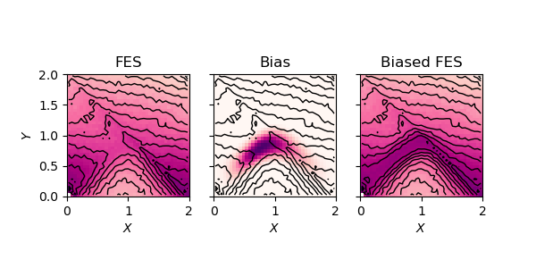
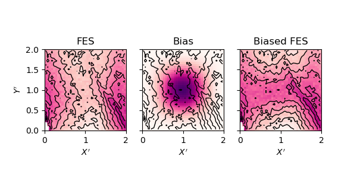
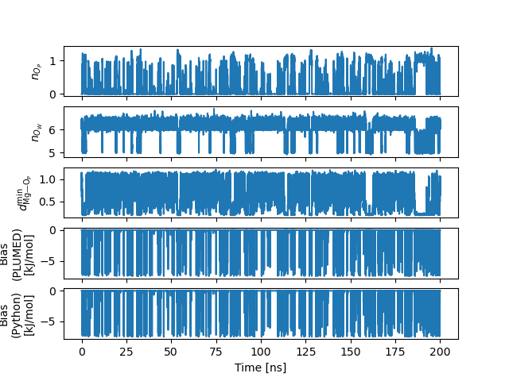

# Part 2: Design a barrier-flattening potential

Now that we have a clear picture about the free-energy surface (FES) we can devise a strategy to accelerate the dynamics along the most probable reaction pathway.

The idea behind this approach is to lower the free energy barrier between the bound and the unbound states in the hope of increasing the reaction rate in both directions. In the language of transition state theory (TST), this corresponds to decreasing the (Gibbs) free energy of activation for both the forward and backward processes ($\Delta^\ddagger G_\pm$) in order to increase the corresponding rate constants,

$$
\begin{equation}
k_\pm \propto e^{-\frac{\Delta^\ddagger G_\pm}{k_B T}}.
\end{equation}
$$

We will use the FES previously computed to craft a barrier-flattening bias. For this, no further simulation is needed as we can directly predict the shape of the FES for any bias potential that is a function of the same variables,

$$
\begin{equation}
G(x, y) = G_0(x, y) + U_\text{bias}(x, y).
\end{equation}
$$

## Choosing a functional form

The choice of $U_\text{bias}$ is rather free, but we need to take some constraints into account:
- It should be continuous
- Far away from the barrier, the bias should be flat so as to minimally affect the thermodynamic ensemble
- The bias should avoid creating stable intermediates

### Instructions

1) Propose a candidate functional form matching the above criteria.

> [!TIP] Tip 1
> Try to transform the input variables so as to make it easier to fit the barrier with common functions (exp, cos, polynomials, etc.)

> [!TIP] Tip 2
> Use Heaviside step functions to restrict the bias to the section of the CV-space you are interested in. Make sure the resulting potential is continuous (and it’s probably a good idea if it’s differentiable too) everywhere the system can go.

2) Using the reweighted FES computed in [Part 1](PART1.md), predict the shape of the biased FES and plot it.

3) Adjust the parameters and/or the functional form until you are satisfied with the resulting free-energy barrier.

### Results

Here is our proposition. For convenience, we defined new variables $X$ and $Y$ as:

$$
\begin{align}
X &= n_{O_P} - n_{O_W} + 6 \\
Y &= n_{O_P} + n_{O_W} - 6
\end{align}
$$

where $X$ can be interpreted as the advancement of the OW/OP exchange ($X = 0$ is the unbound state, $X = 1$ represents the addition of OP to the inner-sphere, and $X = 2$ complete departure of the supranumerary OW atom) and $Y$ is the excess coordination relative to the basal $n = 6$.

(Click to) See the functional form details.

$$
U_\text{bias}(X', Y') = -1.875 \cdot\theta(X')\theta(2-X')\theta(Y')\theta(2 - Y')(1 - \cos(X'\pi))(1 - \cos(Y'\pi)) \\
X' = X + 0.12 (1 - \cos(X\pi)) \\
Y' = 2.8Y - 0.7(1 - \cos(X\pi))
$$

Your solution will probably look different, and that's OK since precise shape of the barrier should not matter too much.

## Testing the barrier-flattening bias

Once you are satisfied with functional form of your bias, you can implement it in a Plumed file.

### Instructions

1) Prepare a new directory for the bias testing simulation (you can reuse the same input files as previously).

2) Write a `plumed_bias.dat` file implementing the chosen bias. You will to define a [`CUSTOM`](https://www.plumed.org/doc-v2.9/user-doc/html/_c_u_s_t_o_m.html) collective variable and turn its output value into a biasing potential with [`BIASVALUE`](https://www.plumed.org/doc-v2.9/user-doc/html/_b_i_a_s_v_a_l_u_e.html). 

3) To avoid wasting time with free diffusion of the ion in the simulation box, restrain the Mg2+ in the vicinity of the OP atoms. For example you can use an upper wall on the minimum Mg—OP distance to restrain it under $1~\text{nm}$ using the [`DISTANCES`](https://www.plumed.org/doc-v2.9/user-doc/html/_d_i_s_t_a_n_c_e_s.html) multicolvar with the appropriate keyword.

4) Run the simulation.

5) In a Python notebook, plot the timeseries for the two CVs of interest as well as $U_\text{bias}(t)$.

### Template PLUMED file



 Click on the labels of the actions for more information on what each action computes 

<pre class="plumedlisting">
# Barrier-flattening bias for accelerating Mg (un)binding to phosphate oxygen
<b name="data/solutions/inputs/plumed_bias.datmg" onclick='showPath("data/solutions/inputs/plumed_bias.dat","data/solutions/inputs/plumed_bias.datmg","data/solutions/inputs/plumed_bias.datmg","brown")'>mg</b>: GROUPDefine a group of atoms so that a particular list of atoms can be referenced with a single label in definitions of CVs or virtual atoms. <a href="https://www.plumed.org/doc-master/user-doc/html/GROUP" style="color:green">More details</a><i></i> __FILL__
The GROUP action with label <b>mg</b> calculates something<b name="data/solutions/inputs/plumed_bias.datop" onclick='showPath("data/solutions/inputs/plumed_bias.dat","data/solutions/inputs/plumed_bias.datop","data/solutions/inputs/plumed_bias.datop","brown")'>op</b>: GROUPDefine a group of atoms so that a particular list of atoms can be referenced with a single label in definitions of CVs or virtual atoms. <a href="https://www.plumed.org/doc-master/user-doc/html/GROUP" style="color:green">More details</a><i></i> __FILL__
The GROUP action with label <b>op</b> calculates something<b name="data/solutions/inputs/plumed_bias.datow" onclick='showPath("data/solutions/inputs/plumed_bias.dat","data/solutions/inputs/plumed_bias.datow","data/solutions/inputs/plumed_bias.datow","brown")'>ow</b>: GROUPDefine a group of atoms so that a particular list of atoms can be referenced with a single label in definitions of CVs or virtual atoms. <a href="https://www.plumed.org/doc-master/user-doc/html/GROUP" style="color:green">More details</a><i></i> __FILL__
 The GROUP action with label <b>ow</b> calculates something<b name="data/solutions/inputs/plumed_bias.datnop" onclick='showPath("data/solutions/inputs/plumed_bias.dat","data/solutions/inputs/plumed_bias.datnop","data/solutions/inputs/plumed_bias.datnop","brown")'>nop</b>: COORDINATIONCalculate coordination numbers. <a href="https://www.plumed.org/doc-master/user-doc/html/COORDINATION" style="color:green">More details</a><i></i> ...
   __FILL__
...
 The COORDINATION action with label <b>nop</b> calculates the value of the coordination<b name="data/solutions/inputs/plumed_bias.datnow" onclick='showPath("data/solutions/inputs/plumed_bias.dat","data/solutions/inputs/plumed_bias.datnow","data/solutions/inputs/plumed_bias.datnow","brown")'>now</b>: COORDINATIONCalculate coordination numbers. <a href="https://www.plumed.org/doc-master/user-doc/html/COORDINATION" style="color:green">More details</a><i></i> ...
   __FILL__
...
 The COORDINATION action with label <b>now</b> calculates the value of the coordination<b name="data/solutions/inputs/plumed_bias.datdop" onclick='showPath("data/solutions/inputs/plumed_bias.dat","data/solutions/inputs/plumed_bias.datdop","data/solutions/inputs/plumed_bias.datdop","brown")'>dop</b>: DISTANCESCalculate the distances between multiple piars of atoms <a href="https://www.plumed.org/doc-master/user-doc/html/DISTANCES" style="color:green">More details</a><i></i> ...
   __FILL__
...
 The DISTANCES action with label <b>dop</b> calculates the DISTANCES between the each pair of atoms that were specified<b name="data/solutions/inputs/plumed_bias.datuwall" onclick='showPath("data/solutions/inputs/plumed_bias.dat","data/solutions/inputs/plumed_bias.datuwall","data/solutions/inputs/plumed_bias.datuwall","brown")'>uwall</b>: UPPER_WALLSDefines a wall for the value of one or more collective variables, <a href="https://www.plumed.org/doc-master/user-doc/html/UPPER_WALLS" style="color:green">More details</a><i></i> __FILL__
 The UPPER_WALLS action with label <b>uwall</b> calculates the following quantities:<table  align="center" frame="void" width="95%" cellpadding="5%"><tr><td width="5%"><b> Quantity </b>  </td><td><b> Description </b> </td></tr><tr><td width="5%">uwall.bias</td><td>the instantaneous value of the bias potential</td></tr><tr><td width="5%">uwall.force2</td><td>the instantaneous value of the squared force due to this bias potential</td></tr></table><b name="data/solutions/inputs/plumed_bias.datbias_fn" onclick='showPath("data/solutions/inputs/plumed_bias.dat","data/solutions/inputs/plumed_bias.datbias_fn","data/solutions/inputs/plumed_bias.datbias_fn","brown")'>bias_fn</b>: CUSTOMCalculate a combination of variables using a custom expression. <a href="https://www.plumed.org/doc-master/user-doc/html/CUSTOM" style="color:green">More details</a><i></i> ...
   __FILL__
...
 The CUSTOM action with label <b>bias_fn</b> calculates an arbitrary function<b name="data/solutions/inputs/plumed_bias.datbias" onclick='showPath("data/solutions/inputs/plumed_bias.dat","data/solutions/inputs/plumed_bias.datbias","data/solutions/inputs/plumed_bias.datbias","brown")'>bias</b>: BIASVALUETakes the value of one variable and use it as a bias <a href="https://www.plumed.org/doc-master/user-doc/html/BIASVALUE" style="color:green">More details</a><i></i> __FILL__
 The BIASVALUE action with label <b>bias</b> calculates the following quantities:<table  align="center" frame="void" width="95%" cellpadding="5%"><tr><td width="5%"><b> Quantity </b>  </td><td><b> Description </b> </td></tr><tr><td width="5%">bias.bias</td><td>the instantaneous value of the bias potential</td></tr><tr><td width="5%">bias._bias</td><td>one or multiple instances of this quantity can be referenced elsewhere in the input file</td></tr></table>PRINTPrint quantities to a file. <a href="https://www.plumed.org/doc-master/user-doc/html/PRINT" style="color:green">More details</a><i></i> ARGthe labels of the values that you would like to print to the file<i></i>=<b name="data/solutions/inputs/plumed_bias.datnop">nop</b>,<b name="data/solutions/inputs/plumed_bias.datnow">now</b>,<b name="data/solutions/inputs/plumed_bias.datdop">dop.lowest</b>,<b name="data/solutions/inputs/plumed_bias.datuwall">uwall.bias</b>,<b name="data/solutions/inputs/plumed_bias.datbias">bias.bias</b> STRIDE the frequency with which the quantities of interest should be output<i></i>=500 FILEthe name of the file on which to output these quantities<i></i>=<b name="data/solutions/inputs/plumed_bias.datbias">bias.COLVAR</b>
</pre>

<pre class="plumedlisting">
# Barrier-flattening bias for accelerating Mg (un)binding to phosphate oxygen
 <b name="data/solutions/inputs/plumed_bias.dat_solmg" onclick='showPath("data/solutions/inputs/plumed_bias.dat","data/solutions/inputs/plumed_bias.dat_solmg","data/solutions/inputs/plumed_bias.dat_solmg","brown")'>mg</b>: GROUPDefine a group of atoms so that a particular list of atoms can be referenced with a single label in definitions of CVs or virtual atoms. <a href="https://www.plumed.org/doc-master/user-doc/html/GROUP" style="color:green">More details</a><i></i> ATOMSthe numerical indexes for the set of atoms in the group<i></i>=60
The GROUP action with label <b>mg</b> calculates something<b name="data/solutions/inputs/plumed_bias.dat_solop" onclick='showPath("data/solutions/inputs/plumed_bias.dat","data/solutions/inputs/plumed_bias.dat_solop","data/solutions/inputs/plumed_bias.dat_solop","brown")'>op</b>: GROUPDefine a group of atoms so that a particular list of atoms can be referenced with a single label in definitions of CVs or virtual atoms. <a href="https://www.plumed.org/doc-master/user-doc/html/GROUP" style="color:green">More details</a><i></i> NDX_FILEthe name of index file (gromacs syntax)<i></i>=index_diuridine.ndx NDX_GROUPthe name of the group to be imported (gromacs syntax) - first group found is used by default<i></i>=O_Phosphate
The GROUP action with label <b>op</b> calculates something<b name="data/solutions/inputs/plumed_bias.dat_solow" onclick='showPath("data/solutions/inputs/plumed_bias.dat","data/solutions/inputs/plumed_bias.dat_solow","data/solutions/inputs/plumed_bias.dat_solow","brown")'>ow</b>: GROUPDefine a group of atoms so that a particular list of atoms can be referenced with a single label in definitions of CVs or virtual atoms. <a href="https://www.plumed.org/doc-master/user-doc/html/GROUP" style="color:green">More details</a><i></i> NDX_FILEthe name of index file (gromacs syntax)<i></i>=index_diuridine.ndx NDX_GROUPthe name of the group to be imported (gromacs syntax) - first group found is used by default<i></i>=O_Water

The GROUP action with label <b>ow</b> calculates something<b name="data/solutions/inputs/plumed_bias.dat_solnop" onclick='showPath("data/solutions/inputs/plumed_bias.dat","data/solutions/inputs/plumed_bias.dat_solnop","data/solutions/inputs/plumed_bias.dat_solnop","brown")'>nop</b>: COORDINATIONCalculate coordination numbers. <a href="https://www.plumed.org/doc-master/user-doc/html/COORDINATION" style="color:green">More details</a><i></i> ...
   GROUPAFirst list of atoms<i></i>=<b name="data/solutions/inputs/plumed_bias.dat_solmg">mg</b>
   GROUPBSecond list of atoms (if empty, N*(N-1)/2 pairs in GROUPA are counted)<i></i>=<b name="data/solutions/inputs/plumed_bias.dat_solop">op</b>
   SWITCHThis keyword is used if you want to employ an alternative to the continuous switching function defined above. Options for this keyword are explained in the documentation for <a href="https://www.plumed.org/doc-master/user-doc/html/LESS_THAN">LESS_THAN</a>.<i></i>={COSINUS D_0=0.18 R_0=0.24}
...
 The COORDINATION action with label <b>nop</b> calculates the following quantities:<table  align="center" frame="void" width="95%" cellpadding="5%"><tr><td width="5%"><b> Quantity </b>  </td><td><b> Description </b> </td></tr><tr><td width="5%">nop.value</td><td>the value of the coordination</td></tr></table><b name="data/solutions/inputs/plumed_bias.dat_solnow" onclick='showPath("data/solutions/inputs/plumed_bias.dat","data/solutions/inputs/plumed_bias.dat_solnow","data/solutions/inputs/plumed_bias.dat_solnow","brown")'>now</b>: COORDINATIONCalculate coordination numbers. <a href="https://www.plumed.org/doc-master/user-doc/html/COORDINATION" style="color:green">More details</a><i></i> ...
   GROUPAFirst list of atoms<i></i>=<b name="data/solutions/inputs/plumed_bias.dat_solmg">mg</b>
   GROUPBSecond list of atoms (if empty, N*(N-1)/2 pairs in GROUPA are counted)<i></i>=<b name="data/solutions/inputs/plumed_bias.dat_solow">ow</b>
   SWITCHThis keyword is used if you want to employ an alternative to the continuous switching function defined above. Options for this keyword are explained in the documentation for <a href="https://www.plumed.org/doc-master/user-doc/html/LESS_THAN">LESS_THAN</a>.<i></i>={COSINUS D_0=0.18 R_0=0.24}
...
 The COORDINATION action with label <b>now</b> calculates the following quantities:<table  align="center" frame="void" width="95%" cellpadding="5%"><tr><td width="5%"><b> Quantity </b>  </td><td><b> Description </b> </td></tr><tr><td width="5%">now.value</td><td>the value of the coordination</td></tr></table><b name="data/solutions/inputs/plumed_bias.dat_soldop" onclick='showPath("data/solutions/inputs/plumed_bias.dat","data/solutions/inputs/plumed_bias.dat_soldop","data/solutions/inputs/plumed_bias.dat_soldop","brown")'>dop</b>: DISTANCESCalculate the distances between multiple piars of atoms <a href="https://www.plumed.org/doc-master/user-doc/html/DISTANCES" style="color:green">More details</a><i></i> ...
   GROUPACalculate the distances between all the atoms in GROUPA and all the atoms in GROUPB<i></i>=<b name="data/solutions/inputs/plumed_bias.dat_solmg">mg</b>
   GROUPBCalculate the distances between all the atoms in GROUPA and all the atoms in GROUPB<i></i>=<b name="data/solutions/inputs/plumed_bias.dat_solop">op</b>
   LOWEST this flag allows you to recover the lowest of these variables<i></i>
...
 The DISTANCES action with label <b>dop</b> calculates the following quantities:<table  align="center" frame="void" width="95%" cellpadding="5%"><tr><td width="5%"><b> Quantity </b>  </td><td><b> Description </b> </td></tr><tr><td width="5%">dop.lowest</td><td>the smallest of the colvars</td></tr><tr><td width="5%">dop.value</td><td>the DISTANCES between the each pair of atoms that were specified</td></tr></table><b name="data/solutions/inputs/plumed_bias.dat_soluwall" onclick='showPath("data/solutions/inputs/plumed_bias.dat","data/solutions/inputs/plumed_bias.dat_soluwall","data/solutions/inputs/plumed_bias.dat_soluwall","brown")'>uwall</b>: UPPER_WALLSDefines a wall for the value of one or more collective variables, <a href="https://www.plumed.org/doc-master/user-doc/html/UPPER_WALLS" style="color:green">More details</a><i></i> ARGthe arguments on which the bias is acting<i></i>=<b name="data/solutions/inputs/plumed_bias.dat_soldop">dop.lowest</b> ATthe positions of the wall<i></i>=1 KAPPAthe force constant for the wall<i></i>=500

The UPPER_WALLS action with label <b>uwall</b> calculates the following quantities:<table  align="center" frame="void" width="95%" cellpadding="5%"><tr><td width="5%"><b> Quantity </b>  </td><td><b> Description </b> </td></tr><tr><td width="5%">uwall.bias</td><td>the instantaneous value of the bias potential</td></tr><tr><td width="5%">uwall.force2</td><td>the instantaneous value of the squared force due to this bias potential</td></tr></table><b name="data/solutions/inputs/plumed_bias.dat_solbias_fn" onclick='showPath("data/solutions/inputs/plumed_bias.dat","data/solutions/inputs/plumed_bias.dat_solbias_fn","data/solutions/inputs/plumed_bias.dat_solbias_fn","brown")'>bias_fn</b>: CUSTOMCalculate a combination of variables using a custom expression. <a href="https://www.plumed.org/doc-master/user-doc/html/CUSTOM" style="color:green">More details</a><i></i> ...
   ARGthe values input to this function<i></i>=<b name="data/solutions/inputs/plumed_bias.dat_solnop">nop</b>,<b name="data/solutions/inputs/plumed_bias.dat_solnow">now</b>
   VARthe names to give each of the arguments in the function<i></i>=<b name="data/solutions/inputs/plumed_bias.dat_solnop">nop</b>,<b name="data/solutions/inputs/plumed_bias.dat_solnow">now</b>
   FUNCthe function you wish to evaluate<i></i>=-1.875*step(X)*step(2-X)*step(Y)*step(2-Y)*(1-cos(X*pi))*(1-cos(Y*pi));X=x+0.12*(1-cos(x*pi));Y=2.8*y-0.7*(1-cos(x*pi));x=1.039661*(nop-now)+6;y=1.039661*(nop+now)-6
   PERIODICif the output of your function is periodic then you should specify the periodicity of the function<i></i>=NO
...
 The CUSTOM action with label <b>bias_fn</b> calculates the following quantities:<table  align="center" frame="void" width="95%" cellpadding="5%"><tr><td width="5%"><b> Quantity </b>  </td><td><b> Description </b> </td></tr><tr><td width="5%">bias_fn.value</td><td>an arbitrary function</td></tr></table><b name="data/solutions/inputs/plumed_bias.dat_solbias" onclick='showPath("data/solutions/inputs/plumed_bias.dat","data/solutions/inputs/plumed_bias.dat_solbias","data/solutions/inputs/plumed_bias.dat_solbias","brown")'>bias</b>: BIASVALUETakes the value of one variable and use it as a bias <a href="https://www.plumed.org/doc-master/user-doc/html/BIASVALUE" style="color:green">More details</a><i></i> ARGthe labels of the scalar/vector arguments whose values will be used as a bias on the system<i></i>=<b name="data/solutions/inputs/plumed_bias.dat_solbias_fn">bias_fn</b>

The BIASVALUE action with label <b>bias</b> calculates the following quantities:<table  align="center" frame="void" width="95%" cellpadding="5%"><tr><td width="5%"><b> Quantity </b>  </td><td><b> Description </b> </td></tr><tr><td width="5%">bias.bias</td><td>the instantaneous value of the bias potential</td></tr><tr><td width="5%">bias._bias</td><td>one or multiple instances of this quantity can be referenced elsewhere in the input file</td></tr></table>PRINTPrint quantities to a file. <a href="https://www.plumed.org/doc-master/user-doc/html/PRINT" style="color:green">More details</a><i></i> ARGthe labels of the values that you would like to print to the file<i></i>=<b name="data/solutions/inputs/plumed_bias.dat_solnop">nop</b>,<b name="data/solutions/inputs/plumed_bias.dat_solnow">now</b>,<b name="data/solutions/inputs/plumed_bias.dat_soldop">dop.lowest</b>,<b name="data/solutions/inputs/plumed_bias.dat_soluwall">uwall.bias</b>,<b name="data/solutions/inputs/plumed_bias.dat_solbias">bias.bias</b> STRIDE the frequency with which the quantities of interest should be output<i></i>=500 FILEthe name of the file on which to output these quantities<i></i>=<b name="data/solutions/inputs/plumed_bias.dat_solbias">bias.COLVAR</b>
</pre>

  

### Results

## Reweighting

If we want to recover the original statistics implied by the force field, we need to reweight out the contribution of our accelerating bias. Each frame of the biased trajectory will receive a weight

$$
\begin{equation}
w(t) \propto \frac{p_0(t)}{p_\text{bias}(t)} = \frac{e^{-\beta U_0(t)}}{e^{-\beta [U_0(t) + U_\text{bias}(t)]}} = e^{\beta U_\text{bias}(t)}.
\end{equation}
$$

Any observable we are interested in can then be estimated using a weighted average on the $N$ frames from our biased trajectory as

$$
\begin{equation}
\langle \mathcal{O} \rangle_{p_0} \approx \frac{1}{N} \sum_{i=1}^{N} w(t_i)\mathcal{O}(t_i).
\end{equation}
$$

The quality of our estimation, however, will depend on the phase space overlap between the biased and unbiased ensembles. A generic way of evaluating the efficiency of our reweighting scheme is to use the Kish effective sample size,

$$
\begin{equation}
N_\text{Kish} = \frac{(\sum_{i=1}^{N}w_i)^2}{\sum_{i=1}^{N}w_i^2}.
\end{equation}
$$

We can interpret $N_\text{Kish}$ as the effective number of sample frames that contribute to the weighted average. In the worst case scenario, $N_\text{Kish} = 1$ and only one frame has a non-zero weight, resulting in a very poor estimate of $\langle \mathcal{O} \rangle_{p_0}$. The higher $N_\text{Kish}$, the better the statistics, with a maximum value at $N_\text{Kish} = N$ for trivial reweighting (e.g. for a constant bias).

### Instructions

1) Compute the Kish effective sample size corresponding to reweighting the simulation to the original force field.

> 

<b>Q:</b> How do you expect the Kish size to vary when increasing the number of magnesium ions (each ion contributing one bias potential) and RNA binding sites?

> <b>A</b>: Assuming independent Mg2+/binding site pairs, we expect the Kish size to decrease faster than linearly with the number of ions. This is because, for a frame to have a significant weight, all biases should simultaneously have a small contribution, <i>i.e.</i> be far from the barrier. This becomes combinatorially unlikely as the number of Mg2+ increases.

